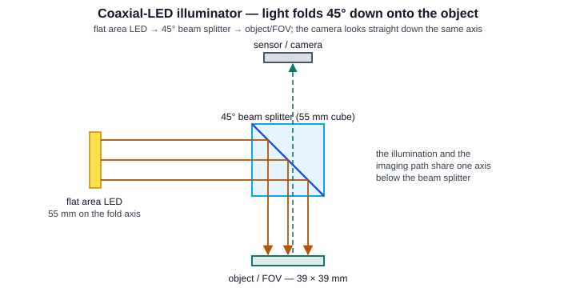
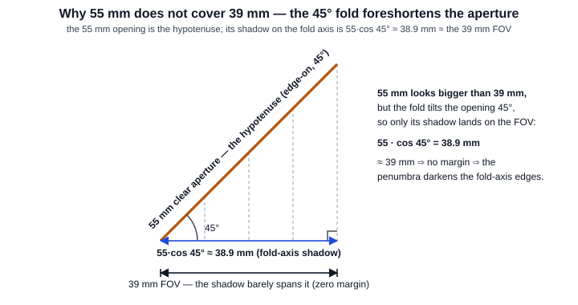
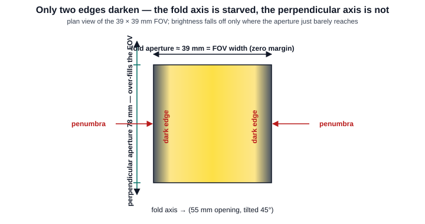
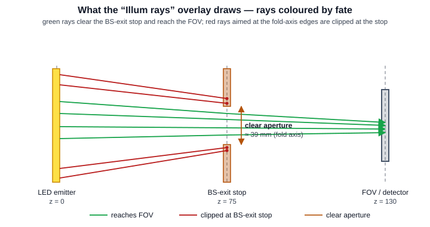

Coaxial-LED Dark Edges — Why 55 mm Does Not Cover a 39 mm FOV
==============================================================

A machine-vision coaxial illuminator floods a flat area LED onto a 45°
beam splitter that folds the light down onto the object. On the MV-150
scene the LED is 55 mm wide, the splitter cube is 55 mm, and the field of
view is only 39 × 39 mm — so the natural expectation is *55 covers 39,
plenty of margin*. In production the 25 MP sensor instead shows **two dark
edges**, and always on the same axis. This page explains why: the 45° fold
turns that 55 mm into a **hypotenuse**, and its shadow on the fold axis is
:math:`55\cos 45^\circ \approx 38.9\ \text{mm}` — essentially equal to the
39 mm FOV, so there is no margin left to keep the edges bright.

   The coaxial arrangement — a flat area LED reflects off a 45° beam
   splitter down onto the object, while the camera looks straight down the
   same axis. The illumination and imaging paths share one optical axis
   below the splitter.

.. contents::
   :local:
   :depth: 1

The intuition trap: "55 is bigger than 39, so it must cover"
------------------------------------------------------------

Read flat off the datasheet, the numbers look comfortable:

* Flat area LED: **55 mm** (fold axis) × 74 mm (perpendicular axis).
* Beam-splitter cube: **55 × 55 × 78 mm**.
* Field of view: **39 × 39 mm**.

55 mm of aperture for a 39 mm field is a 40 % margin — it *should* light
the field to the corners. The trap is that the 55 mm is quoted in the
plane of the splitter face, and that face is not square-on to the folded
optical axis. It is tilted at 45°.

The 45° fold turns 55 mm into a hypotenuse
------------------------------------------

When the beam splitter folds the light through 90°, its clear aperture is
tilted 45° to the folded axis. What reaches the object is not the true
55 mm opening but its **projection** onto the plane the object lives in —
the aperture's shadow along the fold axis. The 55 mm is the hypotenuse of
that 45° projection, and the shadow is the adjacent side:

   The 55 mm clear aperture, seen edge-on, is the hypotenuse of a 45°
   right triangle. Its shadow on the fold axis — the width that actually
   reaches the object — is :math:`55\cos 45^\circ`.

.. math::

   w_{\text{fold}} \;=\; 55\,\cos 45^\circ
   \;=\; 55 \times 0.7071
   \;=\; 38.9\ \text{mm}
   \;\approx\; 39\ \text{mm (the FOV)}.

The effective fold-axis aperture is **38.9 mm** against a **39 mm** field:
the margin is

.. math::

   \Delta \;=\; 38.9 - 39 \;=\; -0.1\ \text{mm} \;\approx\; 0 .

Zero margin. A real area source is not a point, so its edge rays form a
**penumbra** — a soft partial shadow — and with no margin to hide it, that
penumbra lands inside the field and darkens the two fold-axis edges.

Why only two edges go dark
--------------------------

The foreshortening only happens on the fold axis. The perpendicular axis
never tilts, so the LED aperture stays at the full **74 mm** — nearly twice the 39 mm
field. That axis over-fills the FOV and both of its edges stay bright.

   Plan view of the 39 × 39 mm field. The fold axis (horizontal) is
   starved — its ≈ 39 mm aperture just reaches the field, so the two
   fold-axis edges fall into penumbra. The perpendicular axis (vertical)
   carries the full 74 mm LED aperture and lights the field uniformly.

That asymmetry is the tell: a *uniform* fall-off on all four sides would
point to a centering or vignetting problem, but **two dark edges on one
axis** is the signature of a foreshortened fold aperture.

Opt in: bound the imaging launch to the illuminated field
----------------------------------------------------------

The Open 3D editor's imaging-preview rays for a finite conjugate still
originate on the **Object plane**. A coaxial LED can optionally bound those
object-plane origins to its effective illuminated rectangle by adding
``couple_to_imaging_launch`` to the physical scene-source specification:

.. code-block:: python

   {
       "model": "Random rectangle source",
       "role": "illumination",
       "physical": True,
       "enabled": True,
       "radius_x": 37.0,
       "radius_y": 27.5,
       "cone_deg": 90.0,
       "angular_weight": "Cosine-weighted",
       "couple_to_imaging_launch": True,
       "coaxial_illuminator": True,
       "coaxial_aperture_fold_mm": 55.0,
       "coaxial_aperture_perp_mm": 74.0,
       "coaxial_fold_angle_deg": 45.0,
       "coaxial_fold_axis": "x",
   }

The flag is deliberately opt-in and is accepted only for an enabled,
physical source with a valid coaxial-illuminator descriptor. For a finite
object, KrakenOS computes

.. math::

   A_{\mathrm{launch}}
   = A_{\mathrm{folded\ LED}}
   \cap A_{\mathrm{configured\ field}}
   \cap A_{\mathrm{camera\ FOV}},

where the camera term is applied when a registered camera and finite
magnification are available. The folded-LED rectangle has dimensions

.. math::

   w_{\mathrm{fold}} =
   w_{\mathrm{aperture}}\left|\cos\theta\right|,
   \qquad
   w_{\mathrm{perp}} = w_{\mathrm{aperture,perp}}.

The fold-axis label selects whether those two dimensions bound X or Y. The
Object row's round drawing diameter is not substituted for this rectangular
intersection. For the MV-150 values, the 55 × 74 mm LED folded at 45° gives
38.8909 × 74 mm; intersecting it with the 39 × 39 mm camera field produces
a **38.8909 × 39 mm** imaging-launch rectangle.

The coupled LED remains additive. Its physical LED rays are kept in an
isolated illumination trace when illumination records are needed; they do not
replace or contaminate the Object-driven imaging keeper, image conjugates, or
detector placement. The imaging ray origins remain at the Object plane and
only their finite-field X/Y bounds change.

Set ``couple_to_imaging_launch`` to ``False`` (or remove it) to opt out. This
restores the existing uncoupled scene-source and finite-field launch paths; it
does not delete or disable the LED source itself. Infinity-object layouts and
sources without a valid coaxial descriptor also follow the uncoupled paths.

``angular_weight="Cosine-weighted"`` is the Lambertian projected-solid-angle
law for scene-source directions. Together with ``cone_deg=90.0`` it samples
the complete forward Lambertian hemisphere. A smaller cone gives a truncated
Lambertian lobe; authored angles above 90° are clamped to the forward
hemisphere. This angular law controls the physical LED trace independently of
the rectangular imaging-launch bound.

Seeing it in the ray trace: the "Illum rays" overlay
----------------------------------------------------

The Open 3D inspector draws this mechanism directly from the traced LED
rays rather than from a synthetic cone. Turn it on with **Overlays →
Illum rays**. Each LED ray becomes a world-coordinate polyline coloured by
its fate:

* **green** — the ray clears the BS-exit stop and reaches the FOV /
  detector;
* **red** — the ray, aimed at a fold-axis edge, is clipped at the BS-exit
  stop and never reaches the sensor;
* **amber** — the limiting clear aperture, read off the surviving rays
  where they cross the stop (the foreshortened rectangle the red rays are
  cut on).

   The overlay unfolded along +z: rays leave the LED (z = 0), the survivors
   pass the BS-exit stop (z = 75) through the amber clear aperture and reach
   the detector (z = 130); the fold-axis-edge rays terminate red at the
   stop. On the MV-150 scene ~8000 launched rays split roughly 1700 green /
   1500 red.

What KrakenOS actually measures
-------------------------------

The overlay does not assume the geometric 38.9 mm; it reads the real clear
aperture back off the rays that survive. Sampling where the green
(reaching) rays cross the stop plane and taking a robust high percentile,
the passing envelope on the MV-150 scene measures roughly

.. math::

   \text{fold axis} \approx 29\ \text{mm}
   \qquad\text{vs}\qquad
   \text{perpendicular} \approx 64\ \text{mm}.

The fold-axis clear aperture is even tighter than the 38.9 mm geometric
projection — the survivors that actually make it through under-fill the
39 mm FOV — while the perpendicular aperture comfortably over-fills it.
Same story, measured instead of assumed.

**Naming the fold axis is subtler than it looks.** The clipped (red) rays
spread *wider* on the unconstrained perpendicular axis than on the
foreshortened fold axis they are being cut on, so raw terminal spread
points the wrong way. The overlay instead compares the clipped rays
against the **survivor** aperture at the stop: the clipped rays only stick
out *past* the passing envelope on the foreshortened axis. The fold axis
is the one with the larger clipped-beyond-survivor margin — which is how
the overlay label reports the fold axis correctly (X on this scene) rather
than the axis with the biggest raw spread.

Reproduce and validate
-----------------------

The opt-in Object-plane launch coupling and Lambertian source sampler have a
focused display-free guard. The existing effective-area guard independently
checks the geometric footprint and the two-edge detector overlay:

.. code-block:: bash

   python -m KrakenOS.UI.validate_open3d_coaxial_imaging_launch
   python -m KrakenOS.UI.validate_open3d_effective_illumination_area

The coupling guard checks that the physical LED stays isolated from the
imaging keeper, that the imaging origins remain on the Object plane inside the
38.8909 × 39 mm rectangle, and that opting out restores the uncoupled path.

The geometry kernel is pure NumPy in
``KrakenOS/UI/services/source_illumination_rays_overlay.py``; the editor
caches the spec on the preview-trace signature and the inspector builds
the VTK polylines from the returned arrays. The display-free guard traces
the coaxial scene end-to-end and asserts the split, the clip plane, the
foreshortened aperture, and — load-bearing — that the reported fold axis
is the foreshortened one:

.. code-block:: bash

   python -m KrakenOS.UI.validate_open3d_source_illumination_rays

It is also wired into the penta-telescope regression suite as
*Phase 232*, so a regression that broke the classification or flipped the
fold axis would fail the gate.

Rule of thumb
-------------

Any time a flat source or aperture is folded by a mirror or splitter at an
angle :math:`\theta` from the optical axis, the dimension **in the plane
of the fold** is foreshortened by :math:`\cos\theta`; the dimension across
the fold is unchanged. For a 45° fold that is a 29 % haircut
(:math:`\cos 45^\circ = 0.707`). Size the folded aperture against
:math:`\text{FOV} / \cos\theta`, not against the FOV itself — on this
scene a fold-axis aperture of :math:`39 / \cos 45^\circ \approx 55` mm is
the *break-even* size, which is exactly why 55 mm lands right on the edge.
