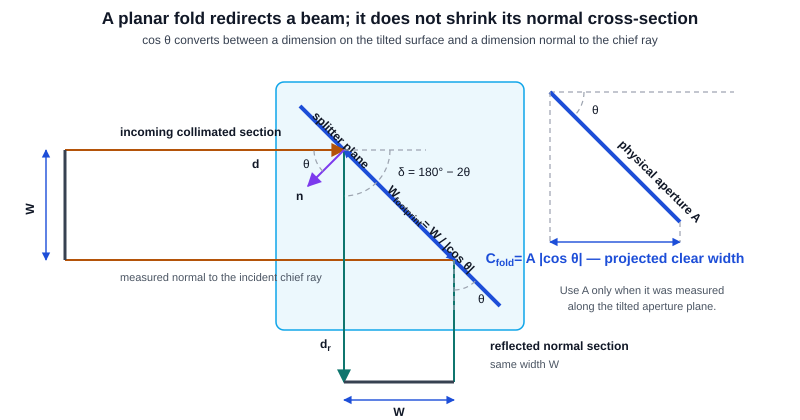
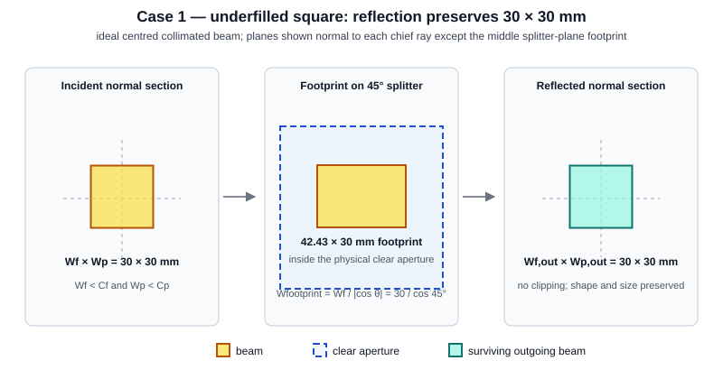
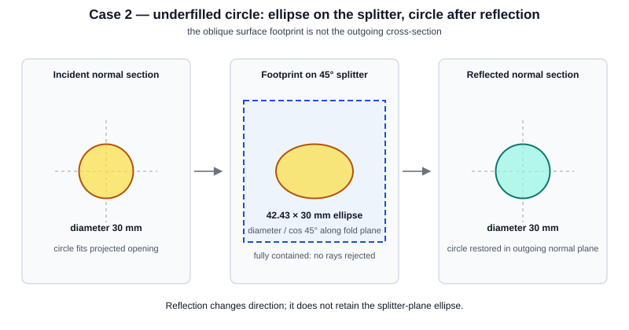
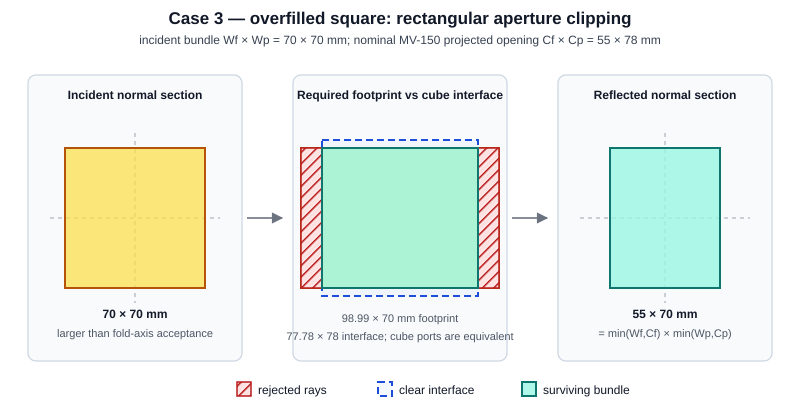
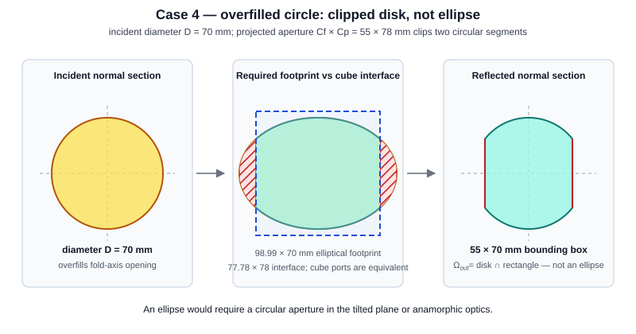
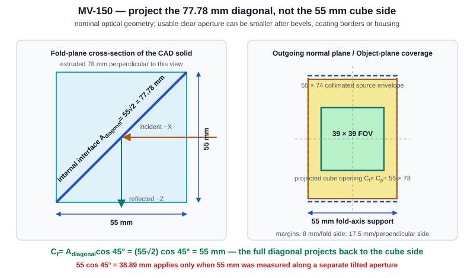
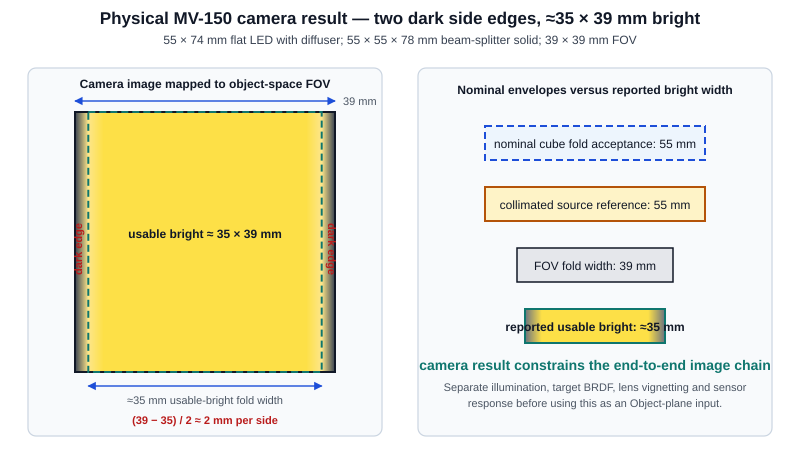
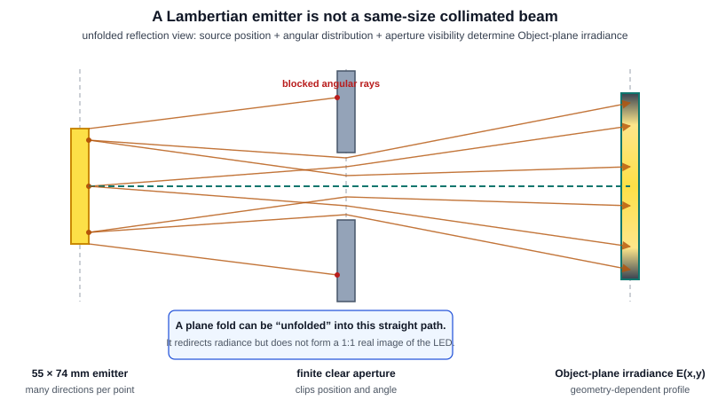

.. _coaxial-led-dark-edges:

Folded Coaxial Illumination — Projection Physics and the MV-150
================================================================

A flat mirror or beam splitter changes a ray bundle's direction; it does
not, by itself, magnify one transverse axis. The familiar
:math:`\cos\theta` factor belongs to the **projection of a finite aperture
whose size is measured in the tilted plane**. It must not be applied a
second time to a cube side that is already the aperture's projected width.

There is a second distinction which matters just as much: a 30 mm
**collimated beam** and a 30 mm **Lambertian emitter** are not the same
thing. The former has a defined cross-section; the latter has both a
spatial extent and a distribution of ray angles.

This page develops the general construction first, illustrates four common
under-fill and over-fill cases, and then applies it to the MV-150 layout's
55 × 55 × 78 mm beam-splitter solid. It also records the actual MV-150
experiment: a 55 × 74 mm flat LED with diffuser produces two side dark edges
and an approximately 35 × 39 mm usable bright region inside the 39 × 39 mm
FOV.

.. contents::
   :local:
   :depth: 2

Keep these five quantities separate
-----------------------------------

.. list-table::
   :header-rows: 1
   :widths: 22 78

   * - Quantity
     - Meaning
   * - Emitter size
     - The physical luminous area. It does not define a unique beam width
       unless the angular distribution and any relay optics are also known.
   * - Beam cross-section
     - The bundle shape measured in a plane normal to its chief ray.
   * - Splitter footprint
     - The intersection of that bundle with the tilted splitter plane. It is
       longer than the normal beam section along the plane of incidence.
   * - Clear aperture
     - The usable optical opening after coating borders, bevels, mounts and
       windows are included. Mechanical outside dimensions are only an upper
       bound.
   * - Illuminated object field
     - The irradiance distribution on the Object plane after propagation,
       clipping, refraction and radiometric weighting.

Most incorrect :math:`\cos45^\circ` arguments come from substituting one
row of this table for another.

General rule for an ideal planar fold
-------------------------------------

For a unit splitter normal :math:`\mathbf n`, specular reflection maps an
incident direction :math:`\mathbf d` to

.. math::

   \mathbf d_{\mathrm r}
   = \mathbf d - 2(\mathbf d\!\cdot\!\mathbf n)\mathbf n .

This is an orthogonal transformation: it preserves distances and angles.
Consequently, an unclipped collimated square remains congruent to the square,
and an unclipped circular bundle remains circular, when each is measured in a
plane normal to its own chief ray.

The splitter-plane footprint is different. If :math:`W` is a beam width
normal to the incident chief ray and the splitter is at angle
:math:`\theta` to that transverse plane, then

.. math::

   W_{\mathrm{footprint}} = \frac{W}{|\cos\theta|}.

Conversely, if :math:`A` is a clear length measured **along the tilted
splitter plane**, its accepted transverse width is

.. math::

   C_{\mathrm{fold}} = A|\cos\theta|.

Here :math:`\theta` is the surface tilt relative to the incident transverse
plane—equivalently, the incidence angle from the surface normal. For a
specular fold, the chief-ray deflection is :math:`\delta=2\theta`. Thus a
90° path turn uses :math:`\theta=45^\circ`; the KrakenOS field named
``coaxial_fold_angle_deg`` currently stores this 45° surface/incidence
angle, not the 90° change in propagation direction.

   The incoming and reflected normal sections both have width :math:`W`.
   Only the footprint on the splitter is
   :math:`W/|\cos\theta|`. The inverse calculation,
   :math:`A|\cos\theta|`, converts a physical tilted-aperture length
   :math:`A` back to accepted normal beam width.

For a rectangular collimated bundle with incident widths
:math:`W_f\times W_p` and a projected clear aperture
:math:`C_f\times C_p`,

.. math::

   W_{f,\mathrm{out}}=\min(W_f,C_f),
   \qquad
   W_{p,\mathrm{out}}=\min(W_p,C_p).

The subscripts ``f`` and ``p`` mean fold axis and perpendicular axis. This
minimum rule describes the **support** of centred, axis-aligned geometrical
rays. It does not describe penumbra or irradiance.

Case 1 — underfilled square bundle
----------------------------------

If :math:`W_f<C_f` and :math:`W_p<C_p`, no ray is clipped. An ideal
30 × 30 mm collimated square therefore remains 30 × 30 mm after a 90° fold,
apart from a rotation or mirror reversal of its coordinate labels.

   Reflection redirects the bundle but does not apply anamorphic
   magnification. This statement assumes collimation, an Object plane normal
   to the outgoing chief ray, and no other limiting stop.

Case 2 — underfilled circular bundle
------------------------------------

If a circular bundle of diameter :math:`D` fits inside the projected clear
aperture, it remains a circle of diameter :math:`D` after reflection.

Its **footprint on the tilted splitter** is an ellipse with axes
:math:`D/|\cos\theta|\times D`. That ellipse is an intersection shape on
the splitter surface, not the outgoing beam section.

   At 45°, a 30 mm circle occupies approximately 42.43 × 30 mm on the
   splitter plane. If that footprint fits, the reflected normal section is
   still a 30 mm circle.

Case 3 — overfilled square bundle
---------------------------------

When a square or rectangular collimated bundle is larger than the projected
clear aperture, the aperture clips it. For example, a 70 × 70 mm bundle and
a 55 × 78 mm projected opening give

.. math::

   \min(70,55)\times\min(70,78)=55\times70\ \mathrm{mm}.

   The rectangle is caused by clipping at a rectangular projected aperture.
   It is not a deformation imposed by specular reflection. In the actual
   cube the normal entry port and the projected diagonal have the same
   nominal 55 × 78 mm acceptance; the first encountered usable opening clips
   the rays.

Case 4 — overfilled circular bundle
-----------------------------------

A circle clipped by a rectangular aperture does **not** generally become an
ellipse. Its outgoing support is

.. math::

   \Omega_{\mathrm{out}}
   =
   \left\{x^2+y^2\leq(D/2)^2\right\}
   \cap
   \left\{|x|\leq C_f/2,\ |y|\leq C_p/2\right\}.

For :math:`D=70\ \mathrm{mm}` and
:math:`C_f\times C_p=55\times78\ \mathrm{mm}`, the perpendicular 78 mm
opening does not clip the circle, but the 55 mm fold-axis opening removes
two circular segments. The result has a 55 × 70 mm bounding box and two
flat sides.

   A true ellipse results when a circular **aperture located in the tilted
   plane** is projected onto a normal plane, or when an anamorphic optical
   system is present. It is not the generic result of clipping a circular
   beam with a rectangular cube opening. The middle panel compares the
   footprint that the unvignetted beam would require with the diagonal
   interface; a real normal-incidence cube port may clip it first.

External and internal reflection
--------------------------------

The geometrical reflection law is the same for an external coated mirror,
an internal coated interface and total internal reflection. What changes is
the radiometry: Fresnel coefficients, polarization, phase, absorption and
ghost paths.

A cube also has entry and exit refractions. In the centred MV-150 chief-ray
geometry those faces are normal to the incoming and outgoing chief rays, so
they do not introduce a universal fold-axis scale. Off-axis or divergent
rays can acquire lateral shifts and different clipping, which is another
reason to ray-trace a real area source instead of assigning a hard footprint
from one nominal dimension.

The actual MV-150 beam-splitter geometry
------------------------------------------------

The promoted MV-150 optical solid has bounds 55 mm in the fold-plane
``X`` direction, 55 mm in ``Z`` and 78 mm perpendicular to the fold. Its
entry and exit face extents are therefore 55 × 78 mm. These CAD extents are
a nominal geometric upper bound, not a measured usable clear aperture.

The internal 45° interface crosses the complete 55 × 55 mm square. Its
physical length in the tilted plane is

.. math::

   A_{\mathrm{diagonal}}
   = \sqrt{55^2+55^2}
   = 55\sqrt2
   = 77.7817\ \mathrm{mm}.

The CAD face area confirms this:

.. math::

   77.7817\times78
   = 6066.976\ \mathrm{mm^2}.

Projecting the **actual nominal diagonal extent** gives

.. math::

   C_f
   = (55\sqrt2)\cos45^\circ
   = 55\ \mathrm{mm},
   \qquad
   C_p=78\ \mathrm{mm}.

   The :math:`\cos45^\circ` projection is real, but its input is the
   77.78 mm diagonal—not the already projected 55 mm cube side. Applying
   :math:`55\cos45^\circ` a second time double-counts the projection. Bevel,
   coating-border, housing and window dimensions are still needed to turn
   this nominal acceptance into a true clear aperture.

For ideal centred collimated bundles, the nominal MV-150 results are:

.. list-table::
   :header-rows: 1
   :widths: 36 30 34

   * - Incident bundle
     - Output after the cube
     - Shape
   * - 30 × 30 mm square
     - 30 × 30 mm
     - Unclipped square
   * - 30 mm diameter circle
     - 30 mm diameter
     - Unclipped circle
   * - 70 × 70 mm square
     - 55 × 70 mm
     - Rectangularly clipped
   * - 70 mm diameter circle
     - 55 × 70 mm bounding box
     - Circle with two clipped sides
   * - MV-150 55 × 74 mm collimated rectangle
     - 55 × 74 mm
     - Fits the nominal 55 × 78 mm opening

Intersecting that last collimated support with the 39 × 39 mm object-space
FOV gives a fully covered 39 × 39 mm field. The nominal cube dimensions
alone therefore do **not** predict two dark edges.

A result of :math:`55\cos45^\circ=38.8909\ \mathrm{mm}` would be correct
only if 55 mm were independently measured **along a separate tilted clear
aperture**. For example, a 55 mm plate-mirror opening at 45° would present
38.8909 mm to the beam. That is not the geometry of the full internal
diagonal in this 55 mm cube.

Reported physical MV-150 camera result — approximately 35 × 39 mm bright
-------------------------------------------------------------------------

The user-reported physical MV-150 experiment used the 55 × 55 × 78 mm
beam-splitter solid and a 55 × 74 mm flat LED with a diffuser. The recorded
camera image, mapped to the 39 × 39 mm object-space FOV, shows two dark side
edges. Taking those sides as the fold axis, the approximate usable-bright
region is

.. math::

   35\ \mathrm{mm}\quad\text{(fold axis)}
   \;\times\;
   39\ \mathrm{mm}\quad\text{(perpendicular axis)}.

For a centred pattern, the fold-axis shortfall is approximately

.. math::

   39-35=4\ \mathrm{mm},
   \qquad
   \frac{4}{2}\approx2\ \mathrm{mm}

at each side. “Usable bright” is an image-intensity threshold or contour,
not a hard geometrical support boundary. Its numerical width depends on the
threshold, exposure, flat-field calibration and measurement uncertainty;
those quantities have not yet been specified.

   The reported end-to-end asymmetry is real: recorded camera intensity rolls
   off along the fold axis while the perpendicular direction remains usable.
   It constrains the complete illumination–object–imaging–sensor chain, not
   the illuminator or nominal cube diagonal in isolation.

This observation and the nominal projection calculation are not
contradictory. The nominal full-face collimated model predicts geometric
illumination support beyond the complete FOV; the experiment says the
**end-to-end recorded intensity** falls below its usable-bright criterion near
the two fold-axis edges. Therefore at least one non-ideal or unmodelled
mechanism is load-bearing, for example:

* a smaller coating, illuminator window, bevel or housing clear aperture;
* diffuser angular distribution and source/aperture view factor;
* decentre, tilt, gap or assembly tolerance;
* splitter throughput versus incidence angle and polarization;
* Object-plane BRDF or downstream lens/pupil vignetting.

Under an ideal centred, collimated, single-aperture orthographic-projection
model, if the 35 mm threshold contour were represented as an equivalent hard
aperture lying in a 45° plane, its in-plane width would be

.. math::

   A_{\mathrm{equivalent}}
   = \frac{35}{\cos45^\circ}
   \approx49.50\ \mathrm{mm}.

This 49.50 mm value is only a fitted proxy inside that ideal model. It is not
proof that a physical 49.50 mm stop exists. A diffuser normally produces a
soft irradiance transition rather than a hard support boundary.

Use the reported camera profile as an **end-to-end validation target**. Feed
it back as Object-plane illumination only after a flat diffuse target and
flat-field calibration have separated illumination from target BRDF,
imaging-lens relative illumination and sensor response; otherwise those
factors would be counted twice. For illumination-only coupling, use a
calibrated Object-plane irradiance map or a physical source trace. Describe
35 × 39 mm as an approximate usable-bright threshold contour or width—not as
the ray bundle's hard support.

What the latest full KrakenOS recording shows—and does not show
----------------------------------------------------------------

The latest full UI recording,
``attachment/recorded_bug_repros/recording_20260719_095137.json``, contains
one flag: “All other Analysis Overlay no longer working, only the Illumination
Overlay is working now.” It is a recording of the **simulated 3D detector
relative-illumination overlay**, not a recording of the physical camera
experiment. Its overlay qualitatively has the same two-side orientation—dark
left and right edges, without comparable top and bottom edges.

For that simulation, the scene source is enabled as a 55 × 74 mm
cosine-weighted/Lambertian emitter, but the current imaging-launch descriptor
still constructs a synthetic fold-axis width
:math:`55\cos45^\circ=38.8909\ \mathrm{mm}`. The visual map additionally uses
a default raised-cosine penumbra of 6% of that width—approximately 2.33 mm—and
Gaussian display smoothing with a 1.5-bin sigma. Consequently, any numerical
bright width inferred by thresholding the screenshot depends on software
heuristics and the chosen threshold. The visual resemblance to the reported
approximately 35 × 39 mm physical result is useful for comparison, but it is
not independent validation of that result or of the :math:`55\cos45^\circ`
interpretation.

The MV-150 source is Lambertian, not collimated
-------------------------------------------------

The saved MV-150 source is a 55 × 74 mm cosine-weighted emitter with a 90°
cone. Each source point emits a hemisphere of directions. A plane splitter
creates a same-size virtual source, but it does not form a 1:1 real image of
that source on the Object plane.

Unfolding the reflection turns the path into ordinary free-space propagation.
For a finite cone of half-angle :math:`\alpha` and unfolded distance
:math:`L`, the geometrical support is approximately the source shape
expanded by :math:`L\tan\alpha` on every side:

.. math::

   \Omega_{\mathrm{object}}
   \approx
   \Omega_{\mathrm{source}}
   \oplus
   \operatorname{disk}(L\tan\alpha).

A full Lambertian hemisphere has no finite hard support without apertures.
Its irradiance falls with angle and distance, while the cube, housing,
windows and other stops bound the visible source solid angle.

   A physical emitter size is not a beam cross-section. The object receives
   an irradiance distribution assembled from all source points and all
   accepted directions.

At an Object-plane point :math:`P`, a useful radiometric statement is

.. math::

   E(P)
   =
   \int_{A_{\mathrm{visible}}}
   L_e(s\rightarrow P)\,
   T(s,P)\,
   \frac{\cos\theta_s\cos\theta_P}{r^2}
   \,\mathrm dA_s ,

where :math:`T` includes aperture visibility, splitter throughput,
refraction and losses. For a diffuse Object plane, this irradiance map and
the surface reflectance/BRDF determine the radiance launched toward the
camera. For a specular Object plane, the directional incident radiance
:math:`L(x,y,\boldsymbol\omega)` and the BRDF must be retained; a scalar
irradiance map alone is insufficient. The integral is written in the
unfolded/virtual-source geometry: :math:`r` is the unfolded distance from
source point :math:`s` to :math:`P`, :math:`\theta_s` and
:math:`\theta_P` are angles to the corresponding plane normals, and
:math:`A_{\mathrm{visible}}` is the source area visible through all projected
stops.

How to predict dark edges generally
-----------------------------------

Use the following sequence for any folded illuminator:

#. Identify whether each quoted dimension describes an emitter, a collimated
   beam, a mechanical body or an optical clear aperture.
#. Express every clear aperture in a plane normal to the local chief ray. Use
   :math:`A|\cos\theta|` only when :math:`A` was measured along a tilted
   plane.
#. For a collimated bundle, intersect its transverse support with all projected
   apertures. For a divergent or Lambertian source, trace or integrate the
   accepted angular distribution.
#. Compute the object-plane irradiance :math:`E(x,y)` over the complete
   imaged FOV.
#. Convey the illumination to the imaging calculation as ray weights or an
   illumination map for a diffuse object, or as directional radiance for a
   specular object. Cropping Object-plane launch coordinates is appropriate
   only for genuinely zero illumination outside a hard boundary.
#. Predict two dark edges only when irradiance rolls off inside the FOV on one
   axis while remaining flat on the perpendicular axis.

Possible physical causes include a smaller illuminator window, coating clear
aperture, bevel or mount; source-view-factor roll-off; decentre; and downstream
vignetting. They must be measured or modelled rather than inferred from the
nominal 55 mm cube side.

KrakenOS descriptor semantics and the legacy MV-150 approximation
-----------------------------------------------------------------

KrakenOS currently evaluates the coaxial descriptor as

.. math::

   C_f =
   \mathtt{coaxial\_aperture\_fold\_mm}
   |\cos(\mathtt{coaxial\_fold\_angle\_deg})| .

That formula is physically meaningful only if
``coaxial_aperture_fold_mm`` is an in-plane tilted-aperture length. The
following block shows how the **existing formula** would encode the nominal
full MV-150 diagonal:

.. code-block:: python

   {
       "coaxial_illuminator": True,
       "coaxial_aperture_fold_mm": 77.78174593,  # 55*sqrt(2), on diagonal
       "coaxial_aperture_perp_mm": 78.0,
       "coaxial_fold_angle_deg": 45.0,
       "coaxial_fold_axis": "x",
   }

This evaluates to the cube's nominal 55 × 78 mm transverse acceptance.
It is not a complete physical MV-150 descriptor: the current schema carries
one rectangle and does not independently represent and intersect the
55 × 74 mm source support, the cube acceptance, other clear apertures and
the FOV. That separation requires either a richer schema or the physical
trace. In this particular example both the nominal source and cube envelope
over-fill the 39 × 39 mm FOV, so the missing distinction does not change the
ideal collimated coverage verdict.

.. warning::

   The existing MV-150 prescription supplies 55 mm together with 45°. The
   current kernel consequently constructs a synthetic 38.8909 mm fold-axis
   bound and can force two dark edges. That is a legacy approximation, not a
   result derived from the prescription's 55 × 55 × 78 mm CAD solid. Its
   implementation guards demonstrate current software behaviour; they are not
   evidence for the physical projection. The synthetic 38.8909 mm support and
   the user-reported physical 35 mm usable-bright threshold width are different
   quantities and must not be presented as the same measurement.

For the actual Lambertian source, the preferred general solution is to trace
the source through the true optical clear apertures. Accumulate
:math:`E(x,y)` for a diffuse Object plane, or retain directional radiance for
a specular one, and carry the resulting weights through the imaging rays to
the detector-relative-illumination overlay.
