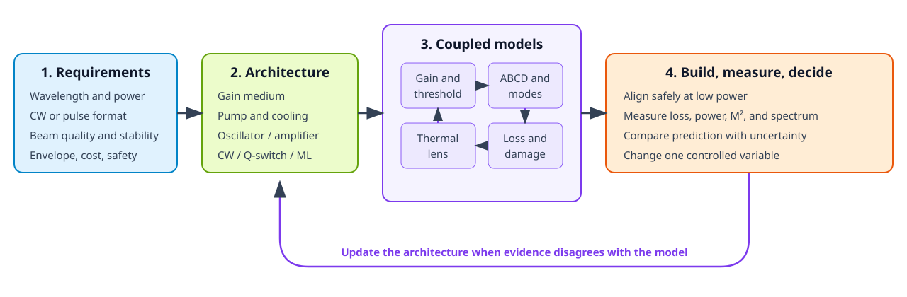

Laser Design Engineer Interview Guide
=====================================

This collection distills the interview-relevant theory and engineering practice
from seven local references.  Three provide the main conceptual and design spine:

* Jeff Hecht, *Understanding Lasers: An Entry-Level Guide*, fourth edition
  (2019);
* Norman Hodgson and Horst Weber, *Laser Resonators and Beam Propagation*,
  second edition (2005); and
* Walter Koechner, *Solid-State Laser Engineering*, sixth revised edition
  (2006).

Four focused references deepen the engineering and measurement treatment:

* Richard Scheps, *Introduction to Laser Diode-Pumped Solid State Lasers*
  (2002);
* Travis S. Taylor, *Introduction to Laser Science and Engineering*, first
  edition (2020);
* T. Sean Ross, *Laser Beam Quality Metrics* (2013); and
* Detlev Ristau, editor, *Laser-Induced Damage in Optical Materials* (2015).

The text is an independent technical synthesis.  It paraphrases concepts rather
than reproducing the books.  Use the :doc:`source_map` to return to the relevant
chapters when a topic needs deeper study.

For the supplied job description, begin with :doc:`role_playbook`, then study
:doc:`duv_integration`.  These pages map the general laser material to the role's
requirements allocation, feasibility benches, integration, qualification,
automation, motion control, cross-functional execution, and product-introduction
responsibilities.

   **Figure 1.** A strong design answer closes the loop between requirements,
   coupled models, and measured evidence.

What an interviewer is testing
------------------------------

.. list-table::
   :header-rows: 1
   :widths: 19 29 28 24

   * - Dimension
     - Strong evidence
     - Weak answer pattern
     - Best page here
   * - Physics
     - Derives threshold, mode size, or pulse relations and states assumptions
     - Recites a laser definition without closing the energy or loss balance
     - :doc:`theory_essentials`
   * - Optical design
     - Uses ABCD matrices, checks stability over thermal-lens range, and reserves apertures
     - Designs only at one nominal focal power
     - :doc:`resonators_and_beams`
   * - System engineering
     - Connects gain medium, pump, cooling, coatings, extraction, safety, and controls
     - Optimizes one component in isolation
     - :doc:`solid_state_design`
   * - Laboratory judgment
     - Aligns at low power, measures with calibrated tools, and changes one variable at a time
     - Chases maximum power without a baseline or damage controls
     - :doc:`hands_on`
   * - Qualification
     - Defines beam quality and damage limits using application-specific, traceable conditions
     - Quotes an instrument's :math:`M^2` or a catalog LIDT without the measurement basis
     - :doc:`beam_quality` and :doc:`laser_damage`
   * - Communication
     - Starts from requirements, names assumptions, estimates, verifies, then discusses risk
     - Gives a number without units, tolerance, or validation plan
     - :doc:`design_case` and :doc:`interview_drill`
   * - Productization
     - Converts prototype knowledge into controlled tests, procedures, training, and yield feedback
     - Treats first light or one passing unit as completion
     - :doc:`role_playbook` and :doc:`duv_integration`

Recommended preparation order
-----------------------------

1. Map your own projects to the evidence matrix in :doc:`role_playbook` and
   prepare the six requested stories with numerical results.
2. Learn the architecture fork, materials, purge, alignment, and lifetime risks
   in :doc:`duv_integration`.
3. Memorize the governing equations and verbal explanations in
   :doc:`theory_essentials`.
4. Work the cavity and Gaussian-beam calculations in
   :doc:`resonators_and_beams` without notes.
5. Practice turning requirements into a solid-state architecture with
   :doc:`solid_state_design`, :doc:`diode_pumped_lasers`, and :doc:`design_case`.
6. Learn to defend the source specification and qualification evidence with
   :doc:`beam_quality` and :doc:`laser_damage`.
7. Rehearse the alignment, measurement, and fault-isolation sequences in
   :doc:`hands_on`.
8. Answer :doc:`interview_drill` aloud.  Keep the first answer under 90 seconds,
   then expand only when asked.

.. toctree::
   :maxdepth: 1

   role_playbook
   duv_integration
   theory_essentials
   resonators_and_beams
   solid_state_design
   diode_pumped_lasers
   beam_quality
   laser_damage
   hands_on
   design_case
   interview_drill
   source_map
