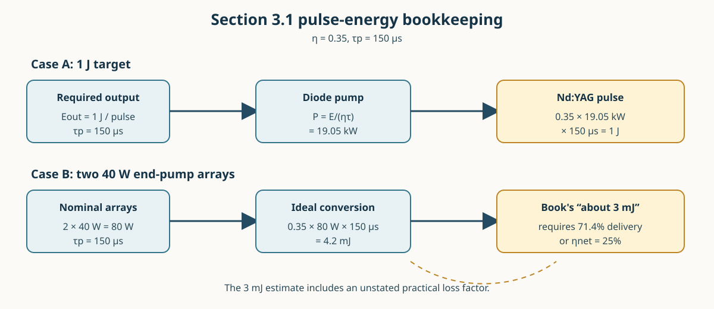

Scheps Section 3.1: Pump-Power Scaling
=======================================

This worked calculation expands the second and third paragraphs of Section 3.1
in Richard Scheps, *Introduction to Laser Diode-Pumped Solid State Lasers*,
Chapter 3, p. 26.  The paragraph uses a pump-diode-to-Nd:YAG output conversion
efficiency of 35 percent and a 150 microsecond excitation pulse.

The energy-to-power conversion
-------------------------------

The required **diode optical power** is not obtained by dividing 1 J by the
efficiency alone.  The pulse energy must first be converted to average power
over the pump pulse:

.. math::
   :label: scheps-31-pump-energy-balance

   E_{\rm out}=\eta_{\rm d\to YAG}P_{\rm d}\tau_p.

Here :math:`E_{\rm out}` is the desired laser pulse energy,
:math:`P_{\rm d}` is the diode optical power during the excitation pulse,
:math:`\tau_p` is the pump-pulse duration, and
:math:`\eta_{\rm d\to YAG}` includes the stated diode-to-Nd:YAG conversion.
Rearranging gives

.. math::
   :label: scheps-31-required-power

   P_{\rm d}=\frac{E_{\rm out}}
   {\eta_{\rm d\to YAG}\tau_p}.

For the values in the book,

.. math::
   :label: scheps-31-19kw-substitution

   \begin{aligned}
   E_{\rm out}&=1\ \mathrm{J},\\
   \eta_{\rm d\to YAG}&=0.35,\\
   \tau_p&=150\ \mu\mathrm{s}=1.50\times10^{-4}\ \mathrm{s},\\
   P_{\rm d}&=\frac{1}{0.35(1.50\times10^{-4})}\ \mathrm{W}
             =1.9048\times10^{4}\ \mathrm{W}
             \approx 19\ \mathrm{kW}.
   \end{aligned}

The inverse pulse duration is the key scale factor: a joule delivered in only
150 microseconds corresponds to 6.667 kW before conversion losses, and the
35-percent conversion requirement multiplies that by :math:`1/0.35`.

Two 40 W end-pump arrays
------------------------

If two fiber-coupled arrays each provide 40 W, their nominal simultaneous pump
power is

.. math::
   :label: scheps-31-two-array-power

   P_{\rm arrays}=2(40\ \mathrm{W})=80\ \mathrm{W}.

Applying exactly the same 35 percent conversion and 150 microsecond pulse used
above predicts

.. math::
   :label: scheps-31-two-array-energy

   E_{\rm out,pred}=0.35(80\ \mathrm{W})(150\times10^{-6}\ \mathrm{s})
                    =4.20\times10^{-3}\ \mathrm{J}
                    =4.2\ \mathrm{mJ}.

This is the direct arithmetic from the stated assumptions.  The book's phrase
“about 3 mJ per pulse” therefore implies an additional unlisted practical
factor.  The effective delivered-pump fraction required to turn the nominal
4.2 mJ into 3 mJ is

.. math::
   :label: scheps-31-utilization

   u=\frac{3.0\ \mathrm{mJ}}{4.2\ \mathrm{mJ}}=0.714.

Equivalently, 3 mJ corresponds to 57.1 W of effective pump at 35 percent, or
to a net conversion of 25 percent when all 80 W reaches the crystal:

.. math::
   :label: scheps-31-three-mj-equivalents

   P_{\rm eff}=\frac{3\ \mathrm{mJ}}{0.35(150\ \mu\mathrm{s})}=57.1\ \mathrm{W},
   \qquad
   \eta_{\rm net}=\frac{3\ \mathrm{mJ}}{80\ \mathrm{W}(150\ \mu\mathrm{s})}=0.25.

Thus 3 mJ is a reasonable engineering estimate if coupling, absorption,
spectral mismatch, and other delivery losses reduce the nominal array power by
about 29 percent.  It should not be presented as the exact result of only the
two stated assumptions; under those assumptions the result is 4.2 mJ.

   **Figure 1.** The 19 kW case requires 1 J in a 150 microsecond pulse.  Two
   40 W arrays produce 4.2 mJ with the idealized 35 percent conversion; the
   book's approximate 3 mJ value corresponds to 71.4 percent effective delivery.

Scaling rules
-------------

For any desired pulse energy and pulse duration, use

.. math::
   :label: scheps-31-general-scaling

   P_{\rm d}[\mathrm{W}]
   =\frac{E_{\rm out}[\mathrm{J}]}
   {\eta\,\tau_p[\mathrm{s}]},
   \qquad
   E_{\rm out}[\mathrm{J}]=\eta P_{\rm d}[\mathrm{W}]\tau_p[\mathrm{s}].

These are pulse-average optical quantities.  Electrical wall-plug power,
thermal duty factor, pump absorption, and resonator extraction efficiency must
be added separately when sizing the complete laser system.
