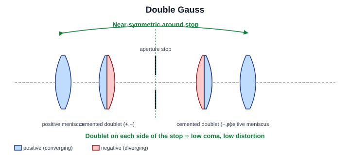
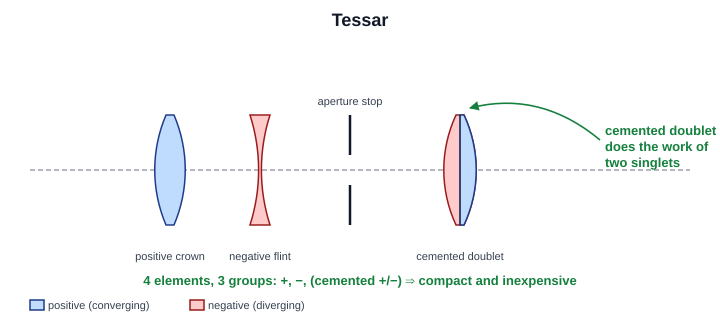
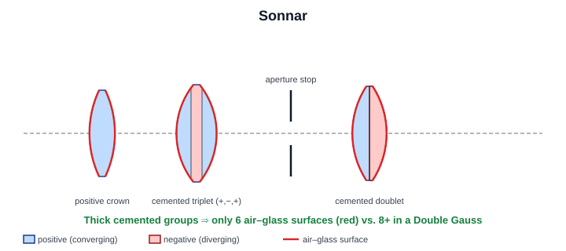
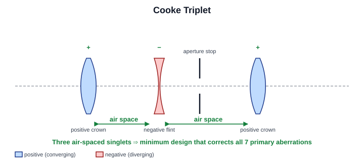
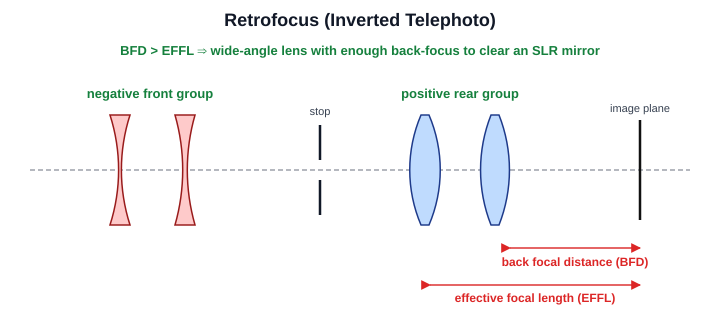
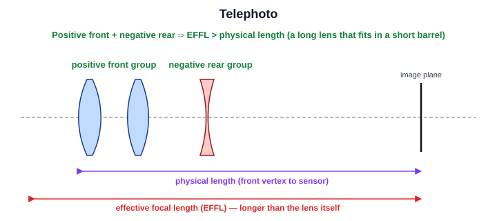
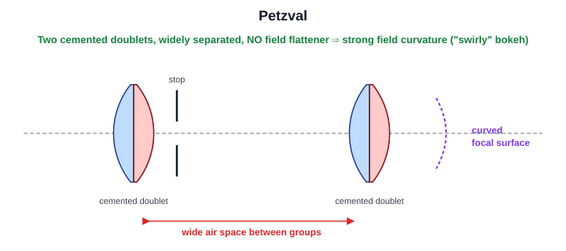
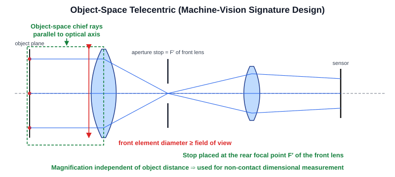

Introduction To Fundamental Lens Design
=======================================

This chapter is a short, vendor-neutral primer on how real-world objective
lenses are built up from a small number of recurring design "families". It is
intended for KrakenOS users who want to recognize the shape of a prescription
in the editable table and understand why the designer chose it.

Two domains are compared:

* **photographic lenses** – the consumer / cinema / broadcast world, where
  speed (large aperture), compactness, and pleasing rendering matter;
* **machine vision lenses** – the industrial / metrology world, where low
  distortion, high MTF across the whole sensor, mechanical stability, and
  (often) telecentricity matter more than aperture or weight.

The same glass elements show up in both domains, but the priorities are
different, so the typical layouts diverge.

Why "Lens Families" Exist
-------------------------

A practical objective has to correct, at minimum, the third-order Seidel
aberrations: spherical, coma, astigmatism, field curvature, and distortion,
plus axial and lateral chromatic aberration. A single lens cannot do this; the
designer needs several elements with carefully chosen powers, separations, and
glasses.

Over the last 130 years a handful of element arrangements turned out to balance
these aberrations well. Modern designs are almost always derivatives of one of
these classical "families", with extra elements, aspherics, and exotic glasses
bolted on to push performance further.

Knowing the family tells you, at a glance:

* roughly how many surfaces and groups to expect in the table;
* which aberrations are inherently controlled vs. which are still loose;
* whether the design will be symmetric (good for distortion) or asymmetric
  (telephoto, retrofocus);
* what its likely application niche is.

Photographic Lens Families
--------------------------

The Double Gauss
~~~~~~~~~~~~~~~~

The Double Gauss is the most iconic fast standard-lens design. Originating
with Alvan Clark (1888) and refined by Paul Rudolph at Zeiss as the *Planar*
(1896), it dominated 35 mm SLR 50 mm f/1.4 – f/2 lenses for most of the 20th
century and is still the backbone of many modern primes.

The hallmark is **near-symmetry around a central stop**, with a cemented
doublet on each side of the aperture. The symmetry naturally cancels the odd
aberrations (coma, distortion, lateral chromatic).

   **Double Gauss.** Distinguishing trait highlighted in green: the design is
   near-symmetric around the aperture stop, with a cemented doublet on each
   side. Symmetry is what suppresses coma, distortion, and lateral chromatic
   aberration "for free".

Typical headline properties:

* 6 elements in 4 groups (classic Planar / Biotar);
* fast – f/2 to f/1.4 is comfortable, f/1.0 is reachable with extra elements;
* moderate field of view (40°–50°), so it is the natural "normal" lens;
* low distortion thanks to symmetry;
* limited back-focal distance, which is fine for rangefinders and mirrorless
  but historically required tweaks for SLRs.

Tessar
~~~~~~

The Tessar (Zeiss, 1902) is a 4-element / 3-group design: a positive front
singlet, a negative middle, and a cemented positive doublet behind the stop.
It is compact, sharp on-axis at moderate apertures (typically f/2.8 – f/4),
and very cheap to manufacture, which is why countless "kit" and "pancake"
lenses are Tessar derivatives.

   **Tessar.** Distinguishing trait: the rear cemented doublet (highlighted)
   replaces what would otherwise be two separate elements, allowing the whole
   lens to be done with only 4 elements in 3 groups – cheap to grind, cheap
   to assemble, sharp on-axis at moderate apertures.

Sonnar
~~~~~~

The Sonnar (Bertele, Zeiss, 1929) uses thicker cemented groups and **fewer
air-glass surfaces** than the Double Gauss. Before lens coatings existed, this
gave dramatically higher contrast, and it still produces a very specific
"Sonnar look" used in fast portrait and short-tele lenses (the Zeiss 85 mm
f/2 and many 50 mm rangefinder lenses).

   **Sonnar.** Distinguishing trait: thick cemented groups (a triplet plus a
   doublet here) – the surfaces marked in red are the *only* air-glass
   interfaces. A Double Gauss of similar element count would have roughly
   twice as many. In the pre-coating era this directly translated to
   higher contrast and less veiling flare.

Cooke Triplet
~~~~~~~~~~~~~

The Cooke Triplet (H. Dennis Taylor, 1893) is the simplest air-spaced
arrangement that can correct all seven primary aberrations: a positive –
negative – positive sequence with the stop between the negative and rear
positive elements. It appears in low-cost cameras, projector lenses, and as
the conceptual ancestor of the Tessar.

   **Cooke Triplet.** Distinguishing trait: three air-spaced singlets in a
   ``+, −, +`` sequence with the stop tucked behind the negative element.
   This is the *minimum* element count that can correct all seven primary
   aberrations simultaneously – every later air-spaced design is, in some
   sense, a Cooke Triplet with more parts.

Retrofocus (Inverted Telephoto)
~~~~~~~~~~~~~~~~~~~~~~~~~~~~~~~

A retrofocus lens places a strong **negative group in front** of a positive
rear group, deliberately making the back-focal distance longer than the focal
length. This is what allows a 24 mm wide-angle lens to clear the swinging
mirror of a 35 mm SLR. Most SLR wide-angles, and many short-focal-length
machine-vision lenses on large sensors, are retrofocus.

   **Retrofocus.** Distinguishing trait: a *negative* group is placed in
   front of the *positive* group. The back focal distance (red) is then
   deliberately longer than the effective focal length (red, lower bracket)
   – which is exactly what allows a wide-angle lens to clear the swinging
   mirror of an SLR.

Telephoto
~~~~~~~~~

A *true* telephoto reverses the retrofocus idea: a positive front group and a
negative rear group, so the **physical length is shorter than the focal
length**. Most lenses called "telephotos" in casual speech are simply
long-focal-length lenses, but the optical telephoto layout is what keeps a
600 mm sports lens from being 600 mm long.

   **Telephoto.** Distinguishing trait (compare against retrofocus): a
   *positive* group is placed in front of a *negative* group. The physical
   length of the barrel (purple bracket) is then shorter than the effective
   focal length (red bracket). This is what keeps a 600 mm sports lens from
   needing a 600 mm long body.

Petzval
~~~~~~~

The Petzval portrait lens (Joseph Petzval, 1840) was the first computed
photographic objective. It uses two widely separated cemented doublets and is
extremely fast for its era (around f/3.6) but has strong, uncorrected field
curvature – which is exactly what gives it its famously swirly, vignetted
bokeh. Several modern lenses revive the design for that look.

   **Petzval.** Distinguishing trait: two cemented doublets, both with
   positive net power, separated by a wide air space, with no field
   flattener. The Petzval sum is therefore not corrected and the focal
   surface (purple) is curved – sharp at the centre, smearing into a
   characteristic "swirl" at the edges. The defect is now the *feature*.

Modern Aspheric / Floating-Element Designs
~~~~~~~~~~~~~~~~~~~~~~~~~~~~~~~~~~~~~~~~~~

Contemporary photographic lenses, particularly mirrorless zooms and fast
primes, are heavily computer-optimized derivatives that no longer fit neatly
into one classical family. They typically include:

* 12 – 20 elements, several with aspheric surfaces;
* low-dispersion (ED / FK / fluorite) and high-index glasses;
* one or more **floating groups** that move at different rates during focus
  or zoom, to keep aberrations corrected at all distances and focal lengths;
* internal focus and image stabilization groups.

When you see such a prescription in the table, the family label is mostly
historical. The optimizer, not a single classical layout, is doing the work.

Photographic Family Summary
~~~~~~~~~~~~~~~~~~~~~~~~~~~

.. list-table::
   :header-rows: 1
   :widths: 18 10 10 22 40

   * - Family
     - Elements
     - Groups
     - Typical use
     - Distinguishing trait
   * - Double Gauss
     - 6 – 8
     - 4 – 6
     - Fast normals (50 mm f/1.4)
     - Symmetry around the stop; doublet on each side
   * - Tessar
     - 4
     - 3
     - Compact moderate-aperture primes
     - +, –, cemented (+,–) behind the stop
   * - Sonnar
     - 6 – 7
     - 3 – 4
     - Fast portrait / short tele
     - Few air-glass surfaces; thick cemented groups
   * - Cooke Triplet
     - 3
     - 3
     - Cheap primes, projector lenses
     - +, –, + air-spaced; minimum corrected design
   * - Retrofocus
     - varies
     - 2 main
     - SLR wide-angles
     - Negative group in front, positive behind
   * - Telephoto
     - varies
     - 2 main
     - Long lenses
     - Positive front, negative rear; length < EFFL
   * - Petzval
     - 4
     - 2
     - Portrait, art bokeh
     - Two widely-spaced cemented doublets
   * - Modern aspheric zoom
     - 12 – 20
     - 6 – 10
     - Most current lenses
     - Floating groups, aspherics, ED glass

Machine Vision Lens Families
----------------------------

Machine-vision lenses are designed to a different cost function. The relevant
priorities are usually:

* low geometric distortion (often < 0.1 % for metrology);
* high MTF *uniformly* across the sensor, not just on-axis;
* fixed focus and aperture, mechanically locked against vibration;
* compatibility with C, CS, F, or large-format industrial mounts;
* in many cases, **telecentricity**, so that magnification does not change
  with object distance.

Aperture speed and weight, which dominate photographic design, are typically
secondary.

Fixed-Focal-Length (FFL) Industrial Lenses
~~~~~~~~~~~~~~~~~~~~~~~~~~~~~~~~~~~~~~~~~~

Most general-purpose machine-vision FFL lenses (the C-mount lenses sold by
Edmund, Kowa, Fujinon, Schneider, Tamron, Computar, and so on) are still
**Double Gauss derivatives** or close cousins. The symmetry is a free
distortion-suppressor, which matters when the lens will be used for
measurement, not photography. They differ from photographic Double Gauss
lenses mainly in:

* fixed (often locked) iris and focus rings;
* lower maximum aperture (f/2.8 or f/4 is common);
* tighter mechanical tolerances and athermalized barrels;
* spectral correction extended into NIR, or restricted to a narrow band.

Retrofocus On Large Sensors
~~~~~~~~~~~~~~~~~~~~~~~~~~~

Short focal lengths on large machine-vision sensors (1.1", 4/3", APS-C-sized
line scan) often need a **retrofocus** layout simply to give enough mechanical
back-focal distance for the C/F-mount flange and any filter or prism in front
of the sensor. The same negative-front / positive-rear topology used in SLR
wide-angles applies.

Telecentric Lenses
~~~~~~~~~~~~~~~~~~

Telecentric lenses are *the* signature optic of machine vision and are not
common in photography at all. In an **object-space telecentric** lens, the
aperture stop is placed at the rear focal point of the front group, so the
chief rays in object space are parallel to the optical axis. The practical
consequence is that **magnification does not change with object distance**:
a part that is slightly closer or farther than nominal still images at the
same size. This is essential for non-contact dimensional measurement.

   **Object-space telecentric.** Distinguishing trait: the aperture stop is
   placed at the rear focal point ``F'`` of the front group. As a direct
   consequence (highlighted in green), the chief rays in object space – one
   from each object point – are *parallel to the optical axis*. The physical
   give-away (highlighted in red) is that the front element diameter must be
   at least as large as the field of view, which is why telecentric lenses
   are big, heavy, and unmistakable in a parts catalogue.

Distinguishing physical traits:

* the **front element diameter must be at least as large as the field of
  view** – telecentric lenses for a 100 mm field have a 100+ mm front element
  and are large, heavy, and expensive;
* long, tubular barrels;
* very narrow useful working-distance range (often quoted ±5 % of nominal);
* sometimes **bi-telecentric** (telecentric in both object and image space),
  which additionally stabilizes magnification against sensor placement.

Fixed-Magnification Macro / Inspection Lenses
~~~~~~~~~~~~~~~~~~~~~~~~~~~~~~~~~~~~~~~~~~~~~

Many vision tasks need a specific magnification at a specific working
distance, not infinity focus. Vendors sell lenses specified directly as e.g.
"0.5× at 110 mm WD". These are typically symmetric or near-symmetric designs
optimized at that conjugate, and they perform poorly if used away from it.
In KrakenOS terms, they are designed with a finite object distance as part
of the prescription rather than the usual infinite-conjugate convention.

Line-Scan Lenses
~~~~~~~~~~~~~~~~

Line-scan sensors are very long and very narrow (e.g. 8k × 1 pixels). The
lens only needs to image one line, but it must do so over a wide field with
extremely uniform MTF. Designs tend to be large-format-style, often
near-symmetric process-lens descendants, and are usually specified by image
circle (e.g. "82 mm image circle") rather than by 35 mm-equivalent focal
length.

Spectrally Specialized Lenses
~~~~~~~~~~~~~~~~~~~~~~~~~~~~~

UV, SWIR, and broadband VIS-NIR lenses are usually not a different *topology*
from the families above; they use the same Double Gauss / retrofocus /
telecentric layouts but with carefully chosen glasses (fused silica, CaF\
:sub:`2`, sapphire, special crowns) and coatings tuned for the target band.
A "SWIR Double Gauss" is still recognizably a Double Gauss in the prescription.

Machine Vision Family Summary
~~~~~~~~~~~~~~~~~~~~~~~~~~~~~

.. list-table::
   :header-rows: 1
   :widths: 22 22 22 34

   * - Family
     - Typical layout
     - Typical use
     - Distinguishing trait
   * - FFL industrial
     - Double Gauss derivative
     - General machine vision, 8 – 75 mm focal lengths
     - Locked focus / iris, low distortion, robust barrel
   * - Wide-FOV industrial
     - Retrofocus
     - Short focal length on large sensors
     - Negative front group, long back focus
   * - Telecentric
     - Front group with stop at F'
     - Gauging, metrology, alignment
     - Front element ≥ FOV; magnification independent of WD
   * - Bi-telecentric
     - Telecentric on both sides
     - High-precision metrology
     - Stable against both object *and* sensor displacement
   * - Fixed-magnification macro
     - Symmetric finite-conjugate
     - PCB / part inspection at fixed WD
     - Specified by magnification + WD, not focal length
   * - Line-scan
     - Large-format symmetric
     - Web inspection, document scanning
     - Specified by image circle; very wide flat field
   * - UV / SWIR / NIR
     - Any of the above
     - Spectroscopy, hyperspectral, thermal
     - Special glasses and coatings, same topology

Photography vs. Machine Vision: Side by Side
--------------------------------------------

.. list-table::
   :header-rows: 1
   :widths: 28 36 36

   * - Concern
     - Photography
     - Machine vision
   * - Aperture speed
     - Often dominant – f/1.4 to f/2.8 is the goal
     - Secondary – f/2.8 to f/8 is common, often fixed
   * - Distortion
     - Tolerated and corrected in software
     - Hard requirement, often < 0.1 %
   * - Off-axis MTF
     - Allowed to drop toward edges
     - Required to stay high across the whole sensor
   * - Working distance
     - Continuously variable focus
     - Often a single fixed WD per lens
   * - Telecentricity
     - Practically never used
     - Common, sometimes mandatory
   * - Mechanical stability
     - Manual / autofocus rings, light barrel
     - Locked rings, athermalized, vibration-tolerant
   * - Spectral range
     - Visible only, with anti-IR coating
     - Visible, NIR, SWIR, UV depending on application
   * - Typical front-element size
     - Driven by aperture (entrance pupil)
     - Driven by field of view (telecentric) or aperture
   * - Family of choice
     - Double Gauss, retrofocus, telephoto, modern zooms
     - Double Gauss derivatives, retrofocus, telecentric

Reading A Prescription In KrakenOS
----------------------------------

When you load or build a system in the KrakenOS editable table, the family
usually reveals itself within the first inspection:

* count the elements (rows of glass material) and the groups (consecutive
  rows separated by AIR);
* find the aperture stop;
* check whether the layout is **symmetric around the stop** (Double Gauss,
  classical Planar, fixed-magnification macro);
* check whether the **front group is negative** (retrofocus) or the **rear
  group is negative** (telephoto);
* check whether the stop sits at the **rear focal point of the front group**
  (telecentric).

Once the family is identified, the *intent* of every variable in the table
becomes much easier to reason about. Optimization variables, paraxial solves,
and merit operands such as ``EFFL`` or ``Spot RMS`` (introduced in the
tutorials) can then be applied with the correct expectation of which
aberrations the family already controls and which it does not.

Further Reading
---------------

For deeper treatments of these families and their derivations, the standard
references are:

* W. J. Smith, *Modern Lens Design*, McGraw-Hill;
* W. J. Smith, *Modern Optical Engineering*, McGraw-Hill;
* R. Kingslake & R. B. Johnson, *Lens Design Fundamentals*, Academic Press;
* M. Laikin, *Lens Design*, CRC Press.

These books give exact prescriptions for many of the layouts sketched above,
which can be entered directly into the KrakenOS editable table as a starting
point for further work.
