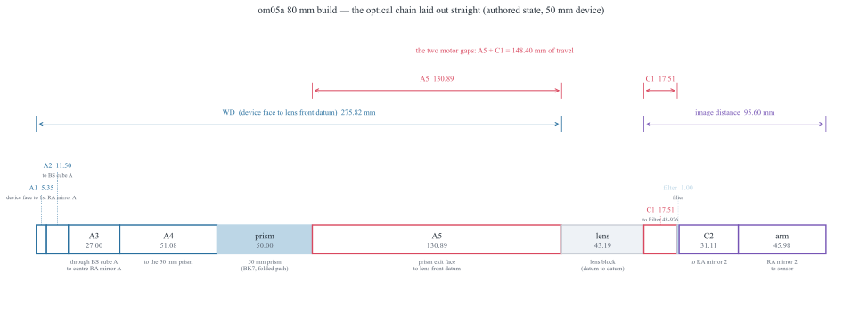
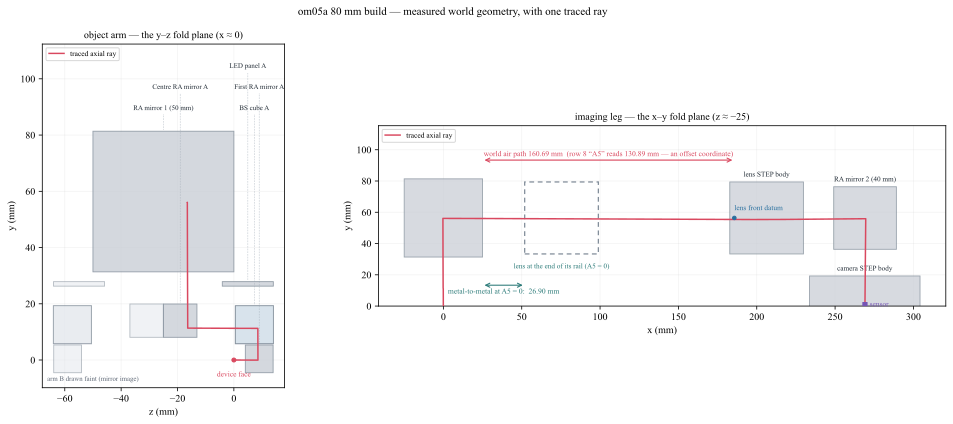
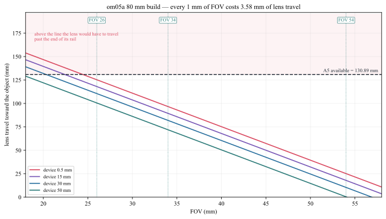
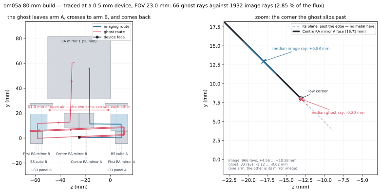

om05a Bench Geometry — Working Distance, A5 and the Motor Rail
==============================================================

The om05a inspection cell images **two faces of one device** down mirror-image
arms. Light leaves a device face, is folded by the coaxial illumination prisms,
crosses the big 50 mm right-angle prism, runs down a long air leg to the imaging
lens, passes the filter, folds once more at RA mirror 2 and lands on the sensor.

Two gaps in that chain are not hardware — they are where the **motors** live. The
bench's labels for them are ``A5`` (in front of the lens) and ``C1`` (behind it),
and the rule from the bench owner is that *"A5 + C1 is where the motors can
travel; the C1 here is up to the Edmund Filter"*.

This page shows the measured geometry of the 80 mm build
(``attachment/om05a_folded_80mm.py``), defines the working distance, and explains
the thing that surprises everybody: **A5 = 0 does not mean the lens touches the
prism.** The last section measures the other surprise — the bench's stray light is
a single geometric leak between the two arms, and it is **about a millimetre of
mirror edge.**

.. note::

   **What is measured and what is modelled.** The first three figures, the segment
   tables and the clearance numbers are measured from the scene file — rows, world
   body positions and one real traced ray — by::

      taskset -c 0-9 nice -n 15 xvfb-run -a \
          .devenv/state/venv/bin/python -u docs/generate_om05a_bench_geometry.py

   The stray-light figure and every number in that section come from a second,
   slower pass, which solves the worst case and traces it in its own process::

      taskset -c 0-9 nice -n 15 xvfb-run -a \
          .devenv/state/venv/bin/python -u docs/generate_om05a_bench_geometry.py --ghost

   The FOV / working-distance table and the travel chart come from the solver's
   **first order** (its own conjugate solve), not from traced rays. Where a traced
   value exists and differs, both are given.

Chain coordinates are not physical distances
---------------------------------------------

Every row thickness in the table below is a **station coordinate** in the row
model's unfolded chain. Several bodies on this bench are placed absolutely by
``desp`` (rows 1, 3, 5, 7 and 16), and the prism folds the beam through 90°
inside its own glass, so a row's thickness and the distance the ray actually
flies are different quantities. The totals survive by cancellation; the splits do
not. Measured against one traced axial ray:

.. list-table:: Where the chain and the ray disagree
   :header-rows: 1
   :widths: 26 20 20 34

   * - Segment
     - chain (mm)
     - traced (mm)
     - note
   * - A1
     - 5.35
     - 8.55
     - device face → first RA mirror A
   * - A4
     - 51.08
     - 20.02
     - to the prism's entrance face (44.73 to the fold point)
   * - A5
     - 130.89
     - 160.69
     - prism exit face → lens front datum
   * - C2
     - 31.11
     - 22.28
     - filter → RA mirror 2
   * - arm
     - 45.98
     - 55.18
     - RA mirror 2 → sensor (C2 + arm cancel: 77.09 either way)
   * - WD
     - 275.82
     - 275.44
     - the 0.39 mm is row 9's ``desp_z`` of −0.3885

A5 is not a special case — it is simply the offset that matters, because it is
the one a motor drives.

The chain, laid out straight
----------------------------

   The row model laid out straight, at the **authored 50 mm device**. **WD** runs
   from the device face to the lens front datum; the image distance runs from the
   lens rear datum to the sensor. ``A5`` and ``C1`` are the two motor gaps, and
   their sum, 148.40 mm, is the total motor travel.

.. list-table:: Object side — chain coordinates at the authored 50 mm device
   :header-rows: 1
   :widths: 26 12 14 48

   * - Segment
     - Rows
     - mm
     - What the row spans
   * - A1 *(device-dependent)*
     - 0
     - 5.35
     - device face → first RA mirror A
   * - A2
     - 1–2
     - 11.50
     - → BS cube A
   * - A3
     - 3–4
     - 27.00
     - BS cube A (row 3 reads 15.00; the ray crosses 13.50 mm of BK7) → centre RA mirror A
   * - A4
     - 5–6
     - 51.08
     - → the 50 mm prism
   * - prism
     - 7
     - 50.00
     - the folded glass path inside the right-angle prism (BK7)
   * - **A5** (motor)
     - 8
     - **130.89**
     - prism exit → lens front datum
   * - **WD** *(device-dependent)*
     - 0–8
     - **275.82**
     - device face → lens front datum

Only A1 moves with the device: the face travels half of any size change, so a
0.5 mm device puts A1 near 30.10 mm and WD near 300.57 mm. Everything else in
that table is fixed hardware.

.. list-table:: Image side — chain coordinates
   :header-rows: 1
   :widths: 26 12 14 48

   * - Segment
     - Rows
     - mm
     - What the row spans
   * - lens block
     - 9–12
     - 43.19
     - front datum → rear datum
   * - **C1** (motor)
     - 13
     - **17.51**
     - lens rear datum → Filter 48-926
   * - filter
     - 14
     - 1.00
     - N-BK7
   * - C2
     - 15
     - 31.11
     - → RA mirror 2
   * - arm
     - 16–24
     - 45.98
     - RA mirror 2 → sensor
   * - **image distance**
     - 13–24
     - **95.60**
     - lens rear datum → sensor

One FOV, one WD, one image distance
------------------------------------

A field of view fixes the magnification, :math:`|m| = h_\text{sensor}/\text{FOV}`
with a 23.04 mm sensor, and a magnification fixes both conjugates. So each FOV has
one working distance and one image distance, **independent of device size**.

The three FOVs below are the **production bench's** operating points (20, 34×29
and 54×29, recorded in ``bugs/0767``). They are listed here for reference; the
80 mm build's own set is further down and is *not* the same. All values are
first order and **datum-referenced** — WD ends at the lens front datum and the
image distance starts at the rear datum, so they sit about 21.9 mm below the
thin-lens :math:`f(1+m)` figure. The lens is a blackbox model (rows 10–12), and
:math:`f \approx 82.4` mm is a **fitted** effective focal length, not a datasheet
value.

.. list-table:: Production operating points (first order, chain mm)
   :header-rows: 1
   :widths: 10 12 20 20 19 19

   * - FOV (mm)
     - \|m\|
     - 80 mm WD (mm)
     - 80 mm image (mm)
     - production WD (mm)
     - production image (mm)
   * - 20
     - 1.152
     - 153.85
     - 155.40
     - 141.47
     - 161.59
   * - 34
     - 0.678
     - 203.92
     - 116.31
     - 193.20
     - 121.21
   * - 54
     - 0.427
     - 275.44
     - 95.64
     - 267.10
     - 99.84

.. warning::

   **FOV 20 on the 80 mm build.** Until ``bugs/0784`` the lens could not reach it
   below a ~32 mm device — a row limit, not a hardware one. The bodies allow it
   (a 0.5 mm device needs 146.7 mm against 155.8 mm of clearance), so it is now
   reachable; what remains true is the field: the one traced FOV-20 case on this
   scene, a 50 mm device, captures only 0.40 of it. The production columns are
   first order only: ``bugs/0783`` records that production's traced image does not
   yet form where its first order says.

   The 80 mm WD of 275.44 mm at FOV 54 is the first-order figure; the segment
   table's 275.82 mm is the **row sum** at the authored state. The difference is
   row 9's ``desp_z``.

When the device size changes, only the device **face** moves — by half the size
change on this split-field bench. The working distance is restored by moving the
whole imaging group (lens, filter, RA mirror 2, camera) by that same amount, and
the image distance does not change. ``bugs/0783`` does exactly that in one move,
**when** the scene has a MOTOR 1 group stage, the image distance already sits at
the requested FOV's operating point, a measured traced focus agrees, and the
request is not forced; otherwise the full solve runs.

The folded reality
-------------------

The chain above is *unfolded*. The real bench folds twice, into two orthogonal
planes: the object arm lives in the y–z plane at :math:`x \approx 0`, and the
imaging leg in the x–y plane at :math:`z \approx -25`.

   Measured world geometry with one real traced ray, and the lens drawn a second
   time (dashed) where the end of its rail would put it. The prism's exit face is
   at :math:`x = 25.000`; the lens front datum at :math:`x = 185.689`. The ray
   flies **160.69 mm** of air between them — while row 8, "A5", reads 130.89 mm.

Why A5 is not the air gap
--------------------------

**A5 is an offset coordinate, not a physical distance.** The traced ray measures
160.69 mm of air where the row reads 130.89 mm. The 29.80 mm difference has an
exact, measured decomposition:

.. math::

   30.187 \;-\; 0.389 \;=\; 29.798 \ \text{mm}

* **30.187 mm** — row 8's station origin sits that far past the prism's exit face
  along the leg. Most of it is the prism's own folded glass path: the ray enters
  the prism's lower face, crosses 24.71 mm of glass to the hypotenuse, turns, and
  crosses another 25.29 mm along :math:`+x` to the exit face (24.71 + 25.29 =
  50.000, exactly row 7). Row 8's zero therefore starts well past the fold point,
  over a span the beam spends inside glass.
* **0.389 mm** — row 9's ``desp_z`` seat offset, which is why row 8 overshoots the
  lens datum by that much.

The prism's optical exit surface **is** its metal face: its analytic face
centroid, its true mesh extreme and the traced ray's exit vertex all land on
:math:`x = 25.000`. There is no body setback.

So what does A5 = 0 mean?
--------------------------

Driving the lens to :math:`A5 = 0.001` moves the barrel exactly 1:1 with the row
gap — from :math:`x = 182.79` to :math:`x = 51.90` — while the prism face stays
at :math:`x = 25.000`:

.. list-table::
   :header-rows: 1
   :widths: 40 30 30

   * -
     - authored (mm)
     - at A5 ≈ 0 (mm)
   * - lens front datum
     - 185.69
     - 54.80
   * - lens barrel front face
     - 182.79
     - 51.90
   * - prism exit face
     - 25.00
     - 25.00
   * - **metal-to-metal**
     - **157.79**
     - **26.90**

At the end of its rail the lens still has **26.90 mm of clearance** to the bare
prism wedge — 24.90 mm after the mover's own 2 mm mechanical allowance.

``bugs/0771`` quotes a different figure, 19.85 mm: that is a 3D minimum distance
to the whole prism **assembly** (which carries parts nearer than the bare wedge),
and it was measured at :math:`A5 = 0.889`, not at the rail end. Its own model,
``body_gap = A5 + 18.96``, puts the assembly figure near 18.96 mm at
:math:`A5 = 0`. Both are positive and both exceed any shortfall discussed below.

The consequence: at the small-FOV end the lens used to be stopped by the
**row/station partition — the motor rail as drawn — not by a collision**. Since
bugs/0784 the mover recovers that headroom, so the stop is the metal.

Why a smaller FOV cannot be reached
------------------------------------

A smaller FOV is a higher magnification, and a higher magnification needs the lens
closer to the device:

.. math::

   s = f\left(1 + \frac{1}{|m|}\right), \qquad |m| = \frac{h_\text{sensor}}{\text{FOV}}

so with the fitted :math:`f \approx 82.4` mm and :math:`h_\text{sensor} = 23.04`
mm, the object distance is linear in the FOV: **every 1 mm of FOV costs 3.576 mm
of lens travel toward the object.** The row gap A5 holds 130.89 mm of that. The **row is not the limit**: bugs/0784 recovers a
shortfall from the nearest upstream air gap, so the lens runs until its *body* reaches
RA mirror 1 at **155.79 mm**.

   First order, not traced. Above the dashed line the lens *body* would reach
   RA mirror 1 — a real collision. The dotted line is the A5 row gap, which is
   bookkeeping: bugs/0784 recovers a shortfall against it from the nearest
   upstream air gap. A smaller device pushes its face further from the lens and so
   demands *more* travel — which is why the small-FOV limit is set by the smallest
   device.

.. list-table:: Travel demanded, and the A5 row left over (mm; L = device size)
   :header-rows: 1
   :widths: 14 22 22 22 20

   * - FOV
     - need @ L = 0.5
     - A5 left
     - need @ L = 24
     - A5 left
   * - 20
     - 146.72
     - **−15.83**
     - 134.97
     - **−4.08**
   * - 22
     - 139.56
     - **−8.67**
     - 127.81
     - +3.08
   * - 24
     - 132.41
     - **−1.52**
     - 120.66
     - +10.23
   * - 26
     - 125.26
     - +5.63
     - 113.51
     - +17.38

A negative entry in that table is where the **row** runs out, not the machine.
bugs/0784 recovers exactly that shortfall — it shifts the missing millimetres out of
the nearest upstream air gap into the lens gap and compensates every body in between,
so nothing moves and the conjugate is unchanged. What remains is the metal:

.. math::

   \text{FOV}_\text{min}^{\,\text{row}}(L) = 21.70 - 0.14\,(L - 20)
   \qquad
   \text{FOV}_\text{min}^{\,\text{metal}}(L) = 14.74 - 0.14\,(L - 20)

For a 0.5 mm device that moves the floor from FOV 24.4 to about **17.5**. Traced on
the shipped scene: 0.5 mm at FOV 23 lands at 2.28 µm with 19.8 mm of clearance left,
20 mm at FOV 21 lands at 2.48 µm, and 0.5 mm at FOV 17 is still refused — it needs
157.4 mm where 155.8 mm of body clearance exists.

The 80 mm operating points
---------------------------

.. list-table::
   :header-rows: 1
   :widths: 10 20 20 18 32

   * - FOV (mm)
     - devices (mm)
     - A5 at L = 0.5 (mm)
     - lens → RA mirror 2 (mm)
     - traced spot on the sensor
   * - 26
     - 0.5–24.8
     - +5.63
     - 55.2
     - 1.90–1.94 µm (traced to L = 24)
   * - 34
     - 0.5–32.4
     - +34.24
     - 38.0
     - 1.31–1.35 µm (traced to L = 30)
   * - 54
     - 0.5–51.4
     - +105.76
     - 17.4
     - 0.65–1.95 µm (traced to L = 50)

Every traced case lands well inside one 4.5 µm pixel, at full capture, with
positive clearances and both motor stages inside their rails. The FOV 26 floor was
set by the **row** gap running out; since ``bugs/0784`` recovers that headroom the
floor is the metal, and lower settings are reachable — a 0.5 mm device at FOV 23
traces 2.28 µm with 19.8 mm of clearance. Three caveats a reader should carry:

* The device ranges come from a 5 % field margin and run past the traced cases
  (24, 30 and 50 mm). The extra 0.8 / 2.4 / 1.4 mm is first-order extrapolation.
  At FOV 34 full capture is known to break somewhere above 30 mm — a 50 mm device
  there captures only 0.68.
* The FOV-54 band's 1.95 µm upper end is the authored 50 mm case, where the solve
  found the field already delivered and moved nothing; it traced 106 rays against
  314–962 for the other FOV-54 cases, whose spots are 0.65–0.68 µm.
* "Lands" is not "clean". At FOV 26 a 0.5 mm device still carries 36 cross-arm
  ghost rays reaching the sensor up to 2.96 mm outside the image — measured in
  `Stray light — the two arms can see each other`_ below. Since ``bugs/0784`` lifted
  the mechanical floor to about FOV 17.5, **that section is what now argues for
  stopping at 26**: going to 23 costs no clearance but nearly doubles the stray
  light. The floor is a stray-light choice, not a rail limit.

Stray light — the two arms can see each other
----------------------------------------------

Every traced case above lands inside a pixel, but "lands" is not "clean". A small
share of the light that leaves a device face reaches the sensor by a **different
route**. On this bench that route is not scatter and not a coating artefact: it is
a geometric leak past the edge of one mirror.

   Traced at the worst corner the bench can be asked for — the smallest device at
   the lowest FOV that still solves. Left: the imaging route and the ghost route in
   the object arm's fold plane. Right: where each one crosses centre RA mirror A's
   face. The image ray lands on the mirror; the ghost crosses just past its low
   corner and keeps going.

Where it comes from
~~~~~~~~~~~~~~~~~~~~

Light off face A reflects at first RA mirror A, turns down inside BS cube A and
runs back along :math:`-z` toward **centre RA mirror A**, which folds it into the
50 mm prism. That mirror's optical face is **16.75 mm** across (a 45° flat, so the
diagonal of an 11.84 mm AABB). A ray that crosses the face plane *below its low
corner* misses the mirror altogether and carries straight on — and the next thing
on that line, **51.0 mm** further along :math:`-z`, is **arm B's** BS cube.

Traced at a 0.5 mm device and FOV 23, counting each crossing along the face from
its low-\ :math:`y` corner (per arm; the other arm is the mirror image, ray for ray):

.. list-table:: Where each route crosses centre RA mirror A's 16.747 mm face
   :header-rows: 1
   :widths: 26 12 28 34

   * - route
     - rays
     - crosses at
     - what happens
   * - imaging route
     - 966
     - **+4.56 … +10.58 mm** (median +6.88)
     - onto the face — it reflects into the prism
   * - ghost route
     - 33
     - **−0.02 … −1.12 mm** (median −0.20)
     - past the low corner — it flies on to arm B

Two things in that table are worth reading twice. The imaging bundle keeps **4.56 mm
of margin** to the corner — it is not grazing anything, and rays that cross between
0 and 4.56 mm do strike the mirror but are then stopped at the aperture stop, so they
never land. And the ghosts are a **narrow band, 1.1 mm wide**, immediately past the
corner: miss by more than that and the ray never finds its way back to the sensor at
all. The leak is about **one millimetre of mirror edge**, not a coating and not a
scattering model.

The route, hit by hit
~~~~~~~~~~~~~~~~~~~~~~

After it misses, the ghost enters **BS cube B** through the near face at its very
bottom edge, totally internally reflects off the cube's *bottom* face, reflects off
cube B's cement diagonal, leaves through the bottom face and reflects off **first RA
mirror B**. From there it runs the length of the bench back into **arm A**, hits
first RA mirror A and re-enters the ordinary imaging path — cube A a second time,
the centre mirror, the prism, the lens, the filter, RA mirror 2, the sensor. Its
``surface_ids`` route is 26 hits long against the imaging route's 17:

.. code-block:: text

   imaging   1  3 3 3   5            7 7 7   9 10 11 12 13 14 15 16   25
   ghost     1  3 3 3   18 18 18 18  17  1  3 3 3  5  7 7 7  9 … 16   25

Arm B produces the mirror image of it, ray for ray and millimetre for millimetre:
its ghosts leave through centre RA mirror B's corner, visit cube A, and land the
same 8.21 mm from their own field.

One hit in that chain looks suspicious and is worth checking, because a bounce
inside a cube is exactly what a wrong model produces:

.. list-table::
   :header-rows: 1
   :widths: 34 66

   * - measured
     - meaning
   * - ``interaction=reflect_tir``
     - the engine's own label for total internal reflection
   * - turn 4.49°
     - a reflection turns the ray by :math:`180^\circ - 2\theta_i`, so
       :math:`\theta_i = 87.8^\circ`
   * - :math:`n = 1.5185` (BK7)
     - critical angle :math:`\arcsin(1/n) = 41.2^\circ`

At 87.8° the ray is 46° past the critical angle: this is **real total internal
reflection** at grazing incidence, not a modelling artefact. Nothing in the ghost
route needs a coating to exist.

The cement diagonals are modelled as 100 % mirrors
~~~~~~~~~~~~~~~~~~~~~~~~~~~~~~~~~~~~~~~~~~~~~~~~~~

The one place the model *is* optimistic: each BS cube's cement diagonal is
authored ``function: "Mirror"`` and reflects 100 %, even though the row stores
``split_ratio: 0.5``. The engine reads ``split_ratio`` only when the face's
function is ``"Beam Splitter"``.

The ghost route takes **three** cement reflections where the imaging route takes
**one**, so a real 50/50 coating would divide the ghost-to-image ratio by
:math:`0.5^2 = 4`. Every measured share below is therefore an **upper bound**, and
the column beside it is the same number with that correction applied.

Simply re-marking those faces ``"Beam Splitter"`` is not the fix — tried on a
probe copy of the scene, it collapses the trace (460 paths, none landing: 410
vignette at the stop, 50 with no next intersection), while a control copy with the
same rows re-serialised and no value changed traces identically to the shipped
scene. Branching those faces disturbs the launch and pupil aim; that is its own
piece of work, not a scene edit.

What it costs the picture
~~~~~~~~~~~~~~~~~~~~~~~~~~

.. list-table:: Traced stray light (ghost flux as a share of image flux)
   :header-rows: 1
   :widths: 12 10 12 12 18 18 18

   * - device
     - FOV
     - image rays
     - ghosts
     - ghost flux
     - with 50/50 cement
     - landing on the picture
   * - 17 mm
     - 21
     - 644
     - 6
     - 0.78 %
     - ≈ 0.20 %
     - none (≤ 1.70 mm outside)
   * - 0.5 mm
     - 26
     - 1932
     - 36
     - 1.57 %
     - ≈ 0.39 %
     - none (≤ 2.96 mm outside)
   * - 0.5 mm
     - 23
     - 1932
     - 66
     - 2.85 %
     - ≈ 0.71 %
     - none (≤ 6.07 mm outside)

Flux here is the sum of each landing ray's ``branch_power`` — 0.771 for an image
ray, 0.59–0.71 for a ghost — not a ray count.

**So the answer to "how much does the stray light reduce image quality?" is, on
these settings, nothing measurable.** Every ghost ray lands *outside* the two field
strips, 2.3–24.7 mm from where its own field point images. The measured image RMS
stays at 2.28 µm at 0.5 mm / FOV 23, against a 4.5 µm pixel — the ghosts are not in
it because they are not on it. What *is* affected is a reading of the **whole sensor
frame**: there the ghosts appear as a faint patch a few millimetres off the picture,
carrying up to ~0.7 % of the image flux once the cement coatings are right.

The caveat is the sampling. These are traced pupil samples, not a radiometric
stray-light budget: they prove the route exists, where it lands and roughly how
strong it is, but a real veiling-glare figure needs the coating data and a much
denser launch.

Smaller FOV, more stray light
~~~~~~~~~~~~~~~~~~~~~~~~~~~~~~

The trend in that table is real and it is the one the bench owner expects: a
smaller FOV is a larger magnification, a shorter working distance and a lens
carried further forward, and it makes more stray light. At a fixed 0.5 mm device,
FOV 26 → 23 nearly doubles the ghost count (36 → 66) and the flux share
(1.57 % → 2.85 %).

But it is not the cone growing. The working distance only shortens from 175.3 mm
to 164.6 mm over that step, so the accepted cone widens by **6.5 %** — which cannot
double anything, and in any case the imaging bundle keeps 4.56 mm of margin to the
corner at both settings. What changes is the other end of the route: a ghost has to
come back through the *same aperture stop* as the image, and moving the lens forward
changes which of the missed rays do. The measurement is solid; the sensitivity is
worth its own run before anyone leans on it.

The device size moves it the same way, and harder: at FOV 26 a 17 mm device produces
**no** ghosts at all, while a 0.5 mm device — whose face sits further from the lens,
so MOTOR 1 carries the imaging group closer to the prism — produces 36. FOV 34 at
17 mm is also clean.

The lesson for the bench is that this is cheap to fix in hardware. The ghosts all
cross within 1.12 mm past the mirror's low corner, and the imaging bundle stays
4.56 mm clear of it, so an **opaque lip about 1.2 mm long, in the mirror's own plane,
past its low corner** intercepts the whole measured band without touching the image.
Nothing in the optics has to change. That is a bench change for its owner to make:
the app never moves, slides or hides vendor hardware on its own — only the device
under test changes size, and the motors follow it.

What the app reports
~~~~~~~~~~~~~~~~~~~~~

``bugs/0779`` and ``bugs/0780`` keep these rays out of the focus measurement (1 %
of rays on another route once turned a 2 µm spot into 656 µm) and draw them faint.
The banner's share, however, counts **rays on any other route** — ghosts plus the
bookkeeping strays that merely skipped the stop — and does not weight them by
power. At 17 mm / FOV 21 it reads 10 of 654 rays, 1.53 %, where the six ghosts
carry 0.78 % of the image flux. Display already weights by ``branch_power``
(``bugs/0604``); the stray-light and focus measurements do not. Read the banner as
"how many rays", and this page's table as "how much light".

Notes for maintainers
----------------------

* Figures 1–3 are regenerated by ``docs/generate_om05a_bench_geometry.py``; it
  re-measures the scene and re-traces, so a scene change is reflected by re-running
  it, never by editing the SVGs.
* ``A5`` is ``rows[front - 1].thickness`` and ``C1`` is ``rows[rear].thickness``,
  with ``front, rear = editor._imaging_lens_block_indices()`` — rows 8 and 13 on
  this scene, whose lens block is rows 9–13.
* The motor model is ``bugs/0759`` (two motors), ``bugs/0782`` (MOTOR 1 moves the
  group along the beam on any frame — its seat sign is *measured*, because the
  production build's lens leg runs the other way) and ``bugs/0783`` (a device
  change restores the WD in one move).
* ``bugs/0784`` recovers lens-gap headroom from the nearest upstream air gap when the row
  is short and the bodies are not, which is why the row floor above is a waypoint rather
  than a limit.
* The stray-light section is measured by the same script's ``--ghost`` pass, which
  solves the 0.5 mm / FOV 23 corner and traces it; it writes ``measured_ghost.json``
  beside the SVGs, so every share, count and crossing on this page can be checked
  against the run that produced it. Run it in its own process — it starts a second
  app. Two things in that pass are deliberate and easy to break: which diagonal of a
  45° mirror's AABB is its optical face is decided from the *traced hits*, not
  assumed; and the crossing test is anchored on the BS cube's exit face rather than
  on a sign change, because an imaging ray lands exactly on the mirror plane and its
  signed distance there is ±1e-16 — a sign test finds it for half the rays and
  silently skips the rest.
* The stray-route classification is ``bugs/0779`` (keep another route out of the
  focus measurement) and ``bugs/0780`` (draw it faint). Neither weights by
  ``branch_power``; the shares in the table above do.
* Guards: ``python -m KrakenOS.UI.validate_open3d_0782_motor1_follows_the_beam``,
  ``python -m KrakenOS.UI.validate_open3d_0783_device_change_restores_wd`` and
  ``python -m KrakenOS.UI.validate_open3d_0784_lens_leg_headroom_is_the_metal``.
