Pupil Sampling — A Lecture on Where the Rays Go
===============================================

Every analysis in KrakenOS — spot diagrams, PSFs, MTF, OPD maps, Seidel
sums, radiometric throughput, Monte-Carlo stray-light — ultimately
estimates an integral over the **entrance pupil**:

.. math::

   I \;=\; \frac{1}{A}\int_{\text{pupil}} f\!\left(x_{\!p},\, y_{\!p}\right)\, dA
   \;\approx\;
   \frac{1}{N}\sum_{i=1}^{N} f\!\left(x_i,\, y_i\right)

Choosing the sample positions :math:`\{(x_i, y_i)\}` is **pupil
sampling**. The choice controls three different things at once:
how fast the estimate converges, how isotropic the result is, and how
much aliasing leaks into image-plane FFTs. This page surveys the
strategies KrakenOS ships, derives the equal-area trick they all share,
and motivates the **Vogel / golden-angle spiral** that the UI uses
internally for source previews and Lambertian / lobe scattering.

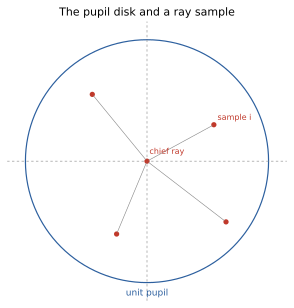

   The unit pupil :math:`\{(x_p, y_p) : x_p^2 + y_p^2 \le 1\}`.
   The chief ray sits at the centre; analysis rays are deposited
   on the disk and then mapped to real-world starting positions and
   direction cosines by ``PupilCalc.Pattern2Field``.

.. contents::
   :local:
   :depth: 1

1. What makes a sampler "good"?
-------------------------------

Three useful quality metrics, all easy to read off the figures further
down:

* **Equal area.** Every sample should represent the same area of the
  pupil. If samples cluster near the centre, the Monte-Carlo estimate
  becomes a biased estimate of an axially-symmetric integrand. The
  fix is the radial mapping :math:`r = \sqrt{u}` for :math:`u \in [0,1]`
  derived below.
* **Low discrepancy.** Loosely: no large empty regions and no clumps.
  Quantitatively, the **star discrepancy** :math:`D^*_N` measures the
  worst-case deviation between sample density and true area. Truly
  random points have :math:`D^*_N \sim N^{-1/2}`; quasi-random sequences
  (Halton, Sobol, golden-angle) can reach :math:`D^*_N \sim N^{-1}
  \log^{d-1} N`.
* **Isotropy.** Section fans deliberately collapse the pupil to a line
  and are fine for tangential / sagittal aberration plots. For PSFs,
  MTFs, and stray light you want sampling that does not pick a
  direction.

A useful empirical proxy for the last two is the **nearest-neighbour
distance distribution**: a tight peak ≈ uniform spacing; a long left
tail ≈ clumps.

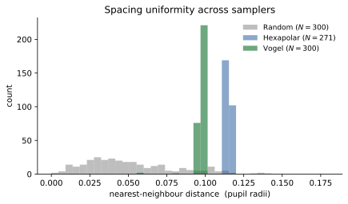

   Nearest-neighbour distances for the three full-disk samplers at
   :math:`N \approx 300`. Random sampling produces clumps (left tail of
   short distances); hexapolar and Vogel are tightly peaked, with Vogel
   slightly narrower than hexapolar.

2. The equal-area mapping
-------------------------

A common rookie mistake: place :math:`N` samples by stepping
:math:`r = i/N` and rotating around. Because :math:`dA = r\, dr\, d\theta`,
that recipe oversamples the centre by a factor of :math:`r`.

The fix follows from the inverse-CDF method. For uniform sampling on a
disk of radius :math:`R`, the radial CDF is

.. math::

   F_R(r) \;=\; \frac{\pi r^{2}}{\pi R^{2}} \;=\; \frac{r^{2}}{R^{2}},
   \qquad r \in [0, R].

Inverting :math:`F_R(r) = u` with :math:`u \sim \mathcal{U}(0, 1)` gives

.. math::

   \boxed{\;r \;=\; R \sqrt{u}\;}

so **every linear, equal-spaced sequence in** :math:`u` **produces an
equal-area sequence in** :math:`r`. This single identity is why
KrakenOS's Vogel sampler uses ``r = sqrt(i/N)`` and why the Random-disk
generator works by rejection sampling on the unit square (which is
equivalent to taking :math:`u \sim \mathcal{U}(0,1)`).

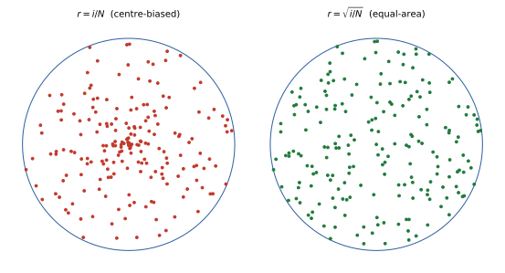

   Same 200 indices, two radial maps: :math:`r = i/N` (left) over-densifies
   the centre, :math:`r = \sqrt{i/N}` (right) gives constant area density.

3. Section fans — when one dimension is enough
----------------------------------------------

For tangential / sagittal aberration slices, a 2D sampler is wasteful:
the integrand is constant along the orthogonal direction. KrakenOS
exposes three section patterns (see :doc:`../manual/pupil_patterns`):

* **Fan Y** (``Pup.Ptype = "fany"``) — the meridional fan,
  :math:`\{(0, j/\mathrm{Samp})\}`. Canonical input for transverse
  ray-aberration plots :math:`\Delta y' = \mathrm{TRA}_y(p_y)`.
* **Fan X** (``"fanx"``) — sagittal fan.
* **Cross fan** (``"fan"``) — Fan X ∪ Fan Y, useful for a quick
  visual sanity check of both aberration directions in one trace.

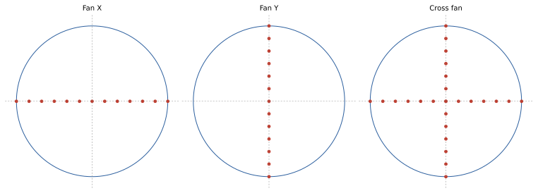

   Section patterns. They are not physical 3D launch distributions;
   Open 3D source-cone tracing maps them to a filled angular cone.

Section fans converge as :math:`O(1/N^{2})` for the 1D integrals they
target (Simpson-like behaviour with smooth integrands) but they are
not valid for any quantity that requires a 2D integral over the pupil
— PSF, encircled energy, MTF, throughput.

4. Hexapolar — equal-area rings
-------------------------------

The traditional analysis default. One chief ray at the centre plus
``Samp`` concentric rings, ring :math:`j` carrying :math:`6j` samples
evenly spaced in azimuth at radius :math:`r_j = j/\mathrm{Samp}`. Each
*ring* covers an area :math:`\pi (r_j^2 - r_{j-1}^2)
= \pi (2j-1)/\mathrm{Samp}^{2}`, and there are :math:`6j` samples on
it, giving constant per-sample area
:math:`\pi (2j-1) / (6j\,\mathrm{Samp}^{2}) \approx \pi/(3\,\mathrm{Samp}^{2})`
for large :math:`j` — so the pattern is asymptotically equal-area
without the :math:`\sqrt{\cdot}` step.

The total ray count is

.. math::

   N_{\text{hex}} \;=\; 1 + \sum_{j=1}^{\mathrm{Samp}} 6j
   \;=\; 1 + 3\,\mathrm{Samp}(\mathrm{Samp}+1).

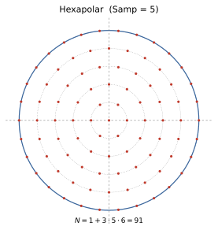

   Hexapolar at ``Samp = 5``: six-fold azimuthal symmetry and well
   defined ring radii. Deterministic, reproducible, and visually
   readable in spot diagrams.

Strengths: zero variance for any radially-symmetric integrand at finite
:math:`N`; exact six-fold symmetry plays nicely with PSF cores. Weakness:
the strong angular ordering aliases sharp pupil features (a hard mask,
a vignette edge) into Moiré-like artefacts in FFTs.

5. Square grid — when the detector decides
------------------------------------------

A Cartesian grid of step :math:`1/\mathrm{Samp}` clipped to the unit
disk (``Pup.Ptype = "square"``). It contains roughly :math:`\pi
\mathrm{Samp}^{2}` samples after clipping. Useful when:

* The downstream computation is an FFT-based OPD → PSF pipeline that
  wants a square footprint anyway.
* Sample positions must align with detector pixel centres in image
  space (e.g. discrete-grid optical-bench experiments).

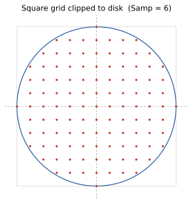

   The Cartesian grid that survives the disk clip. The corner samples
   are dropped, leaving a slightly noisy boundary.

Weakness: the *boundary* is irregular, so a marginal-ray sweep produced
by this pattern has gaps. Avoid for Seidel sums or marginal-rim
analyses; prefer hexapolar or Vogel there.

6. Random disk — the Monte-Carlo baseline
-----------------------------------------

``Pup.Ptype = "rand"``: rejection sampling on the square
:math:`[-1, 1]^2` keeping points with :math:`x^2 + y^2 < 1`. Up to
:math:`4\,\mathrm{Samp}^{2}` candidates produce a disk population of
roughly :math:`\pi \mathrm{Samp}^{2}`.

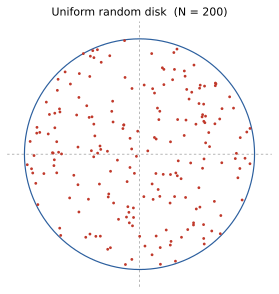

   Uniform pseudo-random samples. Note the visible clumps and voids
   typical of low-:math:`N` random draws.

For an integrand :math:`f` with finite variance :math:`\sigma^{2}`,
the standard Monte-Carlo error is

.. math::

   \operatorname{Var}\!\left[\hat{I}_{N}\right] \;=\; \frac{\sigma^{2}}{N},
   \qquad
   \operatorname{StdErr} \;=\; \frac{\sigma}{\sqrt{N}}.

Strength: the rate :math:`1/\sqrt{N}` is **independent of dimension**,
which is why it remains the workhorse for high-dimensional stray-light
integrals. Weakness: clumps and voids at small :math:`N` produce visible
banding in PSF / spot estimates.

7. The Vogel / golden-angle spiral
----------------------------------

This is the sampler KrakenOS uses *inside* the source preview, the
reference-disk launcher, and the Lambertian / cosine-lobe hemisphere
generators — see ``sample_source_disk_points`` in
``KrakenOS/UI/source_trace_helpers.py``, the matching 3D variant
``sample_reference_disk_points_3d``, and the hemisphere code in
``KrakenOS/KrakenSys.py``. It is colloquially called "Fibonacci sampling"
because its azimuthal step is the limit of the Fibonacci ratios.

Definition
~~~~~~~~~~

For sample index :math:`i = 0, 1, \dots, N-1`:

.. math::

   r_{i} \;=\; R\sqrt{i / (N-1)}, \qquad
   \theta_{i} \;=\; i \cdot \alpha, \qquad
   \alpha \;=\; \pi\bigl(3 - \sqrt{5}\bigr) \;\approx\; 137.5077640^{\circ}.

The radial step is the equal-area mapping of §2. The azimuthal step
:math:`\alpha` is the **golden angle**.

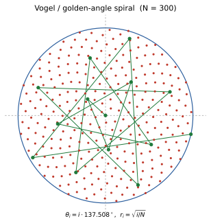

   :math:`N = 300` Vogel samples. The green polyline highlights the
   first 14 in order — they spiral outward at exactly :math:`137.5^\circ`
   per step.

Why the golden angle?
~~~~~~~~~~~~~~~~~~~~~

The golden angle is the unique angle that is **maximally irrational**
in a number-theoretic sense, and that is what makes the resulting
spiral low-discrepancy. The derivation has three steps.

**Step 1 — turn fraction.** Set :math:`\alpha = 2\pi\,\rho` for some
turn fraction :math:`\rho \in (0, 1)`. After :math:`N` steps the
azimuths are :math:`\{2\pi\,\rho\,i \bmod 2\pi\}`. If :math:`\rho = p/q`
is rational with small :math:`q`, every :math:`q^{\text{th}}` sample
lands on the same ray and you get :math:`q`-arm starburst patterns
instead of a uniform fill.

**Step 2 — continued fractions.** The "how rational" of any
:math:`\rho` is measured by how well it can be approximated by rationals.
Every irrational :math:`\rho` has a unique simple continued-fraction
expansion :math:`\rho = [a_{0}; a_{1}, a_{2}, \dots]`. Large
:math:`a_{k}` mean cheap rational approximations (close clumps);
small :math:`a_{k}` mean the opposite. The most-irrational choice is
the one where every :math:`a_{k} = 1`:

.. math::

   \rho^{*} \;=\; [0; 1, 1, 1, 1, \dots]
   \;=\; \frac{1}{1 + \dfrac{1}{1 + \dfrac{1}{1 + \dotsb}}}
   \;=\; \frac{1}{\varphi}, \quad
   \varphi = \frac{1+\sqrt{5}}{2}.

**Step 3 — back to the angle.** Either turn fraction
:math:`\rho^{*}` or :math:`1 - \rho^{*}` works; by convention we take

.. math::

   \alpha \;=\; 2\pi\bigl(1 - 1/\varphi\bigr)
   \;=\; \frac{2\pi}{\varphi^{2}}
   \;=\; \pi(3 - \sqrt{5})
   \;\approx\; 137.5078^{\circ}.

The successive Fibonacci ratios :math:`F_{n}/F_{n+1}
= 1/1, 1/2, 2/3, 3/5, 5/8, 8/13, \dots` are exactly the convergents of
the continued-fraction expansion, which is why this angle is also
called the **Fibonacci angle** even though no Fibonacci number appears
in the runtime formula.

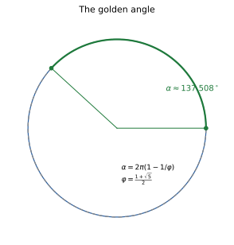

   The golden angle as a fraction of the full circle. The green arc is
   the turn taken between successive samples; the grey-dashed arc is
   the *complement* taken on every other revolution. Neither arc closes
   into a low-period orbit.

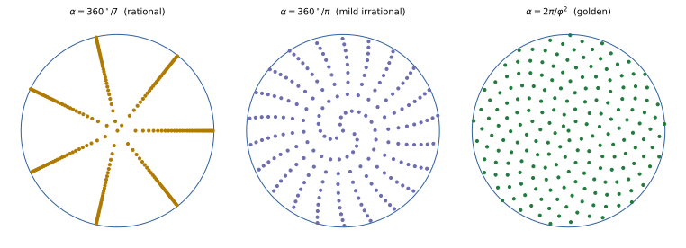

   Same :math:`N = 200` indices, three angles. A *rational* angle
   (:math:`360^{\circ}/7`) produces seven straight arms. A *mildly
   irrational* angle (:math:`360^{\circ}/\pi`) still shows visible
   curved bands. The **golden angle** uniformly fills the disk.

Why optical designers care
~~~~~~~~~~~~~~~~~~~~~~~~~~

* **Convergence.** For smooth integrands the Vogel spiral behaves like
  a 2D quasi-random sequence: error :math:`\sim N^{-1}` versus
  :math:`N^{-1/2}` for pure random. In a typical PSF estimate you reach
  the same standard error with :math:`\sim \sqrt{N_{\text{random}}}`
  rays.
* **Isotropy.** Unlike the hexapolar grid, the Vogel spiral has no
  preferred direction at any :math:`N`, so it never imprints
  six-fold structure on a PSF or MTF.
* **Incremental.** Adding samples never re-positions existing ones.
  This makes it ideal for live UI previews: increase ``ray_count`` and
  the previously drawn rays remain valid — a property the
  ``sample_source_disk_points`` helper relies on.
* **Boundary fill.** The outermost ring is exactly
  :math:`r_{N-1} = R`, so the marginal rim is always sampled. The
  square-grid and random-disk patterns leave a fluctuating gap there.

8. From disk to hemisphere — Lambertian and lobe scattering
-----------------------------------------------------------

The same spiral lifts straight onto a hemisphere. KrakenOS's Lambertian
emitter (``KrakenSys.py`` around line 2565) and its glossy lobe
(line 2602) both use it.

For a **cosine-weighted hemisphere** (Lambert's law), the joint PDF in
spherical coordinates is :math:`p(\theta, \phi) = \cos\theta\,\sin\theta /
\pi`. Integrating gives the marginal radial CDF

.. math::

   F(\theta) \;=\; \sin^{2}\theta, \qquad
   F^{-1}(u) \;=\; \arcsin \sqrt{u},

so the recipe is

.. math::

   \sin^{2}\theta_{i} \;=\; i/N, \qquad
   \phi_{i} \;=\; i\cdot \alpha,

which is exactly what ``KrakenSys._sample_lambertian_directions`` does
(``sin2_max`` clamps the cone). The Vogel spiral on the disk maps
isomorphically onto the cosine-weighted hemisphere by reading the
disk-radius :math:`r_{i} = \sqrt{i/N}` as :math:`\sin\theta_{i}`.

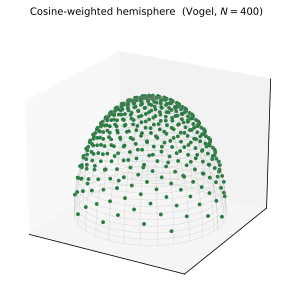

   400 directions drawn from the cosine-weighted hemisphere using the
   Vogel spiral with :math:`\sin^{2}\theta = i/N`. The density falls off
   toward the rim because Lambert's law puts more flux near the normal.

The directional-lobe variant raises the cosine to a power :math:`n`
(``settings["lobe_exponent"]``), giving a glossy specular highlight; the
golden-angle azimuth keeps the lobe rotationally uniform.

9. KrakenOS code map
--------------------

Where each sampler lives, for reference:

.. list-table:: KrakenOS sampling sites
   :header-rows: 1
   :widths: 30 35 35

   * - Sampler
     - Where it is implemented
     - Where it is used
   * - Hexapolar / Square / Random / fans
     - ``KrakenOS/PupilTool.py`` (``PupilCalc.Pattern``)
     - Sequential analysis driven by ``Pup.Ptype``; UI labels in
       ``PUPIL_PATTERN_TO_KRAKEN``.
   * - Vogel disk (2D)
     - ``sample_source_disk_points`` —
       ``KrakenOS/UI/source_trace_helpers.py``
     - 2D source previews; non-sequential disk launches with
       ``ray_count > 9``.
   * - Vogel disk (3D)
     - ``sample_reference_disk_points_3d`` —
       same file
     - Open 3D scene reference launches.
   * - Vogel preview overlays
     - ``KrakenOS/UI/services/source_modeling.py`` and
       ``KrakenOS/UI/services/trace_preview_sampling.py``
     - Live "Source preview" and "Trace preview" overlays in the Layout
       Editor.
   * - Vogel hemisphere (Lambertian)
     - ``KrakenSys.py`` ``_sample_lambertian_directions``
     - Diffuse scattering from a surface; non-sequential thermal /
       Lambertian sources.
   * - Vogel cosine-lobe
     - ``KrakenSys.py`` directional-lobe block
     - Glossy specular scattering with adjustable ``lobe_exponent``.
   * - Vogel finite-source offsets
     - ``KrakenSys.py`` finite-source pupil block
     - Mapping a finite-radius emitter to a Lambertian fan when
       ``Source cone`` is non-zero.

10. Choosing in practice
------------------------

A short decision tree for the analyses the Layout Editor surfaces:

* **Tangential aberration plot, sagittal aberration plot, ray-fan
  display** — Fan Y or Fan X (then maybe Cross fan).
* **Spot diagram, Seidel sums, ABCD/wavefront overlay, classical OPD** —
  Hexapolar at ``Samp = 5``…``8`` (deterministic, six-fold benign).
* **Square-detector PSF / FFT-OPD pipeline** — Square grid; align
  ``Samp`` to the detector sampling.
* **Encircled energy, throughput, stray-light Monte-Carlo, edge-of-pupil
  vignetting** — Vogel (via source preview / disk launchers) or Random
  if you need an unbiased variance estimate.
* **Non-sequential diffuse / glossy surface scattering** — leave it to
  the built-in Lambertian and lobe samplers, both of which already use
  the golden-angle spiral.

When in doubt: start with hexapolar for analysis and Vogel for source
launches. They cover almost every workflow in KrakenOS.

Further reading
---------------

* :doc:`../manual/pupil_patterns` — UI combobox → ``Pup.Ptype`` mapping.
* :doc:`../manual/pupilcalc_tool` — how patterns are turned into rays
  with ``Pattern2Field``.
* :doc:`cardinal_points` — what the pupil *is* and how EP/XP are
  located.
* :doc:`rules_of_thumb` — sampling counts you actually need for PSF /
  MTF / spot reductions.
* H. Vogel, *A better way to construct the sunflower head*,
  Mathematical Biosciences **44** (1979), 179–189.
