Rules of Thumb — Optics, Imaging, Laser
=======================================

A reference of quick-recall formulas, the geometry behind them, and the
specific KrakenOS calls that compute the exact answer. The UI's
**Help → Paraxial Calculator** and **Help → Optics Formula Sheet** dialogs
present the same paraxial relations against your live system; this page is
the in-depth companion that pairs each rule with an illustration, a
back-of-envelope number, and runnable code.

.. contents::
   :local:
   :depth: 2

How to use this page
--------------------

Each section uses the same structure:

* **Rule** — the formula in its everyday form.
* **Where each symbol comes from** — variable list pulled out of the equation.
* **Quick number** — a worked example you can do in your head, sized so
  the right-hand side is obviously the right order of magnitude.
* **KrakenOS** — the call that computes the same quantity exactly for your
  actual layout, so the rule of thumb stays a sanity check, not a
  ground-truth substitute.

The achromatic doublet system from
:doc:`../manual/analysis_tools` is referenced in several code blocks as
``Doublet``; rebuild it from that page's *Common Setup* block.

Section 1 — Geometric / paraxial optics
---------------------------------------

1.1 Thin-lens imaging equation
~~~~~~~~~~~~~~~~~~~~~~~~~~~~~~

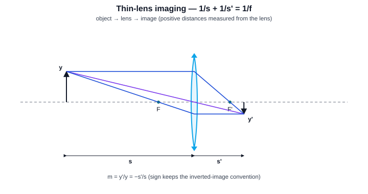

.. math::

   \frac{1}{s} + \frac{1}{s'} = \frac{1}{f}\,,\qquad m = \frac{y'}{y} = -\frac{s'}{s}.

where:

* :math:`s` — object distance, lens to object (positive when the object is
  on the incoming side).
* :math:`s'` — image distance, lens to image.
* :math:`f` — effective focal length.
* :math:`y, y'` — object and image heights.
* :math:`m` — lateral magnification (negative for inverted).

**Quick number.** A 50 mm lens at :math:`s = 250\,\mathrm{mm}` gives
:math:`s' = 1/(1/50 - 1/250) = 62.5\,\mathrm{mm}` and
:math:`m = -62.5/250 = -0.25\times`.

.. code-block:: python

   # Exact paraxial image distance and magnification for the doublet
   import KrakenOS as Kos
   s = 250.0                             # object distance, mm
   effl, ppa, ppp = (Pup.EFFL, 0.0, 0.0) # use _exact_paraxial_cardinals for thick lenses
   sp = 1.0 / (1.0 / effl - 1.0 / s)
   m  = -sp / s
   print("s' =", sp, "mm   m =", m)

1.2 f-number, aperture cone and diffraction limit
~~~~~~~~~~~~~~~~~~~~~~~~~~~~~~~~~~~~~~~~~~~~~~~~~

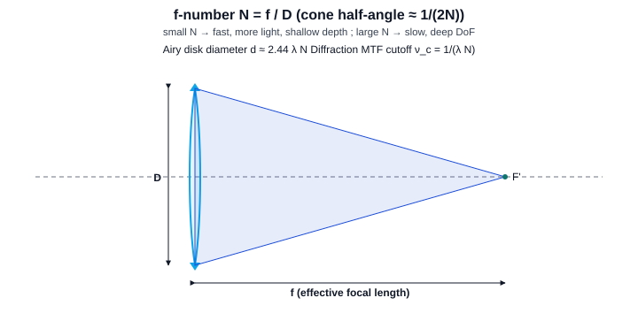

.. math::

   N = \frac{f}{D_{\mathrm{EP}}}\,,\qquad
   d_{\mathrm{Airy}} = 2.44\,\lambda\,N\,,\qquad
   \nu_c = \frac{1}{\lambda\,N}.

where:

* :math:`N` — f-number (a.k.a. "f/N", "speed").
* :math:`D_{\mathrm{EP}}` — entrance-pupil diameter.
* :math:`d_{\mathrm{Airy}}` — diameter of the Airy disk to the first zero.
* :math:`\nu_c` — diffraction-limited MTF cutoff frequency (1/length).

**Quick numbers (λ = 0.55 µm).**

============  ===============  ==============
   N           Airy diameter    MTF cutoff
============  ===============  ==============
f/2            2.7 µm           1660 cyc/mm
f/4            5.4 µm            830 cyc/mm
f/8           10.7 µm            415 cyc/mm
f/16          21.5 µm            207 cyc/mm
============  ===============  ==============

.. code-block:: python

   D_EP = 2.0 * Pup.RadPupInp
   f    = Pup.EFFL
   N    = f / D_EP
   wave_um = 0.55
   d_airy_um = 2.44 * wave_um * N
   nu_c_per_mm = 1.0e3 / (wave_um * N)  # cycles per mm

1.3 Working f-number for finite conjugates
~~~~~~~~~~~~~~~~~~~~~~~~~~~~~~~~~~~~~~~~~~

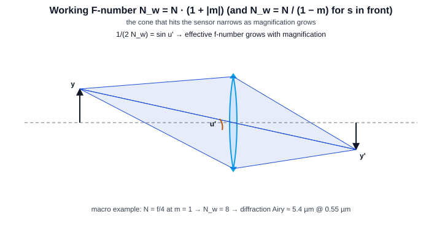

.. math::

   N_w = N\,(1 + |m|)\quad\text{(object far from lens)}\,,\qquad
   N_w \approx \frac{N}{1 - m}\quad\text{(object inside lens)}.

where:

* :math:`N_w` — working f-number that actually sets the image-side cone.
* :math:`m` — magnification of the imaging conjugate in use.

**Quick number.** A 100 mm f/4 lens used at 1:1 macro
(:math:`|m| = 1`) acts like :math:`N_w = 8` — depth of field doubles,
diffraction-limited resolution halves.

.. code-block:: python

   m  = abs(-sp / s)
   N  = f / D_EP
   Nw = N * (1.0 + m)
   d_airy_um_macro = 2.44 * 0.55 * Nw

1.4 Two thin lenses in series
~~~~~~~~~~~~~~~~~~~~~~~~~~~~~

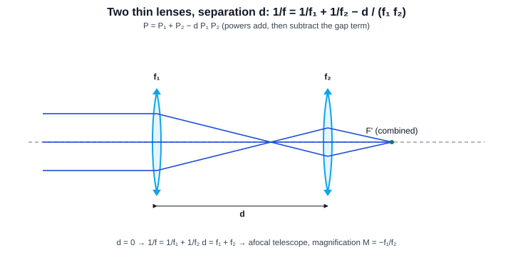

.. math::

   \frac{1}{f} = \frac{1}{f_1} + \frac{1}{f_2} - \frac{d}{f_1 f_2}\,,\qquad
   P = P_1 + P_2 - d\,P_1 P_2.

where:

* :math:`f_1, f_2` — individual focal lengths.
* :math:`d` — separation between the two thin-lens vertices.
* :math:`P_i = 1/f_i` — surface or element powers.

**Quick number.** Two 100 mm lenses spaced 50 mm apart:
:math:`P = 0.01 + 0.01 - 0.05 \cdot 10^{-4} = 0.0195\,\mathrm{mm}^{-1}`
→ :math:`f \approx 51.3\,\mathrm{mm}` and the doublet is much faster than
either element alone.

**Afocal limit.** When :math:`d = f_1 + f_2` the system becomes an afocal
telescope with angular magnification :math:`M = -f_2/f_1`.

.. code-block:: python

   # Exact two-element power combination via ABCD
   import numpy as np
   def combined_focal(f1, f2, d):
       M = np.array([[1, 0],[-1/f2, 1]]) @ np.array([[1, d],[0,1]]) @ np.array([[1,0],[-1/f1,1]])
       return -1.0 / M[1, 0]

1.5 Macro 2f rule (1:1 imaging)
~~~~~~~~~~~~~~~~~~~~~~~~~~~~~~~

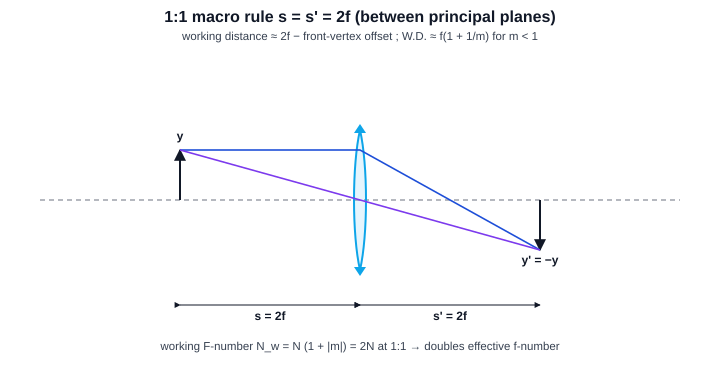

.. math::

   s = s' = 2f\,,\qquad
   \text{W.D.} \approx f\left(1 + \frac{1}{|m|}\right).

where:

* W.D. — working distance, lens-front to object.
* :math:`m` — magnification (1× for unit imaging).

**Quick number.** A 100 mm lens at unit magnification places both object
and sensor 200 mm from the principal planes. Effective f-number doubles
(:math:`N_w = 2N`).

1.6 Snell's law and total internal reflection
~~~~~~~~~~~~~~~~~~~~~~~~~~~~~~~~~~~~~~~~~~~~~

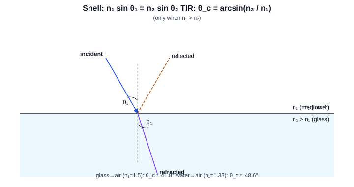

.. math::

   n_1 \sin\theta_1 = n_2 \sin\theta_2\,,\qquad
   \theta_c = \arcsin\!\left(\frac{n_2}{n_1}\right)\;(n_1 > n_2).

where:

* :math:`\theta_1, \theta_2` — incident / refracted angles to the
  surface normal.
* :math:`n_1, n_2` — refractive indices.
* :math:`\theta_c` — critical angle (only defined when :math:`n_1 > n_2`).

**Quick numbers.** glass→air (n=1.50): :math:`\theta_c \approx
41.8^\circ` ; water→air (n=1.33): :math:`\theta_c \approx 48.6^\circ` ;
sapphire→air (n=1.77): :math:`\theta_c \approx 34.4^\circ`.

Section 2 — Imaging system rules
--------------------------------

2.1 Angle of view and sensor format
~~~~~~~~~~~~~~~~~~~~~~~~~~~~~~~~~~~

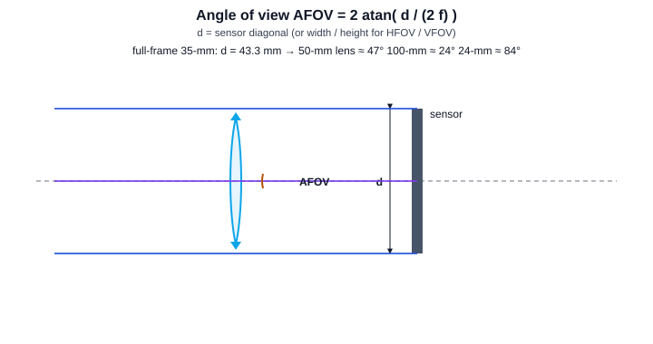

.. math::

   \mathrm{AFOV} = 2 \arctan\!\left(\frac{d}{2f}\right)\,,\qquad
   y' = f\,\tan\theta\;(\text{object at infinity}).

where:

* :math:`d` — sensor full extent (diagonal for full AFOV, width for HFOV,
  height for VFOV).
* :math:`f` — focal length.
* :math:`\theta` — half field angle.
* :math:`y'` — image height of a field point at :math:`\theta`.

**Quick numbers (full-frame 35-mm, d = 43.3 mm).**

============  ==========  ==========
   f           AFOV        H × V
============  ==========  ==========
24 mm          84°         74° × 53°
35 mm          63°         54° × 38°
50 mm          47°         40° × 27°
100 mm         24°         20° × 14°
200 mm         12°         10° × 7°
============  ==========  ==========

2.2 Depth of field
~~~~~~~~~~~~~~~~~~

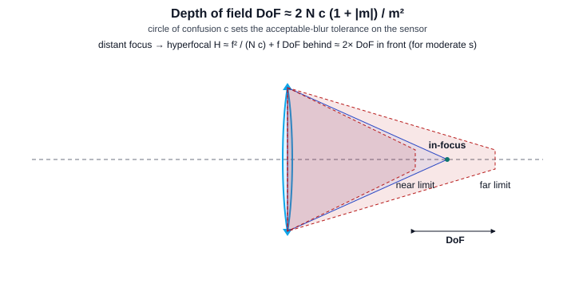

.. math::

   \mathrm{DoF} \approx \frac{2\,N\,c\,(1 + |m|)}{m^2}\quad\text{(general)}\,,\qquad
   \mathrm{DoF} \approx \frac{2\,N\,c}{m^2}\quad\text{(macro, } |m| \ll 1\text{)}.

where:

* :math:`c` — circle of confusion accepted on the sensor (often the
  pixel pitch or 1/1500 of the sensor diagonal).
* :math:`m` — magnification of the in-focus object.
* :math:`N` — f-number.

**Quick number.** Full-frame sensor, :math:`c = 30\,\mu\mathrm{m}`,
f/8, 50 mm at 2 m subject distance gives
:math:`m = 50/1950 \approx 0.026` and
:math:`\mathrm{DoF} \approx 2(8)(0.030)(1.026)/(0.026)^2 \approx 730\,\mathrm{mm}`
— roughly a half-metre in front, a metre behind.

2.3 Hyperfocal distance
~~~~~~~~~~~~~~~~~~~~~~~

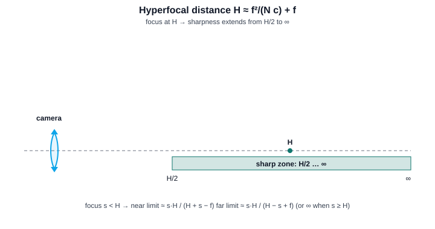

.. math::

   H \approx \frac{f^2}{N\,c} + f.

where:

* :math:`H` — hyperfocal distance. Focusing the lens at :math:`H` makes
  everything from :math:`H/2` to :math:`\infty` acceptably sharp.

**Quick number.** Full-frame 35 mm at f/8, :math:`c = 30\,\mu\mathrm{m}`:
:math:`H = 0.035^2 / (8 \cdot 30\times10^{-6}) + 0.035 \approx 5.14\,\mathrm{m}`.
Set focus to 5 m, get everything from 2.5 m to infinity sharp.

2.4 Diffraction & resolution
~~~~~~~~~~~~~~~~~~~~~~~~~~~~

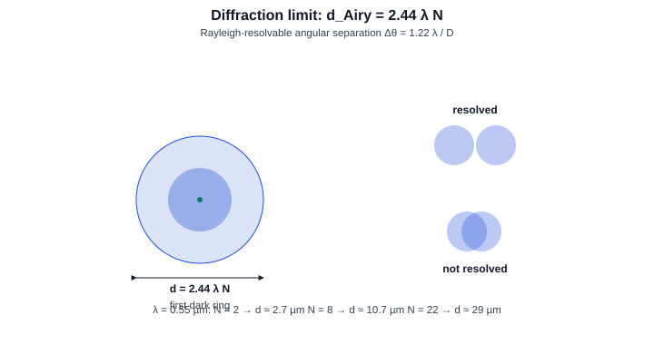

* **Airy disk diameter:** :math:`d = 2.44\,\lambda\,N`.
* **Rayleigh angular resolution:** :math:`\Delta\theta = 1.22\,\lambda/D`.
* **Strehl from RMS wavefront** (small aberration):

  .. math::

     S \approx \exp\!\left(-(2\pi\,\sigma)^2\right)\approx 1 - (2\pi\,\sigma)^2.

  Maréchal's rule:  diffraction-limited iff
  :math:`\sigma \leq \lambda/14\;\;(S \geq 0.8)`.
* **Rayleigh wavefront tolerance:** :math:`\lambda/4` peak-to-valley.

where:

* :math:`D` — entrance-pupil diameter.
* :math:`\sigma` — RMS wavefront error in waves.
* :math:`S` — Strehl ratio (peak intensity / diffraction-limited peak).

.. code-block:: python

   # Strehl from RMS wavefront error (Maréchal)
   import math
   sigma_waves = 0.05
   strehl_approx = math.exp(-(2*math.pi*sigma_waves)**2)
   #  see analysis_tools.rst, section "PSF (Fraunhofer)" for the
   #  full Fourier optics path through KrakenOS:
   #     Zcoef, *_ = Kos.Zernike_Fitting(X, Y, Z, np.ones(15))
   #     I = Kos.psf(Zcoef, Focal, Diameter, W, pixels=265)

2.5 Pixel sampling and the Nyquist limit
~~~~~~~~~~~~~~~~~~~~~~~~~~~~~~~~~~~~~~~~

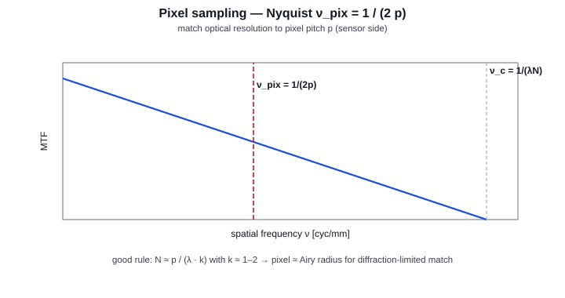

.. math::

   \nu_{\mathrm{pix}} = \frac{1}{2p}\,,\qquad
   \text{match diffraction:}\;\;
   N \approx \frac{p}{\lambda\,k},\;\;k \in [1, 2].

where:

* :math:`p` — pixel pitch on the sensor.
* :math:`\nu_{\mathrm{pix}}` — sensor Nyquist limit.

**Quick number.** A 3.45 µm pixel at λ = 0.55 µm hits a diffraction
limit around :math:`N \approx 3.45 / 0.55 \approx 6.3` for k = 1, i.e.
about f/6.3 — stop down further and the lens, not the sensor, sets
sharpness.

**Bayer/AA caveats.** Color sensors with Bayer filters give effective
luminance Nyquist ≈ 0.7 × geometric Nyquist. If the optical system has
no anti-alias filter, aim for ≥ 2× oversampling at the highest expected
luminance frequency.

Section 3 — Lasers and Gaussian beams
-------------------------------------

3.1 Waist, Rayleigh range, divergence
~~~~~~~~~~~~~~~~~~~~~~~~~~~~~~~~~~~~~

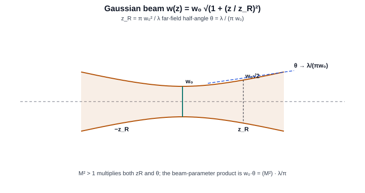

.. math::

   w(z) = w_0\sqrt{1 + (z/z_R)^2}\,,\qquad
   z_R = \frac{\pi\,w_0^2}{\lambda}\,,\qquad
   \theta_{\mathrm{half}} = \frac{\lambda}{\pi w_0}.

where:

* :math:`w_0` — beam waist radius (:math:`1/e^2` of intensity).
* :math:`z_R` — Rayleigh range; beam radius grows by :math:`\sqrt{2}`.
* :math:`\theta_{\mathrm{half}}` — far-field half-angle of the
  :math:`1/e^2` envelope.
* For real (non-:math:`M^2 = 1`) beams, multiply both :math:`z_R` and
  :math:`\theta` by :math:`M^2`.

**Quick numbers (λ = 633 nm HeNe).**

==============  ==========  ===============
   w₀            z_R          full-angle 2θ
==============  ==========  ===============
0.10 mm          50 mm        4.0 mrad
0.50 mm         1240 mm       0.81 mrad
1.00 mm         4960 mm       0.40 mrad
==============  ==========  ===============

.. code-block:: python

   import KrakenOS as Kos
   beam = Kos.GaussianBeamInput(w0=0.5, wavelength_um=0.633)
   # KrakenOS-side propagation and ABCD steps live in gaussian_beams.rst

3.2 Focused spot of a Gaussian beam
~~~~~~~~~~~~~~~~~~~~~~~~~~~~~~~~~~~

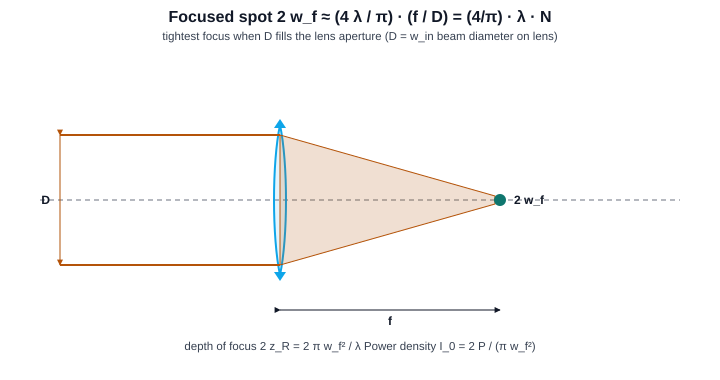

.. math::

   2\,w_f \;\approx\; \frac{4}{\pi}\,\lambda\,N \;=\; \frac{4}{\pi}\,\lambda\,\frac{f}{D}\,,\qquad
   \text{depth of focus}\;\; 2\,z_R = \frac{2\pi\,w_f^2}{\lambda}.

where:

* :math:`w_f` — focused-spot radius at the new waist.
* :math:`D` — incoming-beam diameter at the lens (:math:`2\,w_{\text{in}}`).
* :math:`f` — focal length of the focusing element.

**Quick number.** A 1064 nm beam, 5 mm diameter, focused by a 50 mm
lens: :math:`N = 10` → :math:`2 w_f \approx (4/\pi)(1.064\,\mu)(10) \approx
13.5\,\mu\mathrm{m}`, depth of focus :math:`\approx 0.27\,\mathrm{mm}`.

3.3 Two-mirror cavity stability
~~~~~~~~~~~~~~~~~~~~~~~~~~~~~~~

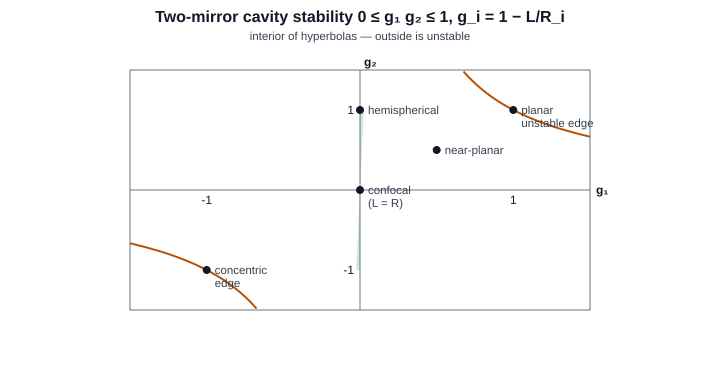

.. math::

   g_i = 1 - \frac{L}{R_i}\,,\qquad
   0 \le g_1\,g_2 \le 1\;\Leftrightarrow\;\text{stable}.

where:

* :math:`L` — mirror-to-mirror cavity length.
* :math:`R_i` — radius of curvature of mirror :math:`i` (positive for
  concave-toward-cavity).

**Special cases.**

* :math:`g_1 = g_2 = 0`: confocal (L = R), lowest waist, large mode.
* :math:`g_1 = g_2 = 1`: planar, only marginally stable.
* :math:`g_1 = g_2 = -1`: concentric (L = 2R), unstable edge.
* :math:`g_1 = 0, g_2 = 1`: hemispherical.

3.4 Power density and damage
~~~~~~~~~~~~~~~~~~~~~~~~~~~~

Peak on-axis intensity at the waist:

.. math::

   I_0 = \frac{2 P}{\pi w^2}.

**Quick number.** 1 mW CW HeNe focused to a 10 µm-radius waist
gives :math:`I_0 = 2(10^{-3})/(\pi \cdot (10\times10^{-6})^2) \approx
6.4\,\mathrm{kW/cm^2}` — well below CW damage thresholds for most
absorbing coatings but enough to permanently bleach a film.

3.5 Coherence and bandwidth
~~~~~~~~~~~~~~~~~~~~~~~~~~~

.. math::

   L_c = \frac{c}{\Delta\nu}\,,\qquad
   \Delta\nu \approx \frac{c\,\Delta\lambda}{\lambda^2}.

* :math:`L_c` — coherence length.
* :math:`\Delta\nu` — optical bandwidth (Hz).
* :math:`\Delta\lambda` — wavelength width (same units as λ).

**Quick numbers.**

* HeNe (Δν = 1.5 GHz):  Lc ≈ 20 cm.
* DBR diode (Δλ = 0.1 nm at 780 nm):  Lc ≈ 6 mm.
* Mode-locked Ti:Sapph (Δλ = 30 nm at 800 nm):  Lc ≈ 21 µm.

Section 4 — Cross-cutting design heuristics
-------------------------------------------

The list below intentionally repeats from the popups so the same advice
shows up wherever the user is reading.

* **Diameters are full, fields are semi.** In the UI, ``Object
  Diameter``, ``Image Diameter`` and ``EPD`` are full diameters;
  ``Field Half-Angle`` and every ``* Semi-Height`` field type is a
  semi-field. Mixing the two doubles or halves your answers.
* **Stop choice changes pupil location, not focal length.** Move the
  ``STOP`` between elements to change vignetting and pupil aberrations;
  don't expect the focal length, magnification, or image distance to
  change.
* **Paraxial solves are linear**. They assume small angles, no
  decenter/tilt, no aspherics. Use the trace tools, not the calculator,
  for off-axis, anamorphic, or freeform layouts.
* **2/3 rule for image plane motion.** A focus error :math:`\delta` at
  the object side moves the image by :math:`-m^2 \delta` — that's why
  macro setups are so sensitive to subject movement.
* **Don't chase Strehl below 0.8 with paraxial intuition.** Past
  :math:`\sigma \approx \lambda/14`, only the full PSF (Fraunhofer
  propagation in :py:mod:`KrakenOS.PSFCalc`) tells you what the image
  actually looks like.
* **The achromat is the cheapest fix.** Replacing a singlet with an
  air-spaced doublet cuts on-axis longitudinal chromatic aberration by
  ≈ 30×; a triplet adds another ≈ 5× and removes the spherochromatism
  residual. Quantify with ``Kos.Seidel(Pup).SCW_TOTAL``.

Section 5 — Where to go next
----------------------------

* :doc:`../manual/parax_tool` — the paraxial matrix layer the calculator uses.
* :doc:`../manual/pupilcalc_tool` — entrance/exit pupil geometry, EFL, Airy
  radius, chief-ray data.
* :doc:`cardinal_points` — step-by-step ray construction for EP, XP,
  PP, PP', FFL, BFL.
* :doc:`../manual/analysis_tools` — full formula, illustration, worked example
  and KrakenOS source block for each Analysis tool: spot, OPD, Zernike,
  Seidel, MTF, PSF, encircled energy, atmospheric, etc.
* :doc:`../manual/gaussian_beams` — Gaussian beam propagation, q-parameters,
  cavity eigenmodes, branch-field overlap, with worked examples.
