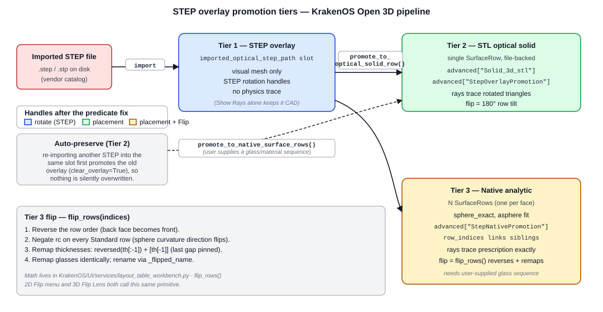
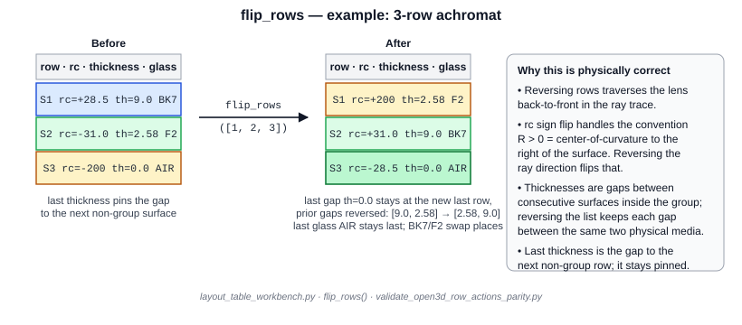

STEP Overlay Promotion — Tiers and 2D/3D Parity
================================================

How an imported STEP file becomes traceable optical geometry in KrakenOS,
why there are three different representations, and which row-level actions
must remain available in the 3D inspector to match what the 2D surface
table can already do.

   Tier 1 (display-only STEP overlay) → Tier 2 (single STL-backed row) or
   Tier 3 (one analytic row per face) → trace-ready optical geometry. The
   tier choice changes how flipping, scene-placement handles, and physics
   tracing behave.

.. contents::
   :local:
   :depth: 2

Why three tiers
---------------

Importing a STEP file from a vendor catalog gives you triangulated CAD
geometry. KrakenOS has to bridge that to a sequential prescription that
can be ray-traced. Each tier is a different point on the trade-off curve
between *fast to import* and *physically rigorous*:

* **Tier 1** keeps the STEP as a *display-only* overlay. Cheap and
  reversible — but rays don't trace through it.
* **Tier 2** wraps the whole STEP body in a single ``SurfaceRow`` backed
  by an STL mesh. Rays trace against the rotated triangles, so it's a
  refractive/reflective solid in the scene, but interior surface curvatures
  are approximated by triangle facets.
* **Tier 3** parses the STEP B-Rep, fits each analytic face (sphere,
  asphere, plane) to a true KrakenOS surface, and inserts one row per
  face. The lens traces as exact analytic surfaces — at the cost of
  needing a glass/material sequence and surfaces that the fitter
  recognises.

Tier 1 — STEP overlay
~~~~~~~~~~~~~~~~~~~~~

Triggered by *Import Optical STEP* (and the corresponding LED / Camera /
Lens slots). The STEP path is stored in
``editor.imported_optical_step_path`` (one slot per
``STEP_OVERLAY_LABELS = ("lens", "optical", "led", "camera")``), the mesh
is tessellated for display, and the overlay carries placement state
(``optical_step_rotation_x_deg``, ``optical_step_axis_offset_xy``, etc.).
The 3D inspector renders it as an interactive body with **STEP rotation
handles** (``_actor_step_rotate_map``) anchored at the overlay centroid.

* Pickable: yes (face hover/selection works, axis-snap works).
* Traceable: no — rays do not propagate through Tier 1 bodies unless an
  explicit physics preview is requested.
* Handles: STEP rotation handles (X/Y/Z arcs about the overlay centroid).
* Flippable: yes — a 180° rotation handle click rotates the overlay
  itself, but only the *visual* — until you promote, it's not in the trace.

Tier 2 — STL optical-solid row
~~~~~~~~~~~~~~~~~~~~~~~~~~~~~~

Triggered by *Promote STEP to Optical Solid Row*, or automatically by
``_preserve_unpromoted_step_overlay`` when a slot is about to be reused
for a different import. The current transformed mesh is saved to
``CAD_CACHE/promoted_step_overlays/<label>_<hash>.stl`` and a fresh
``SurfaceRow`` is inserted with two key markers in ``row.advanced``:

* ``Solid_3d_stl`` — absolute path to the cached STL (this is what
  ``_file_backed_stl_row_at()`` looks for, and the gate for several legacy
  handle/feature predicates).
* ``StepOverlayPromotion`` — provenance: source STEP path, promotion
  step label, baked-in rotation/offset state, axial reserve, etc.

The lens is now a single row that traces as a refractive STL solid. The
sequential trace pierces the triangle mesh; rotating the row (``tilt_x``,
``tilt_y``, ``tilt_z``) rotates the mesh and the trace obeys.

* Pickable: yes (file-backed body, scene placement handles apply).
* Traceable: yes.
* Handles: scene-placement translate + rotate handles
  (``_add_scene_placement_translate_handles``,
  ``_add_scene_placement_rotate_handles``).
* Flippable: 180° rotation about Y is the natural flip; the STL rotates,
  rays still intersect the same triangles in the rotated frame, physics
  is preserved.

Tier 3 — Native analytic rows
~~~~~~~~~~~~~~~~~~~~~~~~~~~~~

Triggered by *Promote STEP to Native Rows* (the user supplies a
glass/material sequence such as ``BK7, F2, AIR`` for a cemented
achromat). ``reconstruct_step_native_surfaces`` walks the STEP B-Rep,
fits each external face to an analytic surface, and produces N
``SurfaceRow`` objects (one per face). Each row's ``advanced`` carries a
``StepNativePromotion`` block:

.. code-block:: python

   row.advanced["StepNativePromotion"] = {
       "step_label": "optical",
       "source_step_path": ".../step_49665.step",
       "material_sequence": ["BK7", "F2", "AIR"],
       "row_indices": [3, 4, 5],         # all siblings of this group
       "applied_row_pose": {...},        # row tilt/desp inherited
                                         # from the overlay's pose at
                                         # promotion time
       "reconstruction": {...},          # surface-fit diagnostics
   }

The ``row_indices`` field is the canonical group membership marker —
``_lens_row_group_for_row()`` resolves any row in the group back to the
full sibling list.

* Pickable: yes (now that the handle predicate accepts promoted rows).
* Traceable: yes, exactly — each surface is an analytic sphere/asphere.
* Handles: scene-placement handles appear (after the predicate fix); a
  single-row rotation only rotates that surface, so use **Flip Lens**
  from the right-click menu for a true 180° flip.
* Flippable: yes, but via ``flip_rows()`` not via the rotation handle —
  see below.

Flipping a Tier-3 lens: why it's not a rotation
-----------------------------------------------

For a Tier-2 STL solid, "flip" really is "rotate the mesh 180°" — the ray
trace traverses the rotated triangles and the physics works out. For a
Tier-3 native group, that doesn't work: the rows still get traced in the
declared front-to-back order, so even if you rotate every row's tilt by
180° you'd visually flip the lens while the prescription continues to be
"front sphere first." The ray would hit the same surfaces in the same
order, regardless of orientation.

A real flip changes the *prescription*. That's what ``flip_rows()`` does:

The four mechanical steps:

1. Reverse the row order — what was the back face is now traced first.
2. Negate ``rc`` on every ``Standard`` row (KrakenOS uses the convention
   *R > 0 when the center of curvature is to the right of the surface*;
   reversing ray direction flips that).
3. Remap thicknesses: ``reversed(th[:-1]) + [th[-1]]``. The interior
   gaps between consecutive surfaces in the group get reversed; the
   *last* thickness pins the gap from the new back surface to whatever
   non-group row follows (object, next element, image), so it must stay
   in place.
4. Remap glasses the same way; rename rows via ``_flipped_name``.

The primitive lives in ``layout_table_workbench.py``:

.. code-block:: python

   # KrakenOS/UI/services/layout_table_workbench.py
   def flip_selected(self) -> None:
       if not self.table.selection():
           return
       self.flip_rows(self._selected_table_indices())

   def flip_rows(self, indices: list[int]) -> bool:
       cleaned = sorted({int(v) for v in indices
                         if 0 <= int(v) < len(self.rows)})
       if len(cleaned) < 2:
           return False
       # ... reverse, negate rc, remap thickness/glass, rename, sync ...
       return True

Both the 2D surface-table *Flip* menu item and the 3D *Row Actions →
Flip Lens* menu item go through ``flip_rows``. That's the parity
guarantee — there's exactly one implementation of "flip", and the two
inspectors agree on what it means.

2D ↔ 3D row-action parity
-------------------------

The 2D surface-table context menu (``main_context_menu.py``) carries a
deep menu of row-level actions. Many of them — Shape Builder, Coating
editor, paraxial solves, tolerance manufacturing — are 2D-only because
they don't have a meaningful 3D-spatial trigger. The ones that *do* have
a spatial meaning must be reachable from a 3D right-click on a lens or
prism body.

The current parity table:

+-----------------------------------+-------------------+-------------------+
| Action                            | 2D context menu   | 3D right-click    |
+===================================+===================+===================+
| Flip / reverse element            | yes               | **yes** (Flip     |
|                                   |                   | Lens for groups)  |
+-----------------------------------+-------------------+-------------------+
| Move element up                   | yes               | **yes**           |
+-----------------------------------+-------------------+-------------------+
| Move element down                 | yes               | **yes**           |
+-----------------------------------+-------------------+-------------------+
| Duplicate                         | yes               | **yes**           |
+-----------------------------------+-------------------+-------------------+
| Delete                            | yes               | **yes**           |
+-----------------------------------+-------------------+-------------------+
| Group as element                  | yes               | **yes**           |
+-----------------------------------+-------------------+-------------------+
| Ungroup element                   | yes               | **yes**           |
+-----------------------------------+-------------------+-------------------+
| Element settings…                 | yes               | **yes**           |
+-----------------------------------+-------------------+-------------------+
| Set face function (mirror, …)     | n/a (face-level)  | yes (face menu)   |
+-----------------------------------+-------------------+-------------------+
| Promote STEP to optical solid     | n/a               | yes               |
+-----------------------------------+-------------------+-------------------+
| Convert Type                      | yes               | 2D only           |
+-----------------------------------+-------------------+-------------------+
| Insert Component Below            | yes               | 2D only           |
+-----------------------------------+-------------------+-------------------+
| Apply Material / Coating          | yes               | 2D only           |
+-----------------------------------+-------------------+-------------------+
| Shape Builder / UDA               | yes               | 2D only (dialog)  |
+-----------------------------------+-------------------+-------------------+
| Tolerance / Solve menus           | yes               | 2D only           |
+-----------------------------------+-------------------+-------------------+

The 3D side builds the cascade in
``open3d_face_assignment.py · _build_row_actions_cascade``:

.. code-block:: python

   # KrakenOS/UI/services/open3d_face_assignment.py
   def _build_row_actions_cascade(self, parent_menu, row_index: int) -> None:
       editor = self.editor
       group = editor._lens_row_group_for_row(int(row_index))
       is_group = len(group) >= 2

       def _select_group() -> None:
           editor._select_table_indices(group, focus_index=group[0])

       def _do(action) -> None:
           _select_group()
           action()
           self.refresh_from_editor(force_retrace=True)
           self.highlight_row(group[0])

       actions = tk.Menu(parent_menu, tearoff=False)
       actions.add_command(
           label="Flip Lens (reverse element)" if is_group else "Flip / reverse selected element",
           state="normal" if is_group else "disabled",
           command=lambda: _do(lambda: editor.flip_rows(group)),
       )
       # ... move up/down, duplicate, delete, group/ungroup, element settings ...
       parent_menu.add_cascade(label="Row Actions", menu=actions)

The cascade is offered in two right-click branches:

* Right-click on a **file-backed STL row** (Tier 2): face-function menu
  plus the *Row Actions* cascade.
* Right-click on a **promoted optical-solid row** that isn't file-backed
  (Tier 3 native): *Row Actions* cascade only (no face-function items,
  since faces are analytic surfaces, not STL triangles).

Handle eligibility — the predicate that gates the rotation rings
----------------------------------------------------------------

``_show_scene_placement_handles()`` decides whether the 3D inspector
draws scene-placement translate/rotate handles for the currently-picked
row. The historical gate was *"only file-backed STL rows"*, which meant
Tier 3 native promotions silently lost their handles — clicking the lens
would highlight it but the handles never appeared.

The current predicate accepts any promoted optical-solid row:

.. code-block:: python

   # KrakenOS/UI/open3d_inspector.py
   row_eligible = False
   if active_row_index is not None and 0 <= active_row_index < len(self.editor.rows):
       if self.editor._file_backed_stl_row_at(active_row_index) is not None:
           row_eligible = True
       else:
           row_eligible = bool(
               self.editor._is_any_promoted_optical_solid_row(
                   self.editor.rows[active_row_index]
               )
           )
   picked_row_has_handles = bool(row_eligible and self._show_rotation_handles())

The companion helper
``_is_any_promoted_optical_solid_row`` returns ``True`` when the row
carries either ``StepOverlayPromotion`` (Tier 2) or ``StepNativePromotion``
(Tier 3). The complementary
``_lens_row_group_for_row`` returns the sibling indices for Tier 3
groups so any action (handles, flip, refresh) can operate on the whole
lens, not just the single picked surface.

Validation contract
-------------------

``KrakenOS/UI/validate_open3d_row_actions_parity.py`` enforces:

* ``flip_rows`` is the programmatic primitive and ``flip_selected``
  delegates to it (so 2D and 3D never diverge on flip semantics).
* The handle predicate accepts promoted rows.
* The 3D right-click cascade wires the spatial 2D actions.
* ``flip_rows`` reverses + negates rc + remaps thickness/glass correctly
  on a synthetic 3-row achromat group (numerical check, not just static
  source inspection).

Run it standalone:

.. code-block:: bash

   python -m KrakenOS.UI.validate_open3d_row_actions_parity

Known follow-ups
----------------

* **Group-aware rotation handles for Tier 3.** Today a rotation-handle
  click on a Tier 3 row rotates only that row's tilts (one surface).
  Full free-form group rotation about the lens centroid would need
  ``desp_xy`` updates on all sibling rows, since rotating each row
  independently shifts surface positions. For the common case (flip the
  lens) ``flip_rows`` is the correct primitive and gives the
  physically-correct answer; free-form group rotation is deferred.
* **Demotion path.** There is no Tier 2/3 → Tier 1 reverse. A practical
  workaround is to re-import the source STEP into the same slot, which
  also triggers ``_preserve_unpromoted_step_overlay`` for the existing
  row.
