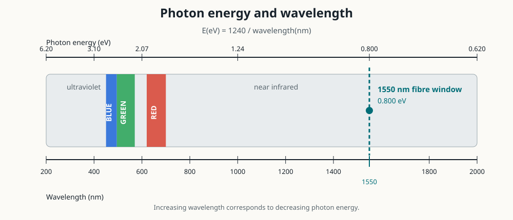

Photonics Essentials: Chapter 2 Problems
========================================

Source
------

Thomas P. Pearsall, *Photonics Essentials: An Introduction with Experiments*
(McGraw-Hill, 2003), Chapter 2, ``Electrons and Photons``, Problems 2.1--2.8,
printed pages 32--34.

The problems are paraphrased below.  Calculations use
:math:`T=295\ \mathrm K`, :math:`k_B T=0.026\ \mathrm{eV}`, and

.. math::

   h=6.62607015\times10^{-34}\ \mathrm{J\,s},\qquad
   c=2.99792458\times10^8\ \mathrm{m/s}.

Quick results
-------------

.. csv-table::
   :header: "Problem", "Result"

   "2.1", "Conduction-band separation: :math:`0.838\ \mathrm{eV}`"
   "2.2", "Phonon: :math:`\lambda\approx1.25\ \mathrm{nm}`, :math:`f\approx6.83\ \mathrm{THz}`, :math:`E\approx28.2\ \mathrm{meV}`"
   "2.3", "Electron wavelength: :math:`29.8\ \mathrm{nm}`, about 53 conventional cells and :math:`6.2\times10^5` atoms"
   "2.4", "Correct relation: :math:`E(\mathrm{eV})=1239.84/\lambda(\mathrm{nm})`"
   "2.5", "The 200--2000 nm interval corresponds to 6.20--0.620 eV"
   "2.6", "Free-particle equation: :math:`-\hbar^2\psi''/(2m)=E\psi`"
   "2.7", "Ideally, reflection and transmission; no band-to-band absorption"
   "2.8", "Frequency is unchanged; wavelength and speed both fall by :math:`1/n`"

Worked solutions
----------------

Problem 2.1: Energy step across a p-n junction
^^^^^^^^^^^^^^^^^^^^^^^^^^^^^^^^^^^^^^^^^^^^^^

**Paraphrase.**  At equilibrium, the electron densities on the two sides are
:math:`n_n=10^{18}\ \mathrm{cm^{-3}}` and
:math:`n_p=10^4\ \mathrm{cm^{-3}}`.  Find the conduction-band energy
difference at room temperature.

For two electron populations in thermal equilibrium, the Boltzmann relation is

.. math::
   :label: pearsall-boltzmann-ratio

   \frac{n_p}{n_n}
   =\exp\left(-\frac{\Delta E_C}{k_B T}\right).

Take the natural logarithm and solve for :math:`\Delta E_C`:

.. math::

   \begin{aligned}
   \Delta E_C
   &=k_B T\ln\left(\frac{n_n}{n_p}\right)\\
   &=(0.026\ \mathrm{eV})
     \ln\left(\frac{10^{18}}{10^4}\right)\\
   &=(0.026)(14\ln10)\ \mathrm{eV}\\
   &=0.838\ \mathrm{eV}.
   \end{aligned}

.. math::

   \boxed{\Delta E_C\approx0.84\ \mathrm{eV}}

The side with fewer conduction electrons has the higher conduction-band edge.
As a check, inserting :math:`0.838\ \mathrm{eV}` into Equation
:eq:`pearsall-boltzmann-ratio` returns the required density ratio
:math:`10^{-14}`.

Problem 2.2: Photon-electron-phonon collision
^^^^^^^^^^^^^^^^^^^^^^^^^^^^^^^^^^^^^^^^^^^^^

**Paraphrase.**  A :math:`1\ \mathrm{eV}` photon transfers energy to an
electron initially at rest.  A silicon phonon supplies the momentum balance.
Find the phonon wavelength, frequency, and energy; then find the electron
energy and discuss the room-temperature initial state.

Assumptions and conservation laws
~~~~~~~~~~~~~~~~~~~~~~~~~~~~~~~~~

The problem does not specify an electron effective mass, so we use the free
electron mass :math:`m_e=9.109\times10^{-31}\ \mathrm{kg}`, consistent with
the chapter's preceding :math:`1\ \mathrm{eV}` electron estimate.  The photon
momentum,

.. math::

   p_\gamma=\frac{E_\gamma}{c}=5.34\times10^{-28}\ \mathrm{kg\,m/s},

is only about one thousandth of the final electron momentum.

At :math:`T=0`, no thermal phonon is available for absorption, so the physical
branch is **phonon emission**.  Neglecting the very small
:math:`p_\gamma` in the first estimate, momentum and energy conservation give

.. math::

   p_{\mathrm{ph}}\approx p_e=p,

.. math::
   :label: pearsall-photon-phonon-energy

   E_\gamma=\frac{p^2}{2m_e}+v_s p,

where :math:`v_s=8.5\times10^3\ \mathrm{m/s}` and
:math:`E_{\mathrm{ph}}=v_s p`.

Solve the quadratic

.. math::

   p^2+2m_e v_s p-2m_eE_\gamma=0

using the positive root:

.. math::

   p=m_e\left[
      -v_s+\sqrt{v_s^2+\frac{2E_\gamma}{m_e}}
      \right]
    =5.33\times10^{-25}\ \mathrm{kg\,m/s}.

Phonon properties
~~~~~~~~~~~~~~~~~

The phonon de Broglie wavelength is

.. math::

   \lambda_{\mathrm{ph}}
   =\frac{h}{p_{\mathrm{ph}}}
   \approx\frac{6.626\times10^{-34}}{5.32\times10^{-25}}
   =1.25\times10^{-9}\ \mathrm m.

Its frequency and energy are

.. math::

   f_{\mathrm{ph}}
   =\frac{v_s}{\lambda_{\mathrm{ph}}}
   =\frac{8.5\times10^3}{1.25\times10^{-9}}
   \approx6.83\times10^{12}\ \mathrm{Hz},

.. math::

   E_{\mathrm{ph}}=hf_{\mathrm{ph}}
   \approx4.52\times10^{-21}\ \mathrm J
   =0.0282\ \mathrm{eV}.

Thus,

.. math::

   \boxed{
   \lambda_{\mathrm{ph}}\approx1.25\ \mathrm{nm},\quad
   f_{\mathrm{ph}}\approx6.83\ \mathrm{THz},\quad
   E_{\mathrm{ph}}\approx28.2\ \mathrm{meV}
   }.

Final and room-temperature electron energies
~~~~~~~~~~~~~~~~~~~~~~~~~~~~~~~~~~~~~~~~~~~~~

For the phonon-emission branch, Equation
:eq:`pearsall-photon-phonon-energy` gives

.. math::

   E_{e,f}=E_\gamma-E_{\mathrm{ph}}
   =1.000-0.0282
   =\boxed{0.972\ \mathrm{eV}}.

If a phonon is already present and is **absorbed** instead, the corresponding
solution is approximately :math:`E_{e,f}=1.029\ \mathrm{eV}`.  Stating the
phonon branch is therefore essential.

At room temperature the characteristic initial thermal energy is

.. math::

   E_{\mathrm{thermal}}\sim k_BT\approx0.026\ \mathrm{eV}.

The three-dimensional mean translational energy is
:math:`3k_BT/2\approx0.039\ \mathrm{eV}`.  The exact initial energy and
momentum are thermally distributed, so a room-temperature collision does not
have one unique initial value.

Problem 2.3: Thermal electron wavelength in GaAs
^^^^^^^^^^^^^^^^^^^^^^^^^^^^^^^^^^^^^^^^^^^^^^^^

**Paraphrase.**  Use the GaAs electron effective mass
:math:`m^*=0.065m_e` and thermal kinetic energy :math:`k_BT` to find its de
Broglie wavelength, express that length in crystal cells, and estimate how
many atoms occupy a sphere of that diameter.

Electron wavelength
~~~~~~~~~~~~~~~~~~~

For a nonrelativistic electron,

.. math::

   E=\frac{p^2}{2m^*},\qquad \lambda=\frac{h}{p},

so

.. math::

   \lambda
   =\frac{h}{\sqrt{2m^*E}}
   =\frac{6.626\times10^{-34}}
          {\sqrt{2(0.065)(9.109\times10^{-31})
          (0.026)(1.602\times10^{-19})}}.

Therefore,

.. math::

   \boxed{\lambda\approx2.98\times10^{-8}\ \mathrm m=29.8\ \mathrm{nm}}.

Crystal cells along the wavelength
~~~~~~~~~~~~~~~~~~~~~~~~~~~~~~~~~~

The problem does not provide a lattice constant.  Using the standard
room-temperature GaAs conventional-cell dimension
:math:`a=0.565\ \mathrm{nm}`,

.. math::

   N_{\mathrm{cells}}=\frac{\lambda}{a}
   =\frac{29.8}{0.565}=52.8.

The wavelength spans approximately

.. math::

   \boxed{53\ \text{conventional unit cells}}.

Atoms in a wavelength-diameter sphere
~~~~~~~~~~~~~~~~~~~~~~~~~~~~~~~~~~~~~

The conventional zinc-blende GaAs cell contains four Ga atoms and four As
atoms, or eight atoms total.  The atomic number density in this cell model is
:math:`8/a^3`.  A sphere of diameter :math:`\lambda` has volume
:math:`\pi\lambda^3/6`, hence

.. math::

   \begin{aligned}
   N_{\mathrm{atoms}}
   &=\frac{\pi\lambda^3}{6}\frac{8}{a^3}\\
   &=\frac{4\pi}{3}\left(\frac{\lambda}{a}\right)^3\\
   &=\frac{4\pi}{3}(52.8)^3\\
   &\approx6.16\times10^5.
   \end{aligned}

.. math::

   \boxed{N_{\mathrm{atoms}}\approx6.2\times10^5\ \text{atoms}}.

This large number illustrates what it means for a conduction electron to be
delocalized over the crystal.

Problem 2.4: Photon energy from wavelength
^^^^^^^^^^^^^^^^^^^^^^^^^^^^^^^^^^^^^^^^^^

**Paraphrase.**  Derive the electron-volt photon-energy formula from
:math:`E=hf` and :math:`c=f\lambda`.

Eliminate frequency:

.. math::

   E=\frac{hc}{\lambda}.

For wavelength in nanometres, write
:math:`\lambda=\lambda_{\mathrm{nm}}10^{-9}\ \mathrm m`, then convert joules
to electron volts:

.. math::

   \begin{aligned}
   E(\mathrm{eV})
   &=\frac{(6.62607015\times10^{-34}\ \mathrm{J\,s})
            (2.99792458\times10^8\ \mathrm{m/s})}
           {(\lambda_{\mathrm{nm}}10^{-9}\ \mathrm m)
            (1.602176634\times10^{-19}\ \mathrm{J/eV})}\\
   &=\frac{1239.841984}{\lambda_{\mathrm{nm}}}\ \mathrm{eV}.
   \end{aligned}

Thus the convenient rounded relation is

.. math::
   :label: pearsall-photon-energy

   \boxed{
   E(\mathrm{eV})
   \approx\frac{1240}{\lambda(\mathrm{nm})}
   }.

.. important:: Typographical error in the problem

   The formula printed in Problem 2.4 has :math:`124` in the numerator.  It is
   missing a zero.  The chapter's own earlier result that a
   :math:`1\ \mathrm{eV}` photon has wavelength :math:`1240\ \mathrm{nm}`
   confirms the correct constant.

Problem 2.5: Energy-wavelength conversion chart
^^^^^^^^^^^^^^^^^^^^^^^^^^^^^^^^^^^^^^^^^^^^^^^

**Paraphrase.**  Construct aligned wavelength and photon-energy axes from
:math:`200` to :math:`2000\ \mathrm{nm}`; mark blue, green, red, and the
:math:`1550\ \mathrm{nm}` telecommunications region.

Use Equation :eq:`pearsall-photon-energy` at the two endpoints:

.. math::

   E(200\ \mathrm{nm})=\frac{1240}{200}=6.20\ \mathrm{eV},

.. math::

   E(2000\ \mathrm{nm})=\frac{1240}{2000}=0.620\ \mathrm{eV}.

The requested corresponding energy interval is therefore

.. math::

   \boxed{0.620\ \mathrm{eV}\le E\le6.20\ \mathrm{eV}}.

   A wavelength-linear conversion chart.  The upper energy labels are
   nonlinear because :math:`E` is proportional to :math:`1/\lambda`.  Colour
   boundaries are approximate and vary slightly among references.

The chart uses approximate colour intervals of 450--495 nm for blue,
495--570 nm for green, and 620--700 nm for red.  At the fibre
telecommunications wavelength,

.. math::

   E(1550\ \mathrm{nm})=\frac{1240}{1550}=0.800\ \mathrm{eV}.

Blue photons have more energy than red photons because blue has the shorter
wavelength.

Problem 2.6: From a sinusoidal wave to electron energy
^^^^^^^^^^^^^^^^^^^^^^^^^^^^^^^^^^^^^^^^^^^^^^^^^^^^^^

**Part a: differentiate the wave.**  Start with

.. math::

   \psi(x)=A\sin(kx).

The two derivatives are

.. math::

   \frac{d\psi}{dx}=Ak\cos(kx),

.. math::

   \frac{d^2\psi}{dx^2}
   =-Ak^2\sin(kx)
   =\boxed{-k^2\psi(x)}.

**Part b: introduce momentum and energy.**  Since
:math:`k=2\pi/\lambda` and :math:`\hbar=h/(2\pi)`, de Broglie's relation
gives

.. math::

   p=\frac{h}{\lambda}=\hbar k.

The nonrelativistic kinetic energy is therefore

.. math::

   E=\frac{p^2}{2m}=\frac{\hbar^2k^2}{2m}.

Multiply the second-derivative equation by
:math:`-\hbar^2/(2m)`:

.. math::

   -\frac{\hbar^2}{2m}\frac{d^2\psi}{dx^2}
   =\frac{\hbar^2k^2}{2m}\psi
   =E\psi.

Thus,

.. math::
   :label: pearsall-free-schrodinger

   \boxed{
   -\frac{\hbar^2}{2m}\frac{d^2\psi}{dx^2}=E\psi
   }.

Equation :eq:`pearsall-free-schrodinger` is the one-dimensional,
time-independent Schrödinger equation for a free particle.  A potential
:math:`V(x)` adds a term :math:`V(x)\psi(x)` on the left.

Problem 2.7: Sub-bandgap light incident on silicon
^^^^^^^^^^^^^^^^^^^^^^^^^^^^^^^^^^^^^^^^^^^^^^^^^^

**Paraphrase.**  Decide whether :math:`1240\ \mathrm{nm}` light is absorbed,
reflected, or transmitted by a :math:`0.5\ \mathrm{mm}` silicon wafer whose
band gap is :math:`1.1\ \mathrm{eV}`.

The photon energy is

.. math::

   E_\gamma=\frac{1240}{1240}\ \mathrm{eV}=1.00\ \mathrm{eV}.

Since

.. math::

   E_\gamma=1.00\ \mathrm{eV}<E_g=1.1\ \mathrm{eV},

one photon cannot promote a valence electron across the band gap.  In the
ideal model there is therefore **no band-to-band absorption**.  The
air-silicon index discontinuity still reflects part of the beam, and the
remainder is transmitted through the wafer:

.. math::

   \boxed{\text{reflection and transmission occur; intrinsic absorption does not.}}

Real wafers can have weak free-carrier, defect, surface, or multiphoton
absorption.  Those mechanisms are outside the three-process idealization in
the problem.

Problem 2.8: What changes when light enters glass?
^^^^^^^^^^^^^^^^^^^^^^^^^^^^^^^^^^^^^^^^^^^^^^^^^^

**Paraphrase.**  Light crosses from air into glass of refractive index
:math:`n=1.5`.  Determine whether its frequency, wavelength, or both change,
and justify the result using photon energy.

A stationary boundary cannot create a new time oscillation rate.  Equivalently,
the photon energy is conserved across a passive interface:

.. math::

   E_1=E_2,\qquad hf_1=hf_2,

so

.. math::

   \boxed{f_2=f_1}.

The speed in glass is

.. math::

   v_2=\frac{c}{n}=\frac{c}{1.5}.

Because :math:`v=f\lambda` and the frequency is unchanged,

.. math::

   \lambda_2=\frac{v_2}{f}
   =\frac{c}{nf}
   =\frac{\lambda_1}{n}
   =\frac{2}{3}\lambda_1.

Therefore the speed and wavelength both decrease by the factor :math:`1/n`,
while frequency and photon energy remain unchanged:

.. math::

   \boxed{
   v_{\mathrm{glass}}=\frac{2}{3}c,\qquad
   \lambda_{\mathrm{glass}}=\frac{2}{3}\lambda_{\mathrm{air}},\qquad
   f_{\mathrm{glass}}=f_{\mathrm{air}}
   }.
