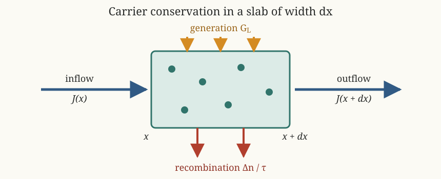

Photonics Essentials: From Diffusion Current to Equation 3.5
============================================================

Source
------

Thomas P. Pearsall, *Photonics Essentials: An Introduction with Experiments*
(McGraw-Hill, 2003), Chapter 3, ``Photodiodes``, printed pages 38--40.

Question
--------

The chapter first gives a diffusion-current equation containing one spatial
derivative,

.. math::

   J(x)=-qD_e\frac{\partial n}{\partial x}.

Why does the carrier equation later contain the second derivative
:math:`\partial^2 n/\partial x^2`?

.. important::

   Current :math:`J` does **not** turn directly into concentration.
   Equation 3.5 asks whether more carriers enter a small region than leave it.
   That requires the spatial derivative of :math:`J`, introducing one more
   derivative.

The small-slab picture
----------------------

   Carrier accumulation equals inflow minus outflow, plus optical generation,
   minus recombination.

The symbols used below are:

.. list-table::
   :header-rows: 1
   :widths: 22 48 30

   * - Symbol
     - Meaning
     - Units
   * - :math:`\Delta n_p(x,t)`
     - Excess minority-electron concentration in p-type material
     - :math:`\mathrm{cm^{-3}}`
   * - :math:`J(x)`
     - Diffusion current density, using the book's sign convention
     - :math:`\mathrm{A\,cm^{-2}}`
   * - :math:`D_e`
     - Electron diffusion coefficient
     - :math:`\mathrm{cm^2\,s^{-1}}`
   * - :math:`\tau_e`
     - Minority-electron recombination lifetime
     - :math:`\mathrm s`
   * - :math:`G_L`
     - Optical generation rate per unit volume
     - :math:`\mathrm{cm^{-3}\,s^{-1}}`

Step 1: A concentration gradient produces diffusion
----------------------------------------------------

Carriers diffuse from high concentration toward low concentration.  The book
writes the resulting current density as

.. math::

   J(x)=-qD_e\frac{\partial\Delta n_p}{\partial x}.

The chapter initially writes :math:`n(x)` instead of
:math:`\Delta n_p(x)`.  In the neutral p-region,

.. math::

   n_p(x)=n_{p0}+\Delta n_p(x).

The equilibrium concentration :math:`n_{p0}` is spatially constant, so

.. math::

   \frac{\partial n_p}{\partial x}
   =\frac{\partial\Delta n_p}{\partial x}.

The two notations therefore give the same diffusion term.

Step 2: Apply carrier conservation to a thin slab
--------------------------------------------------

Consider a slab extending from :math:`x` to :math:`x+dx`.

* Current density entering the slab is :math:`J(x)`.
* Current density leaving it is :math:`J(x+dx)`.

Expand the outgoing current to first order:

.. math::

   J(x+dx)
   \approx J(x)+\frac{\partial J}{\partial x}dx.

The net carrier inflow per unit volume and time is consequently

.. math::

   \begin{aligned}
   \text{net inflow}
   &=\frac{J(x)-J(x+dx)}{q\,dx}\\
   &=-\frac{1}{q}\frac{\partial J}{\partial x}.
   \end{aligned}

This is the crucial extra derivative.

Step 3: Add generation and recombination
-----------------------------------------

Three processes change the excess-carrier concentration:

.. math::

   \text{rate of change}
   =
   \text{net inflow}
   -\text{recombination}
   +\text{optical generation}.

In symbols,

.. math::

   \frac{\partial\Delta n_p}{\partial t}
   =
   -\frac{1}{q}\frac{\partial J}{\partial x}
   -\frac{\Delta n_p}{\tau_e}
   +G_L.

Step 4: Substitute the diffusion current
-----------------------------------------

Insert :math:`J=-qD_e\,\partial\Delta n_p/\partial x`:

.. math::

   \begin{aligned}
   -\frac{1}{q}\frac{\partial J}{\partial x}
   &=-\frac{1}{q}\frac{\partial}{\partial x}
     \left(
       -qD_e\frac{\partial\Delta n_p}{\partial x}
     \right)\\
   &=D_e\frac{\partial^2\Delta n_p}{\partial x^2},
   \end{aligned}

where :math:`D_e` is assumed constant.  The complete result is

.. math::

   \frac{\partial\Delta n_p}{\partial t}
   =
   D_e\frac{\partial^2\Delta n_p}{\partial x^2}
   -\frac{\Delta n_p}{\tau_e}
   +G_L.
   \tag{3.5}

Why it is second order
----------------------

The derivative chain is

.. math::

   \boxed{
   \Delta n_p
   \xrightarrow{\ \partial/\partial x\ }
   J
   \xrightarrow{\ -\partial/\partial x\ }
   \text{carrier accumulation}
   }.

Therefore:

* Equation 3.5 is **second order in position** :math:`x`.
* It is only **first order in time** :math:`t`.
* The second spatial derivative measures the curvature of the concentration
  profile, not simply its slope.

A useful physical reading is:

* constant concentration gives no diffusion current;
* a straight concentration profile gives constant current but no local
  accumulation;
* a curved concentration profile makes current vary with position, so some
  regions gain or lose carriers.

Unit check
----------

Every term in Equation 3.5 must have units of concentration change per time:

.. math::

   \left[
   D_e\frac{\partial^2\Delta n_p}{\partial x^2}
   \right]
   =
   \frac{\mathrm{cm^2}}{\mathrm s}
   \frac{\mathrm{cm^{-3}}}{\mathrm{cm^2}}
   =
   \mathrm{cm^{-3}\,s^{-1}}.

The recombination and generation terms have the same units:

.. math::

   \left[\frac{\Delta n_p}{\tau_e}\right]
   =
   [G_L]
   =
   \mathrm{cm^{-3}\,s^{-1}}.

Steady-state Equation 3.6
--------------------------

At steady state the concentration profile no longer changes with time:

.. math::

   \frac{\partial\Delta n_p}{\partial t}=0.

Equation 3.5 then becomes

.. math::

   \frac{d^2\Delta n_p}{dx^2}
   =
   \frac{\Delta n_p}{D_e\tau_e}
   -\frac{G_L}{D_e}.
   \tag{3.6}

In the dark, :math:`G_L=0`.  Define the electron diffusion length

.. math::

   L_e=\sqrt{D_e\tau_e}.

The equation reduces to

.. math::

   \frac{d^2\Delta n_p}{dx^2}
   -\frac{\Delta n_p}{L_e^2}=0,

whose decaying solution in a long neutral region is

.. math::

   \Delta n_p(x)=\Delta n_p(0)e^{-x/L_e}.

Because the spatial equation is second order, two boundary conditions are
needed.  Typically the junction supplies :math:`\Delta n_p(0)` and the excess
concentration approaches zero far from the junction.

Source correction
-----------------

.. warning::

   The paragraph below Equation 3.5 says that **Equation 3.4** is a
   second-order differential equation.  Equation 3.4 is algebraic.  The
   sentence should refer to **Equation 3.5**.
