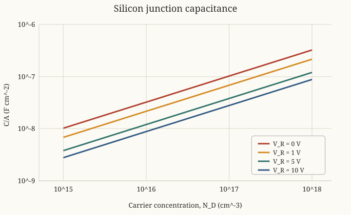

Photonics Essentials: Chapter 4 Problems
========================================

Source
------

Thomas P. Pearsall, *Photonics Essentials: An Introduction with Experiments*
(McGraw-Hill, 2003), Chapter 4, ``Electrical Response Time of Diodes``,
Problems 4.1--4.4, printed pages 75--76.

Worked solutions
----------------

Problem 4.1: A 4 MHz fiber receiver
^^^^^^^^^^^^^^^^^^^^^^^^^^^^^^^^^^^

Silicon loses band-to-band response near :math:`1.1\ \mu\mathrm m`, whereas
germanium still absorbs at :math:`1.3\ \mu\mathrm m`.  Of the two choices,

.. math::

   \boxed{\text{use the Ge photodiode}}.

The specified relation gives the largest permissible time constant:

.. math::

   \tau_{\max}
   =\frac{1}{\pi(4.0\times10^6)}
   =79.6\ \mathrm{ns}.

With a :math:`50\ \Omega` load,

.. math::

   C_{\mathrm{total,max}}
   =\frac{\tau_{\max}}{R_L}
   =\frac{79.6\ \mathrm{ns}}{50\ \Omega}
   =\boxed{1.59\ \mathrm{nF}}.

The printed C-V graph shows approximately :math:`3.5\ \mathrm{nF}` at zero
bias, :math:`2.0\ \mathrm{nF}` at :math:`-2\ \mathrm V`, and
:math:`1.55\ \mathrm{nF}` at :math:`-3\ \mathrm V`.  Therefore choose at
least about :math:`3\ \mathrm V` reverse bias, preferably with margin for
cable and amplifier input capacitance:

.. math::

   C_D+C_{\mathrm{stray}}\leq1.59\ \mathrm{nF}.

For example, :math:`-4\ \mathrm V` gives roughly :math:`C_D=1.35\ \mathrm{nF}`
and leaves about :math:`0.24\ \mathrm{nF}` for parasitics.

Problem 4.2: Junction capacitance
^^^^^^^^^^^^^^^^^^^^^^^^^^^^^^^^^

For a one-sided abrupt silicon junction under reverse-bias magnitude
:math:`V_R`,

.. math::

   \frac{C}{A}
   =\sqrt{\frac{\epsilon_s qN_D}
                 {2(V_{\mathrm{bi}}+V_R)}}.

Use :math:`\epsilon_s=11.8\epsilon_0`,
:math:`\epsilon_0=8.854\times10^{-14}\ \mathrm{F/cm}`, and the representative
silicon value :math:`V_{\mathrm{bi}}=0.8\ \mathrm V`.  The results are:

.. csv-table::
   :header: ":math:`N_D` (:math:`\mathrm{cm^{-3}}`)", "0 V", "1 V", "5 V", "10 V"

   ":math:`10^{15}`", ":math:`1.02\times10^{-8}`", ":math:`6.82\times10^{-9}`", ":math:`3.80\times10^{-9}`", ":math:`2.78\times10^{-9}`"
   ":math:`10^{16}`", ":math:`3.23\times10^{-8}`", ":math:`2.16\times10^{-8}`", ":math:`1.20\times10^{-8}`", ":math:`8.80\times10^{-9}`"
   ":math:`10^{17}`", ":math:`1.02\times10^{-7}`", ":math:`6.82\times10^{-8}`", ":math:`3.80\times10^{-8}`", ":math:`2.78\times10^{-8}`"
   ":math:`10^{18}`", ":math:`3.23\times10^{-7}`", ":math:`2.16\times10^{-7}`", ":math:`1.20\times10^{-7}`", ":math:`8.80\times10^{-8}`"

All entries are in :math:`\mathrm{F/cm^2}`.  On log-log axes each voltage
curve is a straight line:

   Calculated junction capacitance per area.  Each curve has log-log slope
   :math:`1/2`.

.. math::

   \log(C/A)=\frac12\log N_D+\text{constant}.

Thus every curve has slope :math:`1/2`; reverse bias shifts a curve downward
by widening the depletion region.

Problem 4.3: Built-in voltage from Table 4.1
^^^^^^^^^^^^^^^^^^^^^^^^^^^^^^^^^^^^^^^^^^^^

The area is constant, so multiplying :math:`1/C^2` by :math:`A^2` changes
only the vertical scale and not the voltage-axis intercept.  A least-squares
fit to all 21 tabulated points gives, with :math:`C` in pF and applied
voltage :math:`V` in volts,

.. math::

   \frac{1}{C^2}
   =(-5.586\times10^{-4})V
    +4.253\times10^{-4}\ \mathrm{pF^{-2}}.

Set the fitted ordinate to zero:

.. math::

   V_{\mathrm{intercept}}
   =-\frac{4.253\times10^{-4}}{-5.586\times10^{-4}}
   =0.761\ \mathrm V.

Therefore,

.. math::

   \boxed{V_{\mathrm{bi}}\approx0.76\ \mathrm V}.

Problem 4.4: Area and response time
^^^^^^^^^^^^^^^^^^^^^^^^^^^^^^^^^^^

For a device of thickness :math:`d`, resistivity :math:`\rho`, permittivity
:math:`\epsilon`, and area :math:`A`,

.. math::

   R_D=\rho\frac{d}{A},
   \qquad
   C_D=\epsilon\frac{A}{d}.

Their product is

.. math::

   \boxed{R_DC_D=\rho\epsilon},

which is independent of area.

The complete circuit also has an external resistance :math:`R_L`:

.. math::

   \tau=(R_D\parallel R_L)C_D.

In the usual reverse-biased photodiode, :math:`R_D\gg R_L`, so

.. math::

   \tau\approx R_LC_D\propto A.

The fixed load breaks the internal area cancellation.  A smaller junction has
less capacitance and is therefore faster, until transit time or another
parasitic becomes the dominant limit.
