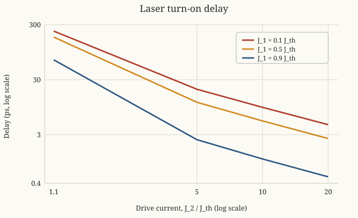

Photonics Essentials: Chapter 8 Problems
========================================

Source
------

Thomas P. Pearsall, *Photonics Essentials: An Introduction with Experiments*
(McGraw-Hill, 2003), Chapter 8, ``Direct Modulation of Laser Diodes``,
Problems 8.1--8.3, printed page 190.

The book labels both of its final two exercises ``8.2``.  This page calls the
last one **8.3**.

Problem 8.1: Band filling and wavelength chirp
-----------------------------------------------

Let a current pulse be shorter than the recombination time.

**Before the pulse**

.. math::

   E_C:\ \text{few excess electrons},
   \qquad
   E_V:\ \text{few excess holes}.

**During carrier injection**

Carriers enter faster than they recombine.  States nearest the band edges fill
first; Pauli exclusion forces later electrons to higher conduction-band
states and holes deeper into the valence band:

.. math::

   E_{\gamma,\mathrm{early}}
   =(E_C+\Delta E_e)-(E_V-\Delta E_h)
   =E_g+\Delta E_e+\Delta E_h.

**After stimulated recombination begins**

The highest-energy occupied states recombine and empty first.  The carrier
distribution retreats toward the band edges:

.. math::

   E_{\gamma}(t)\downarrow E_g.

Since :math:`\lambda=hc/E_\gamma`, decreasing photon energy means increasing
wavelength:

.. math::

   \boxed{\lambda(t)\ \text{chirps from shorter to longer wavelength}}.

Problem 8.2: Delay with 90% threshold prebias
----------------------------------------------

Equation 8.8 gives

.. math::

   \tau_d=\tau_r
   \ln\left(\frac{J_2-J_1}{J_2-J_{\mathrm{th}}}\right),

where :math:`J_2>J_{\mathrm{th}}>J_1`.  Put
:math:`\tau_r=10^{-10}\ \mathrm s=100\ \mathrm{ps}` and
:math:`J_1=0.9J_{\mathrm{th}}`:

.. csv-table::
   :header: ":math:`J_2/J_{\mathrm{th}}`", "1.1", "5", "10", "20"

   ":math:`\tau_d` (ps)", "69.3", "2.47", "1.10", "0.525"

For example,

.. math::

   \tau_d(1.1J_{\mathrm{th}})
   =(100\ \mathrm{ps})
   \ln\left(\frac{1.1-0.9}{1.1-1}\right)
   =69.3\ \mathrm{ps}.

Problem 8.3: Other prebias levels
----------------------------------

Repeat the same calculation:

   Design curves from Equation 8.8.  Both axes are logarithmic.

.. csv-table::
   :header: ":math:`J_1/J_{\mathrm{th}}`", ":math:`1.1J_{\mathrm{th}}`", ":math:`5J_{\mathrm{th}}`", ":math:`10J_{\mathrm{th}}`", ":math:`20J_{\mathrm{th}}`"

   "0.1", "230 ps", "20.3 ps", "9.53 ps", "4.63 ps"
   "0.5", "179 ps", "11.8 ps", "5.41 ps", "2.60 ps"
   "0.9", "69.3 ps", "2.47 ps", "1.10 ps", "0.525 ps"

The design trends are clear:

.. math::

   J_1\uparrow\Longrightarrow\tau_d\downarrow,
   \qquad
   J_2\uparrow\Longrightarrow\tau_d\downarrow.

A negligible delay is obtained by prebiasing close to threshold and driving
several times above threshold.  Neither variable should be taken to an
extreme: high prebias increases off-state light and power, while a large
current step increases heating, relaxation oscillations, and wavelength
chirp.  A practical choice is therefore the smallest :math:`J_1` and
:math:`J_2` that meet the system's delay, extinction-ratio, thermal, and
spectral requirements.
