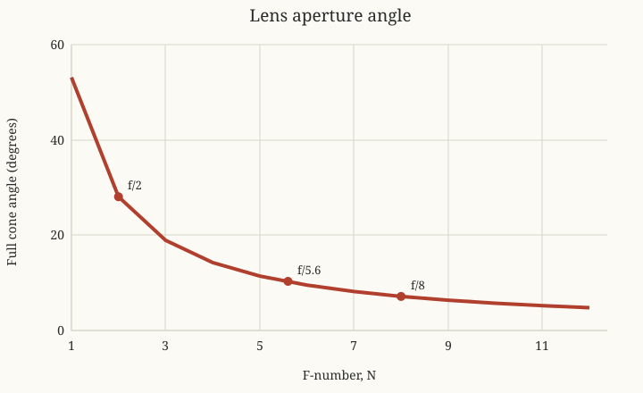

Photonics Essentials: Chapter 10 Problems
=========================================

Source
------

Thomas P. Pearsall, *Photonics Essentials: An Introduction with Experiments*
(McGraw-Hill, 2003), Chapter 10, ``Measurements in Photonics``,
Problems 10.1--10.3, printed pages 242--243.

Problem 10.1: Lock-in amplifier experiment
-------------------------------------------

This is an experimental protocol, not a problem with one numerical answer.
Do not invent the phase or noise readings.

Setup
~~~~~

1. Mount the silicon photodiode rigidly and connect it to the lock-in input
   using short, shielded leads.
2. Place the chopping wheel between a stable visible source and detector.
3. Connect the chopper reference output to the lock-in reference input.
4. Start with a long time constant, a sensitivity range that cannot overload,
   and the manufacturer's recommended input configuration.
5. Adjust reference phase for the maximum in-phase signal.

Measurements
~~~~~~~~~~~~

.. csv-table::
   :header: "Chop frequency", "Time constant", "Source position", "Phase at maximum", "Lock-in amplitude", "Oscilloscope amplitude/noise"

   "", "", "", "", "", ""
   "", "", "", "", "", ""
   "", "", "", "", "", ""

Predicted behavior
~~~~~~~~~~~~~~~~~~

The lock-in multiplies the detector signal by a phase-coherent reference and
low-pass filters the result.  A desired sinusoidal component
:math:`V_s\cos(\omega t+\phi)` produces a DC term proportional to
:math:`V_s\cos\phi`; unrelated light and electrical noise average toward
zero.

Moving the source can change optical path, detector capacitance coupling, and
signal-to-background ratio, but it should not create a large propagation
phase change at laboratory distances.  Raising chopping frequency eventually
reduces response when the photodiode, amplifier, or selected time constant
cannot follow it.  Room lighting is strongly rejected unless it contains a
component near the reference frequency.

On the oscilloscope, the same chopped signal is visible but rides on broadband
noise and ambient-light offsets.  This direct comparison demonstrates why
phase-sensitive detection can recover a small periodic signal.

Problem 10.2: F-number and aperture angle
-----------------------------------------

For focal length :math:`f`, clear diameter :math:`D`, and f-number
:math:`N=f/D`, the marginal-ray half-angle is

.. math::

   \theta=\tan^{-1}\left(\frac{D/2}{f}\right)
   =\tan^{-1}\left(\frac1{2N}\right).

.. csv-table::
   :header: "Lens", "Half-angle :math:`\theta`", "Full cone angle :math:`2\theta`"

   "f/2", "14.04 degrees", "28.07 degrees"
   "f/5.6", "5.10 degrees", "10.20 degrees"
   "f/8", "3.58 degrees", "7.15 degrees"

The requested plotting function is

.. math::

   \boxed{2\theta(N)=2\tan^{-1}\left(\frac1{2N}\right)}.

   Full cone angle as a function of f-number.

It decreases monotonically and is approximately :math:`1/N` radians for
large f-number.

Problem 10.3: Filling a screen through a slit
----------------------------------------------

The book's figure places a :math:`2\ \mathrm{cm}` screen
:math:`L=6\ \mathrm{cm}` behind the slit.  Place the lens so that the focused
parallel beam forms its waist at the slit.  Beyond the waist the cone expands
with

.. math::

   \tan\theta=\frac1{2N}.

The illuminated height at the screen is

.. math::

   H=2L\tan\theta=\frac{L}{N}.

Therefore:

.. csv-table::
   :header: "Lens", "Illuminated height at screen", "Fraction of 2 cm screen"

   "f/2", "3.0 cm", "100% illuminated; 1.0 cm spills outside"
   "f/4", "1.5 cm", "75%"
   "f/8", "0.75 cm", "37.5%"

To fill the screen exactly,

.. math::

   N=\frac{L}{H_{\mathrm{screen}}}
   =\frac{6}{2}
   =\boxed{3}.

Thus an **f/3** cone exactly fills the one-dimensional screen under the
problem's thin-lens and point-slit assumptions.
