Analysis Tools (Layout Editor Toolbar)
======================================

The **Analysis** row of the |ui| toolbar exposes 23 toggleable analyses that
plot data on top of the editable layout. Their button labels and tooltip text
are defined in ``KrakenOS/UI/layout_editor.py`` near
``mode_button_groups`` / ``mode_tooltips``. This page collects the *theory*
behind each tool — the equation(s) it evaluates and what the resulting figure
represents — together with a schematic SVG of the typical output.

The toolbar groups them into five clusters, reflected by the section
ordering below:

* **Geometric image quality** — Spot, RMS, PSF, MTF
* **Pupil and wavefront** — Pupil, Seidel, WFront, Zernike
* **Field-dependent metrics** — FC/Dist, Illum, LatClr, Pol, Atmos
* **Map analyses on the detector / pupil** — PSFMap, FldMap, IllMap, WfeMap,
  DetMap, CohDet, BField, Diffr
* **Comparative analyses** — Interf, TolCmp

Symbol conventions
------------------

Symbols that recur throughout the page:

.. list-table::
   :header-rows: 1
   :widths: 18 82

   * - Symbol
     - Meaning
   * - :math:`(u, v)`
     - Normalised pupil coordinates, :math:`u^{2} + v^{2} \le 1`. Stored as
       ``Pup.Cordx``, ``Pup.Cordy`` in ``KrakenOS.PupilCalc``.
   * - :math:`(\rho, \theta)`
     - Polar form of the pupil coordinates: :math:`\rho = \sqrt{u^{2}+v^{2}}`,
       :math:`\theta = \arg(u + iv)`.
   * - :math:`(x, y)`
     - Cartesian coordinates on the image / detector plane, in millimetres.
   * - :math:`(x_{f}, y_{f})`
     - Field-point coordinates (object-space angle in degrees or object
       height in mm, set by ``Pup.FieldX``/``Pup.FieldY`` and
       ``Pup.FieldType``).
   * - :math:`h`
     - Generic field magnitude — image height (mm) for finite objects,
       field angle (rad or deg) for objects at infinity.
   * - :math:`\lambda`
     - Wavelength, in millimetres (matches the rest of the KrakenOS system
       units).
   * - :math:`k`
     - Vacuum wavenumber, :math:`k = 2\pi/\lambda`.
   * - :math:`n_{1}, n_{2}`
     - Refractive indices on the incident and transmitted sides of an
       interface.
   * - :math:`F/\#`
     - Working F-number, :math:`F/\# = f' / D_{\mathrm{EP}}`.
   * - :math:`f, f'`
     - Front / rear effective focal lengths
       (``PupilCalc.PPP``, ``PupilCalc.EFFL``).
   * - :math:`D_{\mathrm{stop}}, D_{\mathrm{EP}}, D_{\mathrm{XP}}`
     - Diameters of the aperture stop, entrance pupil and exit pupil.
   * - :math:`W(u, v)`
     - Optical-path-difference (OPD) wavefront in the exit pupil, in waves
       (multiples of :math:`\lambda`) or in millimetres depending on the
       plot.
   * - :math:`P(u, v)`
     - Pupil-amplitude function. Unit on the open pupil, zero outside;
       complex-valued if apodization or polarization loss is included.
   * - :math:`z`
     - Axial distance from the exit pupil to the image plane.
   * - :math:`\boldsymbol{\nu} = (\nu_{x}, \nu_{y})`
     - Spatial frequency vector on the image plane (cycles / mm).
   * - :math:`\nu_{c}`
     - Diffraction cut-off frequency, :math:`\nu_{c} = 1/(\lambda\,F/\#)`.
   * - :math:`E(x, y)`
     - Complex scalar field amplitude on a surface; irradiance is
       :math:`|E|^{2}`.
   * - :math:`w_{i}`
     - Radiometric weight (power, or :math:`|E|^{2}\,\Delta A`) carried by
       traced ray :math:`i`.
   * - :math:`\mathrm{OPL}_{i}`
     - Optical path length accumulated by ray :math:`i` along its path,
       :math:`\mathrm{OPL}_{i} = \sum_{\ell} n_{\ell}\,s_{\ell}`.
   * - :math:`\langle \cdot \rangle`
     - Average of the quantity over the pupil area (or the relevant
       integration domain).

.. contents::
   :local:
   :depth: 1

Shared setup for the code examples
----------------------------------

Every Python snippet below assumes the same achromatic doublet imaging a
finite object — built once here and reused under each tool. Adapt
``Doublet``, ``Pup``, ``W`` and ``Surf`` to your own design.

.. code-block:: python
   :caption: Common doublet system used by every code example below

   import KrakenOS as Kos
   import numpy as np

   # --- Surfaces -----------------------------------------------------
   P_Obj = Kos.surf(); P_Obj.Rc = 0.0; P_Obj.Thickness = 100
   P_Obj.Glass = "AIR"; P_Obj.Diameter = 30.0; P_Obj.Name = "Object"

   L1a = Kos.surf(); L1a.Rc =  92.847066; L1a.Thickness = 6.0
   L1a.Glass = "N-BK7"; L1a.Diameter = 30.0

   L1b = Kos.surf(); L1b.Rc = -30.716087; L1b.Thickness = 3.0
   L1b.Glass = "F2";    L1b.Diameter = 30.0

   L1c = Kos.surf(); L1c.Rc = -78.197307; L1c.Thickness = 57.376
   L1c.Glass = "AIR";  L1c.Diameter = 30.0

   Stop = Kos.surf(); Stop.Rc = 0.0; Stop.Thickness = 40.0
   Stop.Glass = "AIR"; Stop.Diameter = 15.0; Stop.Name = "Stop"

   P_Ima = Kos.surf(); P_Ima.Rc = 0.0; P_Ima.Thickness = 0.0
   P_Ima.Glass = "AIR"; P_Ima.Diameter = 20.0; P_Ima.Name = "Image"

   Doublet = Kos.system([P_Obj, L1a, L1b, L1c, Stop, P_Ima], Kos.Setup())

   # --- Pupil + sampling --------------------------------------------
   W       = 0.5876         # wavelength (µm)
   Surf    = 4              # aperture-stop surface index
   Pup     = Kos.PupilCalc(Doublet, Surf, W, "EPD", 10.0)   # EPD = 10 mm
   Pup.Samp     = 12
   Pup.Ptype    = "hexapolar"
   Pup.FieldType = "angle"
   Pup.FieldX, Pup.FieldY = 0.0, 2.0   # 2° field

   # Useful first-order numbers (reused throughout):
   Focal    = Pup.EFFL                     # focal length (mm)
   Diameter = 2.0 * Pup.RadPupInp          # entrance-pupil diameter (mm)
   Fno      = Focal / Diameter             # working F-number

Geometric image quality
-----------------------

.. _analysis-spot:

Spot — Spot Diagram
~~~~~~~~~~~~~~~~~~~

Plots ray intercepts at the analysis surface (or the system image plane)
for the currently selected fields and wavelengths. For :math:`N` traced rays
with hit coordinates :math:`(x_i, y_i)` the centroid and geometric RMS spot
radius are

.. math::

   \bar{x} = \frac{1}{N}\sum_i x_i, \quad
   \bar{y} = \frac{1}{N}\sum_i y_i, \quad
   \sigma_{\mathrm{RMS}}
   = \sqrt{\frac{1}{N}\sum_i \bigl[(x_i-\bar{x})^2 + (y_i-\bar{y})^2\bigr]}.

where

* :math:`N` is the number of rays that reached the analysis surface
  (after vignetting),
* :math:`(x_i, y_i)` are the image-plane coordinates of ray :math:`i` (mm),
* :math:`(\bar{x}, \bar{y})` is the unweighted spot centroid (mm),
* :math:`\sigma_{\mathrm{RMS}}` is the geometric RMS spot radius (mm).

The geometric reference is the **Airy radius**

.. math::

   r_{\mathrm{Airy}} = 1.22\,\lambda\,F/\#,

where :math:`\lambda` is the wavelength and :math:`F/\#` the working
F-number. When :math:`\sigma_{\mathrm{RMS}} \lesssim r_{\mathrm{Airy}}` the
spot is dominated by diffraction rather than geometric aberration.

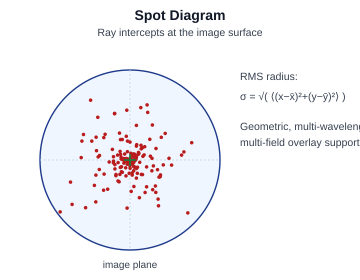

**Worked example.** Three rays land at
:math:`(x_1, y_1) = (0.10,\, 0.05)`,
:math:`(x_2, y_2) = (-0.04,\, 0.08)`,
:math:`(x_3, y_3) = (0.02,\, -0.12)` mm.

* :math:`\bar{x} = (0.10 - 0.04 + 0.02)/3 = 0.0267` mm,
  :math:`\bar{y} = (0.05 + 0.08 - 0.12)/3 = 0.0033` mm.
* per-ray squared offsets:
  :math:`d_1^{2} = 0.0733^{2} + 0.0467^{2} = 0.00755`,
  :math:`d_2^{2} = 0.0667^{2} + 0.0767^{2} = 0.01032`,
  :math:`d_3^{2} = 0.0067^{2} + 0.1233^{2} = 0.01526` mm².
* :math:`\sigma_{\mathrm{RMS}} = \sqrt{(0.00755 + 0.01032 + 0.01526)/3}
  = \sqrt{0.01104} \approx 0.1051` mm = 105 µm.
* Airy radius at :math:`\lambda = 0.5876` µm, :math:`F/\# = 8`:
  :math:`r_{\mathrm{Airy}} = 1.22 \cdot 0.5876 \cdot 8 = 5.73` µm.
* :math:`\sigma_{\mathrm{RMS}} / r_{\mathrm{Airy}} \approx 18` →
  geometrically limited, not diffraction-limited.

**KrakenOS code:**

.. code-block:: python

   Rays = Kos.raykeeper(Doublet)
   x, y, z, L, M, N = Pup.Pattern2Field()
   for i in range(len(x)):
       Doublet.Trace([x[i], y[i], z[i]], [L[i], M[i], N[i]], W)
       Rays.push()

   X, Y, *_ = Rays.pick(-1)             # ray landings on image surface
   xbar, ybar = np.mean(X), np.mean(Y)
   sigma_rms  = np.sqrt(np.mean((X - xbar)**2 + (Y - ybar)**2))
   print(f"centroid = ({xbar:.4f}, {ybar:.4f}) mm")
   print(f"sigma_RMS = {sigma_rms*1e3:.2f} um")
   print(f"r_Airy   = {1.22 * W * Fno:.2f} um")

.. _analysis-rms:

RMS — RMS Spot Radius
~~~~~~~~~~~~~~~~~~~~~

Computes :math:`\sigma_{\mathrm{RMS}}(h)` for a swept field point :math:`h`
and plots one curve per wavelength,

.. math::

   \sigma_{\mathrm{RMS}}(h; \lambda)
   = \sqrt{\frac{1}{N(h, \lambda)}\sum_i
       \bigl[(x_i - \bar{x})^{2} + (y_i - \bar{y})^{2}\bigr]},

where

* :math:`h` is the field magnitude (image height in mm for finite objects,
  field angle in degrees for objects at infinity — see ``Pup.FieldType``),
* :math:`\lambda` is the wavelength of the traced bundle,
* :math:`N(h, \lambda)` is the number of rays that reach the image at that
  field/wavelength,
* :math:`(x_{i}, y_{i})` and :math:`(\bar{x}, \bar{y})` are defined as in
  :ref:`analysis-spot`.

Useful as a quick proxy for image quality across the field without forming
a full PSF.

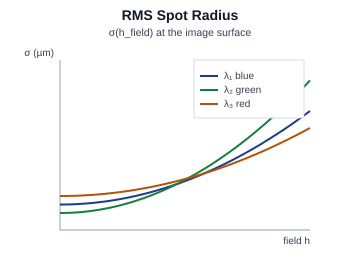

**Worked example.** Suppose a Seidel-dominated lens has approximately
:math:`\sigma_{\mathrm{RMS}}(h) = a + b\,h^{2}` with :math:`a = 4` µm,
:math:`b = 5.25\,\mu\mathrm{m}\,/\,\mathrm{deg}^{2}`.

* On axis (:math:`h = 0`):
  :math:`\sigma_{\mathrm{RMS}}(0) = 4` µm.
* At :math:`h = 2°`:
  :math:`\sigma_{\mathrm{RMS}}(2) = 4 + 5.25 \cdot 4 = 25` µm.
* Ratio:
  :math:`\sigma_{\mathrm{RMS}}(2) / \sigma_{\mathrm{RMS}}(0) = 6.25\times`
  — typical quadratic blow-up dominated by oblique spherical / coma.

**KrakenOS code:**

.. code-block:: python

   fields = np.linspace(0.0, 2.0, 9)     # field angles (deg)
   sigma  = []
   for h in fields:
       Pup.FieldX, Pup.FieldY = 0.0, float(h)
       Rays = Kos.raykeeper(Doublet)
       x, y, z, L, M, N = Pup.Pattern2Field()
       for i in range(len(x)):
           Doublet.Trace([x[i], y[i], z[i]], [L[i], M[i], N[i]], W)
           Rays.push()
       X, Y, *_ = Rays.pick(-1)
       sigma.append(np.sqrt(np.mean((X - X.mean())**2 + (Y - Y.mean())**2)))

   for h, s in zip(fields, sigma):
       print(f"h = {h:.2f} deg  sigma_RMS = {s*1e3:.2f} um")

.. _analysis-psf:

PSF — Point Spread Function
~~~~~~~~~~~~~~~~~~~~~~~~~~~

The image-plane irradiance produced by a point source. With the
Fraunhofer / Fourier-optics formulation,

.. math::

   \mathrm{PSF}(x, y) \;\propto\;
   \Bigl|\,\iint P(u, v)\,
       e^{\,i\,k\,W(u, v)}\,
       e^{\,-i\,2\pi\,(u x + v y) / (\lambda z)}\,
       \mathrm{d}u\,\mathrm{d}v\,\Bigr|^{2},

where

* :math:`(x, y)` are the Cartesian image-plane coordinates (mm),
* :math:`(u, v)` are normalised exit-pupil coordinates,
* :math:`P(u, v)` is the pupil-amplitude function (1 inside the pupil,
  0 outside, optionally complex if apodization / polarization losses are
  included),
* :math:`W(u, v)` is the OPD wavefront in the exit pupil (mm),
* :math:`k = 2\pi/\lambda` is the vacuum wavenumber,
* :math:`\lambda` is the wavelength (mm),
* :math:`z` is the axial distance from exit pupil to image plane (mm).

The diffraction-limited case (:math:`W \equiv 0`) is the Airy pattern with
central radius

.. math::

   r_{\mathrm{Airy}} = 1.22\,\lambda\,F/\#,

with :math:`F/\#` the working F-number of the converging bundle.

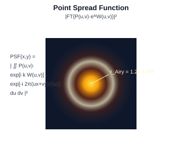

**Worked example.** Diffraction-limited (:math:`W \equiv 0`) circular
pupil at :math:`\lambda = 0.5876` µm, :math:`F/\# = 8`,
:math:`f = 80` mm, :math:`D_{\mathrm{EP}} = 10` mm:

* central Airy radius:
  :math:`r_{\mathrm{Airy}} = 1.22\,\lambda\,F/\# = 1.22 \cdot 0.5876 \cdot 8
  \approx 5.73` µm.
* first-zero diameter :math:`= 2\,r_{\mathrm{Airy}} \approx 11.47` µm.
* peak irradiance (per unit input power) :math:`\propto (D_{\mathrm{EP}} / (\lambda f))^{2}
  = (10 / (0.0005876 \cdot 80))^{2} \approx (212.7\,\mathrm{mm}^{-1})^{2}`.

**KrakenOS code:**

.. code-block:: python

   # Fit the wavefront to Zernikes so we have a COEF vector to feed psf().
   X, Y, Z, P2V = Kos.Phase2(Pup)
   Zcoef, *_ = Kos.Zernike_Fitting(X, Y, Z, np.ones(15))

   I = Kos.psf(Zcoef, Focal, Diameter, W,
               pixels=265, PupilSample=4, plot=1, sqr=1)
   r_Airy_um = 1.22 * W * Fno
   print(f"Airy radius = {r_Airy_um:.2f} um")

.. _analysis-mtf:

MTF — Modulation Transfer Function
~~~~~~~~~~~~~~~~~~~~~~~~~~~~~~~~~~

Magnitude of the Optical Transfer Function (OTF), which is the
autocorrelation of the generalised pupil:

.. math::

   \mathrm{OTF}(\boldsymbol{\nu})
   = \frac{\iint P(\mathbf{u})\,e^{i k W(\mathbf{u})}\,
                 P^{\!*}(\mathbf{u} - \lambda z\boldsymbol{\nu})\,
                 e^{-i k W(\mathbf{u} - \lambda z\boldsymbol{\nu})}\,
                 \mathrm{d}\mathbf{u}}
          {\iint |P(\mathbf{u})|^{2}\,\mathrm{d}\mathbf{u}},
   \qquad
   \mathrm{MTF}(\boldsymbol{\nu}) = |\mathrm{OTF}(\boldsymbol{\nu})|,

where

* :math:`\mathbf{u} = (u, v)` are exit-pupil coordinates (mm),
* :math:`\boldsymbol{\nu} = (\nu_{x}, \nu_{y})` is the spatial-frequency
  vector on the image plane (cycles / mm),
* :math:`P(\mathbf{u})` is the pupil-amplitude function and
  :math:`P^{*}` its complex conjugate,
* :math:`W(\mathbf{u})` is the wavefront error (mm),
* :math:`k = 2\pi/\lambda`, :math:`\lambda` is the wavelength (mm),
* :math:`z` is the exit-pupil-to-image distance (mm),
* :math:`|\mathrm{OTF}(\boldsymbol{\nu})|` is the contrast transmission at
  frequency :math:`\boldsymbol{\nu}`.

For a clear circular pupil the diffraction-limited MTF is

.. math::

   \mathrm{MTF}_{\mathrm{DL}}(\nu)
     = \frac{2}{\pi}\!\left[\phi - \cos\phi\,\sin\phi\right],
   \qquad \phi = \arccos\!\left(\nu / \nu_{c}\right),

where

* :math:`\nu = |\boldsymbol{\nu}|` is the radial spatial frequency
  (cycles / mm),
* :math:`\nu_{c} = 1/(\lambda\,F/\#)` is the **diffraction cut-off
  frequency** (cycles / mm),
* :math:`\phi` is an auxiliary angle obtained from the cut-off-normalised
  frequency, in radians.

KrakenOS plots both tangential and sagittal MTF along with the
diffraction-limited reference.

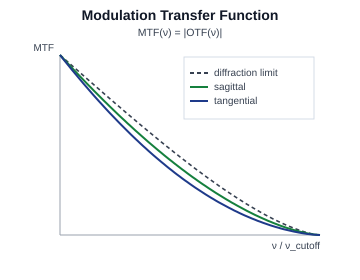

**Worked example.** :math:`\lambda = 0.5876` µm, :math:`F/\# = 8`:

* cut-off frequency
  :math:`\nu_{c} = 1 / (\lambda\,F/\#)
  = 1 / (0.0005876\,\mathrm{mm} \cdot 8) \approx 212.7` cycles/mm.
* At :math:`\nu = \nu_{c}/2`:
  :math:`\phi = \arccos(0.5) = \pi/3 \approx 1.047` rad,
  :math:`\cos\phi\,\sin\phi = 0.5 \cdot 0.8660 = 0.4330`,
  :math:`\mathrm{MTF}_{\mathrm{DL}}
  = (2/\pi)(1.047 - 0.4330) \approx 0.391`.
* At :math:`\nu = 0.2\,\nu_{c}`:
  :math:`\phi = \arccos(0.2) \approx 1.369` rad,
  :math:`\mathrm{MTF}_{\mathrm{DL}}
  = (2/\pi)(1.369 - 0.196 \cdot 0.980) \approx 0.747`.

**KrakenOS code:**

.. code-block:: python

   X, Y, Z, P2V = Kos.Phase2(Pup)
   Zcoef, *_ = Kos.Zernike_Fitting(X, Y, Z, np.ones(15))

   mtf = Kos.calculate_mtf(Zcoef, Focal, Diameter, W,
                           pixels=265, PupilSample=4)
   Kos.plot_mtf(mtf, Diameter, W, freq_limit=300)

   nu_c = 1.0 / (W * 1e-3 * Fno)        # cycles per mm
   print(f"diffraction cut-off = {nu_c:.1f} cy/mm")

Pupil and wavefront
-------------------

.. _analysis-pupil:

Pupil — Pupil Diagnostic
~~~~~~~~~~~~~~~~~~~~~~~~

Reports the *entrance* (EP) and *exit* (XP) pupil positions and diameters
along the optical axis, plus the chief- and marginal-ray paths. KrakenOS
computes the small-angle pupil magnifications

.. math::

   m_{\mathrm{enter}} = \frac{\theta_{0}}{\theta_{\mathrm{stop}}},
   \qquad
   m_{\mathrm{exit}}  = \frac{\theta_{0}}{\theta_{\mathrm{image}}},

where

* :math:`\theta_{0}` is the half-angle subtended at the object by a small
  fan of rays launched from the optical axis (radians),
* :math:`\theta_{\mathrm{stop}}` is the half-angle the same fan subtends
  at the **aperture-stop surface** after being traced through the
  upstream optics,
* :math:`\theta_{\mathrm{image}}` is the half-angle the fan subtends at
  the final image surface after the full system trace,
* :math:`m_{\mathrm{enter}}` and :math:`m_{\mathrm{exit}}` are therefore
  the **angular magnifications** from object space to the stop and from
  object space to image space.

See ``PupilCalc.__init__`` in ``KrakenOS/PupilTool.py`` for the explicit
fan-of-rays construction. With a measured stop diameter
:math:`D_{\mathrm{stop}}`,

.. math::

   D_{\mathrm{EP}} = D_{\mathrm{stop}} / m_{\mathrm{enter}},
   \qquad
   D_{\mathrm{XP}} = D_{\mathrm{stop}} \cdot m_{\mathrm{exit}},

where

* :math:`D_{\mathrm{stop}}` is the clear-aperture diameter of the physical
  stop surface (mm),
* :math:`D_{\mathrm{EP}}` is the **entrance-pupil diameter** (mm) — the
  image of the stop as seen from object space,
* :math:`D_{\mathrm{XP}}` is the **exit-pupil diameter** (mm) — the image
  of the stop as seen from image space.

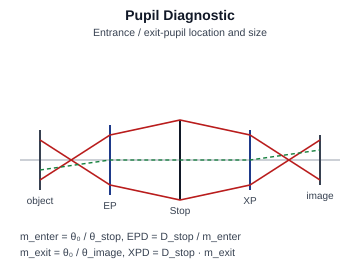

**Worked example.** Send a tiny fan with object-space half-angle
:math:`\theta_{0} = 0.010` rad. Suppose the upstream optics reduce the
half-angle at the stop surface to
:math:`\theta_{\mathrm{stop}} = 0.0083` rad, and the full system expands
it to :math:`\theta_{\mathrm{image}} = 0.0125` rad. With a measured
stop diameter :math:`D_{\mathrm{stop}} = 10.0` mm:

* :math:`m_{\mathrm{enter}} = 0.010 / 0.0083 \approx 1.205`.
* :math:`m_{\mathrm{exit}}  = 0.010 / 0.0125 = 0.800`.
* :math:`D_{\mathrm{EP}} = 10.0 / 1.205 \approx 8.30` mm.
* :math:`D_{\mathrm{XP}} = 10.0 \cdot 0.800 = 8.00` mm.

**KrakenOS code:**

.. code-block:: python

   # 1) Read the cardinal quantities produced by PupilCalc.
   D_EP = 2.0 * Pup.RadPupInp
   D_XP = 2.0 * Pup.RadPupOut
   print(f"EP diameter = {D_EP:.3f} mm  at z = {Pup.PosPupInp}")
   print(f"XP diameter = {D_XP:.3f} mm  at z = {Pup.PosPupOut}")
   print(f"EFFL (f')   = {Pup.EFFL:.3f} mm")

   # 2) Recover the small-angle pupil magnifications from the formula
   #    D_EP = D_stop / m_enter,  D_XP = D_stop * m_exit.
   D_stop      = Doublet.SDT[Surf].Diameter      # physical stop diameter (mm)
   m_enter     = D_stop / D_EP
   m_exit      = D_XP / D_stop
   print(f"D_stop      = {D_stop:.3f} mm")
   print(f"m_enter     = D_stop / D_EP = {m_enter:.4f}")
   print(f"m_exit      = D_XP   / D_stop = {m_exit:.4f}")
   print(f"working F/# = {Pup.EFFL / D_EP:.2f}")

.. _analysis-seidel:

Seidel — Seidel Aberrations
~~~~~~~~~~~~~~~~~~~~~~~~~~~

Per-surface sums of the third-order monochromatic aberration coefficients
:math:`S_{\mathrm{I}}..S_{\mathrm{V}}` and the first-order chromatic terms
:math:`C_{\mathrm{I}}, C_{\mathrm{II}}`. The total wavefront aberration of
the system as a polynomial in pupil and field is

.. math::

   W(u, v; h)
   \;\sim\; S_{\mathrm{I}}\,\rho^{4}
   + S_{\mathrm{II}}\,h\,\rho^{3}\cos\theta
   + S_{\mathrm{III}}\,h^{2}\,\rho^{2}\cos^{2}\theta
   + S_{\mathrm{IV}}\,h^{2}\,\rho^{2}
   + S_{\mathrm{V}}\,h^{3}\,\rho\cos\theta,

where

* :math:`W(u, v; h)` is the OPD wavefront in the exit pupil for field
  :math:`h` (waves),
* :math:`(u, v)` are normalised pupil coordinates and
  :math:`(\rho, \theta)` their polar form
  (:math:`\rho^{2} = u^{2} + v^{2}`, :math:`\theta = \arg(u + i v)`),
* :math:`h` is the field magnitude (image height or field angle),
* :math:`S_{\mathrm{I}}` is the **spherical-aberration** coefficient
  (:math:`\rho^{4}` term),
* :math:`S_{\mathrm{II}}` is the **coma** coefficient (:math:`h \rho^{3}`
  term),
* :math:`S_{\mathrm{III}}` is the **astigmatism** coefficient
  (:math:`h^{2} \rho^{2}\cos^{2}\theta` term),
* :math:`S_{\mathrm{IV}}` is the **Petzval field-curvature** coefficient
  (:math:`h^{2} \rho^{2}` term),
* :math:`S_{\mathrm{V}}` is the **distortion** coefficient (:math:`h^{3}
  \rho` term),
* :math:`C_{\mathrm{I}}, C_{\mathrm{II}}` are the **axial** and **lateral
  chromatic** aberration coefficients (not shown in the polynomial above
  because they describe wavelength-dependent focal-length and
  magnification shifts rather than monochromatic OPD).

Each :math:`S_{k}` is a sum over surfaces; KrakenOS plots the per-surface
bars so the dominant contributor can be identified.

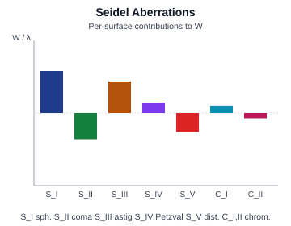

**Worked example.** Take
:math:`S_{\mathrm{I}} = 0.50`,
:math:`S_{\mathrm{II}} = -0.20`,
:math:`S_{\mathrm{III}} = 0.30`,
:math:`S_{\mathrm{IV}} = 0.10`,
:math:`S_{\mathrm{V}} = -0.05` (all in waves). Evaluate the OPD at
:math:`\rho = 0.7`, :math:`\theta = 30°`, :math:`h = 2`:

* :math:`S_{\mathrm{I}}\,\rho^{4} = 0.50 \cdot 0.2401 = +0.1200`
* :math:`S_{\mathrm{II}}\,h\,\rho^{3}\cos\theta
  = -0.20 \cdot 2 \cdot 0.343 \cdot 0.866 = -0.1188`
* :math:`S_{\mathrm{III}}\,h^{2}\,\rho^{2}\cos^{2}\theta
  = 0.30 \cdot 4 \cdot 0.49 \cdot 0.75 = +0.4410`
* :math:`S_{\mathrm{IV}}\,h^{2}\,\rho^{2}
  = 0.10 \cdot 4 \cdot 0.49 = +0.1960`
* :math:`S_{\mathrm{V}}\,h^{3}\,\rho\cos\theta
  = -0.05 \cdot 8 \cdot 0.7 \cdot 0.866 = -0.2425`

Sum: :math:`W \approx +0.396` waves at that pupil/field point —
**astigmatism dominates** at this field height.

**KrakenOS code:**

.. code-block:: python

   AB = Kos.Seidel(Pup)
   print("Seidel coefficients (S_I..S_V):", AB.SAC_TOTAL)
   print("Seidel in waves (W040..W311) :", AB.SCW_TOTAL)
   print("Transverse contributions     :", dict(zip(AB.TAC_NM, AB.TAC_TOTAL)))
   print("Chromatic CL (axial) / CT (lateral):",
         np.sum(AB.CL), np.sum(AB.CT))

.. _analysis-wfront:

WFront — Wavefront Analysis
~~~~~~~~~~~~~~~~~~~~~~~~~~~

Computes the OPD :math:`W(u, v)` of every traced ray relative to a
reference sphere centred on the chief-ray intercept and plots a slice (or
the full 2D map — see :ref:`WfeMap <analysis-wfemap>`). The key scalar
summaries are

.. math::

   \mathrm{PV}  = \max(W) - \min(W),
   \qquad
   \mathrm{RMS} = \sqrt{\langle\,(W - \langle W\rangle)^{2}\,\rangle},

where

* :math:`W(u, v)` is the OPD wavefront in the exit pupil (waves),
* :math:`\max(W), \min(W)` are the maximum and minimum of :math:`W`
  over the pupil,
* :math:`\mathrm{PV}` is the **peak-to-valley** wavefront error (waves),
* :math:`\langle W \rangle = \frac{1}{\pi}\!\iint_{u^{2}+v^{2}\le 1}
  W(u, v)\,\mathrm{d}u\,\mathrm{d}v` is the area-average of :math:`W` over
  the pupil,
* :math:`\mathrm{RMS}` is the root-mean-square wavefront error (waves).

The **Maréchal approximation** links RMS to the Strehl ratio in the
small-aberration limit (:math:`\mathrm{RMS}\lesssim \lambda/14`):

.. math::

   S \;\approx\; \exp\!\bigl[-(2\pi\,\mathrm{RMS}/\lambda)^{2}\bigr],

where

* :math:`S` is the **Strehl ratio**, the on-axis PSF intensity normalised
  to the diffraction-limited value (dimensionless, :math:`0 < S \le 1`),
* :math:`\mathrm{RMS}` and :math:`\lambda` carry the same units (both in
  mm, or both in waves with :math:`\lambda = 1`).

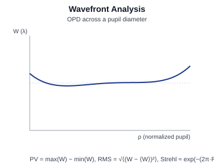

**Worked example.** Assume the pupil-sampled wavefront has
:math:`\max(W) = +0.18` waves, :math:`\min(W) = -0.12` waves and
:math:`\mathrm{RMS} = 0.050` waves:

* :math:`\mathrm{PV} = 0.18 - (-0.12) = 0.30` waves.
* Maréchal Strehl:
  :math:`S \approx \exp[-(2\pi \cdot 0.050)^{2}]
  = \exp(-0.0987) \approx 0.906`.
* Convention check: the Maréchal "diffraction-limited" criterion
  :math:`\mathrm{RMS} \le \lambda/14 \approx 0.0714` waves corresponds
  to :math:`S \gtrsim 0.82`; our 0.906 sits comfortably above that.

**KrakenOS code:**

.. code-block:: python

   X, Y, Z, P2V = Kos.Phase2(Pup)                      # Z is W in waves
   PV   = Z.max() - Z.min()
   RMS  = np.std(Z)
   S    = np.exp(-(2.0 * np.pi * RMS) ** 2)
   print(f"PV  = {PV:.4f} waves  (Phase2 reports P2V = {P2V:.4f})")
   print(f"RMS = {RMS:.4f} waves   Strehl ~= {S:.3f}")

.. _analysis-zernike:

Zernike — Zernike Polynomial Fit
~~~~~~~~~~~~~~~~~~~~~~~~~~~~~~~~

Expands the wavefront on the orthonormal Zernike basis over the unit disk,

.. math::

   W(\rho, \theta) = \sum_{j} a_{j}\,Z_{j}(\rho, \theta),
   \qquad
   Z_{n}^{m}(\rho, \theta)
   = R_{n}^{|m|}(\rho)\!\cdot\!
     \begin{cases}\cos(m\,\theta), & m \ge 0\\
                  \sin(|m|\,\theta), & m < 0,\end{cases}

where

* :math:`(\rho, \theta)` are polar pupil coordinates, :math:`0 \le \rho
  \le 1`, :math:`0 \le \theta < 2\pi`,
* :math:`j` is the single-index ordering of the Zernike polynomials
  (Noll, OSA, or Fringe — KrakenOS reports which convention is used),
* :math:`n` is the **radial order** (non-negative integer),
* :math:`m` is the **azimuthal frequency**, an integer with
  :math:`|m| \le n` and :math:`n - |m|` even,
* :math:`Z_{n}^{m}(\rho, \theta)` is the Zernike polynomial of order
  :math:`(n, m)`,
* :math:`a_{j}` is the **expansion coefficient** of mode :math:`j`
  (waves), and is the quantity plotted in the bar chart.

The radial part :math:`R_{n}^{|m|}(\rho)` is

.. math::

   R_{n}^{|m|}(\rho)
   = \sum_{s=0}^{(n-|m|)/2}
     \frac{(-1)^{s}\,(n-s)!}{s!\,\bigl((n+|m|)/2 - s\bigr)!\,
                              \bigl((n-|m|)/2 - s\bigr)!}\;
     \rho^{n - 2s},

where :math:`s` is the dummy summation index (kept separate from the
wavenumber :math:`k`). Coefficients :math:`a_{j}` are recovered by a
linear least-squares fit to the sampled wavefront and displayed both as a
bar chart and as a colour map of :math:`W(\rho, \theta)`.

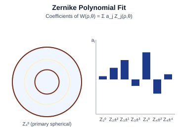

**Worked example.** Suppose a fit yields only
:math:`a_{4}\,Z_{2}^{0}(\rho) = a_{4}(2\rho^{2} - 1)` (defocus) with
:math:`a_{4} = +0.30` waves; all other coefficients negligible.

* At :math:`\rho = 0`: :math:`W = +0.30 \cdot (-1) = -0.30` waves.
* At :math:`\rho = 1`: :math:`W = +0.30 \cdot (+1) = +0.30` waves.
* :math:`\mathrm{PV} = 0.60` waves; the **RMS of pure defocus** is
  :math:`|a_{4}| / \sqrt{3} \approx 0.173` waves
  (using :math:`\langle Z_{2}^{0\,2}\rangle_{\mathrm{disk}} = 1/3`).
* Strehl from defocus alone:
  :math:`S \approx \exp[-(2\pi \cdot 0.173)^{2}] \approx 0.305`.

**KrakenOS code:**

.. code-block:: python

   X, Y, Z, P2V = Kos.Phase2(Pup)
   NC    = 15
   A     = np.ones(NC)
   Zcoef, Mat, RMS2Chief, RMS2Centroid, FE = Kos.Zernike_Fitting(X, Y, Z, A)
   for i in range(NC):
       print(f"z{i+1:>2}  {float(Zcoef[i]):+ .6f}  {Mat[i]}")
   print(f"RMS (to centroid) = {RMS2Centroid:.4f} waves")
   print(f"fitting error     = {FE:.4f} waves")

Field-dependent metrics
-----------------------

.. _analysis-fc-dist:

FC/Dist — Field Curvature / Distortion
~~~~~~~~~~~~~~~~~~~~~~~~~~~~~~~~~~~~~~

Two coupled plots:

* **Field curvature** — the focus shift
  :math:`\Delta z_{\mathrm{focus}}(h) = z_{\mathrm{best}}(h) -
  z_{\mathrm{paraxial}}`, split into **tangential** (T, meridional fan
  best focus) and **sagittal** (S, sagittal fan best focus) branches;
  :math:`z_{\mathrm{best}}(h)` is the axial position of the
  minimum-spot-radius image surface at field :math:`h`,
  :math:`z_{\mathrm{paraxial}}` is the paraxial image-plane position.
* **Distortion** — the radial deviation of the real image height from the
  paraxial value:

.. math::

   \mathrm{distortion}(h)
   = \frac{h_{\mathrm{real}}(h) - h_{\mathrm{paraxial}}(h)}
          {h_{\mathrm{paraxial}}(h)} \times 100\,\%,

where

* :math:`h` is the (paraxial-defined) field magnitude — image height in
  mm for a finite object, or field angle in degrees for an object at
  infinity,
* :math:`h_{\mathrm{paraxial}}(h)` is the image height predicted by the
  paraxial (first-order) trace,
* :math:`h_{\mathrm{real}}(h)` is the chief-ray landing height obtained
  by the full real-ray trace,
* :math:`\mathrm{distortion}(h)` is the dimensionless percentage by which
  the real image deviates radially from the paraxial position.

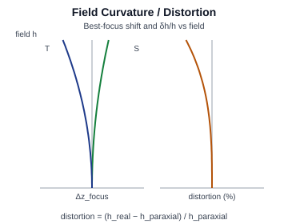

**Worked example.** Paraxial image height at :math:`h = 5°` for an
:math:`f' = 80` mm lens is
:math:`h_{\mathrm{paraxial}} = f' \tan h = 80 \tan(5°) = 6.998` mm.
Suppose the real chief ray lands at
:math:`h_{\mathrm{real}} = 6.892` mm and the best-focus surface curves
by :math:`\Delta z_{\mathrm{best}}(5°) = -0.42` mm
(tangential branch, image-side focus drift):

* :math:`\mathrm{distortion}(5°)
  = (6.892 - 6.998) / 6.998 \approx -1.51\%` (barrel).
* Defocus at edge of field:
  :math:`\Delta z = -0.42` mm → corresponds to
  :math:`\lambda/(8\,(F/\#)^{2})`-style depth-of-focus units of
  :math:`-0.42 / (8 \cdot 8^{2} \cdot 0.5876 \cdot 10^{-3})
  \approx -1.40` Rayleigh units — significant for diffraction-limited
  imaging.

**KrakenOS code:**

This snippet evaluates **both** parts of the formula above — the
field-curvature focus shift :math:`\Delta z_{\mathrm{focus}}(h)` (from
``Kos.BestFocus``) and the distortion :math:`(h_{\mathrm{real}} -
h_{\mathrm{paraxial}})/h_{\mathrm{paraxial}}`:

.. code-block:: python

   fields = np.linspace(0.0, 5.0, 11)
   saved_p = Pup.Ptype

   for h in fields:
       Pup.FieldX, Pup.FieldY = 0.0, float(h)

       # -- (a) field curvature: best-focus axial shift ----------------
       Pup.Ptype = "fan"                                # tangential fan
       Rays = Kos.raykeeper(Doublet)
       x, y, z, L, M, N = Pup.Pattern2Field()
       for i in range(len(x)):
           Doublet.Trace([x[i], y[i], z[i]], [L[i], M[i], N[i]], W)
           Rays.push()
       X, Y, Z, Lp, Mp, Np = Rays.pick(-1)
       dz_focus = float(Kos.BestFocus(X, Y, Z, Lp, Mp, Np))

       # -- (b) distortion: chief-ray height vs paraxial ---------------
       Pup.Ptype = "chief"
       Rays = Kos.raykeeper(Doublet)
       x, y, z, L, M, N = Pup.Pattern2Field()
       Doublet.Trace([x[0], y[0], z[0]], [L[0], M[0], N[0]], W)
       Rays.push()
       Xc, Yc, *_ = Rays.pick(-1)
       h_real  = float(np.hypot(Xc, Yc))
       h_parax = Focal * np.tan(np.deg2rad(h))
       d_pct   = (h_real - h_parax) / h_parax * 100 if h > 0 else 0.0

       print(f"h = {h:.1f} deg  Δz_focus = {dz_focus:+.4f} mm  "
             f"h_real = {h_real:.4f} mm  distortion = {d_pct:+.3f} %")

   Pup.Ptype = saved_p

.. _analysis-illum:

Illum — Relative Illumination
~~~~~~~~~~~~~~~~~~~~~~~~~~~~~

Image-plane irradiance normalised to the on-axis value:

.. math::

   \mathrm{RI}(\theta) = \frac{E(\theta)}{E(0)},

where

* :math:`\theta` is the **chief-ray field angle** as measured from the
  optical axis (degrees or radians),
* :math:`E(\theta)` is the image-plane irradiance (W / mm²) at the
  chief-ray landing point for field angle :math:`\theta`,
* :math:`E(0)` is the on-axis irradiance,
* :math:`\mathrm{RI}(\theta)` is the **relative illumination**, a
  dimensionless ratio in :math:`[0, 1]`.

For an ideal lens with no vignetting, geometric considerations yield the
classical **cos⁴ law**:

.. math::

   \mathrm{RI}_{\mathrm{ideal}}(\theta) = \cos^{4}\theta.

The four cosine factors come from (i) projection of the entrance-pupil
area, (ii) the inverse-square spread of pupil-to-image distance, (iii)
projection of the image-pixel area, and (iv) the Lambertian cosine of
incidence at the detector. KrakenOS overlays the measured curve, which
also captures vignetting and pupil aberration, on top of that reference.

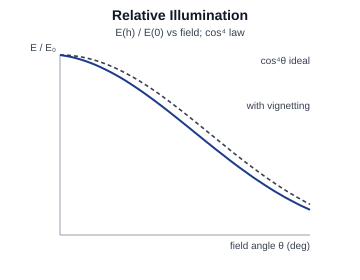

**Worked example.** Pure cos⁴ falloff, no vignetting:

* :math:`\theta = 10°`: :math:`\cos^{4}\theta = 0.9848^{4} \approx 0.940`
  → 94.0% of on-axis irradiance.
* :math:`\theta = 20°`: :math:`\cos^{4}\theta = 0.9397^{4} \approx 0.780`
  → 78.0%.
* :math:`\theta = 30°`: :math:`\cos^{4}\theta = 0.8660^{4} \approx 0.563`
  → 56.3%.

If the measured curve at :math:`\theta = 20°` reads only 0.60 instead of
the geometric 0.78, the **vignetting fraction** at that field is
:math:`1 - 0.60/0.78 \approx 23\%`.

**KrakenOS code:**

Compute the **irradiance** in a small box around each chief-ray
landing point (so the cos α projection is included), then take the
ratio :math:`E(\theta)/E(0)` — this matches the formula directly.

.. code-block:: python

   def irradiance_near_chief(theta_deg, n_rays=10_000, box=0.20):
       """Mean E = Σ w_i cos α_i / A around the chief-ray hit point."""
       # Chief ray = centre of the box.
       Pup.FieldX, Pup.FieldY = 0.0, float(theta_deg)
       Pup.Ptype = "chief"
       Rch = Kos.raykeeper(Doublet)
       x, y, z, L, M, N = Pup.Pattern2Field()
       Doublet.Trace([x[0], y[0], z[0]], [L[0], M[0], N[0]], W)
       Rch.push()
       xc, yc, *_ = Rch.pick(-1); xc, yc = float(xc), float(yc)

       # Filled pupil → irradiance estimate at the box around (xc, yc).
       Pup.Ptype = "rand"
       Pup.Samp  = int(np.sqrt(n_rays) / 2) + 1
       Rays = Kos.raykeeper(Doublet)
       x, y, z, L, M, N = Pup.Pattern2Field()
       launched = len(x)
       for i in range(launched):
           Doublet.Trace([x[i], y[i], z[i]], [L[i], M[i], N[i]], W)
           Rays.push()
       Xs, Ys, _, Ls, Ms, Ns = Rays.pick(-1)
       mask  = (np.abs(Xs - xc) < box/2) & (np.abs(Ys - yc) < box/2)
       power = np.sum(np.abs(Ns[mask]))         # Σ cos α_i, w_i = 1
       return power / (box * box) / launched    # E in (W / mm^2) per launched ray

   E0 = irradiance_near_chief(0.0)
   for h in (10.0, 20.0, 30.0):
       RI   = irradiance_near_chief(h) / E0
       cos4 = np.cos(np.deg2rad(h)) ** 4
       print(f"h = {h:.1f} deg  RI = {RI:.3f}   cos^4 ideal = {cos4:.3f}")

.. _analysis-latclr:

LatClr — Lateral Color
~~~~~~~~~~~~~~~~~~~~~~

The transverse separation of chief-ray landing points between wavelengths,

.. math::

   \Delta y_{\mathrm{lat}}(\lambda; h)
   = y_{\mathrm{chief}}(\lambda, h) - y_{\mathrm{chief}}(\lambda_{0}, h),

where

* :math:`h` is the field magnitude (image height or field angle),
* :math:`\lambda` is the wavelength of the traced ray (mm),
* :math:`\lambda_{0}` is the **reference wavelength** against which other
  wavelengths are compared (typically the primary wavelength in the
  current spectrum),
* :math:`y_{\mathrm{chief}}(\lambda, h)` is the image-plane :math:`y`
  coordinate of the chief ray for field :math:`h` at wavelength
  :math:`\lambda` (mm),
* :math:`\Delta y_{\mathrm{lat}}(\lambda; h)` is the **lateral colour**
  at field :math:`h` for wavelength :math:`\lambda` (mm); equivalently
  the chromatic difference of magnification.

The result is a coloured spread along the field direction.

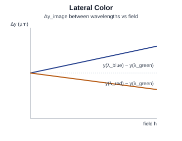

**Worked example.** At :math:`h = 2°` the chief ray hits the image at:

* :math:`\lambda_{0} = 0.5876` µm (reference d-line):
  :math:`y_{\mathrm{chief}} = 6.9920` mm
* :math:`\lambda = 0.4861` µm (F-line):
  :math:`y_{\mathrm{chief}} = 6.9985` mm
* :math:`\lambda = 0.6563` µm (C-line):
  :math:`y_{\mathrm{chief}} = 6.9875` mm

Then

* :math:`\Delta y_{\mathrm{lat}}(0.4861;\,2°) = +6.5` µm
* :math:`\Delta y_{\mathrm{lat}}(0.6563;\,2°) = -4.5` µm
* total F-to-C spread :math:`= 11.0` µm — for a 5 µm-pixel detector
  that is **2.2 pixels of colour fringe**.

**KrakenOS code:**

.. code-block:: python

   Pup.FieldX, Pup.FieldY = 0.0, 2.0
   Pup.Ptype = "chief"
   bands = {"F":   0.4861,
            "d":   0.5876,
            "C":   0.6563}
   y_chief = {}
   for name, lam in bands.items():
       Rays = Kos.raykeeper(Doublet)
       x, y, z, L, M, N = Pup.Pattern2Field()
       Doublet.Trace([x[0], y[0], z[0]], [L[0], M[0], N[0]], lam)
       Rays.push()
       _, Y, *_ = Rays.pick(-1)
       y_chief[name] = float(Y)

   y0 = y_chief["d"]
   for name in ("F", "C"):
       print(f"Delta y_lat({name}) = {(y_chief[name] - y0)*1e3:+.2f} um")

.. _analysis-pol:

Pol — Polarization
~~~~~~~~~~~~~~~~~~

Tracks the Jones state
:math:`\mathbf{E}_{\mathrm{out}} = J\,\mathbf{E}_{\mathrm{in}}` through
every interaction, applying the Fresnel coefficients at each surface,

.. math::

   r_{s} = \frac{n_{1}\cos\theta_{1} - n_{2}\cos\theta_{2}}
                {n_{1}\cos\theta_{1} + n_{2}\cos\theta_{2}},
   \qquad
   r_{p} = \frac{n_{2}\cos\theta_{1} - n_{1}\cos\theta_{2}}
                {n_{2}\cos\theta_{1} + n_{1}\cos\theta_{2}},

where

* :math:`\mathbf{E}_{\mathrm{in}}, \mathbf{E}_{\mathrm{out}}` are the
  complex Jones vectors :math:`(E_{s}, E_{p})^{T}` of the incident and
  exit electric fields, decomposed into components perpendicular
  (:math:`s`) and parallel (:math:`p`) to the local plane of incidence,
* :math:`J` is the :math:`2 \times 2` **Jones matrix** of the surface
  (or, by composition, of the whole system),
* :math:`n_{1}, n_{2}` are the refractive indices on the incident and
  transmitted sides of the interface,
* :math:`\theta_{1}` is the angle of incidence (between the ray and the
  surface normal, radians),
* :math:`\theta_{2}` is the angle of refraction, related to
  :math:`\theta_{1}` by Snell's law
  :math:`n_{1}\sin\theta_{1} = n_{2}\sin\theta_{2}`,
* :math:`r_{s}, r_{p}` are the **amplitude reflection coefficients** for
  the s- and p-polarizations; the corresponding power reflectances are
  :math:`R_{s} = |r_{s}|^{2}`, :math:`R_{p} = |r_{p}|^{2}`, and
  transmittances :math:`T_{s} = 1 - R_{s}`, :math:`T_{p} = 1 - R_{p}`.

The local s/p frame is rotated between surfaces to track polarization
through the system. KrakenOS reports transmittance, diattenuation, and
retardance; the Stokes vector

.. math::

   \mathbf{S} = (S_{0}, S_{1}, S_{2}, S_{3})

gives the **degree of polarization**

.. math::

   \mathrm{DoP} = \frac{\sqrt{S_{1}^{2} + S_{2}^{2} + S_{3}^{2}}}{S_{0}},

where

* :math:`S_{0}` is the **total irradiance** (any polarization state),
* :math:`S_{1}` is the difference between horizontal and vertical
  linearly polarized irradiance,
* :math:`S_{2}` is the difference between +45° and −45° linearly
  polarized irradiance,
* :math:`S_{3}` is the difference between right- and left-circularly
  polarized irradiance,
* :math:`\mathrm{DoP} \in [0, 1]` is the fraction of light that is
  polarized (1 = fully polarized, 0 = unpolarized).

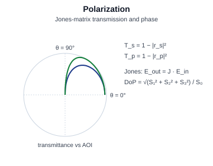

**Worked example.** Air → N-BK7 interface (:math:`n_{1} = 1.0`,
:math:`n_{2} = 1.5`) at :math:`\theta_{1} = 45°`. Snell:

* :math:`\sin\theta_{2} = \sin 45° / 1.5 = 0.4714` →
  :math:`\theta_{2} = 28.13°`.
* :math:`\cos\theta_{1} = 0.7071`, :math:`\cos\theta_{2} = 0.8819`.

Fresnel coefficients:

* :math:`r_{s} = (1.0 \cdot 0.7071 - 1.5 \cdot 0.8819) /
  (1.0 \cdot 0.7071 + 1.5 \cdot 0.8819) = -0.6158/2.0300 = -0.3033`,
  so :math:`R_{s} = 0.0920`, :math:`T_{s} = 0.9080`.
* :math:`r_{p} = (1.5 \cdot 0.7071 - 1.0 \cdot 0.8819) /
  (1.5 \cdot 0.7071 + 1.0 \cdot 0.8819) = +0.1788/1.9426 = +0.0920`,
  so :math:`R_{p} = 0.00847`, :math:`T_{p} = 0.9915`.

Diattenuation at this interface
:math:`= (T_{p} - T_{s}) / (T_{p} + T_{s}) \approx 0.044`.

**KrakenOS code:**

.. code-block:: python

   # Fresnel calculator that matches the formulas used inside KrakenOS.
   def fresnel(n1, n2, theta1_deg):
       t1 = np.deg2rad(theta1_deg)
       s2 = (n1 / n2) * np.sin(t1)
       if abs(s2) > 1.0:
           return None                   # total internal reflection
       t2 = np.arcsin(s2)
       c1, c2 = np.cos(t1), np.cos(t2)
       rs = (n1*c1 - n2*c2) / (n1*c1 + n2*c2)
       rp = (n2*c1 - n1*c2) / (n2*c1 + n1*c2)
       return rs**2, rp**2, 1 - rs**2, 1 - rp**2

   Rs, Rp, Ts, Tp = fresnel(1.0, 1.5, 45.0)
   print(f"R_s={Rs:.4f}  T_s={Ts:.4f}")
   print(f"R_p={Rp:.4f}  T_p={Tp:.4f}")

   # System-level: in the |ui|, set surface coating + polarization input on
   # the source, then read the Stokes vector / DoP from the polarization
   # analysis. See KrakenOS/Examples/Examp_Beam_Splitter_Fresnel_Polarization.py
   # for a full end-to-end sample.

.. _analysis-atmos:

Atmos — Atmospheric Dispersion
~~~~~~~~~~~~~~~~~~~~~~~~~~~~~~

Bends each incoming ray by the wavelength-dependent atmospheric
refraction reported by the AstroAtmosphere library (Ref. 3). A useful
closed form is the **Cassini approximation**

.. math::

   R(z; \lambda) \;\approx\;
   A(\lambda, T, P, H, x_{c})\,\tan z
   - B(\lambda, T, P, H, x_{c})\,\tan^{3} z,

where

* :math:`R(z; \lambda)` is the **astronomical refraction**: the angular
  deviation between the true and apparent direction of a star
  (arcseconds; positive bends the apparent position towards the zenith),
* :math:`z` is the **zenith distance** of the line of sight (radians;
  :math:`z = 0` is straight up, :math:`z = 90°` is the horizon),
* :math:`\lambda` is the wavelength (µm),
* :math:`T` is the air temperature (K),
* :math:`P` is the atmospheric pressure (Pa),
* :math:`H` is the relative humidity in :math:`[0, 1]`,
* :math:`x_{c}` is the CO₂ concentration (ppm),
* :math:`A`, :math:`B` are the **first and third Cassini coefficients**
  — weak functions of :math:`\lambda`, :math:`T`, :math:`P`, :math:`H`,
  :math:`x_{c}` and geographic latitude.

KrakenOS plots one curve per wavelength and uses the same model when
``Pup.AtmosRef = 1`` in ``PupilCalc`` (with the matching
``Pup.l1, Pup.l2, Pup.T, Pup.P, Pup.H, Pup.xc, Pup.lat, Pup.h, Pup.z0``
attributes documented in :doc:`pupilcalc_tool`).

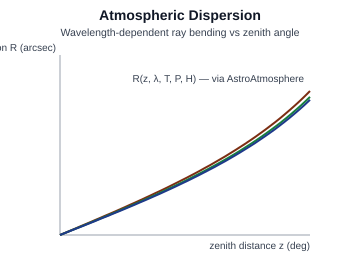

**Worked example.** Use round Cassini coefficients
:math:`A = 60.4''`, :math:`B = 0.06''` (standard atmosphere, mid-visible):

* :math:`z = 30°`: :math:`\tan z = 0.5774`,
  :math:`R = 60.4 \cdot 0.5774 - 0.06 \cdot 0.5774^{3} = 34.86 - 0.012
  \approx 34.85''`.
* :math:`z = 45°`: :math:`\tan z = 1.0`,
  :math:`R = 60.4 - 0.06 = 60.34''`.
* :math:`z = 60°`: :math:`\tan z = 1.7321`,
  :math:`R = 60.4 \cdot 1.7321 - 0.06 \cdot 1.7321^{3}
  = 104.62 - 0.312 \approx 104.31''`.

Between :math:`\lambda = 0.45` µm and :math:`\lambda = 0.70` µm,
:math:`A` typically differs by :math:`\sim 4''` at sea level, so the
**atmospheric-dispersion smear** at :math:`z = 45°` is of order
:math:`4''` (about :math:`1.6` µm on a 80-mm-focal lens).

**KrakenOS code:**

Two halves: (a) plug numbers into the Cassini formula so you can
verify the table above by hand, and (b) hand the same parameters to
``PupilCalc`` for a self-consistent atmosphere-corrected ray launch.

.. code-block:: python

   # (a) Closed-form Cassini check ----------------------------------
   def cassini_arcsec(z_deg, A_arcsec=60.4, B_arcsec=0.06):
       t = np.tan(np.deg2rad(z_deg))
       return A_arcsec * t - B_arcsec * t**3

   for z in (30.0, 45.0, 60.0):
       print(f"z = {z:.0f} deg  R = {cassini_arcsec(z):.2f} arcsec")

   # (b) AstroAtmosphere model inside PupilCalc ---------------------
   Pup.AtmosRef = 1
   Pup.T   = 283.15           # K
   Pup.P   = 101300           # Pa
   Pup.H   = 0.5              # relative humidity (0–1)
   Pup.xc  = 400              # ppm CO2
   Pup.lat = 31               # latitude (degrees)
   Pup.h   = 2800             # observatory altitude (m)
   Pup.l1  = 0.5876           # reference wavelength (µm)
   Pup.l2  = 0.4861           # wavelength of interest (µm)
   Pup.z0  = 45.0             # zenith distance (deg)
   xa, ya, za, La, Ma, Na = Pup.Pattern2Field()
   # Repeat with a different Pup.l2 to inspect the per-wavelength shift.

Map analyses on the detector / pupil
------------------------------------

.. _analysis-psfmap:

PSFMap — Point Spread Function Map
~~~~~~~~~~~~~~~~~~~~~~~~~~~~~~~~~~

Renders the local PSF at a grid of field positions
:math:`(x_{f}, y_{f})` — useful for visualising how aberrations (notably
coma, astigmatism and field curvature) deform the spot across the field.
Each cell evaluates

.. math::

   \mathrm{PSF}(x, y;\, x_{f}, y_{f})
   = \Bigl|\,\mathcal{F}\!\left\{P(u, v)\,
       e^{\,i\,k\,W(u, v;\,x_{f}, y_{f})}\right\}(x, y)\,\Bigr|^{2},

where

* :math:`(x_{f}, y_{f})` are the **field-point coordinates** at which the
  local PSF is computed (object-space angles in degrees for objects at
  infinity, or object-plane heights in mm for finite objects),
* :math:`(x, y)` are the local image-plane coordinates inside one
  PSF-cell (mm),
* :math:`(u, v)` are normalised pupil coordinates,
* :math:`P(u, v)` is the pupil-amplitude function,
* :math:`W(u, v;\, x_{f}, y_{f})` is the field-dependent wavefront error
  for the chief ray of :math:`(x_{f}, y_{f})` (mm),
* :math:`k = 2\pi/\lambda` is the wavenumber,
* :math:`\mathcal{F}\{\cdot\}` denotes the 2D Fourier transform from
  pupil coordinates to image coordinates (an appropriate scale factor
  :math:`1/(\lambda z)` is absorbed into :math:`\mathcal{F}`).

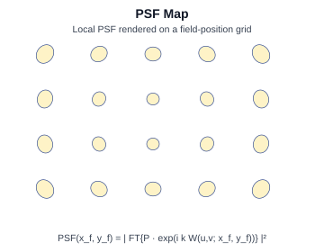

**Worked example.** A :math:`5 \times 5` PSF map at 2° corner field has
local Strehl values:

* on-axis cell: :math:`S(0, 0) \approx 0.94`.
* corner cell: :math:`S(2°, 2°) \approx 0.55`.
* the field-averaged Strehl is the unweighted mean of the cells; if all
  25 cells yielded the corner value, the system would already be below
  :math:`S = 0.8` (the practical "well-corrected" threshold).

For each cell the local Airy radius is unchanged
(:math:`r_{\mathrm{Airy}} = 5.73` µm at :math:`F/\# = 8`,
:math:`\lambda = 0.5876` µm); it is the field-dependent
:math:`W(u, v;\, x_{f}, y_{f})` that broadens the spot.

**KrakenOS code:**

.. code-block:: python

   fx = np.linspace(-2.0, 2.0, 5)
   fy = np.linspace(-2.0, 2.0, 5)
   for yf in fy:
       for xf in fx:
           Pup.FieldX, Pup.FieldY = float(xf), float(yf)
           X, Y, Z, _ = Kos.Phase2(Pup)
           Zc, *_ = Kos.Zernike_Fitting(X, Y, Z, np.ones(15))
           I = Kos.psf(Zc, Focal, Diameter, W,
                       pixels=128, PupilSample=3, plot=0, sqr=1)
           Imax = float(np.max(I))
           print(f"field ({xf:+.1f},{yf:+.1f})  peak I = {Imax:.3e}")

.. _analysis-fldmap:

FldMap — Field Map
~~~~~~~~~~~~~~~~~~

Plots the real chief-ray image positions on a regular field grid and
overlays the paraxial / ideal grid. The pointwise displacement vector

.. math::

   \Delta\mathbf{r}(x_{f}, y_{f})
   = \mathbf{r}_{\mathrm{real}}(x_{f}, y_{f})
   - \mathbf{r}_{\mathrm{paraxial}}(x_{f}, y_{f}),

where

* :math:`(x_{f}, y_{f})` are field-grid sampling coordinates (object
  angle or object height),
* :math:`\mathbf{r}_{\mathrm{paraxial}}(x_{f}, y_{f}) = (x_{p}, y_{p})`
  is the **paraxial / ideal** image-plane landing point (mm), computed
  from the first-order matrix model,
* :math:`\mathbf{r}_{\mathrm{real}}(x_{f}, y_{f}) = (x_{r}, y_{r})` is
  the **real** chief-ray landing point (mm), obtained by tracing the
  ray through every surface,
* :math:`\Delta\mathbf{r}` is the displacement (mm) from ideal to real.

The radial component of :math:`\Delta\mathbf{r}` is distortion; the
azimuthal component captures lateral colour and field-dependent decentre.

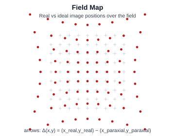

**Worked example.** Field-grid sample at :math:`(x_{f}, y_{f}) = (3°,
4°)`, :math:`f' = 80` mm. Paraxial chief-ray landing:

* :math:`x_{p} = f' \tan(3°) = 80 \cdot 0.0524 = 4.195` mm
* :math:`y_{p} = f' \tan(4°) = 80 \cdot 0.0699 = 5.595` mm

Real chief-ray landing (from full trace):
:math:`(x_{r}, y_{r}) = (4.150,\, 5.531)` mm. Then

* :math:`\Delta\mathbf{r} = (4.150 - 4.195,\, 5.531 - 5.595)
  = (-0.045,\, -0.064)` mm.
* Radial component (distortion):
  :math:`(\Delta\mathbf{r}\cdot\hat{r}) = -0.078` mm
  (:math:`|\hat{r}| = 1`, :math:`\hat{r}` points from axis outward).
* Tangential / azimuthal component: :math:`\approx 0`
  (consistent with rotationally symmetric distortion).

**KrakenOS code:**

.. code-block:: python

   grid = np.linspace(-5.0, 5.0, 7)        # degrees
   Pup.Ptype = "chief"
   for yf in grid:
       for xf in grid:
           Pup.FieldX, Pup.FieldY = float(xf), float(yf)
           Rays = Kos.raykeeper(Doublet)
           x, y, z, L, M, N = Pup.Pattern2Field()
           Doublet.Trace([x[0], y[0], z[0]], [L[0], M[0], N[0]], W)
           Rays.push()
           X, Y, *_ = Rays.pick(-1)
           xp = Focal * np.tan(np.deg2rad(xf))
           yp = Focal * np.tan(np.deg2rad(yf))
           print(f"({xf:+.1f},{yf:+.1f})  real=({float(X):+.4f},{float(Y):+.4f})  "
                 f"d=({float(X)-xp:+.4f},{float(Y)-yp:+.4f}) mm")

.. _analysis-illmap:

IllMap — Illumination Map
~~~~~~~~~~~~~~~~~~~~~~~~~

A 2D irradiance heat map on the detector,

.. math::

   E(x, y) \;=\; \frac{\mathrm{d}\Phi}{\mathrm{d}A}
           \;\approx\; \sum_{i\in\mathrm{pixel}(x, y)}
                       \frac{w_{i}\,\cos\alpha_{i}}{A_{\mathrm{pix}}},

where

* :math:`(x, y)` are the detector-plane coordinates of the pixel centre
  (mm),
* :math:`E(x, y)` is the **irradiance** on that pixel (W / mm²),
* :math:`\Phi` is the radiant power (W) and :math:`\mathrm{d}A` an area
  element of the pixel (mm²),
* :math:`\mathrm{pixel}(x, y)` is the set of traced rays whose
  intersection with the detector falls inside the pixel at
  :math:`(x, y)`,
* :math:`w_{i}` is the **per-ray radiometric weight** (W) carried by
  ray :math:`i` after all upstream transmittances, vignetting and
  apodization,
* :math:`\alpha_{i}` is the **angle of incidence** between ray
  :math:`i` and the pixel surface normal (radians); the
  :math:`\cos\alpha_{i}` factor projects the ray's power onto the pixel
  area,
* :math:`A_{\mathrm{pix}}` is the area of one pixel (mm²).

The map captures cos⁴ falloff, vignetting, caustics and lens hot-spots in
a single picture.

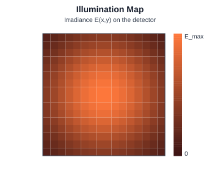

**Worked example.** Pixel pitch :math:`p = 5` µm
(:math:`A_{\mathrm{pix}} = 25 \cdot 10^{-6}` mm²); a single pixel
collects 12 traced rays each of weight :math:`w_{i} = 1.0` µW landing at
incidence angle :math:`\alpha_{i} = 10°`. Then

.. math::

   E \;=\; \frac{12 \cdot 1.0 \cdot \cos 10°}{25 \cdot 10^{-6}\,\mathrm{mm}^{2}}
       \;\approx\; \frac{12 \cdot 0.9848}{25 \cdot 10^{-6}}\,\mathrm{\mu W/mm^{2}}
       \;\approx\; 4.73 \cdot 10^{5}\,\mathrm{\mu W/mm^{2}}
       \;=\; 0.473\,\mathrm{W/mm^{2}}.

If the on-axis pixel reads :math:`E_{0} = 0.612` W/mm² with the same
trace, the local relative illumination is :math:`0.473/0.612 = 0.773` —
matching the cos⁴ prediction for a 20° off-axis field point.

**KrakenOS code:**

.. code-block:: python

   # Build an irradiance map by histogramming ray landings into pixels.
   def illum_map(theta_deg, n_rays=20_000, pitch=0.005, half_extent=2.0):
       Pup.FieldX, Pup.FieldY = 0.0, float(theta_deg)
       Pup.Ptype = "rand"
       Pup.Samp  = int(np.sqrt(n_rays) / 2) + 1
       Rays = Kos.raykeeper(Doublet)
       x, y, z, L, M, N = Pup.Pattern2Field()
       for i in range(len(x)):
           Doublet.Trace([x[i], y[i], z[i]], [L[i], M[i], N[i]], W)
           Rays.push()
       X, Y, _, Lp, Mp, Np = Rays.pick(-1)
       cos_a = np.abs(Np)
       bins = np.arange(-half_extent, half_extent + pitch, pitch)
       H, *_ = np.histogram2d(X, Y, bins=bins, weights=cos_a)
       return H / (pitch ** 2)            # W per mm^2 per unit input ray weight

   E20 = illum_map(20.0)
   E0  = illum_map(0.0)
   print(f"peak E(20 deg) / peak E(0 deg) = {E20.max() / E0.max():.3f}")

.. _analysis-wfemap:

WfeMap — Wavefront Error Map
~~~~~~~~~~~~~~~~~~~~~~~~~~~~

The 2D analogue of :ref:`WFront <analysis-wfront>`: a colour map of
:math:`W(u, v)` over the exit pupil. The same PV / RMS / Strehl summaries
apply,

.. math::

   \mathrm{PV} = \max_{u^{2}+v^{2}\le 1} W
              - \min_{u^{2}+v^{2}\le 1} W,
   \qquad
   \mathrm{RMS}^{2} = \frac{1}{\pi}\!\iint_{u^{2}+v^{2}\le 1}
       \bigl(W(u, v) - \langle W \rangle\bigr)^{2}\,\mathrm{d}u\,\mathrm{d}v,

where

* :math:`W(u, v)` is the OPD wavefront over the unit-disk exit pupil
  (waves),
* :math:`u^{2} + v^{2} \le 1` is the integration domain (open pupil),
* :math:`1/\pi` is the area of the unit disk in the denominator (so
  :math:`\langle\,\cdot\,\rangle` is a true area-average),
* :math:`\langle W \rangle =
  \frac{1}{\pi}\!\iint_{u^{2}+v^{2}\le 1} W\,\mathrm{d}u\,\mathrm{d}v`
  is the pupil-average wavefront,
* :math:`\mathrm{PV}` and :math:`\mathrm{RMS}` are as in
  :ref:`analysis-wfront`.

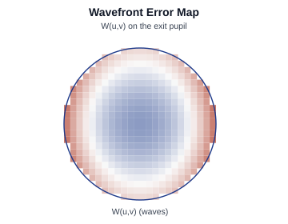

**Worked example.** Suppose the WFE map is pure defocus,
:math:`W(u, v) = 0.30\,(2\rho^{2} - 1)` waves with
:math:`\rho^{2} = u^{2} + v^{2}`:

* :math:`\max W = 0.30 \cdot (+1) = +0.30` at the pupil edge,
  :math:`\min W = 0.30 \cdot (-1) = -0.30` at the centre, so
  :math:`\mathrm{PV} = 0.60` waves.
* :math:`\langle W \rangle = 0` (defocus is mean-free).
* :math:`\mathrm{RMS}^{2}
  = \frac{1}{\pi}\!\iint_{\rho\le 1}(0.30)^{2}(2\rho^{2}-1)^{2}\,
  \mathrm{d}A
  = 0.09 \cdot \frac{1}{3} = 0.030` → :math:`\mathrm{RMS} = 0.173`
  waves, in agreement with :ref:`analysis-zernike`.

**KrakenOS code:**

.. code-block:: python

   X, Y, Z, P2V = Kos.Phase2(Pup)            # Z is W in waves
   print(f"PV   (Phase2)          = {P2V:.4f} waves")
   print(f"PV   (recomputed)      = {Z.max() - Z.min():.4f} waves")
   print(f"<W>                    = {Z.mean():+.4f} waves")
   print(f"RMS  (about mean)      = {np.sqrt(np.mean((Z - Z.mean())**2)):.4f} waves")

   # Optional: render the map as a heat plot
   import matplotlib.pyplot as plt
   plt.scatter(X, Y, c=Z, s=12); plt.axis("equal"); plt.colorbar(label="W (waves)")
   plt.title("Wavefront error map"); plt.show()

.. _analysis-detmap:

DetMap — Detector Power Map
~~~~~~~~~~~~~~~~~~~~~~~~~~~

Bins the *incoherent* power of each landed ray into detector pixels:

.. math::

   P_{kl} \;=\; \sum_{i\,\in\,\mathrm{pixel}(k, l)} w_{i},

where

* :math:`(k, l)` are the integer **column / row indices** of a detector
  pixel,
* :math:`\mathrm{pixel}(k, l)` is the set of traced rays whose detector
  intersection falls into that pixel,
* :math:`w_{i}` is the radiometric weight (W) carried by ray :math:`i`
  after all upstream losses,
* :math:`P_{kl}` is the **total incoherent power** (W) deposited in
  pixel :math:`(k, l)`.

Used for radiometric / throughput analyses and to detect stray-light
hot spots. ``CohDet`` (next) replaces the sum with a coherent one.

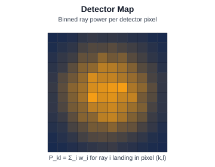

**Worked example.** A 5×5 µm pixel collects 8 rays of weight
:math:`w_{i} = 1.0` µW each:

* :math:`P_{kl} = 8 \cdot 1.0 = 8.0` µW.
* Equivalent irradiance on that pixel (incoherent):
  :math:`E = 8.0\,\mu\mathrm{W} / (25 \cdot 10^{-6}\,\mathrm{mm}^{2})
  = 3.2 \cdot 10^{5}\,\mathrm{\mu W/mm^{2}}
  = 0.32`\ W/mm².
* Contrast with the **coherent** sum (:ref:`analysis-cohdet`) — if all
  8 rays were perfectly in phase, the coherent intensity would scale
  as :math:`(\sum \sqrt{w_{i}})^{2} = (8\sqrt{1.0})^{2} = 64` µW²
  (units differ; coherent uses :math:`|E|^{2}` not :math:`P`).

**KrakenOS code:**

.. code-block:: python

   pitch       = 0.005                          # mm
   half_extent = 2.0                            # mm
   bins        = np.arange(-half_extent, half_extent + pitch, pitch)

   Rays = Kos.raykeeper(Doublet)
   x, y, z, L, M, N = Pup.Pattern2Field()
   for i in range(len(x)):
       Doublet.Trace([x[i], y[i], z[i]], [L[i], M[i], N[i]], W)
       Rays.push()
   X, Y, *_ = Rays.pick(-1)

   w = np.ones_like(X)                          # uniform 1.0 weights
   P, *_ = np.histogram2d(X, Y, bins=bins, weights=w)
   k, l = np.unravel_index(np.argmax(P), P.shape)
   print(f"hottest pixel (k={k}, l={l}) carries P_kl = {P.max():.2f} ray weights")

.. _analysis-cohdet:

CohDet — Coherent Detector Field Sum
~~~~~~~~~~~~~~~~~~~~~~~~~~~~~~~~~~~~

Replaces the incoherent sum in DetMap with a *coherent* sum of complex
amplitudes carried along each ray (including OPL, transmittance and
polarization phase),

.. math::

   I_{kl} \;=\; \Bigl|\,\sum_{i\,\in\,\mathrm{pixel}(k, l)}
       \sqrt{w_{i}}\;
       \exp\!\bigl[\,i\,(k_{\lambda}\,\mathrm{OPL}_{i} + \varphi_{i})\bigr]
       \,\Bigr|^{2},

where

* :math:`(k, l)` are the detector-pixel indices (same as in DetMap),
* :math:`\mathrm{pixel}(k, l)` is the set of rays landing in that pixel,
* :math:`w_{i}` is ray :math:`i`'s radiometric weight; its square root
  acts as a complex-amplitude magnitude,
* :math:`k_{\lambda} = 2\pi/\lambda` is the wavenumber (the subscript
  :math:`\lambda` distinguishes it from the pixel index :math:`k`),
* :math:`\mathrm{OPL}_{i} = \sum_{\ell} n_{\ell}\,s_{\ell}` is the
  optical path length accumulated along ray :math:`i` over all segments,
  with :math:`n_{\ell}` the segment index and :math:`s_{\ell}` the
  segment geometric length (mm),
* :math:`\varphi_{i}` is any additional phase picked up by ray :math:`i`
  (e.g. Fresnel reflection phase, polarization rotation, grating order
  phase), in radians,
* :math:`I_{kl}` is the resulting **coherent intensity** in pixel
  :math:`(k, l)` (W).

This reveals interferometric fringes from two-beam recombination
(Mach–Zehnder, Michelson, etc.), speckle, and any other coherent effects
the trace can resolve.

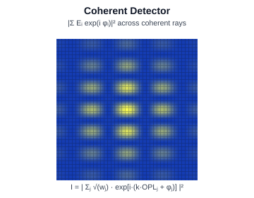

**Worked example.** Two coherent rays land in the same pixel with equal
weights :math:`w_{1} = w_{2} = 1.0`, no extra phase
(:math:`\varphi_{i} = 0`), and OPLs differing by exactly half a
wavelength (:math:`\mathrm{OPL}_{2} - \mathrm{OPL}_{1} = \lambda/2`).
Set :math:`k_{\lambda}\,\mathrm{OPL}_{1} = 0` for convenience:

* coherent sum:
  :math:`A = \sqrt{1}\,e^{i \cdot 0} + \sqrt{1}\,e^{i\pi} = 1 - 1 = 0`,
  :math:`I_{kl} = |A|^{2} = 0` — **fully destructive**.
* incoherent sum (DetMap):
  :math:`P_{kl} = 1 + 1 = 2`.

Now flip the OPL difference to a **whole** wavelength
(:math:`k_{\lambda}\Delta\mathrm{OPL} = 2\pi`):

* :math:`A = 1 + 1 = 2`, :math:`I_{kl} = 4` — **constructive**, twice
  what incoherent addition would give.

Fringe visibility for two unit-weight rays:
:math:`V = 2\sqrt{w_{1}w_{2}}/(w_{1}+w_{2}) = 1` (perfect fringes).

**KrakenOS code:**

.. code-block:: python

   # Toy coherent-sum at one pixel, fed by two rays with controlled OPL.
   lam       = W * 1e-3                          # wavelength in mm
   k_lambda  = 2.0 * np.pi / lam
   w         = np.array([1.0, 1.0])
   OPL       = np.array([10.000, 10.000 + lam / 2])   # half-wave apart
   phi       = np.zeros_like(OPL)

   A         = np.sum(np.sqrt(w) * np.exp(1j * (k_lambda * OPL + phi)))
   I_coh     = np.abs(A) ** 2
   P_inc     = np.sum(w)
   print(f"incoherent sum P_kl = {P_inc:.2f}")
   print(f"coherent   sum I_kl = {I_coh:.4f}")

.. _analysis-bfield:

BField — Branch Field
~~~~~~~~~~~~~~~~~~~~~

For Gaussian-branch sources, plots the on-axis intensity :math:`|E(x)|^{2}`
and phase :math:`\arg E(x)` of the propagated field along the current
branch, together with a fitted TEM₀₀ Hermite–Gauss template. The
mode-overlap efficiency is

.. math::

   \eta \;=\; \frac{\bigl|\!\int E^{*}(x)\,u_{\mathrm{TEM}_{00}}(x)\,
                              \mathrm{d}A\bigr|^{2}}
                   {\bigl(\!\int |E(x)|^{2}\,\mathrm{d}A\bigr) \cdot
                    \bigl(\!\int |u_{\mathrm{TEM}_{00}}(x)|^{2}\,
                              \mathrm{d}A\bigr)},

where

* :math:`x` is the transverse coordinate on the analysis surface along
  the branch (mm),
* :math:`E(x)` is the complex scalar field of the propagated bundle on
  that surface; :math:`E^{*}` is its complex conjugate,
* :math:`u_{\mathrm{TEM}_{00}}(x)` is the **fitted TEM₀₀ template** — a
  fundamental Hermite–Gauss mode with the same wavelength, waist and
  pointing as the measured field,
* :math:`\mathrm{d}A` is an area element on the analysis surface,
* :math:`\eta \in [0, 1]` is the **mode-overlap efficiency** (also
  called the coupling efficiency): the fraction of the measured field's
  power that lies in the fundamental Gaussian mode.

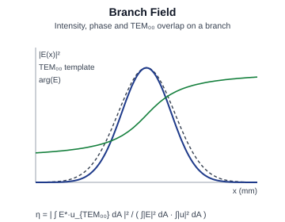

**Worked example.** A measured field
:math:`E(x) = \exp(-x^{2}/w_{e}^{2})` (Gaussian, waist :math:`w_{e}`)
is correlated against an ideal TEM₀₀ template
:math:`u(x) = \exp(-x^{2}/w_{0}^{2})` of waist :math:`w_{0}`.

For two identical Gaussians (:math:`w_{e} = w_{0} = w`),
:math:`\eta = 1`. If the template waist is mis-sized by 20%
(:math:`w_{0} = 1.2\,w_{e}`), the analytic 1-D overlap reduces to
:math:`\eta = 4\,w_{e}^{2}\,w_{0}^{2}/(w_{e}^{2} + w_{0}^{2})^{2}`:

* :math:`\eta = 4 \cdot 1 \cdot 1.44 / (1 + 1.44)^{2}
  = 5.76 / 5.9536 \approx 0.967` — 3.3% coupling loss from
  waist mismatch alone.

For a 50% mismatch (:math:`w_{0} = 1.5\,w_{e}`):
:math:`\eta = 4 \cdot 2.25 / (1 + 2.25)^{2} = 9/10.5625 \approx 0.852`
— now a 15% coupling penalty.

**KrakenOS code:**

.. code-block:: python

   # Mode-overlap on sampled field arrays (E and u defined on the same grid)
   def mode_overlap(E, u, dA):
       num   = np.abs(np.sum(np.conj(E) * u) * dA) ** 2
       den_E = np.sum(np.abs(E) ** 2) * dA
       den_u = np.sum(np.abs(u) ** 2) * dA
       return num / (den_E * den_u)

   x_grid  = np.linspace(-3.0, 3.0, 2001)
   dx      = x_grid[1] - x_grid[0]
   we, w0  = 1.0, 1.2
   E       = np.exp(-x_grid**2 / we**2)
   u       = np.exp(-x_grid**2 / w0**2)
   print(f"eta (Gaussian, w0/we=1.2) = {mode_overlap(E, u, dx):.4f}")

   # In KrakenOS, a Gaussian-branch source's propagated field is exported
   # from the branch field analysis (UI 'BField' button) -- pass the
   # exported (x, E) array into `mode_overlap()` against your reference
   # TEM00 template.

.. _analysis-diffr:

Diffr — Diffraction Detector
~~~~~~~~~~~~~~~~~~~~~~~~~~~~

Computes the angular spectrum of the coherent field landing on the
detector,

.. math::

   \tilde{E}(k_{x}, k_{y})
   = \iint E(x, y)\,e^{-i(k_{x}\,x + k_{y}\,y)}\,\mathrm{d}x\,\mathrm{d}y,

where

* :math:`(x, y)` are detector-plane coordinates (mm),
* :math:`E(x, y)` is the complex scalar field on the detector (W^½ / mm),
* :math:`(k_{x}, k_{y})` are the **transverse wave-vector components**
  (rad / mm),
* :math:`\tilde{E}(k_{x}, k_{y})` is the 2D spatial Fourier transform of
  :math:`E`, i.e. the **angular spectrum**.

The plot shows :math:`|\tilde{E}(k_{x}, k_{y})|^{2}` versus angular
direction

.. math::

   (\theta_{x}, \theta_{y}) = (k_{x}, k_{y}) / k_{\lambda},

with :math:`k_{\lambda} = 2\pi/\lambda` the vacuum wavenumber and
:math:`(\theta_{x}, \theta_{y})` the corresponding propagation angles
(radians). This is the natural output for gratings, holograms and
far-field diffraction studies.

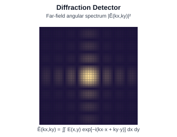

**Worked example.** Square aperture of side :math:`a = 1.0` mm
illuminated at :math:`\lambda = 0.5` µm.

The 1-D angular spectrum of a top-hat of width :math:`a` is
:math:`\tilde{E}(k_{x}) \propto \mathrm{sinc}(k_{x} a / 2)`, so the
**first zero** occurs at :math:`k_{x} a / 2 = \pi`, i.e.
:math:`k_{x} = 2\pi/a = 2\pi/1.0\,\mathrm{mm} = 6.283\,\mathrm{rad/mm}`.

Converted to a propagation angle:

* :math:`\theta_{x} = k_{x} / k_{\lambda}
  = 6.283 / (2\pi / 0.0005\,\mathrm{mm})
  = 5.0 \cdot 10^{-4}\,\mathrm{rad}
  \approx 103\,\mathrm{arcsec}`.
* In micrometres at a 1-m screen: :math:`500` µm to the first dark
  fringe.

**KrakenOS code:**

.. code-block:: python

   # Compute the angular spectrum of a sampled field via 2D FFT.
   def angular_spectrum(E, dx):
       Et = np.fft.fftshift(np.fft.fft2(np.fft.ifftshift(E))) * dx * dx
       N  = E.shape[0]
       kx = 2 * np.pi * np.fft.fftshift(np.fft.fftfreq(N, dx))
       return Et, kx

   # Toy square aperture (replace E by the coherent field exported from
   # KrakenOS' diffraction-detector analysis):
   N, dx  = 512, 0.01                            # mm
   x      = (np.arange(N) - N/2) * dx
   E      = (np.abs(x)[:, None] < 0.5) & (np.abs(x)[None, :] < 0.5)
   E      = E.astype(float)
   Et, kx = angular_spectrum(E, dx)
   theta  = kx / (2 * np.pi / (W * 1e-3))        # propagation angle, rad
   peak   = np.argmax(np.abs(Et[N//2, :]))
   # First zero index off-centre — find it
   row    = np.abs(Et[N//2, :])
   zero   = N//2 + 1 + np.argmin(row[N//2 + 1:])
   print(f"first zero at theta = {theta[zero]*206265:.1f} arcsec")

Comparative analyses
--------------------

.. _analysis-interf:

Interf — Interferogram
~~~~~~~~~~~~~~~~~~~~~~

Simulates a two-beam interference fringe pattern between the system
wavefront and an ideal reference,

.. math::

   I(u, v) \;=\; I_{1} + I_{2}
   + 2\sqrt{I_{1}\,I_{2}}\;
     \cos\!\left[\,\frac{2\pi}{\lambda}\,W(u, v) + \varphi_{0}\,\right],

where

* :math:`(u, v)` are normalised pupil coordinates,
* :math:`I(u, v)` is the fringe **irradiance** at the pupil sample point
  (W / mm²),
* :math:`I_{1}` is the **test-beam** irradiance (from the optical system
  under analysis),
* :math:`I_{2}` is the **reference-beam** irradiance (from the ideal
  reference arm),
* :math:`2\sqrt{I_{1}\,I_{2}}` is the **fringe-visibility envelope** for
  fully coherent interference (visibility :math:`V = 2\sqrt{I_{1}I_{2}} /
  (I_{1}+I_{2})`),
* :math:`\lambda` is the wavelength (mm),
* :math:`W(u, v)` is the OPD wavefront of the test beam relative to the
  reference (mm),
* :math:`\varphi_{0}` is a global **carrier-phase offset** (radians),
  set by the alignment of the reference arm.

Adding tilt / defocus to :math:`W` introduces straight or annular
reference fringes the way a real Twyman–Green or Fizeau interferometer
does.

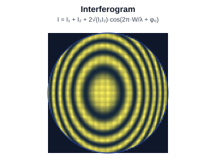

**Worked example.** Equal-intensity beams (:math:`I_{1} = I_{2} = 1`),
no carrier (:math:`\varphi_{0} = 0`), wavelength
:math:`\lambda = 0.5876` µm. Tabulate :math:`I(u, v)` at three
representative wavefront-error samples:

* :math:`W = 0`: :math:`I = 1 + 1 + 2\sqrt{1}\cos 0 = 4`
  (bright fringe).
* :math:`W = \lambda/4`:
  :math:`I = 1 + 1 + 2\cos(\pi/2) = 2`
  (mid-fringe).
* :math:`W = \lambda/2`:
  :math:`I = 1 + 1 + 2\cos(\pi) = 0`
  (dark fringe).

Adding a 5-wave tilt to :math:`W` (e.g.
:math:`W = 5\lambda \cdot u`) produces **10 straight fringes** across
the pupil diameter; tilt provides the spatial "carrier" used in real
interferometer fringe-readout algorithms.

**KrakenOS code:**

.. code-block:: python

   X, Y, Z, _ = Kos.Phase2(Pup)                 # Z = W in waves
   I1, I2 = 1.0, 1.0
   phi0   = 0.0                                  # carrier-phase offset
   tilt   = 5.0                                  # waves of tilt across the pupil
   Z_test = Z + tilt * X / np.max(np.abs(X))

   I = I1 + I2 + 2*np.sqrt(I1*I2) * np.cos(2*np.pi * Z_test + phi0)

   import matplotlib.pyplot as plt
   plt.scatter(X, Y, c=I, s=12, cmap="gray")
   plt.axis("equal"); plt.colorbar(label="I (arb.)")
   plt.title("Mock interferogram with 5-wave tilt carrier")
   plt.show()

.. _analysis-tolcmp:

TolCmp — Tolerance Compare
~~~~~~~~~~~~~~~~~~~~~~~~~~

Overlays the *nominal-design* spot diagram against the **worst**
Monte-Carlo sample from the tolerance run (see
``KrakenOS/UI/validate_tolerance_monte_carlo.py``). Each design parameter
is perturbed independently and the system is re-traced. The merit
function is

.. math::

   M(\boldsymbol{\delta})
   = \sigma_{\mathrm{RMS}}\bigl(\boldsymbol{\delta}\bigr)
   \quad\text{or}\quad
   M(\boldsymbol{\delta})
   = \mathrm{Strehl}\bigl(\boldsymbol{\delta}\bigr),

where

* :math:`\boldsymbol{\delta} = (\delta p_{1}, \delta p_{2}, \ldots,
  \delta p_{K})` is the vector of perturbations applied in one
  Monte-Carlo trial,
* :math:`p_{k}` is the :math:`k`-th design parameter (e.g. surface
  radius, thickness, decentre, tilt, refractive index),
* :math:`\delta p_{k}` is a random draw from the tolerance distribution
  attached to :math:`p_{k}` (typically uniform or Gaussian),
* :math:`K` is the total number of toleranced parameters,
* :math:`\sigma_{\mathrm{RMS}}(\boldsymbol{\delta})` is the RMS spot
  radius of the perturbed system at the test field (mm; lower is
  better),
* :math:`\mathrm{Strehl}(\boldsymbol{\delta})` is the on-axis Strehl
  ratio of the perturbed system (dimensionless; higher is better),
* :math:`M(\boldsymbol{\delta})` is the chosen merit function for the
  trial.

Many trials are run; the worst (highest :math:`\sigma_{\mathrm{RMS}}` /
lowest :math:`\mathrm{Strehl}`) sample is shown overlaid on the nominal
cluster.

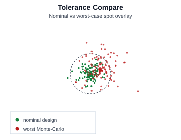

**Worked example.** Two toleranced parameters: surface-1 radius
:math:`R_{1}` with :math:`\delta R_{1} \sim U(-0.05, +0.05)` mm, and
element-2 axial thickness :math:`t_{2}` with
:math:`\delta t_{2} \sim N(0, 0.020)` mm. Run :math:`K = 500`
Monte-Carlo trials. Suppose the empirical distribution of
:math:`M = \sigma_{\mathrm{RMS}}` is:

* nominal: :math:`\sigma_{\mathrm{RMS}} = 5.0` µm.
* median Monte-Carlo: :math:`\sigma_{\mathrm{RMS}} = 8.4` µm.
* 95th percentile: :math:`\sigma_{\mathrm{RMS}} = 16.9` µm.
* worst sample (max): :math:`\sigma_{\mathrm{RMS}} = 22.3` µm.

The overlay plots the nominal cluster (tight, around the centroid) and
the worst-sample cluster (offset and broadened) on the same axes; the
ratio :math:`22.3 / 5.0 = 4.5\times` is a quick sensitivity score.

**KrakenOS code:**

.. code-block:: python

   rng = np.random.default_rng(0)

   def perturbed_sigma(seed_delta):
       # Apply perturbations in-place, retrace, restore.
       dR1, dt2 = seed_delta
       L1a.Rc       += dR1
       L1b.Thickness += dt2
       sys_p = Kos.system([P_Obj, L1a, L1b, L1c, Stop, P_Ima], Kos.Setup())
       Pup_p = Kos.PupilCalc(sys_p, Surf, W, "EPD", 10.0)
       Pup_p.Samp = Pup.Samp; Pup_p.Ptype = Pup.Ptype
       Pup_p.FieldType = Pup.FieldType
       Pup_p.FieldX, Pup_p.FieldY = Pup.FieldX, Pup.FieldY
       Rays = Kos.raykeeper(sys_p)
       x, y, z, L, M, N = Pup_p.Pattern2Field()
       for i in range(len(x)):
           sys_p.Trace([x[i], y[i], z[i]], [L[i], M[i], N[i]], W)
           Rays.push()
       X, Y, *_ = Rays.pick(-1)
       L1a.Rc       -= dR1
       L1b.Thickness -= dt2
       return np.sqrt(np.mean((X - X.mean())**2 + (Y - Y.mean())**2))

   K = 200
   results = []
   for _ in range(K):
       dR1 = rng.uniform(-0.05, 0.05)
       dt2 = rng.normal(0.0, 0.020)
       results.append(perturbed_sigma((dR1, dt2)))

   results = np.array(results) * 1e3            # mm -> um
   print(f"nominal  sigma_RMS ~= 5 um   (trace once with no perturbations)")
   print(f"MC median            = {np.median(results):.2f} um")
   print(f"MC 95th percentile   = {np.percentile(results, 95):.2f} um")
   print(f"MC max (worst)       = {results.max():.2f} um")

Cross-reference table
---------------------

.. list-table:: Toolbar button ↔ analysis mode ↔ this page
   :header-rows: 1
   :widths: 18 24 58

   * - Button
     - ``mode`` key
     - Anchor
   * - Spot
     - ``spot``
     - :ref:`analysis-spot`
   * - RMS
     - ``rms``
     - :ref:`analysis-rms`
   * - PSF
     - ``psf``
     - :ref:`analysis-psf`
   * - MTF
     - ``mtf``
     - :ref:`analysis-mtf`
   * - Pupil
     - ``pupil``
     - :ref:`analysis-pupil`
   * - Seidel
     - ``seidel``
     - :ref:`analysis-seidel`
   * - WFront
     - ``wavefront``
     - :ref:`analysis-wfront`
   * - Zernike
     - ``zernike``
     - :ref:`analysis-zernike`
   * - FC/Dist
     - ``field_curvature``
     - :ref:`analysis-fc-dist`
   * - Illum
     - ``relative_illumination``
     - :ref:`analysis-illum`
   * - LatClr
     - ``lateral_color``
     - :ref:`analysis-latclr`
   * - Pol
     - ``polarization``
     - :ref:`analysis-pol`
   * - Atmos
     - ``atmosphere``
     - :ref:`analysis-atmos`
   * - PSFMap
     - ``psf_map``
     - :ref:`analysis-psfmap`
   * - FldMap
     - ``field_map``
     - :ref:`analysis-fldmap`
   * - IllMap
     - ``illum_map``
     - :ref:`analysis-illmap`
   * - WfeMap
     - ``wavefront_map``
     - :ref:`analysis-wfemap`
   * - DetMap
     - ``detector_map``
     - :ref:`analysis-detmap`
   * - CohDet
     - ``coherent_detector``
     - :ref:`analysis-cohdet`
   * - BField
     - ``branch_field``
     - :ref:`analysis-bfield`
   * - Diffr
     - ``diffraction_detector``
     - :ref:`analysis-diffr`
   * - Interf
     - ``interferogram``
     - :ref:`analysis-interf`
   * - TolCmp
     - ``tolerance_compare``
     - :ref:`analysis-tolcmp`
