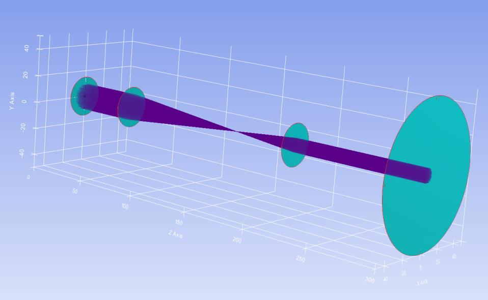

7.2 Example — Perfect Lens
==========================

PDF section 7.2. Source script: ``KrakenOS/Examples/Examp_Perfect_lens.py``.

Demonstrates an aberration-free thin lens via the ``Thin_Lens`` surface
attribute. Two thin lenses (f = 100 mm and f = 50 mm) image a 10 mm-radius
circular field; the resulting spot diagram shows essentially no aberration.

   Figure 9. Perfect-lens system with no aberration.

.. literalinclude:: ../../../../KrakenOS/Examples/Examp_Perfect_lens.py
   :language: python
