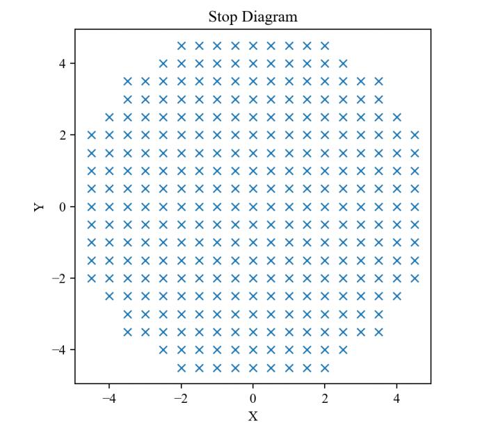

7.3 Example — Doublet Lens 3D Color
===================================

PDF section 7.3. Source script: ``KrakenOS/Examples/Examp_Doublet_Lens_3Dcolor.py``.

Same achromatic doublet as :doc:`ex_01_ray`, but assigns per-surface
``Color`` values to illustrate the 3D viewer's display options. A fan of
rays at three wavelengths (0.4, 0.5, 0.6 µm) is traced to show the
chromatic colouring of the rays alongside the coloured surfaces.

   Figure 10. Doublet view with a custom colour assigned to each surface.

.. literalinclude:: ../../../../KrakenOS/Examples/Examp_Doublet_Lens_3Dcolor.py
   :language: python
