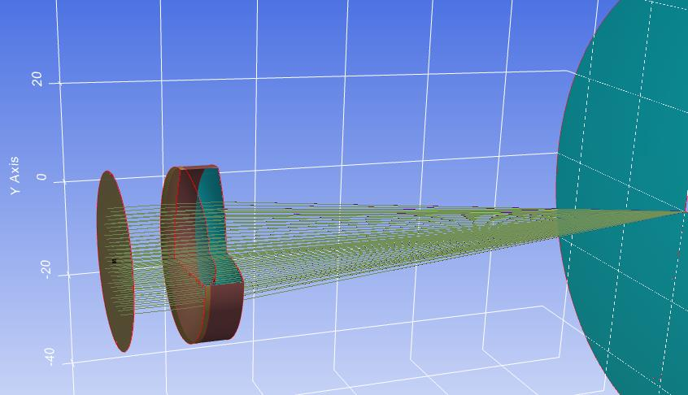

7.4 Example — Doublet Lens Tilt
===============================

PDF section 7.4. Source script: ``KrakenOS/Examples/Examp_Doublet_Lens_Tilt.py``.

Shows how the ``AxisMove``, ``TiltX`` and ``DespY`` attributes affect the
optical axis. The same set of doublet surfaces is reused in the surface
list — when a surface is modified, every reuse of it follows the same
transformation, so the design built from a repeated pattern is fully
off-axis after the tilt is applied.

   Figure 11. 3D visualization of an off-axis system built by repeating the
   doublet surfaces; modifying a surface affects every part of the design
   that uses it.

.. literalinclude:: ../../../../KrakenOS/Examples/Examp_Doublet_Lens_Tilt.py
   :language: python
