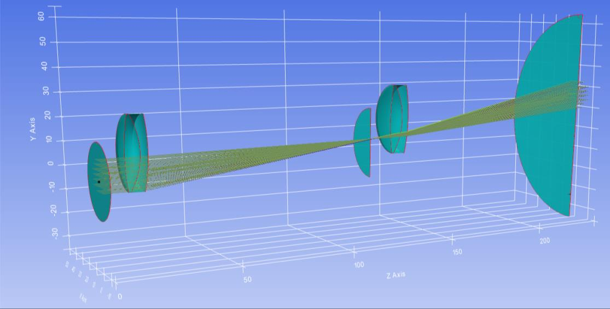

7.5 Example — Doublet Lens (Paraxial Calculations)
==================================================

PDF section 7.5. Source script: ``KrakenOS/Examples/Examp_Doublet_Lens-ParaxMatrix.py``.

Runs ``system.Parax`` on the doublet, prints the effective focal length,
increments ``L1a.Rc`` by 1 mm, calls ``ResetData`` and re-runs the paraxial
calculation — repeating the sweep to show how curvature changes drive the
EFFL.

   Figure 12. Focal lengths returned by the paraxial calculation as
   ``L1a.Rc`` is incremented by 1 mm between calls.

.. literalinclude:: ../../../../KrakenOS/Examples/Examp_Doublet_Lens-ParaxMatrix.py
   :language: python
