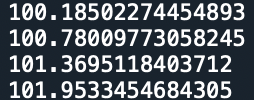

7.6 Example — Doublet Lens Tilt Nulls
=====================================

PDF section 7.6. Source script: ``KrakenOS/Examples/Examp_Doublet_Lens_Tilt-Nulls.py``.

Demonstrates *null surfaces* — ``"NULL"``-glass interfaces inserted around a
tilted element to undo the coordinate transformation so the downstream
surfaces remain on the original optical axis. The first null surface
applies the opposite tilt (``Order = 1``); the second restores the
thickness.

   Figure 13. 2D and 3D view of a doublet with one tilted face, isolated
   from the rest of the system by null surfaces.

.. literalinclude:: ../../../../KrakenOS/Examples/Examp_Doublet_Lens_Tilt-Nulls.py
   :language: python
