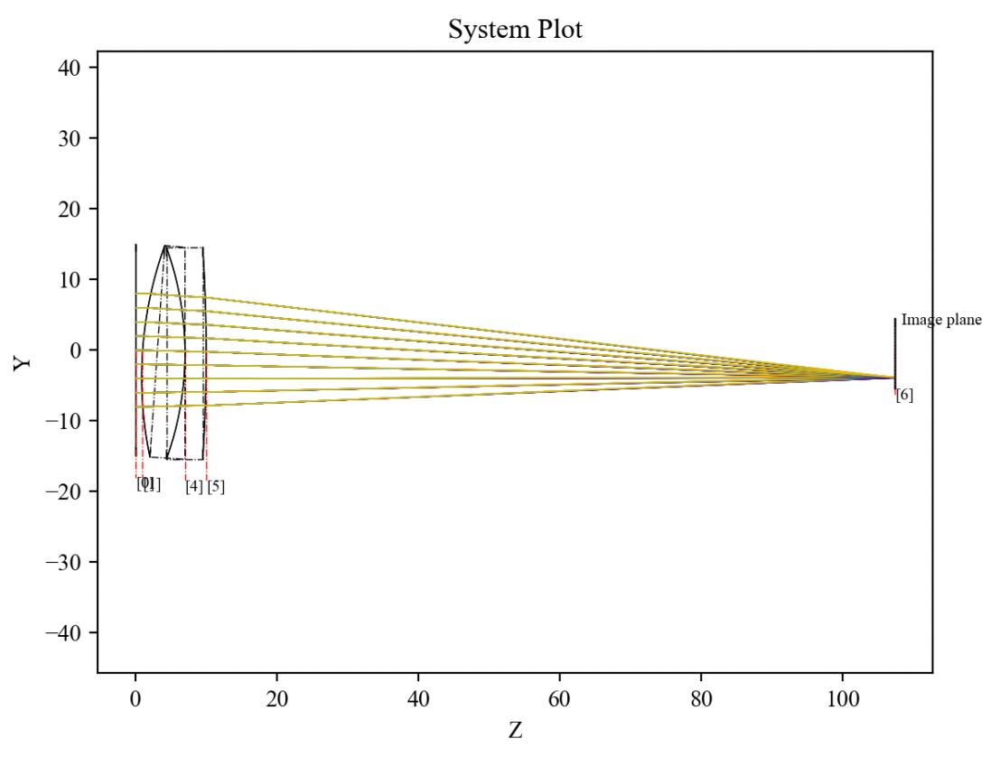
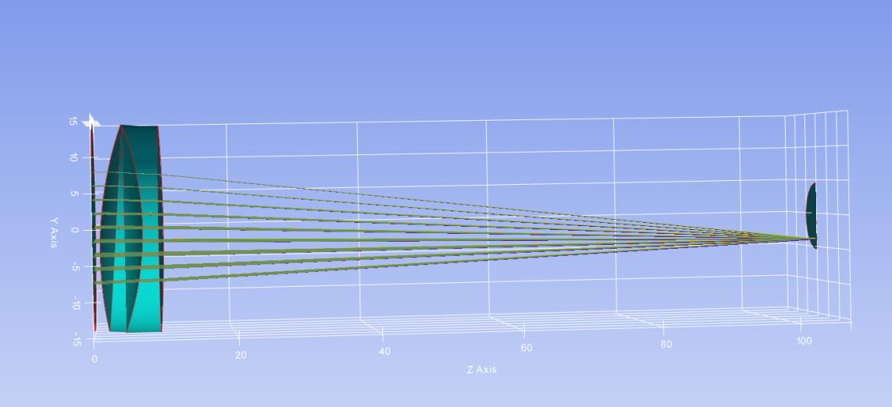

7.7 Example — Doublet Lens NonSec
=================================

PDF section 7.7. Source script: ``KrakenOS/Examples/Examp_Doublet_Lens_NonSec.py``.

Uses ``NsTrace`` (non-sequential tracing) instead of ``Trace``. With the
image plane set to ``"MIRROR"`` and tilted, some rays reflect back through
the system; their amplitudes depend on the Fresnel coefficients at each
interface, which in turn depend on wavelength, material and angle of
incidence at the normal.

   Figure 14a. 2D non-sequential trace.

   Figure 14b. 3D non-sequential trace — rays are reflected back according
   to the Fresnel coefficients.

.. literalinclude:: ../../../../KrakenOS/Examples/Examp_Doublet_Lens_NonSec.py
   :language: python
