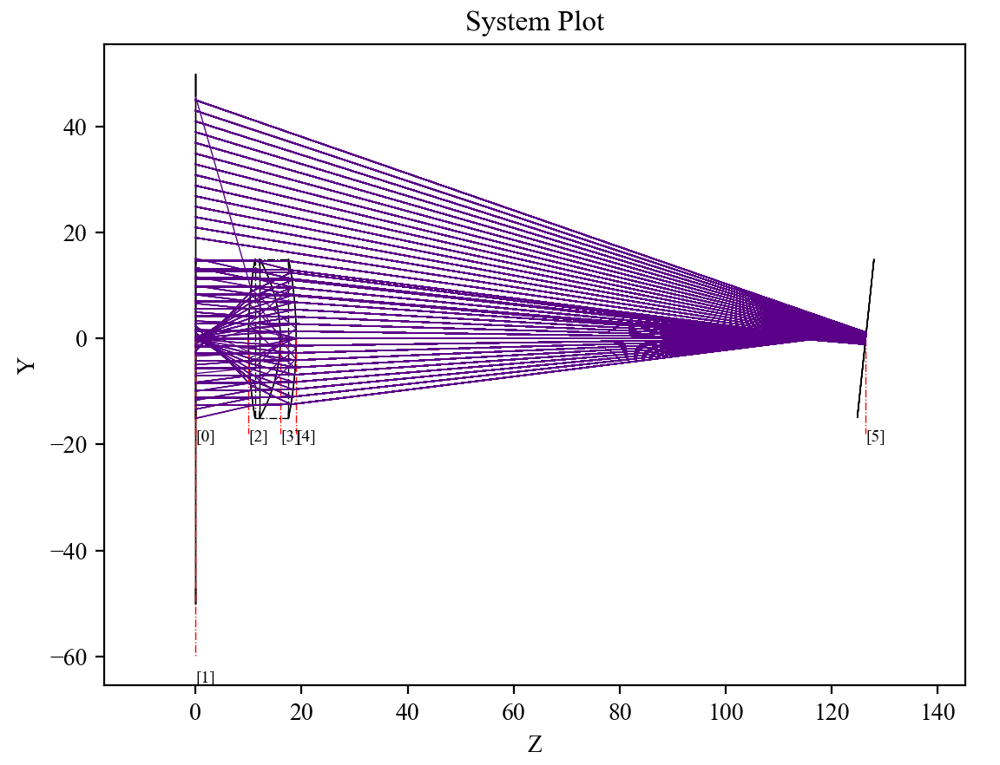
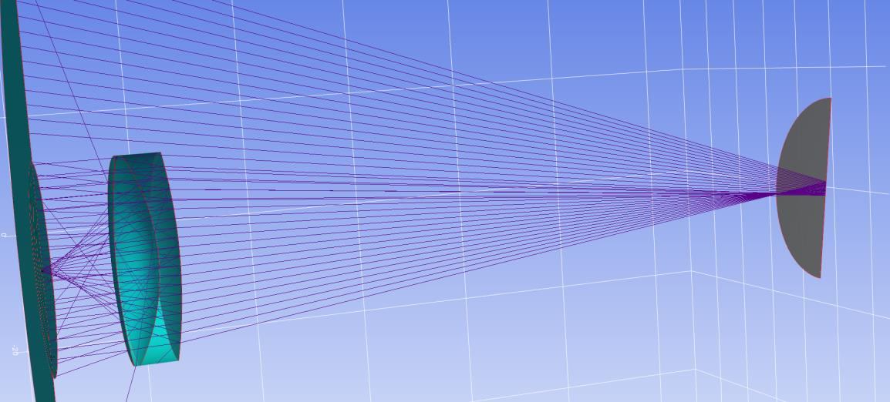

7.8 Example — Doublet Lens Zernike
==================================

PDF section 7.8. Source script: ``KrakenOS/Examples/Examp_Doublet_Lens_Zernike.py``.

Loads a 36-element ``ZNK`` array (Noll-ordered Zernike coefficients) onto
the rear surface of the doublet to deform it. Tracing the same fan of rays
visualises the surface departure and the resulting wavefront effect.

   Figure 15a. Doublet with a surface defined by Zernike-polynomial
   coefficients.

   Figure 15b. Same system in 2D.

.. literalinclude:: ../../../../KrakenOS/Examples/Examp_Doublet_Lens_Zernike.py
   :language: python
