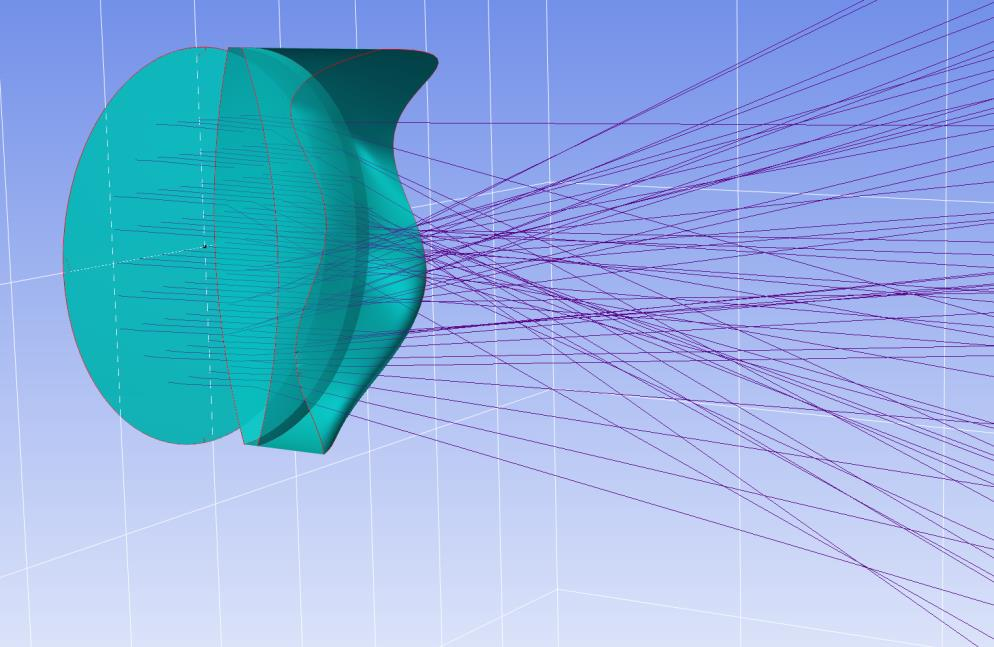

7.9 Example — Doublet Lens Tilt NonSec
======================================

PDF section 7.9. Source script: ``KrakenOS/Examples/Examp_Doublet_Lens_Tilt_non_sec.py``.

Combines surface tilt with the non-sequential tracer. The first occurrence
of the doublet is tilted and shifted in Z; the same surfaces are then
repeated. Rays that miss the first instance are picked up by the second,
demonstrating how ``NsTrace`` finds whichever element the ray actually hits.

   Figure 16. Non-sequential trace through a tilted, repeated doublet —
   rays that miss the first element are picked up by the second.

.. literalinclude:: ../../../../KrakenOS/Examples/Examp_Doublet_Lens_Tilt_non_sec.py
   :language: python
