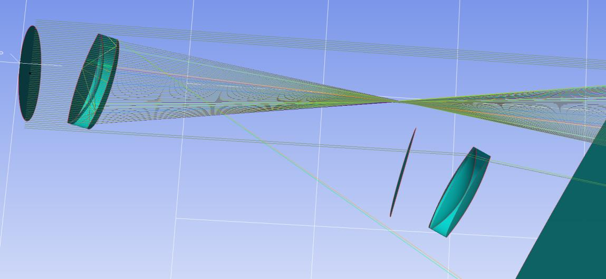

7.10 Example — Doublet Lens Pupil
=================================

PDF section 7.10. Source script: ``KrakenOS/Examples/Examp_Doublet_Lens_Pupil.py``.

Uses :doc:`../pupilcalc_tool` to read the entrance- and exit-pupil
parameters of the doublet with an inserted aperture stop, then samples a
fan pattern at field ±2° and traces it through the system.

   Figure 17. Beams generated by ``PupilCalc`` — the position of the
   aperture-stop surface determines the pupil layout.

.. literalinclude:: ../../../../KrakenOS/Examples/Examp_Doublet_Lens_Pupil.py
   :language: python
