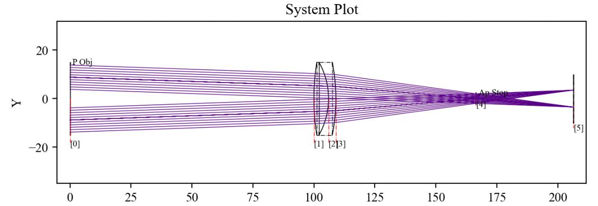

7.11 Example — Doublet Lens Commands System
===========================================

PDF section 7.11. Source script: ``KrakenOS/Examples/Examp_Doublet_Lens_CommandsSystem.py``.

Traces a single ray and then prints essentially every attribute the
``system`` class exposes (see :ref:`tbl-system-class`): ``EFFL``, the
cardinal planes, the per-surface arrays (``SURFACE``, ``NAME``,
``GLASS``, ``XYZ``, ``S_XYZ``, ``T_XYZ``, ``OST_XYZ``, ``DISTANCE``,
``OP``, ``TOP``, ``TOP_S``, ``ALPHA``, ``S_LMN``, ``LMN``, ``R_LMN``,
``N0``, ``N1``, ``WAV``, ``G_LMN``, ``ORDER``, ``GRATING``,
``RP/RS/TP/TS``, ``TTBE``, ``TT``, ``BULK_TRANS``).

   Figure 18. 3D view of the doublet used by the commands example.

.. literalinclude:: ../../../../KrakenOS/Examples/Examp_Doublet_Lens_CommandsSystem.py
   :language: python
