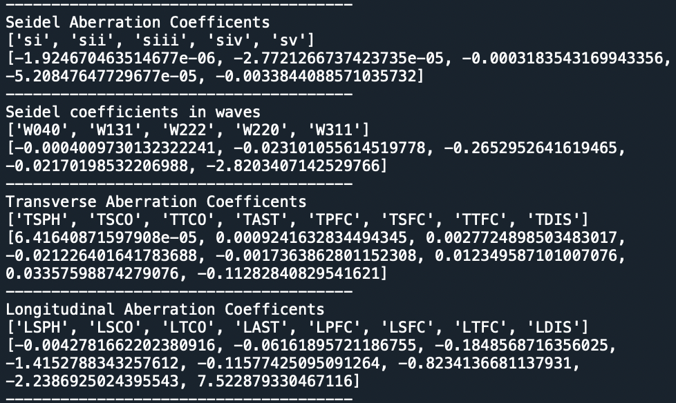
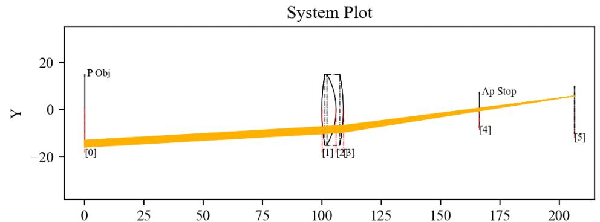

7.12 Example — Doublet Lens Pupil + Seidel
==========================================

PDF section 7.12. Source script: ``KrakenOS/Examples/Examp_Doublet_Lens_Pupil_Seidel.py``.

Computes the Seidel-aberration sums via ``Kos.Seidel`` for the doublet,
sweeping field angle, then re-uses ``PupilCalc`` to trace a fan at the
same field for visual inspection.

   Figure 19a. Seidel-aberration sums printed by the example.

   Figure 19b. Ray fan delimited by the pupil image, for the same field
   used in the Seidel sums.

.. literalinclude:: ../../../../KrakenOS/Examples/Examp_Doublet_Lens_Pupil_Seidel.py
   :language: python
