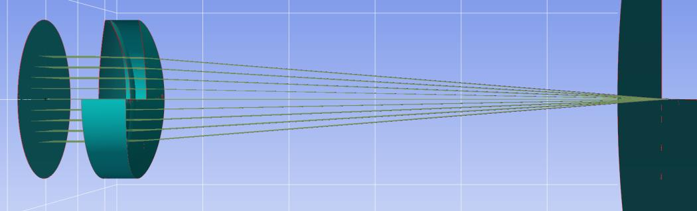
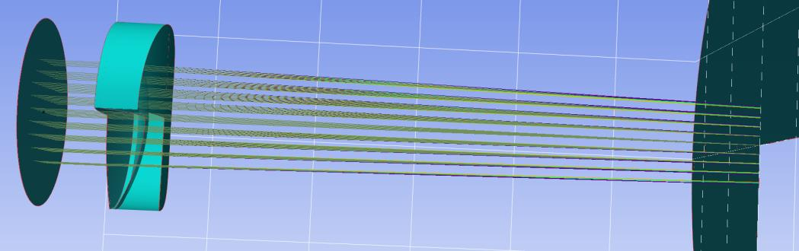

7.13 Example — Doublet Lens Cylinder
====================================

PDF section 7.13. Source script: ``KrakenOS/Examples/Examp_Doublet_Lens_Cylinder.py``.

Sets ``Cylinder_Rxy_Ratio = 0`` on the rear face of the doublet to turn it
into a cylindrical surface, plus a ``TiltZ`` rotation to roll the cylinder
axis. Viewing the system along X versus Y shows that the surface is plane
on one axis and curved on the other.

   Figure 20a. View along the X axis — the cylindrical face is plane.

   Figure 20b. View along the Y axis — the cylindrical face shows
   curvature.

.. literalinclude:: ../../../../KrakenOS/Examples/Examp_Doublet_Lens_Cylinder.py
   :language: python
