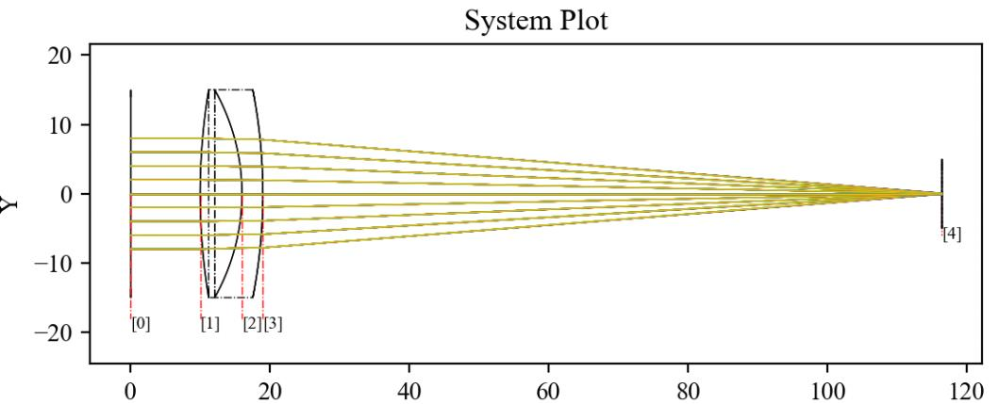
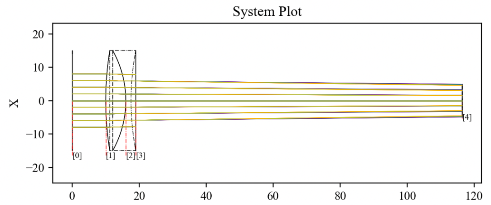

7.14 Example — Axicon
=====================

PDF section 7.14. Source script: ``KrakenOS/Examples/Examp_Axicon.py``.

Uses the ``Axicon`` surface attribute to turn a planar BK7 element into a
conical refractor (the negative value sets the cone direction). A 5×5 fan
at three wavelengths shows the characteristic Bessel-like focal region.

   Figure 21a. Cross-section of the axicon.

   Figure 21b. Full 3D view of the axicon and traced rays.

.. literalinclude:: ../../../../KrakenOS/Examples/Examp_Axicon.py
   :language: python
