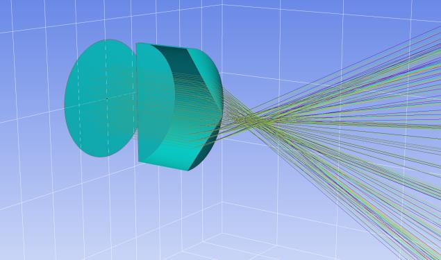
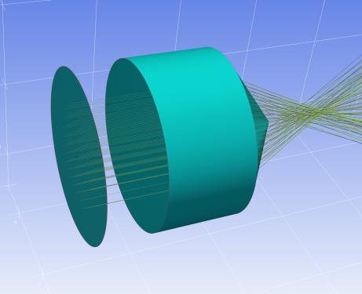

7.15 Example — Axicon and Cylinder
==================================

PDF section 7.15. Source script: ``KrakenOS/Examples/Examp_Axicon_And_Cylinder.py``.

Combines ``Axicon`` with ``Cylinder_Rxy_Ratio = 0`` and ``K = -1`` on the
same surface to demonstrate composing several surface modifiers.

   Figure 22a. Axicon combined with a cylindrical profile, 3D view.

   Figure 22b. Alternate view of the same element.

.. literalinclude:: ../../../../KrakenOS/Examples/Examp_Axicon_And_Cylinder.py
   :language: python
