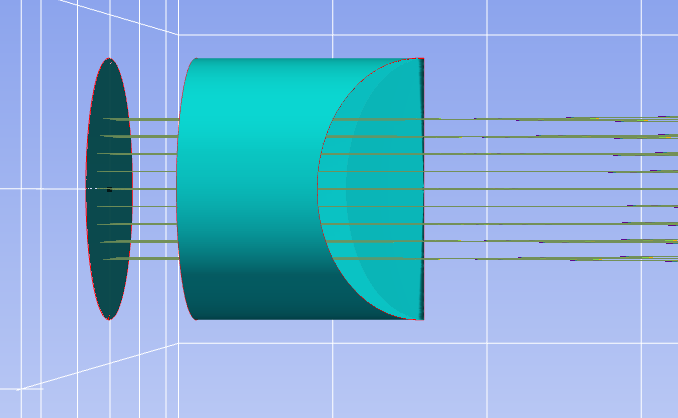
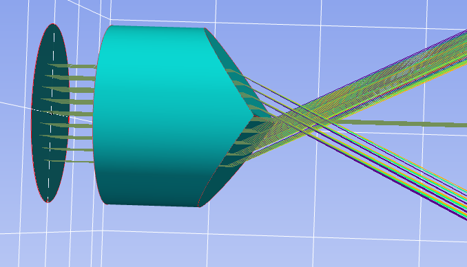

7.16 Example — Flat Mirror 45 Deg
=================================

PDF section 7.16. Source script: ``KrakenOS/Examples/Examp_Flat_Mirror_45Deg.py``.

Folds the optical axis with a flat mirror at 45°. The mirror uses
``AxisMove = 2`` so the axis itself rotates twice — the convention for
specular reflection that keeps the downstream surfaces correctly oriented
along the new axis direction.

   Figure 23a. 2D view — the optical axis is folded by the flat mirror.

   Figure 23b. 3D view of the folded system.

.. literalinclude:: ../../../../KrakenOS/Examples/Examp_Flat_Mirror_45Deg.py
   :language: python
