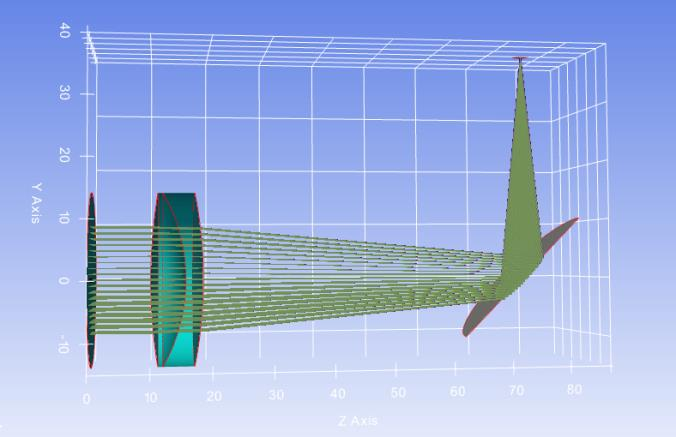
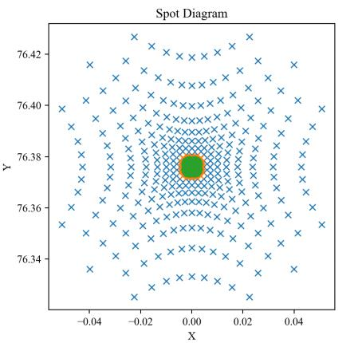

7.17 Example — Parabolic Mirror Shift
=====================================

PDF section 7.17. Source script: ``KrakenOS/Examples/Examp_ParaboleMirror_Shift.py``.

Builds an off-axis parabolic mirror using ``k = -1`` (parabola) plus a
``ShiftY`` to offset the surface profile away from the optical axis. Useful
for off-axis collectors and feeds.

   Figure 24a. Off-axis parabolic mirror — first view.

   Figure 24b. Off-axis parabolic mirror — second view.

.. literalinclude:: ../../../../KrakenOS/Examples/Examp_ParaboleMirror_Shift.py
   :language: python
