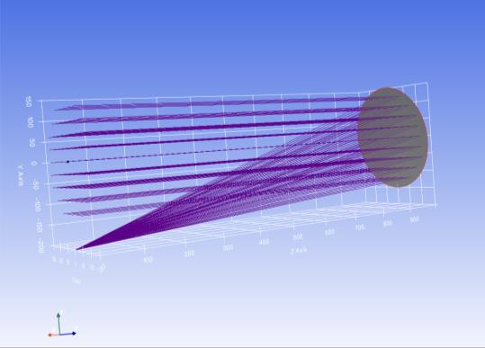
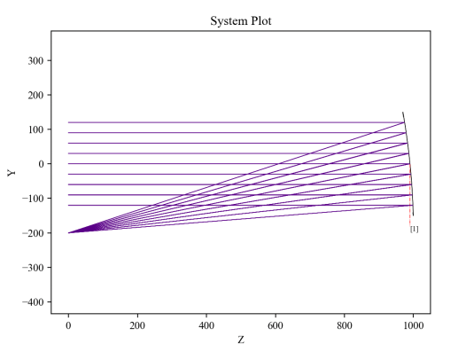

7.18 Example — Diffraction Grating in Transmission
==================================================

PDF section 7.18. Source script: ``KrakenOS/Examples/Examp_Diffraction_Grating_Transmission.py``.

Sets ``Diff_Ord``, ``Grating_D`` and ``Grating_Angle`` on a planar surface
to make it a transmission grating. Tracing a fan of three wavelengths
shows the dispersion: each wavelength leaves the grating at a different
angle for the same diffraction order.

   Figure 25a. Transmission grating — multi-wavelength fan.

   Figure 25b. Alternate view.

.. literalinclude:: ../../../../KrakenOS/Examples/Examp_Diffraction_Grating_Transmission.py
   :language: python
