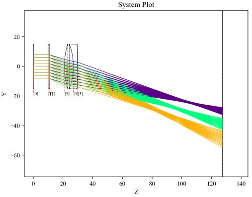
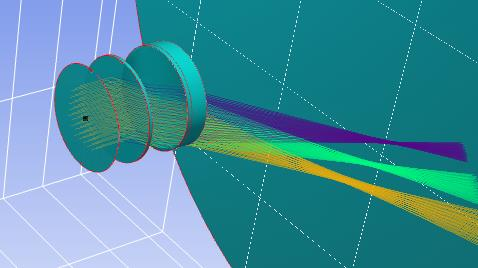

7.19 Example — Diffraction Grating in Reflection
================================================

PDF section 7.19. Source script: ``KrakenOS/Examples/Examp_Diffraction_Grating_Reflection.py``.

The reflective counterpart of :doc:`ex_18_grating_transmission`: the same
grating attributes are applied on a ``"MIRROR"`` surface so the diffracted
orders are reflected back rather than transmitted.

   Figure 26a. Reflection grating — multi-wavelength fan.

   Figure 26b. Alternate view.

.. literalinclude:: ../../../../KrakenOS/Examples/Examp_Diffraction_Grating_Reflection.py
   :language: python
