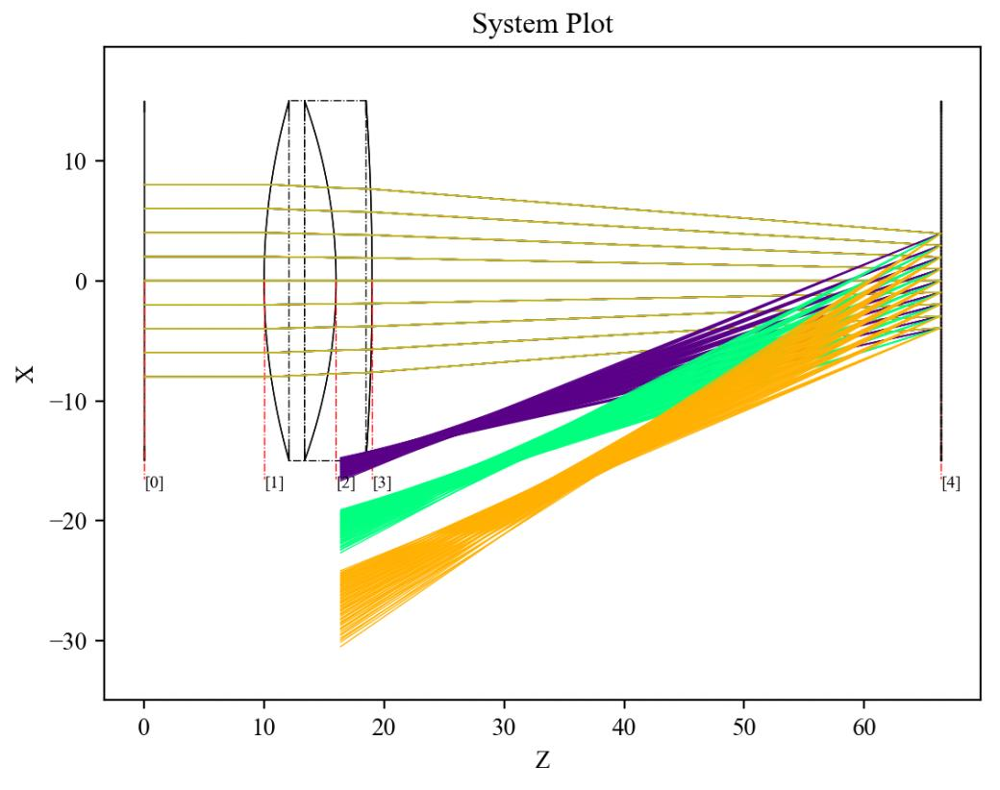

7.20 Example — Tel 2M Spyder Spot Diagram
=========================================

PDF section 7.20. Source script: ``KrakenOS/Examples/Examp_Tel_2M_Spyder_Spot_Diagram.py``.

Builds the 2 m telescope model and produces a spot diagram on-axis,
including the central-aperture obstruction of the primary mirror and the
spider vanes — visible as the characteristic cross pattern around the
core spot.

   Figure 27. Spot diagram of the 2 m telescope with the secondary's
   spider-vane diffraction pattern.

.. literalinclude:: ../../../../KrakenOS/Examples/Examp_Tel_2M_Spyder_Spot_Diagram.py
   :language: python
