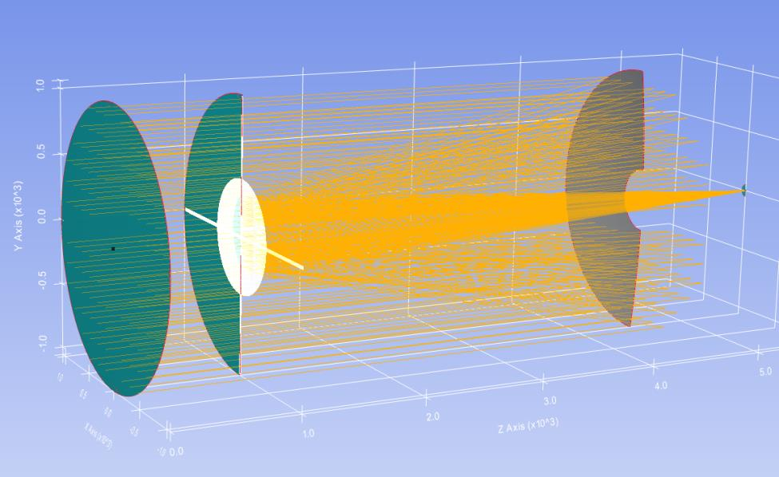
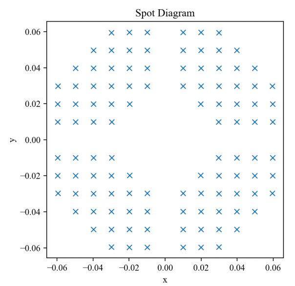

7.21 Example — Tel 2M Spyder Spot, M2 Tilt
==========================================

PDF section 7.21. Source script:
``KrakenOS/Examples/Examp_Tel_2M_Spyder_Spot_RMS.py``
(the closest current script to the 2021 *Spyder_Spot_Tilt_M2* example).

Sweeps a tilt on the telescope's secondary mirror and reports the
resulting RMS-spot growth on-axis.

   Figure 28a. Spot with M2 tilted.

   Figure 28b. RMS plot vs. tilt.

.. literalinclude:: ../../../../KrakenOS/Examples/Examp_Tel_2M_Spyder_Spot_RMS.py
   :language: python
