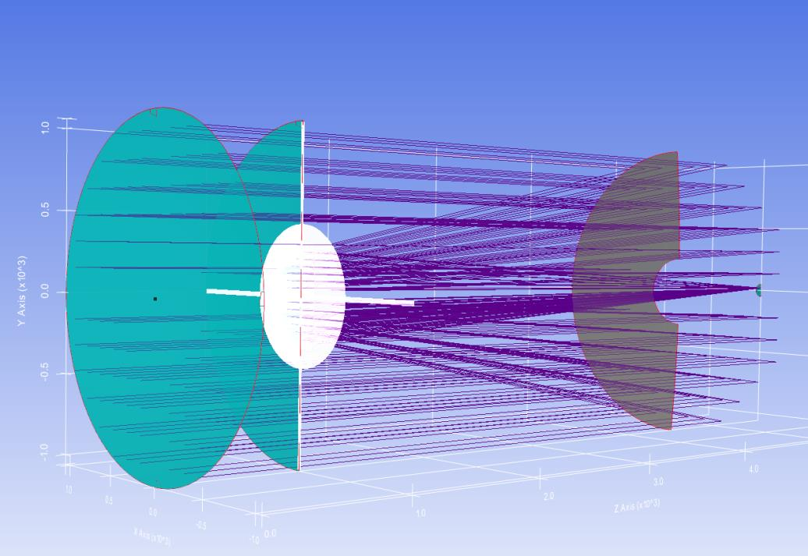
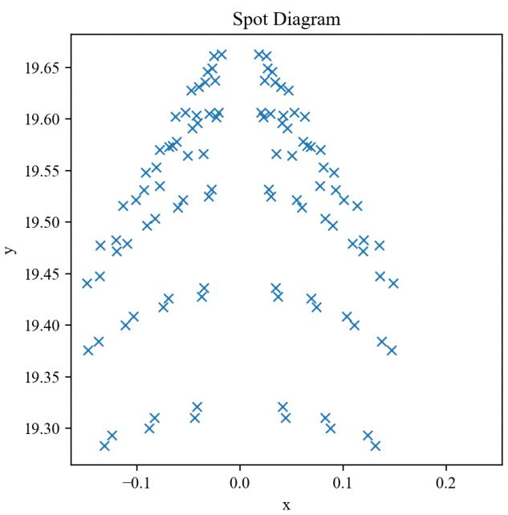

7.22 Example — Tel 2M Pupila
============================

PDF section 7.22. Source script: ``KrakenOS/Examples/Examp_Tel_2M_Pupila.py``.

Wraps the 2 m telescope in :doc:`../pupilcalc_tool` to read the pupil
parameters of a Cassegrain-type design — a setup that involves the
negative thicknesses of mirror returns that the manual flags in
:doc:`../working_with_library`.

   Figure 29a. Entrance/exit-pupil geometry.

   Figure 29b. Ray fan through the telescope.

.. literalinclude:: ../../../../KrakenOS/Examples/Examp_Tel_2M_Pupila.py
   :language: python
