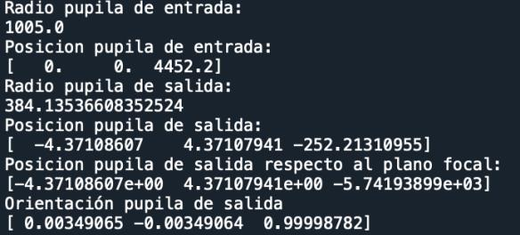
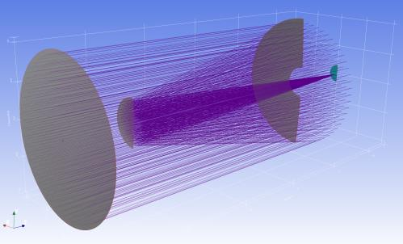

7.23 Example — Tel 2M Error Map
===============================

PDF section 7.23.

.. note::

   The standalone *Examp_Tel_2M_Error_Map.py* script from the 2021 PDF is
   no longer in ``KrakenOS/Examples/``. The closest current example of an
   ``Error_map`` workflow is
   ``KrakenOS/common_optical_layouts/measured_error_map_example.py``.

The example demonstrates ``surf.Error_map = [X, Y, Z, SPACE]`` — feeding a
measured surface error map (NumPy arrays for X, Y, Z and a sample spacing)
onto a mirror so the trace incorporates the actual figure error rather
than just the nominal surface.

   Figure 30a. 2 m telescope with a measured error map on the primary.

   Figure 30b. Spot impact of the error map.

.. literalinclude:: ../../../../KrakenOS/common_optical_layouts/measured_error_map_example.py
   :language: python
