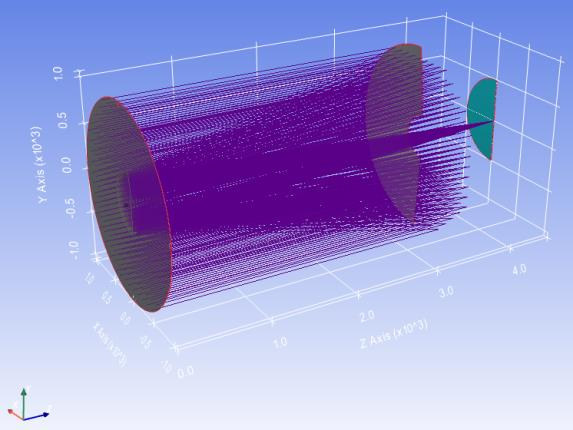
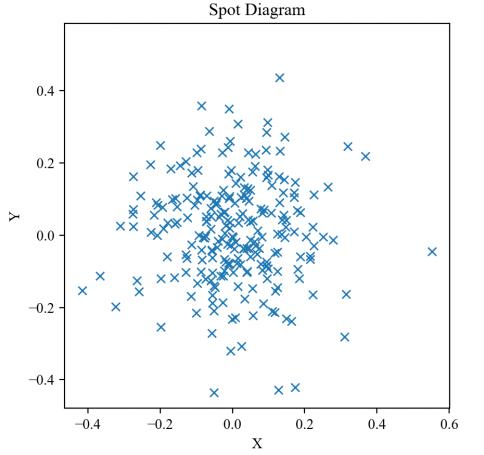

7.24 Example — Tel 2M Wavefront Fitting
=======================================

PDF section 7.24. Source script: ``KrakenOS/Examples/Examp_Tel_2M_Wavefront_Fitting.py``.

Traces a pupil-sampled fan through the 2 m telescope and fits the resulting
optical-path differences with Zernike polynomials, returning the
coefficients that describe the residual wavefront error.

   Figure 31a. Wavefront map.

   Figure 31b. Zernike-coefficient bar chart.

.. literalinclude:: ../../../../KrakenOS/Examples/Examp_Tel_2M_Wavefront_Fitting.py
   :language: python
