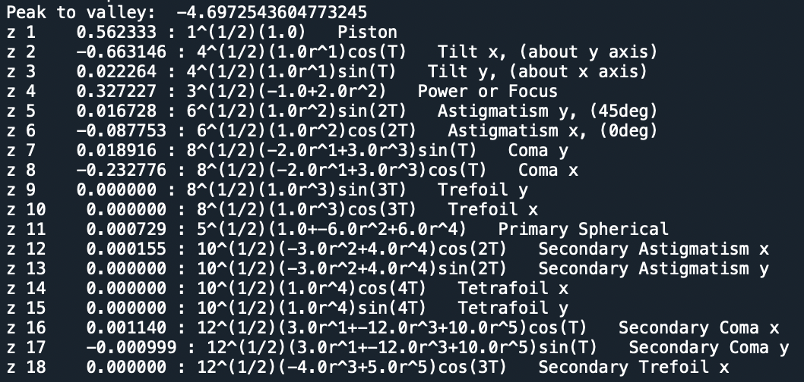

7.25 Example — Tel 2M STL Image Slicer
======================================

PDF section 7.25. Source script: ``KrakenOS/Examples/Examp_Tel_2M-STL_ImageSlicer.py``.

The most memory-hungry example in the library (~2 GB RAM): drops an
STL-defined image slicer into the focal plane of the 2 m telescope and
traces a dense ray fan to visualise the slicing action.

   Figure 32. STL image slicer at the telescope focus.

.. literalinclude:: ../../../../KrakenOS/Examples/Examp_Tel_2M-STL_ImageSlicer.py
   :language: python
