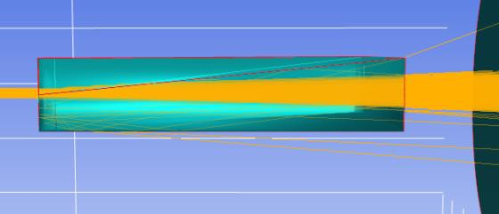
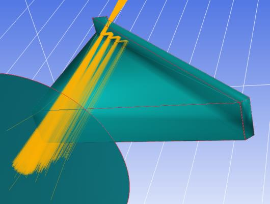
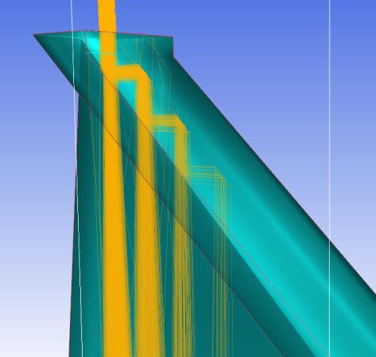
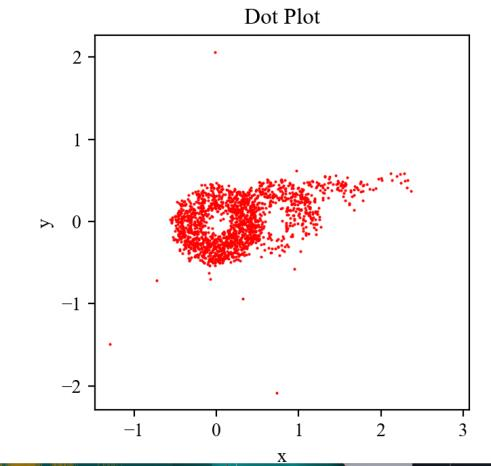

7.26 Example — Tel 2M Atmospheric-Refraction Corrector
======================================================

PDF section 7.26. Source script:
``KrakenOS/Examples/Examp_Tel_2M_Atmospheric_Refraction_Corrector_Static.py``.

End-to-end demonstration of the AstroAtmosphere integration in
:doc:`../pupilcalc_tool`: three wavelength groups are traced through the
telescope; their spot centroids drift apart by tens of micrometres at the
focal plane because of atmospheric dispersion, and a corrector element is
added to compensate.

The 2021 manual referred to a single
*Examp-Tel_2M_Atmospheric_Refraction.py*; the current repo splits it into
``..._Corrector_Static.py`` and ``..._Corrector_Adaptable.py``.

   Figure 33a.

   Figure 33b.

   Figure 33c.

   Figure 33d.

.. literalinclude:: ../../../../KrakenOS/Examples/Examp_Tel_2M_Atmospheric_Refraction_Corrector_Static.py
   :language: python
