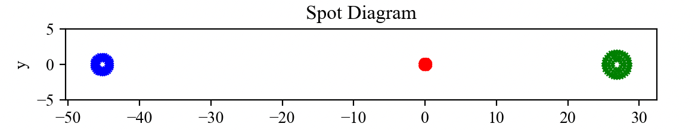
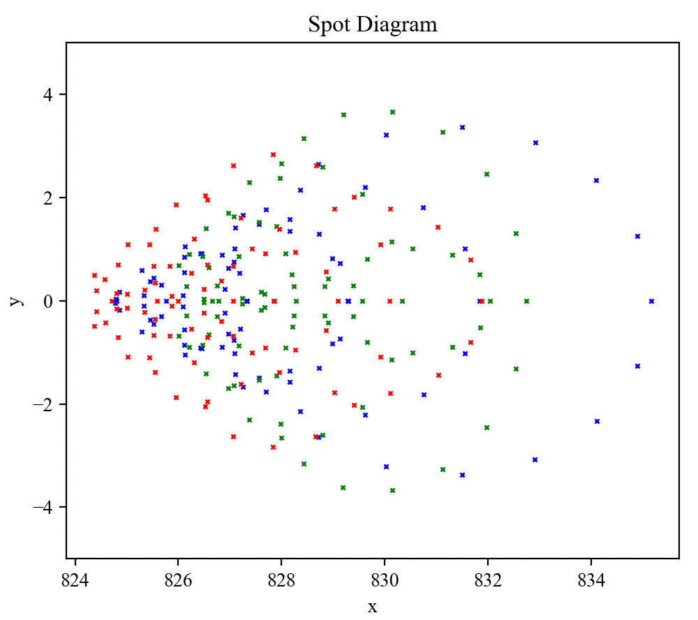

7.27 Example — ExtraShape Micro Lens Array
==========================================

PDF section 7.27. Source script: ``KrakenOS/Examples/Examp_ExtraShape_Micro_Lens_Array.py``.

Uses ``surf.ExtraData = [f, coef]`` (see :ref:`tbl-surf-class`) to attach a
user-defined sagitta function that tiles the surface into a periodic grid
of micro-lenses. The function in the script is the same template the
manual prints in Section 2.

   Figure 34a. Micro-lens-array sag map.

   Figure 34b. Ray trace through the micro-lens array.

.. literalinclude:: ../../../../KrakenOS/Examples/Examp_ExtraShape_Micro_Lens_Array.py
   :language: python
