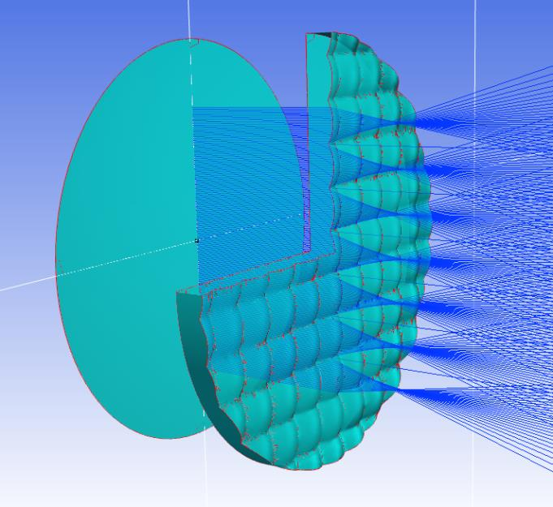

7.28 Example — ExtraShape Radial Sine
=====================================

PDF section 7.28. Source script: ``KrakenOS/Examples/Examp_ExtraShape_Radial_Sine.py``.

Another ``ExtraData`` example: the sagitta is a radial sine wave layered
on top of a base curvature, producing a concentric-ring zone-plate-like
phase profile.

   Figure 35. Radial-sine surface and ray trace.

.. literalinclude:: ../../../../KrakenOS/Examples/Examp_ExtraShape_Radial_Sine.py
   :language: python
