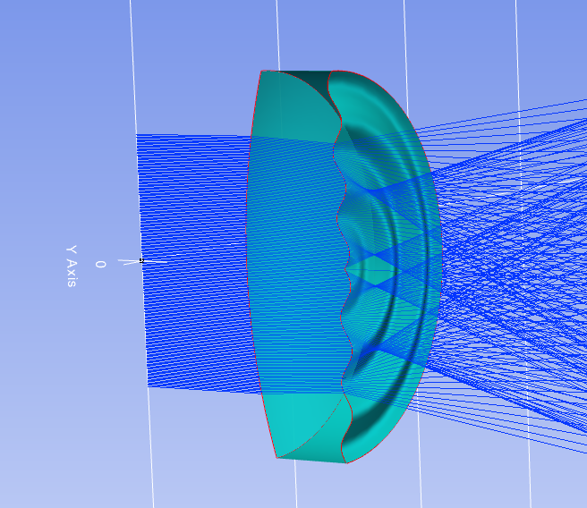

7.29 Example — ExtraShape XY Cosines
====================================

PDF section 7.29. Source script: ``KrakenOS/Examples/Examp_ExtraShape_XY_Cosines.py``.

Builds a surface whose sagitta is the product of two cosines in X and Y —
a checkerboard-like phase profile — via ``ExtraData``.

   Figure 36. XY-cosines surface and ray trace.

.. literalinclude:: ../../../../KrakenOS/Examples/Examp_ExtraShape_XY_Cosines.py
   :language: python
