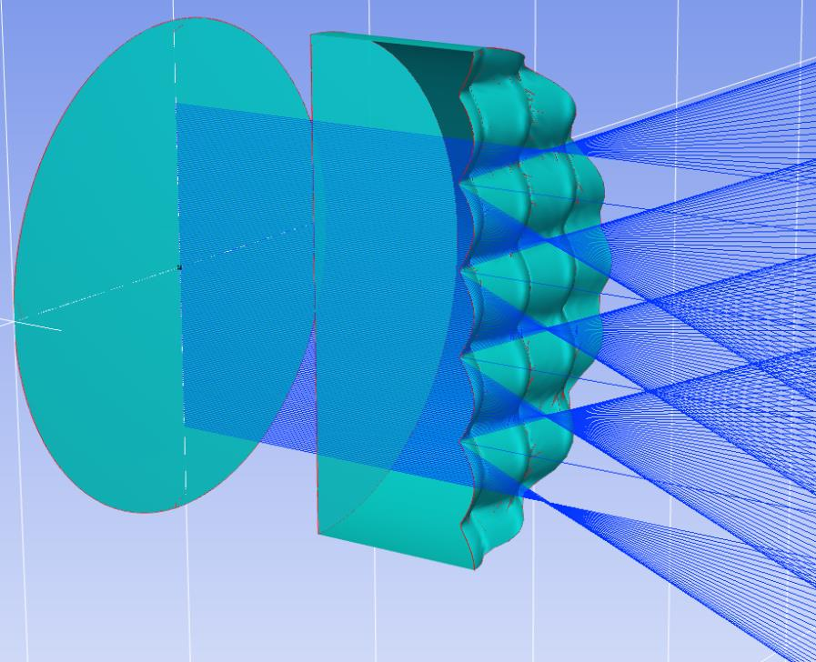

7.30 Example — MultiCore
========================

PDF section 7.30.

.. note::

   The standalone *Examp-MultiCore.py* script from the 2021 PDF is no
   longer in ``KrakenOS/Examples/``. The current example that exercises
   multi-source parallel illumination is
   ``KrakenOS/Examples/Examp_Multi_Source_Illumination.py`` — it is not a
   direct port, but it covers the same use case of distributing many ray
   bundles across independent workers.

The original example demonstrates dispatching a large ray-tracing run
across multiple CPU cores via Python's ``multiprocessing``, splitting the
ray fan into per-worker chunks and merging the resulting ``raykeeper``
contents.

   Figure 37. MultiCore parallel ray trace.

.. literalinclude:: ../../../../KrakenOS/Examples/Examp_Multi_Source_Illumination.py
   :language: python
