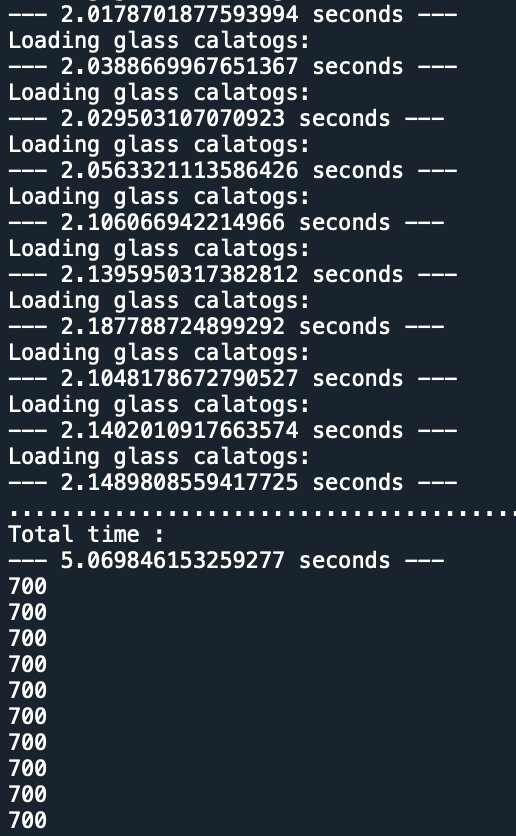

7.31 Example — Solid Objects STL Array
======================================

PDF section 7.31. Source script: ``KrakenOS/Examples/Examp_Solid_Object_STL_ARRAY.py``.

Loads an STL mesh and instantiates an array of copies through the
``Solid_3d_stl`` surface attribute. Useful for assemblies of identical
mechanical parts (mount features, baffles) or arrayed optics.

   Figure 38. STL-defined solid objects arrayed in the scene.

.. literalinclude:: ../../../../KrakenOS/Examples/Examp_Solid_Object_STL_ARRAY.py
   :language: python
