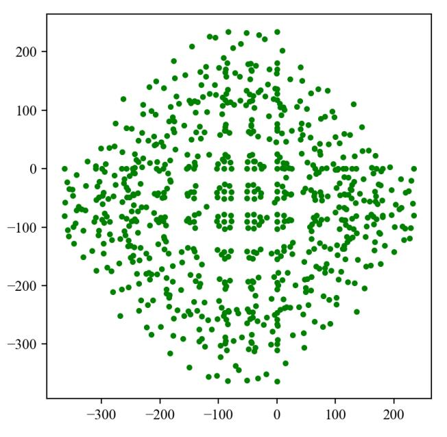
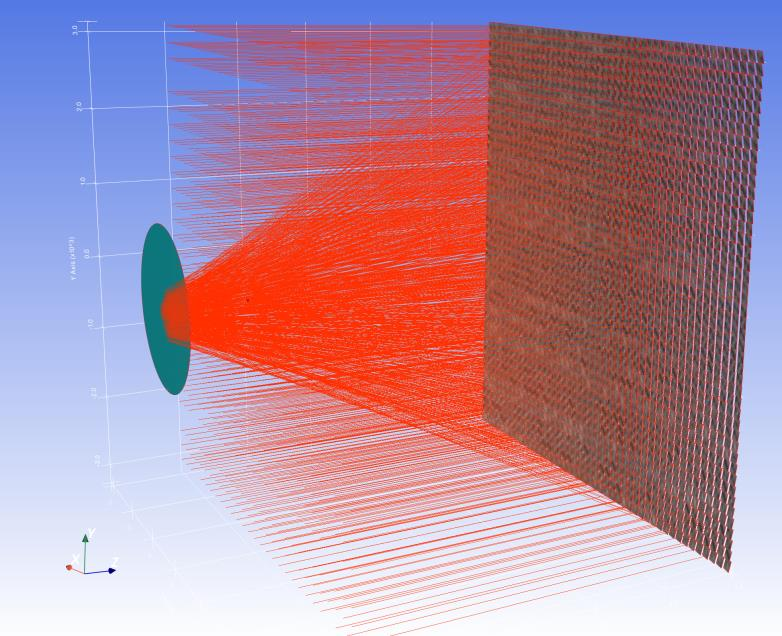
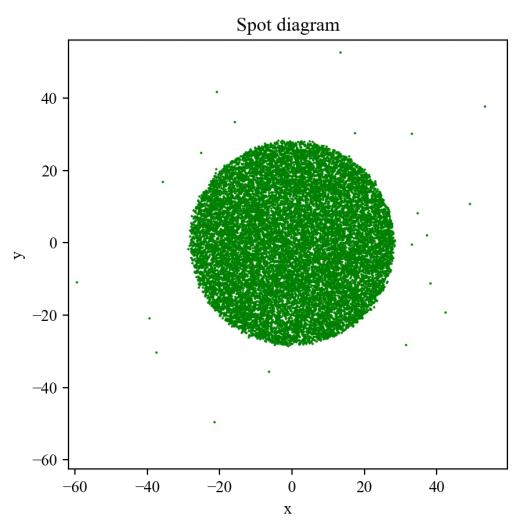
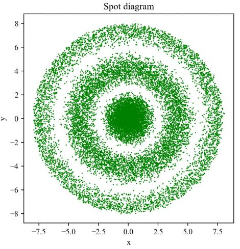
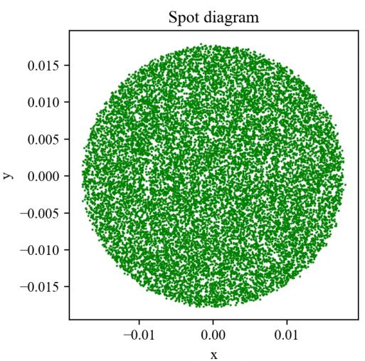
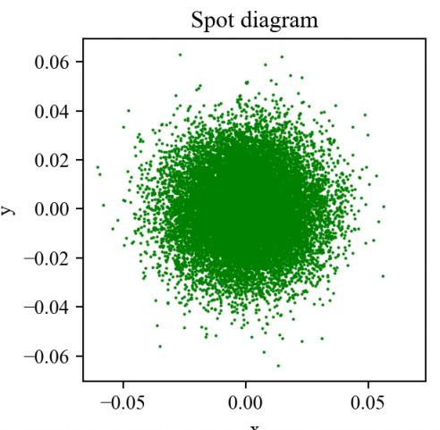

7.32 Example — Source Distribution Function
===========================================

PDF section 7.32. Source script: ``KrakenOS/Examples/Examp_Source_Distribution_Function.py``.

Final example of the appendix: defines a custom source-distribution
function that produces ray origins and directions according to a
user-specified spatial/angular probability distribution. Useful for
modelling extended sources, LED emitters or speckle distributions.

The script ends with several 3D viewer panels showing the source samples,
the rays as they leave the source, and the resulting irradiance on the
detector.

   Figure 39a.

   Figure 39b.

   Figure 39c.

   Figure 39d.

   Figure 39e.

   Figure 39f.

.. literalinclude:: ../../../../KrakenOS/Examples/Examp_Source_Distribution_Function.py
   :language: python
