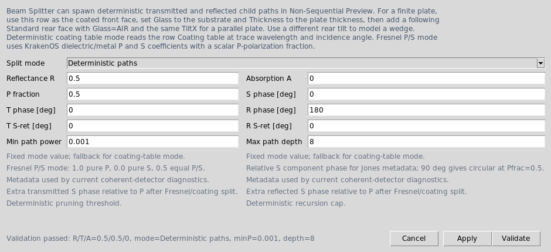
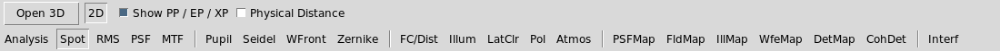

Beam Splitters
==============

The UI now has a ``Beam Splitter`` surface type. It is a first UI/core bridge
for splitters with deterministic non-sequential child paths.

Terminology
-----------

The visible UI uses one workflow term: ``Path``. A path is the editable physical
ray segment between optical graph nodes such as source, beam splitter, mirror,
another beam splitter, or detector. This is the term used by plot labels, table
badges, ``Path view``, right-click assignment menus, and detector
placement helpers.

KrakenOS internals still use ``branch`` field names for traced child rays:
``BRANCH_ID``, ``PARENT_BRANCH_ID``, ``BRANCH_PATH``, and related CSV columns.
Those are trace metadata names, not the user-facing grouping term. Saved UI
metadata also keeps legacy-compatible keys such as ``arm_role``, ``leg_id``,
``branch_selector``, and ``arm_distance``; the editor displays and documents
them as path role, path ID, split selector, and path distance.

Current capability
------------------

``Beam Splitter`` rows store a ``BeamSplitter`` metadata dictionary. Fixed
deterministic mode automatically writes a KrakenOS
``Coating = [R, A, W, THETA]`` fallback table. ``Deterministic coating table``
mode instead preserves and reads the row coating table at the traced wavelength
and incidence angle. ``Deterministic Fresnel P/S`` mode uses KrakenOS core
Fresnel P and S coefficients with a scalar P-polarization fraction and stores
normalized local Jones amplitudes plus a global branch polarization vector.
All deterministic modes can also apply simple transmitted/reflected S-vs-P
retardance controls through ``transmit_s_phase_deg`` and
``reflect_s_phase_deg``.
With ``Non-Sequential Preview``,
deterministic modes spawn both child paths from each splitter hit:

* transmitted path with ``T = 1 - R - A``
* reflected path with ``R``
* branch metadata in ``raykeeper.BRANCH_ID``, ``PARENT_BRANCH_ID``,
  ``BRANCH_POWER``, ``BRANCH_PHASE``, ``BRANCH_LABEL``, and ``BRANCH_PATH``
* branch polarization metadata in ``BRANCH_JONES_P``, ``BRANCH_JONES_S``, and
  ``BRANCH_POLARIZATION_XYZ``
* launch metadata in ``SOURCE_RAY``, ``SOURCE_XYZ``, ``SOURCE_LMN``,
  ``SOURCE_MODEL``, ``SOURCE_POWER``, ``SOURCE_WEIGHT``, and
  ``SOURCE_WAVELENGTH``

``Monte Carlo coating split`` remains available for legacy one-path stochastic
coating experiments. Use a deterministic mode for normal beam-splitter design.

Split modes
-----------

.. list-table::
   :header-rows: 1

   * - Mode
     - Path power source
     - Use when
   * - ``Deterministic paths``
     - ``Reflectance R`` and ``Absorption A`` in the beam-splitter settings.
       Transmission is ``1 - R - A``.
     - You want an ideal/fixed ratio such as 50/50 independent of angle and
       wavelength.
   * - ``Deterministic coating table``
     - Interpolated row ``Coating = [R, A, W, THETA]`` at the current trace
       wavelength and incidence angle. The fixed ``R``/``A`` fields are only
       fallback values if no valid coating table exists.
     - You want path power to follow coating data from the Coating dialog or
       a saved Python layout.
   * - ``Deterministic Fresnel P/S``
     - KrakenOS Fresnel ``RP``, ``RS``, ``TP``, and ``TS`` coefficients at the
       splitter hit, weighted by ``Polarization P fraction``. ``1`` is pure P,
       ``0`` is pure S, and ``0.5`` is an equal P/S input. ``S phase [deg]``
       sets the input relative Jones phase of the S component. ``T S-ret
       [deg]`` and ``R S-ret [deg]`` add output S phase relative to P on the
       transmitted and reflected child paths.
     - You want angle/material-dependent dielectric or metal Fresnel path
       power plus detector coherent sums that include P/S polarization overlap.
   * - ``Monte Carlo coating split``
     - The legacy stochastic one-path coating probability.
     - You are reproducing old non-sequential coating experiments rather than
       designing both splitter paths at once.

UI workflow
-----------

1. Load ``Common Optical Layout -> Beam Splitter 50/50 Example``.
2. Select the splitter row, or change an ordinary row's surface type to
   ``Beam Splitter``.
3. Right-click the row and choose ``Beam splitter settings...``.
4. Set ``Reflectance R`` and ``Absorption A``. Transmission is
   ``T = 1 - R - A``. If you select ``Deterministic coating table``, open
   ``Coating...`` on the same row and enter a valid ``[R, A, W, THETA]`` table;
   ``Reflectance R`` and ``Absorption A`` become fallback values.
5. If you select ``Deterministic Fresnel P/S``, set ``P fraction`` to ``1`` for
   pure P polarization, ``0`` for pure S polarization, or ``0.5`` for equal
   P/S amplitude. Set ``S phase [deg]`` if the source is elliptical or circular
   in the splitter's local P/S basis. Set ``T S-ret [deg]`` or ``R S-ret
   [deg]`` to model a simple coating phase delay of S relative to P on the
   corresponding output path. The fixed ``Reflectance R`` and ``Absorption
   A`` values are fallback values if Fresnel inputs are unavailable.

   The beam-splitter settings dialog controls deterministic path splitting,
   Fresnel P/S input, output retardance, and recursion limits.

6. Use a physical source such as ``Collimated disk source`` or
   ``Gaussian beam``. With a physical source, beam splitter, off-axis geometry,
   target surface, or non-sequential coating-probability request, ``Auto``
   scene trace resolves to ``Non-Sequential Preview``; explicit
   ``Non-Sequential Preview`` is still available. ``Source X/Y/Z`` set the
   physical launch origin, and ``Source L/M/N`` set the normalized chief-ray
   direction. In this mode the ``Object`` row is a scene/reference datum, not
   the source of the launched rays.
7. Leave ``NS probabilistic coating split`` off for deterministic splitters.
8. For a finite plate, set the splitter row ``Glass`` to the substrate, set
   ``Thickness`` to the plate thickness, and add a following ``Standard`` row
   with ``Glass=AIR`` as the rear face. In the editable UI table, use the same
   rear ``TiltX`` as the front face for a parallel plate; use a different rear
   tilt to model a wedge.
9. Right-click any grouped element and use ``Element settings...`` or
   ``Path role`` to mark it as ``Common``, ``Transmit``, ``Reflect``, or
   ``Detector``. The first ``#`` cell shows a compact path-role badge such as
   ``T`` or ``R`` on the first row of the element.
10. Right-click a ``Beam Splitter`` row and choose
    ``Add detector to transmitted path...`` or
    ``Add detector to reflected path...`` to insert a detector plane at a
    distance measured along that central path.
11. Use the table toolbar ``Path view`` dropdown when you want to show the
    full layout or isolate one discovered path. Row numbers remain KrakenOS
    surface indices even when the table is filtered.
12. Click ``Update`` and inspect paths with ``Actions -> Ray Inspector``,
    ``Actions -> Trace Path Inspector``, and
    ``Actions -> Non-Sequential Scene Graph``.

   ``Path view`` filters the table and plot to the full layout or one traced
   path after ``Update`` discovers deterministic splitter paths.

The ``Beam Splitter 50/50 Example`` uses an exact-count collimated disk source.
Each launched source ray creates transmitted and reflected trace records, so
the Ray Inspector can show the source-ray index, path power, and launch
metadata for each child path.

``BRANCH_LABEL`` is the local leaf label, such as ``transmit`` or ``reflect``.
``BRANCH_PATH`` is the cumulative traced splitter path, for example
``S1:BS1/transmit -> S4:BS2/reflect``. Use ``BRANCH_PATH`` for cascaded
splitters, return paths, and future recombination diagnostics.

For small ray counts, the collimated and Gaussian physical source previews use
equal-spaced meridional samples inside the requested radius. The outer preview
rays are kept conservatively inside the source edge, which avoids accidental
path loss on tilted finite plates whose projected clear aperture is smaller
than their nominal diameter. Larger source bundles switch to deterministic
golden-angle disk filling so the 3-D source footprint is represented.

``Ray count`` is the number of launched source rays, not the final number of
drawn paths. A deterministic 50/50 splitter therefore produces up to
``2 * ray_count`` displayed child paths: one transmitted and one reflected path
per source ray. If a finite aperture clips one path, the Ray Inspector will show
fewer child records for that path.

Path workflow tutorial
----------------------

Use this workflow when you want to build a first two-path splitter layout without
manually calculating the reflected detector pose.

1. Start the editor and press ``Reset`` if the table is not empty.
2. Load ``Common Optical Layout -> Beam Splitter 50/50 Example``.
3. In ``Source Field``, choose ``Collimated disk source`` for ray-bundle
   debugging or ``Gaussian beam`` for a laser-style source.
4. Set ``Ray count`` to the number of launched source rays you want. With a
   deterministic splitter, each unclipped input ray can produce one transmitted
   child and one reflected child.
5. Right-click the ``50/50 coated front face`` row and choose
   ``Beam splitter settings...``. Confirm ``Reflectance R = 0.5``,
   ``Absorption A = 0``, and deterministic splitting.
6. Right-click the same front-face row and choose
   ``Add component to transmitted path...``. Select ``Detector plane``,
   ``Aperture stop``, ``Thin lens``, ``Refractive surface``, ``Mirror``, or
   ``Object Target``, enter the distance from the splitter and clear diameter,
   then press ``Insert``. The older ``Add detector to transmitted path...``
   shortcut opens the same dialog with ``Detector plane`` preselected.
7. Right-click the front-face row again and choose
   ``Add component to reflected path...`` or ``Add detector to reflected
   path...``. Enter the reflected-path distance and component parameters, then
   press ``Insert``.
8. Click ``Update``. The 2-D/3-D plots should show source rays forking into the
   transmitted and reflected paths, subject to finite-aperture clipping. The
   2-D plot labels discovered paths directly on representative rays as
   ``Path 1``, ``Path 2``, and so on.
   Use the ``Show labels`` checkbox above the 2-D plot to hide these labels
   when dense sources, such as imported LED ray files, generate many sampled
   ray histories.
   Use the adjacent ``Rays`` selector to switch between every traced ray,
   detector-hit rays, and representative non-primary beam-splitter paths.
9. Use ``Path view -> Path 1: ...`` style entries to filter the table and 2-D
   plot to one discovered path.
10. For a nested/cascaded splitter path, choose the traced ``Path view`` entry
    and use ``Actions -> Add Component to Current Path View...``. The helper
    derives the component frame from the latest traced ``BRANCH_PATH`` segment
    instead of assuming the nominal global ``+Z`` input ray.
11. To insert a real Edmund/Thorlabs catalog lens on a traced path, keep the
    traced ``Path view`` selected and use ``Insert -> Stock Lens to Current
    Path View...`` or ``Actions -> Add Stock Lens to Current Path View...``.
    The catalog importer adds a ``Path distance`` field and writes the chosen
    stock lens as one rigid multi-row element on that path frame.
    The same dialog also exposes local X/Y offsets and local X/Y/Z tilts, so
    the block can be nudged or tipped in the selected branch frame without
    calculating global table values.
12. Open ``Actions -> Ray Inspector``. The path rows should show matching
    ``source_ray`` values, split labels such as ``transmit`` and ``reflect``,
    and path powers derived from the splitter settings.

The path-component helper inserts a native KrakenOS row before ``Image`` and
tags it with ``Element`` metadata. The component mapping is:

.. list-table::
   :header-rows: 1

   * - Dialog component
     - Table row created
     - Parameter meaning
   * - ``Detector plane``
     - ``Standard`` / ``AIR``
     - No extra parameter. Tagged as ``arm_role=Detector`` for detector analyses.
   * - ``Aperture stop``
     - ``Aperture`` / ``AIR``
     - No extra parameter. Diameter is the clear stop.
   * - ``Thin lens``
     - ``Thin Lens`` / ``AIR``
     - Focal length in millimetres, stored in the table ``Rc`` column because the runtime builder maps ``Rc`` to KrakenOS ``Thin_Lens``.
   * - ``Refractive surface``
     - ``Standard`` / selected glass
     - Radius of curvature in millimetres. Add a second surface if you need a finite-thickness singlet.
   * - ``Mirror``
     - ``Mirror`` / ``MIRROR``
     - Mirror radius in millimetres; ``0`` means flat.
   * - ``Object Target``
     - ``Object Target`` / internal ``MIRROR`` proxy
     - Semantic object-location row for source/object split fixtures. It returns one specular proxy ray.
   * - ``Diffuse Object``
     - ``Diffuse Object`` / internal ``MIRROR`` with ``DiffuseScatter`` metadata
     - Lambertian object-scatter row. It spawns deterministic ``scatterNN`` branches in non-sequential tracing.

Example metadata for a reflected-path detector row:

.. code-block:: python

   {
       "element_id": "Reflect_detector",
       "element_name": "Reflect detector",
       "arm_role": "Detector",
       "parent_splitter": "Splitter",
       "branch_selector": "reflect",
       "branch_path": "",
       "arm_distance": 60.0,
       "local_decenter_x": 2.5,
       "local_decenter_y": -1.25,
       "local_tilt_x": 4.0,
       "local_tilt_y": -2.0,
       "local_tilt_z": 7.0,
       "path_component_type": "Detector plane",
   }

``local_decenter_x`` and ``local_decenter_y`` are transverse offsets in the
selected branch frame. ``local_tilt_x``, ``local_tilt_y``, and
``local_tilt_z`` are applied relative to the branch-aligned surface frame
before the UI writes global ``TiltX/Y/Z`` values to the table.

For splitter-row context-menu placement, the helper uses the selected splitter
surface normal and the nominal incoming global ``+Z`` ray. This is correct for
the supplied straight-input beam-splitter examples. For nested/cascaded paths,
first click ``Update``, choose a traced ``Path view`` entry, then use
``Actions -> Add Component to Current Path View...``. That helper derives the
origin and direction from the latest traced ``BRANCH_PATH`` ray segment,
places the component at the requested distance from the last splitter hit, and
saves exact ``branch_path`` metadata such as:

.. code-block:: python

   {
       "element_id": "Path_TR_detector",
       "element_name": "Path TR detector",
       "arm_role": "Detector",
       "parent_splitter": "BS1 transmit -> BS2 reflect",
       "branch_selector": "reflect",
       "branch_path": "S1:BS1/transmit -> S4:BS2/reflect",
       "arm_distance": 20.0,
       "path_component_type": "Detector plane",
       "path_frame_source": "traced_branch_path",
   }

The traced-path helper covers arbitrary traced splitter-to-splitter or return
paths after ``Update``. The stock-lens path importer uses the same traced frame
and keeps every imported catalog surface in one element block. It preserves the
catalog row spacing through ``path_component_axial_offset`` metadata and writes
global ``TiltX/Y/Z`` plus ``DespX/Y/Z`` values for each row so the block sits
on the selected path without manually calculating pose.

Example metadata added to every stock-lens row placed on a traced path:

.. code-block:: python

   {
       "element_id": "Path_TT_08068",
       "element_name": "Path TT 08068",
       "arm_role": "Transmit",
       "branch_selector": "transmit",
       "branch_path": "S4:BS1/transmit -> S8:BS2/transmit",
       "arm_distance": 35.0,
       "path_component_type": "Stock lens block",
       "path_component_part": "08068",
       "path_component_row_count": 2,
       "path_component_axial_offset": 3.21,
       "local_decenter_x": 1.5,
       "local_decenter_y": -2.0,
       "local_tilt_x": 3.0,
       "local_tilt_y": 0.5,
       "local_tilt_z": -1.0,
       "path_frame_source": "traced_branch_path",
   }

To adjust a placed path element later, select the element block, right-click,
and choose ``Geometry -> Edit path-local pose...``. The dialog edits
``Path distance``, ``Local X/Y offset``, and ``Local tilt X/Y/Z`` in the same
branch-local frame used at insertion time, then rewrites the global
``TiltX/Y/Z`` and ``DespX/Y/Z`` table cells. For traced ``BRANCH_PATH`` rows,
click ``Update`` first so the latest traced segment is available. The same
repose helper is also used when ``Element settings...`` is applied to a placed
path element, so saved path-component metadata is not lost.

When any numbered ``Path view`` is active, the editable table presents those
same path-local fields directly for path-placed components:

.. list-table::
   :header-rows: 1

   * - Table column in ``Path view``
     - Meaning for path-placed rows
   * - ``Local TiltX/Y/Z``
     - Surface tilt relative to the selected branch frame.
   * - ``Local X`` and ``Local Y``
     - Transverse decenter in the selected branch frame.
   * - ``Path Dist``
     - Longitudinal distance along the selected branch from the splitter or
       traced path-frame origin.

``Path view -> All paths`` switches back to the canonical global ``Tilt`` and
``Desp`` columns. Only rows inserted by the path-component or path stock-lens
helpers use the virtual local columns; manually grouped/assigned rows keep
their normal global table values.

The Python example
``KrakenOS/Examples/Examp_Phase6_Path_Component_Placement.py`` shows the same
helper calculations headlessly and prints the generated Tilt/Decenter rows.

Two-path doublet example
------------------------

Load ``Common Optical Layout -> Beam Splitter Two Path Doublets`` for a complete
example where one cemented doublet is placed after the transmitted path and a
second cemented doublet is placed after the reflected path.

The row structure is:

1. ``Object`` is a global reference plane; the Source panel launches the
   physical source bundle.
2. ``Splitter`` rows model the tilted 3 mm BK7 50/50 plate.
3. ``Transmit doublet`` rows are centered on the transmitted chief ray after
   the plate exit offset.
4. ``Transmit path detector`` receives the transmitted path after that
   doublet.
5. ``Reflect doublet`` rows are tilted so their local ``+Z`` axis follows the
   reflected ``+Y`` path.
6. ``Reflect path detector`` receives the reflected path after that doublet.
7. ``Image`` remains a global diagnostic surface at the end of the canonical
   KrakenOS table.

The important pattern is the saved ``Element`` metadata. The transmitted
doublet rows use:

.. code-block:: python

   {
       "element_id": "TX_DBL",
       "element_name": "Transmit doublet",
       "arm_role": "Transmit",
       "parent_splitter": "BS1",
       "branch_selector": "transmit",
       "arm_distance": 33.0,
   }

The reflected doublet rows use the same pattern with ``arm_role="Reflect"``
and ``branch_selector="reflect"``. The reflected surfaces also use
``tilt_x=-90`` plus global decenter values so their physical surface normals
point along the reflected path. KrakenOS still traces against those physical
surface poses; the metadata is for path labels, focus selection, grouping, and
future path-workbench editing.

Manual path assignment
----------------------

Use manual path assignment when you add or import components surface-by-surface:

1. Select contiguous rows that form one optical component.
2. Right-click the first ``#`` cell and choose ``Group as Element`` if the rows
   are not already grouped.
3. Right-click the grouped element and choose ``Path role -> Assign to
   Transmit path`` or ``Path role -> Assign to Reflect path``.
4. Open ``Element settings...`` if you need to set the parent splitter,
   split selector, path distance, or path-local offsets for documentation and
   future analysis.
5. Use ``Move Up`` or ``Move Down`` to reorder the element within the same path.

The path assignment metadata does not force ray routing. KrakenOS still traces
against actual geometry. The metadata is used by the editor for grouping,
selection, row movement, saved-layout documentation, and path-aware analysis.
The table currently focuses path rows by selecting and scrolling to them rather
than hiding all other rows. This preserves the KrakenOS surface-index mapping
while the virtual path-workbench table remains a metadata layer on top of the
canonical KrakenOS surface list.

Path Workbench workflow
-----------------------

The intended beam-splitter workflow is:

1. Author the common path first: source, object/reference, pre-splitter optics,
   and the first splitter.
2. Click ``Update``. The editor traces deterministic paths and discovers path
   families.
3. The 2-D plot labels discovered paths as ``Path 1``, ``Path 2``, ``Path 3``,
   and so on, with each label anchored to a representative ray. For nested
   splitters, the stable internal identity remains a ``BRANCH_PATH`` value such as
   ``BS1/transmit -> BS2/reflect``.
   ``Show labels`` controls whether these plot annotations are drawn. Dense
   imported ray sources may create more traced histories than the logical
   splitter ports, so disable labels when the plot needs to show ray geometry
   rather than branch diagnostics.
   The ``Rays`` selector is independent of labels.  ``Beam-splitter paths``
   hides direct primary source rays and draws representative splitter paths,
   which is often the readable view for LED rayfiles and cascaded splitters.
4. Use ``Path view -> All paths`` to show the full global layout and full
   canonical table.
5. Use ``Path view -> Path 1: ...`` or another numbered path to filter the 2-D
   plot and editable table to the common path plus that path's surfaces and
   traced rays.
6. Use the beam-splitter row context menu to insert first-class path components
   when the selected path starts at that splitter. The helper computes the
   global row pose and saves path-local metadata.
7. For arbitrary traced ``BRANCH_PATH`` values, keep the Path view selected and
   use ``Actions -> Add Component to Current Path View...``. Edits still map
   back to real KrakenOS surface indices; the global surface list remains the
   canonical trace geometry.
8. To move or tip an already-placed path component, select its colored element
   block, right-click, and use ``Geometry -> Edit path-local pose...``. This is
   the safe workflow for nudging a detector, aperture, mirror, or stock lens
   along a branch without manually solving global decenter/tilt values.
9. For path-placed rows, edit the same local values directly in the filtered
   ``Path view`` table: ``Local X/Y``, ``Local TiltX/Y/Z``, and ``Path Dist``.
   The editor immediately recomputes the canonical global row pose behind the
   scenes.

The current implementation starts this workflow with metadata-discovered
``Path view`` filtering in the 2-D plot and editable table. The table is
filtered through an internal row-index map, so the first ``#`` column still
shows the real KrakenOS surface index. Adding a new row while a path is
selected tags that row with the selected path metadata. For path-local physical
placement, use ``Add component to transmitted/reflected path...`` on the
splitter row; freehand row insertion still requires explicit decenter/tilt
values. Placed path components and stock blocks can be reposed later through
``Geometry -> Edit path-local pose...`` or by editing their local pose cells
directly while a numbered ``Path view`` is selected.

Michelson-style layouts with detector/output display metadata use the more
physical four-path convention instead: ``Path 1`` for input/source-return,
``Path 2`` for the transmitted mirror path, ``Path 3`` for the reflected mirror
path, and ``Path 4`` for the detector output path. Use those path entries when
placing components in a Michelson path because they correspond to the four
visible optical paths around the splitter, not to individual ``T/R`` branch
histories.

Separate source and object status
---------------------------------

The splitter implementation now separates illumination rays from the
object/field concept for physical sources. ``Collimated disk source``,
``Gaussian beam``, and the random SourceRnd modes launch from the Source panel
origin and direction:

* ``Source X/Y/Z``: physical source origin in millimetres
* ``Source L/M/N``: chief-ray direction cosines; the UI normalizes them
* ``Ray count``: launched source rays before deterministic path splitting

When one of these physical source modes is selected, sequential object/field
inputs that no longer apply are hidden. The ``Object``
surface remains in the KrakenOS table as a reference plane and part of the
global scene geometry, but it is not the ray launch source. This is the current
source/object split.

The UI is still not a full non-sequential scene editor with independent
``Source`` and ``Object`` nodes placed on different paths. That requires a
virtual path-workbench layer: the global KrakenOS surface list remains the
canonical trace geometry, while each path view presents only the components on
one path and maps edits back to their real surface indices.

For cascading splitters, use the same rule manually: assign each path element
to a parent splitter and split selector in ``Element settings...``. The editor
will number each traced ``BRANCH_PATH`` as a ``Path #`` after ``Update`` and
will still associate saved element metadata with matching trace paths. This
means a bare splitter can expose ``Path 1`` / ``Path 2`` from actual traced rays
before downstream components have been assigned. For physical placement on one
of those traced paths, choose that ``Path view`` entry and run
``Actions -> Add Component to Current Path View...``.

Right-angle illumination example
~~~~~~~~~~~~~~~~~~~~~~~~~~~~~~~~

Load ``Layouts -> Beam Splitters / Folds -> Right-Angle Beam-Splitter
Illumination`` for the first explicit source/object split fixture:

* ``S0 Object reference`` stays in the table as reference geometry. It is not
  the illumination emitter.
* ``Source 1`` is a physical collimated disk at ``(0, -80, 45) mm`` with
  direction ``(0, 1, 0)``.
* The source direction is therefore 90 degrees to the object/reference ``+Z``
  axis.
* The 45 degree deterministic splitter first reflects the side illumination
  branch toward the left-side ``Object Target`` on ``-Z``.
* ``Object Target`` is a semantic UI surface type. It traces as a specular
  reflective proxy so this fixture can keep one readable return ray from the
  object location.
* The object-target proxy reflects the return ray back to the splitter. The
  transmitted return branch then passes through a clear aperture and reaches
  the right-side final camera/Image row on ``+Z``.
* The first-pass side transmitted branch and the object-return reflected branch
  remain separate rejected paths and do not terminate on the camera.

The object row is still a reference plane, not the emitter. Use ``Diffuse
Object`` instead of ``Object Target`` when the object should spawn Lambertian
scatter branches. Full measured-BRDF/pySCATMECH support remains future work.

The standalone script is:

.. code-block:: bash

   python KrakenOS/Examples/Examp_Right_Angle_Beam_Splitter_Illumination.py

The regression fixture is:

.. code-block:: bash

   python -m KrakenOS.UI.validate_source_object_split

Michelson detector/interferogram workflow
-----------------------------------------

Load ``Common Optical Layout -> Michelson Interferometer (Interferogram)`` for the
first Michelson-style geometry diagnostic. It uses an independent collimated
disk source at ``(0, 0, 0)`` with direction ``(0, 0, 1)``, a 45 degree
deterministic 50/50 splitter, one mirror in the transmitted path, and one mirror
in the reflected path. The returning rays hit the splitter a second time and
produce four ray-only output-port paths:

* transmit then transmit
* transmit then reflect
* reflect then transmit
* reflect then reflect

The splitter station is now modeled as an Edmund Optics 68551 25 mm cube
beam-splitter primitive. The editable table contains cube entrance/transmit
exit/reflect exit reference faces plus the internal 45 degree ``Beam Splitter``
row. The reference faces are intentionally non-refracting table faces: they make
the cube size and placement visible without using the vendor STEP mesh as an
active trace solid. Use ``attachment/68551/step_68551.step`` or
``iges_68551.igs`` through ``File -> Import Optical CAD/STL Solid...`` when you
need the mechanical CAD body for placement/export. Keep the internal
``Beam Splitter`` row for actual split ratio, phase, and polarization physics,
because vendor CAD does not encode that optical prescription.

The preset is useful for checking geometry, path labels, source/object split,
branch ancestry, power, phase metadata, and the first-order detector
interferogram. Use ``Actions -> Ray Inspector`` or ``Actions -> Trace Path
Inspector`` after ``Update`` to inspect the trace paths. In the 2-D plot, the
four second-pass branch histories are clustered onto the two geometric output
ports: ``T -> T`` and ``R -> R`` leave through one port, while ``T -> R`` and
``R -> T`` leave through the detector output port. In the supplied Y/Z
schematic that detector port is drawn below the splitter, opposite the
reflected return mirror path. The source-return histories, ``T -> T`` and
``R -> R``, are drawn back toward the input/reference side. These display
locations are stored in the final ``Image`` row's ``advanced["Display2D"]``
metadata so the schematic shows the logical Michelson paths even when the raw
non-sequential terminal segment from KrakenOS is not yet a full two-sided
beam-splitter port model.

The 2-D plot labels the four physical Michelson paths, not every directed
branch-history segment. This is the convention used by the editable table's
``Path view`` entries for this preset:

* ``Path 1: Input / source return``: source-to-splitter plus the source-return
  port.
* ``Path 2: Transmit mirror path``: splitter-to-transmit-mirror and the return
  path from that mirror back to the splitter.
* ``Path 3: Reflect mirror path``: splitter-to-reflect-mirror and the return path
  from that mirror back to the splitter.
* ``Path 4: Detector output path``: splitter-to-detector output port.

Use ``Path view -> Path 2: Transmit mirror path`` or another path entry when
adding or inspecting components in one physical Michelson path. The table still
stores one canonical KrakenOS surface list underneath; the path view filters
that list to the common splitter path plus rows tagged to the selected path.

In Michelson-path layouts, the first ``#`` column also shows the path badge for
each row: ``P1`` for the input/source-return path, ``P2`` for the transmitted
mirror path, ``P3`` for the reflected mirror path, and ``P4`` for the detector
output path. These badges are row metadata labels, not traced branch-history
codes. The supplied Michelson preset stores its rows in the same ``P1`` to
``P4`` order so the full table reads in path sequence.

To tag an existing arbitrary surface, select the row or contiguous group,
right-click the first ``#`` column, and use ``Path assignment -> Assign to
Path ...``. The editor will create/preserve an element group for those rows and
write the matching Michelson path metadata.

The preset includes two grouped ``Aperture`` surfaces in each path as a table
editing example. In the full ``Common`` view the rows are still one global
KrakenOS surface list, but the element metadata makes the path filters behave
as expected:

* ``Path 1 aperture pair`` is tagged ``Common`` and appears with the splitter in
  ``Path 1: Input / source return``.
* ``Path 2 aperture pair`` is tagged ``Return`` with ``branch_selector =
  "transmit"``.
* ``Path 3 aperture pair`` is tagged ``Return`` with ``branch_selector =
  "reflect"``.
* ``Path 4 aperture pair`` is tagged ``Detector``.

This is the intended manual workflow for now: switch to the path in ``Path
view``, add or group the surfaces that belong to that path, then use
``Element settings...`` if you need to inspect or correct the stored path
metadata. The orange aperture lines are intentionally simple and non-refractive;
they demonstrate component placement and can clip rays if their diameters are
made smaller than the source bundle.

The coherent interferogram still uses the recombined branch histories: ``T ->
R`` and ``R -> T`` share the detector output port, while ``T -> T`` and ``R ->
R`` share the source-return port.

The preset intentionally starts with one chief ray and compact clear apertures
so the plot reads like a Michelson schematic. Increase ``Ray count`` and
``Source radius`` only after the geometry is clear; large image/reference
diameters make KrakenOS draw longer terminal output rays and can visually
overwhelm the cavity.

To see fringes, select the ``Interf`` analysis button and click ``Update``.
With the default single-ray preset, ``Interf`` still falls back to the analytic
two-beam diagnostic so the layout reads like a Michelson schematic. Once
``Ray count`` and ``Source radius`` are increased enough that the detector port
has a meaningful occupied-bin pattern, ``Interf`` automatically reuses the same
detector-bin coherent accumulation as ``CohDet``. In that promoted mode the
displayed interferogram comes from the detector pixel field sum and its
branch-code self/pair decomposition, not from a pure path average. The
detector row stores the analysis settings in ``advanced["Interferogram"]``:

.. code-block:: python

   {
       "analysis_title": "Michelson Interferogram",
       "detector_port": "cross",        # cross: T->R with R->T; return: T->T with R->R
       "detector_size_mm": 12.0,
       "pixels": 256,
       "fringe_tilt_x_mrad": 1.5,       # set to 0 for the aligned uniform limit
       "fringe_tilt_y_mrad": 0.0,
       "opd_offset_um": 0.0,
       "visibility": 1.0,
       "gaussian_q_weighting": "auto", # auto: use branch q for Gaussian beam sources
   }

When the active Source panel uses ``Source model -> Gaussian beam`` and detector-bin promotion is
reliable, ``Interf`` also applies branch-carried Gaussian q envelope weights and
cumulative aperture/obscuration clipping before summing the detector pixels.
The annotation changes to ``Gaussian-q detector-bin coherent sum``. This uses
the same branch phase, Jones/polarization vectors, and self/pair decomposition
as ``CohDet``; it is not the old path-average fringe shortcut.

This is still not a full diffraction, higher-order mode-overlap, or thick
tilted-plate field solver. Future work still needs FFT/mode propagation and
full oblique astigmatic matrices beyond geometric detector-bin coherent sums.

Twyman-Green example
--------------------

Load ``Common Optical Layout -> Twyman-Green Interferometer (Interferogram)``
when you want the same tested return-path recombination workflow with
Twyman-Green names. The transmitted return path is tagged as the test optic
mirror, the reflected return path is tagged as the reference flat, and the
detector output path uses the same cross-port path pair, ``T -> R`` and
``R -> T``.

To use it:

1. Load the preset from ``Layouts -> Common Optical Layout``.
2. Keep ``Ray count = 1`` while checking the geometry and path labels.
3. Replace or edit the ``Test optic mirror`` row when you want to model a
   curved, decentered, or tilted test surface.
4. Select ``Interf`` and click ``Update``. Detector-bearing variants can use
   the same promoted detector-bin coherent accumulation; the current preset may
   still fall back to the analytic path-average diagnostic when no usable
   detector terminal samples are available.

The matching Python example is
``KrakenOS/Examples/Examp_Twyman_Green_Interferometer.py``. It builds the
splitter, test optic, reference flat, and detector in plain KrakenOS code,
traces the deterministic paths, and currently computes the analytic fallback
interferogram used when detector-bin promotion is not available.

Mach-Zehnder example
--------------------

Load ``Common Optical Layout -> Mach-Zehnder Interferometer (Interferogram)``
for the current Mach-Zehnder table and path-recombination diagnostic. It
includes two 50/50 beam-splitter rows, two fold-mirror rows, and two
output-detector rows. The first splitter sends one path through the transmit-path
mirror and the other through the reflect-path mirror; both paths then reach the
second splitter and leave through cross and return output ports.

The UI labels and table filters use physical paths, not branch histories:

.. list-table::
   :header-rows: 1

   * - Path
     - Meaning
   * - ``Path 1``
     - Input/source path to ``BS1``.
   * - ``Path 2``
     - ``BS1`` transmit path through the transmit-path fold mirror to ``BS2``.
   * - ``Path 3``
     - ``BS1`` reflect path through the reflect-path fold mirror to ``BS2``.
   * - ``Path 4``
     - ``BS2`` cross output path to the cross detector.
   * - ``Path 5``
     - ``BS2`` return output path to the return detector.

To place user-added optics on a Mach-Zehnder path, select the row or element
group in the first ``#`` column, right-click, and choose ``Path assignment``.
The ``Path view`` menu can then show only the chosen path plus its relevant
boundary splitter rows. Branch labels such as ``T->R`` and ``R->T`` remain
available in the Trace Path Inspector, but they are not used as the editable
table grouping because multiple branch histories can share the same physical
path.

Automatic path graph
--------------------

For beam-splitter layouts that are not one of the named interferometer
presets, the UI also builds an automatic physical-path graph after ``Update``.
The graph is derived from traced non-sequential rays:

1. Source points, beam-splitter hits, detector/terminal hits become graph
   vertices.
2. The polyline between two adjacent vertices becomes a candidate physical
   path.
3. Candidate paths are merged when they share the same endpoint vertices and
   the same intermediate surface sequence. This is why two branch histories
   can still become one editable physical path.
4. Path numbers are assigned by a traversal from the source vertex, with
   same-node branches ordered by their outgoing display angle.
5. Right-click ``Path assignment`` stores an explicit ``leg_id`` on the
   selected element group. This manual assignment wins when a future edit makes
   the automatic graph ambiguous.

This is a topology solver, not a fixed formula such as "three paths per beam
splitter". A splitter is physically a ported graph node, and cascaded or nested
splitters add edges according to the actual traced connectivity. For reliable
automatic labels, run ``Update`` after changing splitter geometry.

Select ``Interf`` and click ``Update`` to generate the Mach-Zehnder
interferogram. The diagnostic still compares the two complementary paths at the
selected detector output, but when the detector sampling is dense enough it now
uses the same detector-bin coherent accumulation as ``CohDet`` instead of the
older pure path-average shortcut. Sparse one-ray previews still fall back to
the analytic view so the geometry remains easy to read.

The matching Python example is
``KrakenOS/Examples/Examp_Mach_Zehnder_Interferometer.py``. It prints the
branch paths, surface sequence, and path powers, then computes the analytic
fallback interferogram used when detector-bin promotion is not available.

Saved metadata
--------------

Layouts store the splitter settings in the row's ``advanced`` dictionary:

.. code-block:: python

   {
       "surface": "Beam Splitter",
       "name": "50/50 coated front face",
       "diameter": 25.0,
       "tilt_x": 45.0,
       "thickness": 3.0,
       "glass": "BK7",
       "advanced": {
           "Element": {
               "element_id": "BS1",
               "element_name": "Splitter",
               "arm_role": "Common",
               "parent_splitter": "",
               "branch_selector": "",
               "arm_distance": 0.0,
               "local_decenter_x": 0.0,
               "local_decenter_y": 0.0,
               "local_tilt_x": 0.0,
               "local_tilt_y": 0.0,
               "local_tilt_z": 0.0,
           },
           "BeamSplitter": {
               "split_mode": "Deterministic paths",
               "reflectance": 0.5,
               "absorption": 0.0,
               "transmit_phase_deg": 0.0,
               "reflect_phase_deg": 180.0,
               "min_branch_power": 1e-3,
               "max_branch_depth": 8,
           }
       },
   }

``Element`` metadata is UI metadata. KrakenOS tracing remains geometry-driven;
the metadata lets the editor move elements within the same logical path and
gives future placement and analysis tools a stable path selector. If an element
is assigned to a path, ``Move Up`` and ``Move Down`` search for the previous or
next element with the same path role instead of crossing into another path.
The table ``Path view`` dropdown filters matching path elements while preserving
the surface-index mapping used by KrakenOS and by the table editors.

The loader also accepts legacy roadmap-style aliases:

.. code-block:: python

   {
       "mode": "ideal",
       "transmittance": 0.5,
       "loss": 0.0,
       "max_split_depth": 8,
   }

Those aliases normalize to ``split_mode``, ``reflectance``, ``absorption``,
and ``max_branch_depth``.

Python example
--------------

The fixed-ratio direct API example is
``KrakenOS/Examples/Examp_Beam_Splitter_50_50.py``. It builds a splitter
front surface, attaches both ``BeamSplitter`` metadata and the coating fallback,
adds a rear ``AIR`` surface for substrate exit, and uses ``NsTraceLoop`` with
``system.energy_probability = 0``.

The coating-table direct API example is
``KrakenOS/Examples/Examp_Beam_Splitter_Coating_Table.py``. It sets
``split_mode = "Deterministic coating table"`` and a coating table where
``R=0.70`` and ``A=0.05`` at ``45 deg`` and ``0.55 um``. Running it should
print reflected path power ``0.700000`` and transmitted path power
``0.250000``.

The Fresnel P/S direct API example is
``KrakenOS/Examples/Examp_Beam_Splitter_Fresnel_Polarization.py``. It sets
``split_mode = "Deterministic Fresnel P/S"`` on a finite BK7 plate and runs
the same ray for ``polarization_p_fraction = 1.0``, ``0.5``, and ``0.0``.
At 45 degrees, the printed reflected path power changes because KrakenOS
core ``RP`` and ``RS`` are different. The example also prints
``BRANCH_JONES_P``, ``BRANCH_JONES_S``, and ``BRANCH_POLARIZATION_XYZ`` so you
can see the reflected mixed input become more S-heavy and inspect the global
electric-field direction carried to downstream analysis. The final example case
sets ``reflect_s_phase_deg = 90`` to show how a coating-like reflected
retardance changes the complex S component without changing path power.

Minimal setup:

.. code-block:: python

   import KrakenOS as Kos

   splitter_settings = {
       "split_mode": "Deterministic paths",
       "reflectance": 0.5,
       "absorption": 0.0,
       "polarization_p_fraction": 0.5,
       "polarization_s_phase_deg": 0.0,
       "transmit_phase_deg": 0.0,
       "reflect_phase_deg": 180.0,
       "transmit_s_phase_deg": 0.0,
       "reflect_s_phase_deg": 0.0,
       "min_branch_power": 1e-3,
       "max_branch_depth": 8,
   }

   wavelengths = [0.45, 0.55, 0.65]
   angles = [0.0, 45.0, 70.0]
   coating = [
       [[0.5 for _w in wavelengths] for _theta in angles],
       [[0.0 for _w in wavelengths] for _theta in angles],
       wavelengths,
       angles,
   ]

   splitter = Kos.surf()
   splitter.Name = "50/50 coated front face"
   splitter.TiltX = 45.0
   splitter.Thickness = 3.0
   splitter.Diameter = 25.0
   splitter.Glass = "BK7"
   splitter.AxisMove = 0.0
   splitter.BeamSplitter = splitter_settings
   splitter.Coating = coating

   rear = Kos.surf()
   rear.Name = "BK7 plate rear face"
   rear.Thickness = 60.0
   rear.Diameter = 25.0
   rear.TiltX = 45.0
   rear.Glass = "AIR"
   rear.AxisMove = 0.0

   obj = Kos.surf()
   obj.Name = "Input reference"
   obj.Thickness = 45.0
   obj.Diameter = 30.0
   obj.Glass = "AIR"
   obj.AxisMove = 0.0

   image = Kos.surf()
   image.Name = "Large diagnostic target"
   image.Diameter = 100.0
   image.Glass = "AIR"
   image.AxisMove = 0.0

   system = Kos.system([obj, splitter, rear, image], Kos.Setup())
   system.energy_probability = 0
   system.NsLimit = 120

Internal branch data
--------------------

Each deterministic splitter hit can emit child records:

.. list-table::
   :header-rows: 1

   * - Data
     - Purpose
   * - ``branch_id`` and ``parent_branch_id``
     - Preserve trace ancestry for each reflected/transmitted child.
   * - ``branch_power``
     - Carry optical power through splitter, coating, absorption, and bulk
       transmission.
   * - ``branch_phase``
     - Preserve transmitted/reflected phase for coherent recombination.
   * - ``branch_jones_p`` and ``branch_jones_s``
     - Preserve normalized branch Jones amplitudes in the splitter-local P/S
       basis. Fresnel P/S mode updates these amplitudes from the P and S
       coefficients; scalar fixed/coating modes pass the incident Jones state
       through unchanged. ``transmit_s_phase_deg`` and
       ``reflect_s_phase_deg`` rotate the S component relative to P for the
       corresponding child path.
   * - ``branch_polarization_xyz``
     - Preserve a normalized global complex electric-field vector. Splitter
       P/S amplitudes are converted back to this vector on each child path,
       and non-split surfaces keep it transverse to the traced ray direction.
   * - ``min_branch_power``
     - Prune weak paths.
   * - ``max_branch_depth``
     - Prevent recursive splitter explosions.
   * - ``max_total_branches``
     - Hard safety cap for pathological non-sequential layouts.

The Ray Inspector, Scene Graph, Trace Path Inspector, CSV export, and path-aware
analysis controls consume these child records instead of showing one
stochastic path per launched ray.

Path throughput report
----------------------

After clicking ``Update`` on a deterministic beam-splitter layout, open
``Actions -> Path Throughput Report``. The report groups complete traced leaf
rays by output/path, selector code, trace path, and terminal surface. It sums
``branch_power * source_weight * source_power`` for each group and normalizes
against the unique launched source-ray weights, so it is useful for checking
whether transmitted/reflected outputs, detector ports, and source-return ports
carry the expected power.

The report columns are:

.. list-table::
   :header-rows: 1

   * - Column
     - Meaning
   * - ``Output / path``
     - Human-readable output group such as ``Transmit path``, ``Reflect path``,
       ``Detector output port``, or ``Source return port``.
   * - ``Code``
     - Selector history from the beam splitter path. ``T`` means transmit,
       ``R`` means reflect; ``TR`` means transmit at the first splitter and
       reflect at the second splitter.
   * - ``Terminal``
     - Last surface reached by the leaf ray. Detector rows tagged with
       ``advanced["Element"]["arm_role"] = "Detector"`` are labeled as
       detectors even when they are ``Aperture`` rows rather than the final
       global ``Image`` row.
   * - ``Power sum``
     - Sum of path power weighted by source ray weight and source power.
   * - ``Throughput``
     - ``Power sum`` divided by the unique launched source-ray input weight.
   * - ``Mean OP`` and ``Mean dist``
     - Power-weighted optical path and geometric distance for that path
       group.

Use ``Copy`` for a Markdown summary or ``Export CSV`` for downstream checking.
Use the ``Filter`` selector to limit the report to one output group, selector
code, or terminal detector/surface before copying or exporting. This is the
first path selector in the analysis workflow; later spot, PSF, MTF, and
detector-plane tools should reuse the same path identity model.

This is an incoherent throughput audit. It does not replace the current
Michelson/Twyman-Green/Mach-Zehnder ``Interf`` diagnostic and does not yet
perform detector-pixel coherent field summation.

Path-filtered detector analyses
-------------------------------

The plot controls include an ``Analysis path`` selector. After pressing
``Update`` on a deterministic beam-splitter layout, this selector is populated
from the same path identities used by ``Actions -> Path Throughput
Report``:

* ``All paths`` keeps the existing sequential Spot/RMS behavior.
* ``Output: ...`` selects all leaf rays that reach one logical output group.
* ``Code: ...`` selects one transmit/reflect selector history such as ``T``,
  ``R``, ``TR``, or ``RT``.
* ``Terminal: ...`` selects rays that terminate on one detector or surface.

To inspect one path detector spot, detector PSF/MTF, detector power map, or
first coherent detector sum:

1. Load or build a deterministic beam-splitter layout with detector rows.
2. Select ``Spot``, ``RMS``, ``PSF``, ``MTF``, ``DetMap``, or ``CohDet`` in the
   analysis mode controls.
3. Click ``Update`` once so path records exist.
4. Choose an ``Analysis path`` entry such as ``Output: Detector output
   port`` or a specific ``Terminal: S... Detector`` entry.
5. Click ``Update`` again.

   Detector and interferometer analyses are selected from the analysis toolbar
   above the plot, then regenerated with ``Update``.

Concrete DetMap examples
~~~~~~~~~~~~~~~~~~~~~~~~

The quickest presets are under ``Layouts -> Beam Splitters / Folds``:

* ``Beam Splitter Two Path Doublets`` has one detector on each splitter output.
  Select ``DetMap``, click ``Update``, choose ``Terminal: ... Transmit path
  detector`` or ``Terminal: ... Reflect path detector``, then click ``Update``
  again.
* ``Michelson Interferometer (Interferogram)`` and ``Twyman-Green
  Interferometer (Interferogram)`` share a detector output port. Select
  ``DetMap`` or ``CohDet``, click ``Update``, choose ``Output: Detector output
  port`` or the detector terminal entry, then click ``Update`` again.
* ``Mach-Zehnder Interferometer (Interferogram)`` has cross and return output
  detectors. Choose a specific detector terminal if ``All paths`` spans
  more than one terminal plane.

If the plot says no detector hits are available, the current trace did not end
on a detector row for the selected filter. Either click ``Update`` first, pick a
detector path/terminal from ``Analysis path``, or insert a detector plane on
the path you want to measure.

For path-filtered Spot/RMS, the analysis uses the terminal hit points from
the traced non-sequential preview rays. If the selected terminal has a detector
surface transform, the plot uses detector-local ``X/Y`` coordinates; otherwise
it falls back to world ``X/Y``. Marker size/color are weighted by
``branch_power * source_weight * source_power``. ``RMS`` reports a
power-weighted radius around the path centroid.

For path-filtered ``PSF`` and ``MTF``, the analysis also uses the selected
detector terminal hit cloud instead of the centered sequential pupil model.
``PSF`` builds a power-weighted detector-local histogram around the path
centroid. ``MTF`` computes a geometric detector MTF from the FFT of that
power-weighted PSF and reports tangential, sagittal, and selected reference
frequency values. These are geometric detector diagnostics for non-sequential
paths; they do not replace diffraction PSF/MTF for centered sequential
systems.

Use ``Actions -> Export Path PSF CSV...`` after ``Update`` to export the
same path-filtered PSF grid. Each row is one PSF bin and includes the path
filter, detector terminal, coordinate frame, ray count, bin count, centroid,
centered bin bounds/center, bin power, normalized power, total power, and peak
power.

Use ``Actions -> Export Path MTF CSV...`` after ``Update`` to export the
same geometric detector MTF curves. Each row is one spatial-frequency sample
and includes tangential, sagittal, and average MTF, plus the selected reference
frequency and interpolated selected-curve value used by the UI.

``DetMap`` bins the same detector-local hit coordinates into a power map. It
requires one selected terminal plane; if a filter spans multiple detector
planes, choose a more specific ``Terminal: ...`` entry. The color scale is
``Power per pixel`` and the annotation reports the selected path filter,
terminal, ray count, bin count, total binned power, and peak pixel power.
The ``Detector bins`` field in Plot Controls accepts ``Auto`` or an integer
from 4 to 512. ``Auto`` chooses a ray-count-dependent grid; a manual value is
better for regression checks or comparing two detector exports on the same
pixel grid.

Detector rows also have first-class detector settings. Right-click a detector
row and choose ``Diagnostics -> Detector settings...`` to set:

.. list-table::
   :header-rows: 1

   * - Setting
     - Meaning
   * - ``Active width`` / ``Active height``
     - Detector-local active area used by ``DetMap`` and ``CohDet``. If left at
       zero, the row diameter is used as a square active area.
   * - ``Detector bins``
     - Per-detector sampling override. Blank means use the global Plot Controls
       ``Detector bins`` value.
   * - ``Pixel pitch``
     - Metadata recorded with the detector row for future sensor/pixel models.

Path-inserted ``Detector plane`` rows are created with detector settings whose
active area matches the inserted clear diameter. DetMap and CohDet always use
the selected terminal detector's active area when detector-local coordinates
are available.

Use ``Actions -> Export Detector Map CSV...`` after ``Update`` to export the
same bins used by the plot. The CSV repeats the path filter, terminal,
coordinate frame, ray count, bin count, bin bounds, bin center, bin power,
total power, and peak power on each row so the detector map can be reconstructed
without reading the UI state.

``CohDet`` is the first ray-binned coherent detector analysis. It requires one
selected detector terminal, then bins each traced detector hit into a pixel and
accumulates a complex field
``sqrt(branch_power * source_weight * source_power) * exp(i phase)``. The phase
uses the traced optical path length, current wavelength, and ``BRANCH_PHASE``
from deterministic splitter paths. If branch polarization metadata is
available, the displayed image is the global vector sum
``|sum(Ex)|^2 + |sum(Ey)|^2 + |sum(Ez)|^2`` per detector pixel, so orthogonal
path polarization states do not interfere artificially. Use an output or
terminal filter that contains recombined path families, for example
``Output: Detector output port`` on a Michelson-style layout, otherwise the
plot is only a coherent sum of the selected one-family rays.

The detector-bin engine also decomposes the same grid into per-branch-code self
terms and complementary branch-pair interference terms. ``Interf`` now reuses
that same detector-bin accumulation whenever the selected detector output has a
reliable occupied-bin pattern; otherwise it falls back to the analytic
path-average view.

``Diffr`` uses the same selected output or terminal filter as ``CohDet`` and
computes a vector Fraunhofer/angular-spectrum FFT of the coherent detector
field. The plot axes are angular coordinates in milliradians. This is useful
for checking the far-field structure implied by the current detector sampling
and phase metadata. It is still a detector-plane FFT, not full diffraction
propagation through every preceding surface.

Use ``Actions -> Export Coherent Detector CSV...`` after ``Update`` to export
the same coherent detector grid. Each row is one detector pixel and includes
the selected path filter, terminal, coordinate frame, branch codes,
wavelength, reference optical path, bin bounds/center, complex field
real/imaginary components, P and S field real/imaginary components, coherent
field ``X/Y/Z`` real/imaginary components, coherent intensity, normalized
intensity, incoherent power, total input power, total coherent power, and peak
intensity.
This is the preferred export when validating recombined detector phase outside
the UI.

``CohDet`` is still a geometric ray-bin coherent model, not diffraction PSF/MTF,
Gaussian mode-overlap propagation, or a multilayer coating-stack vector solver.
The current polarization vector is transported by projection along traced ray
directions, and the UI supports simple per-output S-vs-P retardance controls;
full multilayer coating phase and birefringence remain future work.
Pixel size, ray sampling density, and whether both recombining paths land in
the same bins directly control the visible interference contrast.
Use a fixed ``Detector bins`` value when comparing coherent phase changes so
the exported complex field uses the same detector sampling in every run.

Path-analysis validation fixture
~~~~~~~~~~~~~~~~~~~~~~~~~~~~~~~~

Run the lightweight regression fixture when changing beam-splitter tracing,
detector rows, path labels, or path-filtered analyses:

.. code-block:: bash

   python -m KrakenOS.UI.validate_branch_analysis
   python -m KrakenOS.UI.validate_interferogram_detector_accumulation
   python -m KrakenOS.UI.validate_diffraction_detector
   python -m KrakenOS.UI.validate_detector_sampling_stability

The fixture loads detector-bearing common layouts headlessly, traces their
non-sequential paths, selects detector path filters, and verifies that
``DetMap``, path ``PSF``, path ``MTF``, path ``PSF``/``MTF`` CSV row
builders, and ``CohDet`` produce finite, non-empty results. The interferogram
promotion fixture separately checks that dense Michelson and Mach-Zehnder
bundles switch from analytic fallback to detector-bin coherent accumulation and
that the displayed interferogram matches the branch self-plus-pair
decomposition. The diffraction detector fixture checks that the ``Diffr``
angular spectrum is finite, positive, grouped by source ray, and power
conserving under the unitary FFT. The sampling-stability fixture repeats
coherent and diffraction detector accumulation at multiple ``Detector bins``
settings and verifies that the traced sample set, branch codes, source-ray
coherence groups, incoherent power, all-rays Jones-vector intensity, and FFT
power conservation stay consistent. Use ``--json`` for machine-readable output,
or repeat ``--layout "Layout Title"`` to validate a specific common layout.

Expected text-mode output is a PASS table for each default layout and check,
for example detector terminal discovery, ``DetMap``, path ``PSF``, path
``MTF``, path ``PSF``/``MTF`` CSV rows, and ``CohDet`` for
``Beam Splitter Two Path Doublets`` and ``Michelson Interferometer
(Interferogram)``. The JSON form includes the same layout/check/status/message
records and is the preferred format for CI.

Run the Phase 6 path-workbench placement fixture when changing splitter
component insertion, path metadata, or row pose calculations:

.. code-block:: bash

   python -m KrakenOS.UI.validate_phase6_path_workbench

It loads ``Beam Splitter 50/50 Example`` headlessly and verifies that detector
plane, aperture stop, thin lens, refractive surface, mirror, and the legacy
detector shortcut all produce finite global Tilt/Decenter values plus the
expected ``Element`` path metadata. Use ``--json`` for machine-readable output.

For a single Phase 6 closure check, run:

.. code-block:: bash

   python -m KrakenOS.UI.validate_phase6_complete

This aggregate fixture runs the STL prism media/refraction check, the splitter
path-workbench placement check, and the path-filtered detector/PSF/MTF/CohDet
analysis checks, plus the layout-defined multi-source scene-source check. Use
it before changing non-sequential tracing, optical STL media handling,
beam-splitter path placement, source metadata, or coherent detector binning.

Run the source/object split fixture when changing source-object separation,
Source panel metadata, or side-port beam-splitter illumination:

.. code-block:: bash

   python -m KrakenOS.UI.validate_source_object_split

It verifies the right-angle illumination example: Source 1 is an illumination
source, its chief ray is perpendicular to the object/reference axis, the first
reflected branch reaches the semantic ``Object Target``, the object-return
transmitted branch reaches the camera sensor, rejected paths stay separate, and
the object/splitter/camera ordering is left-side object, splitter, right-side
camera. It also checks that the physical source marker is present in the 2-D
scene bundle.

Phase 2 source and path workflow
--------------------------------

The detailed implementation plan is maintained in
``BEAM_SPLITTER_PHASE2_PLAN.md`` at the repository root. It covers
source-driven ray bundles, hidden irrelevant sequential inputs, path-aware element
metadata, placement helpers for transmitted/reflected paths, path-aware
analysis, and validation examples.

Future tilted/folded/non-sequential Gaussian optics
---------------------------------------------------

Current Gaussian beam reports use the centered ``ParaxMatrices()`` ABCD chain.
That is appropriate for centered refractive laser layouts and first-order beam
expanders. It is not a full oblique astigmatic model for tilted splitters,
folded mirrors, or arbitrary non-sequential paths.

The current Ray Inspector and Trace Path Inspector CSV already expose the
first prerequisite for that model: branch-local ``GB K``, ``GB T``, and
``GB S`` axes at every traced hit. ``GB K`` follows the outgoing branch
direction, ``GB T`` is the tangential axis in the local plane of incidence,
and ``GB S`` is the sagittal axis. The frame is right-handed
(``T x S = K``) and is validated by
``python -m KrakenOS.UI.validate_gaussian_branch_frames``.

The next contract is now available as
``KrakenOS.propagate_branch_gaussian_q(record, beam, surfaces=rows)``. It
accepts a Ray Inspector / Trace Path record, propagates independent
tangential/sagittal ``q`` states through the deterministic hit sequence, and
returns final branch-local beam radii, waist data, wavefront radii, and q
values. It handles branch free-space distances, flat splitter/mirror folds,
planar index changes, and conservative spherical power when the surface row and
hit record provide enough information. Each step also reports a centered
Gaussian clipping estimate from row ``Diameter`` / ``InDiameter``:
``clip_transmission``, ``clip_loss``, ``cumulative_clip_transmission``, and
``cumulative_clip_loss``. The matching validator is:

.. code-block:: bash

   python -m KrakenOS.UI.validate_gaussian_branch_q

A minimal scripted example is
``KrakenOS/Examples/Examp_Branch_Gaussian_Q_Propagation.py``. It loads the
Michelson preset, collects traced branch records, and prints the final q and
beam radius plus cumulative clipping transmission for every deterministic
branch path.

Detector-side Gaussian recombination is now available at detector-bin scope.
When ``Interf`` is promoted for an active Source-panel ``Gaussian beam`` source, it computes
branch-carried q traces for detector samples, applies a normalized Gaussian
envelope and cumulative clipping transmission to each sample, then performs the
same complex detector-bin recombination used by ``CohDet``. Validate it with:

.. code-block:: bash

   python -m KrakenOS.UI.validate_gaussian_detector_recombination

Remaining Gaussian work is higher-order field propagation: FFT/mode-overlap
validation and fully oblique astigmatic matrices for tilted plates, thick cube
splitters, and arbitrary non-sequential CAD.
