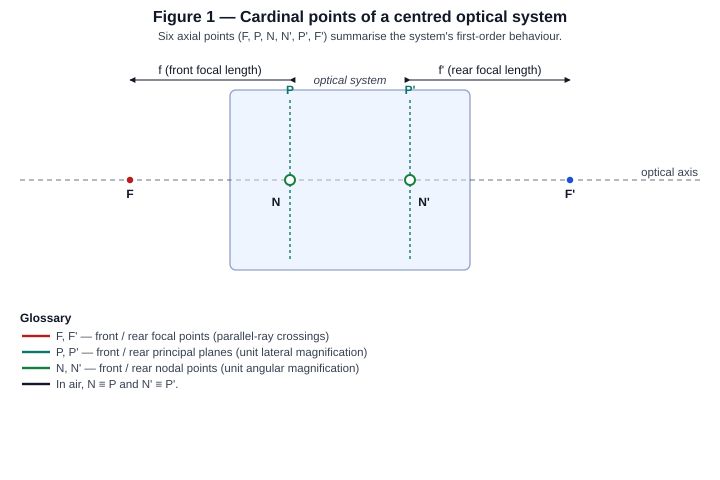
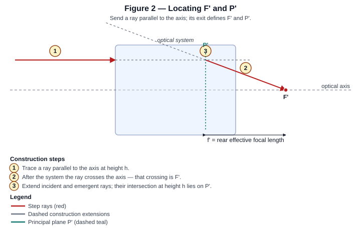
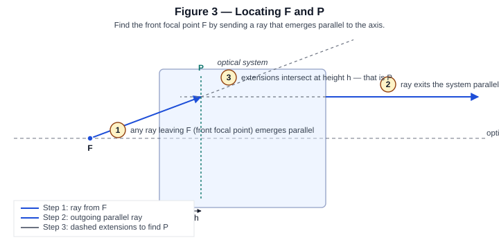
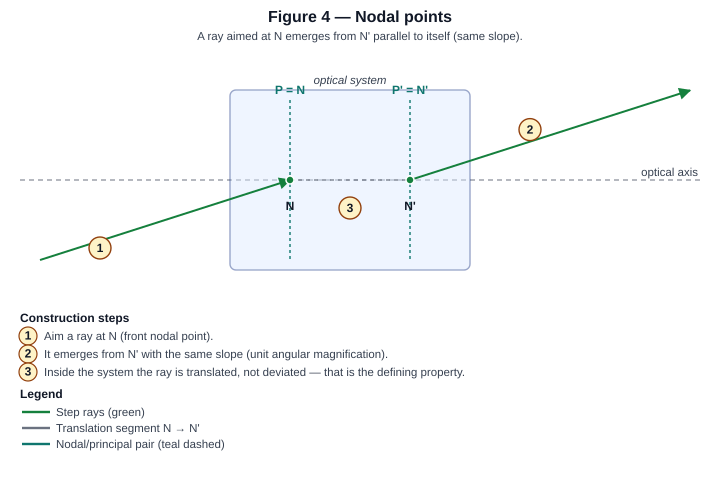
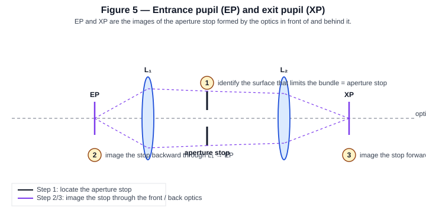
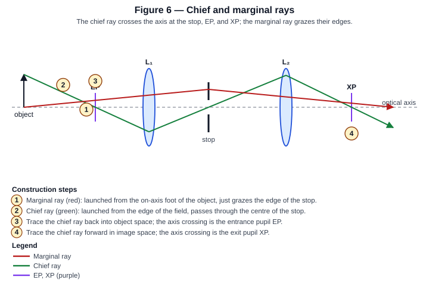
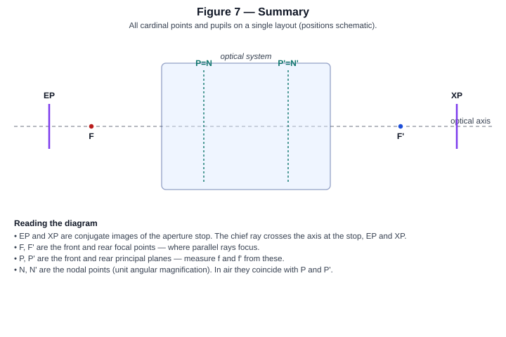

Finding the Cardinal Points and Pupils by Ray Tracing
=====================================================

This page is a textbook-style walk-through of how to locate every
*first-order* landmark of a centred optical system using construction
rays only: the front and rear **focal points** :math:`F, F'`, the
**principal planes** :math:`P, P'`, the **nodal points** :math:`N, N'`,
and the **entrance** and **exit pupils** EP and XP.

Each figure carries numbered ``Step 1``, ``Step 2``, ... badges next to
the rays that produce each landmark — read them in order.

Drawing conventions
-------------------

* Light propagates left → right along the optical axis (dashed grey).
* The whole optical system is drawn as a translucent rectangular block
  (or, in Figures 5–6, as a pair of thin lenses :math:`L_{1}, L_{2}` so
  the aperture stop is visible between them).
* Solid coloured lines are **real ray segments**.
* Grey-dashed lines are **virtual / construction extensions**.
* Coloured vertical dashes mark principal planes; small filled dots
  mark focal and nodal points.

KrakenOS exposes all of these landmarks at runtime through
``KrakenOS.PupilCalc`` (``Pup.PosPupInp``, ``Pup.PosPupOut``,
``Pup.PPP``, ``Pup.PPA``, ``Pup.EFFL``; see :doc:`pupilcalc_tool` and
``KrakenOS/PupilTool.py``), but the constructions below explain *why*
those numbers are what they are.

.. contents::
   :local:
   :depth: 1

1. The six cardinal points
--------------------------

Any centred imaging system can be replaced — at first order — by six
axial points: two **focal points** :math:`F, F'`, two **principal
planes** :math:`P, P'`, and two **nodal points** :math:`N, N'`. In air
(same medium on both sides) the nodal points coincide with the
principal points (:math:`N \equiv P`, :math:`N' \equiv P'`), so it is
common to see only four labels on a diagram.

   The four / six axial landmarks. The effective focal lengths
   :math:`f` and :math:`f'` are measured **from the principal plane**
   to the corresponding focal point.

The thin-lens equation, the Newtonian imaging equation, and the
Gaussian magnification formulas are all written in terms of these
landmarks:

.. math::

   \frac{1}{s'} - \frac{1}{s} = \frac{1}{f'}, \qquad
   x \cdot x' = -f \cdot f', \qquad
   m = -\frac{s'}{s} = -\frac{f'}{x} = -\frac{x'}{f},

where :math:`s, s'` are object/image distances measured from
:math:`P, P'`, and :math:`x, x'` are the Newtonian distances measured
from :math:`F, F'`.

2. Locating :math:`F'` and :math:`P'`
-------------------------------------

The classical recipe: send in a ray that is **parallel to the optical
axis**, then look at what comes out. The exit point on the axis is the
*rear focal point* :math:`F'`; the height at which the construction
extensions cross is the *rear principal plane* :math:`P'`.

   **Step 1.** Trace a ray parallel to the axis at height :math:`h`.
   **Step 2.** The ray emerges and crosses the axis — that crossing is
   :math:`F'`. **Step 3.** Extend the incident ray forward (dashed)
   and the emergent ray backward (dashed); the height at which they
   meet, :math:`h`, lies on the rear principal plane :math:`P'`.

The distance from :math:`P'` to :math:`F'` is the **rear effective
focal length** :math:`f' = \overline{P' F'}`. For a system in air
:math:`f = f'`.

In code, KrakenOS's paraxial backend reports :math:`f'` as
``Pup.EFFL`` (see ``PupilCalc.__init__`` calling ``SYSTEM.Parax``).

3. Locating :math:`F` and :math:`P`
-----------------------------------

Mirror construction: send a ray **out of the system parallel to the
axis** and ask where it must have come from. By the time-reversal
symmetry of geometric optics, any such ray must have entered at the
front focal point :math:`F`.

   **Step 1.** Any ray leaving :math:`F` emerges parallel to the axis.
   **Step 2.** Identify such an emergent ray at height :math:`h`.
   **Step 3.** Extend the incident ray forward to where the emergent
   ray comes from; the intersection at height :math:`h` lies on the
   front principal plane :math:`P`.

The **front effective focal length** is :math:`f = \overline{F P}`,
returned in KrakenOS as ``Pup.PPP`` together with ``Pup.PPA`` (the two
principal-plane axial positions).

4. Nodal points :math:`N, N'`
-----------------------------

The **angular** analogue of the principal points. They satisfy:

   A ray aimed at :math:`N` emerges from :math:`N'` parallel to itself.

In symbols, the angular magnification between :math:`N` and :math:`N'`
is :math:`+1`. In air the nodal points coincide with the principal
points; they only separate when the object- and image-space refractive
indices differ (e.g. an object in air, image in water).

   **Step 1.** Aim a ray at :math:`N`. **Step 2.** It emerges from
   :math:`N'` with the same slope. **Step 3.** Inside the system the
   ray is *translated* but not deviated — that is the defining
   property of the nodal pair.

Mathematically, with :math:`n` and :math:`n'` the indices of object
and image space,

.. math::

   \overline{P N} = \overline{P' N'} = f \left( \frac{n'}{n} - 1 \right).

In air, :math:`n = n' = 1`, so :math:`\overline{P N} = 0` and
:math:`N \equiv P`, :math:`N' \equiv P'`.

5. Aperture stop, EP and XP
---------------------------

The **aperture stop** is the surface that physically limits the
on-axis ray bundle. The **entrance pupil** EP and **exit pupil** XP
are the images of that stop formed by the optics **in front of** the
stop and **behind** the stop, respectively.

   **Step 1.** Identify the aperture stop (the bar with a hole here,
   between :math:`L_{1}` and :math:`L_{2}`). **Step 2.** Image the
   stop backward through every surface in front of it — the resulting
   image is the entrance pupil EP. **Step 3.** Image the stop forward
   through every surface behind it — the resulting image is the exit
   pupil XP. Both are conjugates of the stop, so a ray that hits the
   centre of the stop must also pass through the centres of EP and
   XP.

The pupil magnifications

.. math::

   m_{\mathrm{enter}} = \frac{\theta_{0}}{\theta_{\mathrm{stop}}}, \qquad
   m_{\mathrm{exit}}  = \frac{\theta_{0}}{\theta_{\mathrm{image}}},

introduced in :doc:`pupilcalc_tool`, are exactly the lateral
magnifications of the front-side and back-side stop-imaging steps
above. KrakenOS computes them numerically by tracing the same fan of
rays shown in ``PupilCalc.__init__`` and reading ``Pup.RadPupInp``,
``Pup.PosPupInp``, ``Pup.RadPupOut``, ``Pup.PosPupOut``.

6. Chief and marginal rays — the operational definition
-------------------------------------------------------

In practice you almost never image the stop by hand. Instead, you
**identify EP and XP as the axis-crossings of the chief ray**:

* the **marginal ray** is launched from the on-axis foot of the
  object and just grazes the edge of the stop;
* the **chief ray** is launched from the edge of the field and passes
  through the **centre** of the stop.

Because the chief ray must hit the centre of the stop, it must — by
conjugacy — also hit the centres of EP (on the object side) and XP
(on the image side). Extend it both ways and read off the
axis-crossings.

   **Step 1.** Trace the marginal ray (red): on-axis object foot →
   edge of stop → image-side focus. **Step 2.** Trace the chief ray
   (green): top of object → centre of stop → image. **Step 3.**
   Extend the chief ray *backward* into object space; the axis
   crossing is the entrance pupil EP. **Step 4.** Extend the chief
   ray *forward* in image space; the axis crossing is the exit pupil
   XP.

The marginal ray simultaneously determines the **system F-number**,

.. math::

   F/\# \;=\; \frac{f'}{D_{\mathrm{EP}}}
   \;=\; \frac{1}{2 \sin\theta_{\mathrm{marg}}},

with :math:`\theta_{\mathrm{marg}}` the marginal-ray slope in image
space and :math:`D_{\mathrm{EP}}` the entrance-pupil diameter.

7. Putting it all together
--------------------------

   The complete first-order summary: EP — F — P/N — system — P'/N' —
   F' — XP. EP and XP are conjugates of the aperture stop; the chief
   ray passes through the axis at all three; :math:`f, f'` are
   measured from the principal planes.

KrakenOS surface roles (in the |ui|) map onto this picture as
follows:

* The **analysis surface** chosen via the Layout Editor's "Analysis
  surface" combobox is the surface used as the aperture stop when
  ``Aperture type = STOP`` (or whose image gives EP/XP when
  ``Aperture type = EPD``).
* Toggling **Show PP / EP / XP** in the editor toolbar overlays
  :math:`P', \mathrm{EP}, \mathrm{XP}` markers in the 2D layout plot.
* ``Pup.PosPupInp`` and ``Pup.PosPupOut`` are the axial coordinates
  of EP and XP returned by ``PupilCalc``; ``Pup.PPA``, ``Pup.PPP``
  hold the principal-plane positions; ``Pup.EFFL`` is :math:`f'`.

See :doc:`pupilcalc_tool` for the numerical extraction, and
:doc:`pupil_patterns` for how a chosen EP / chief-ray axis is then
populated with sample rays.
