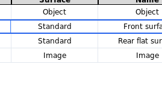
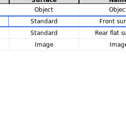
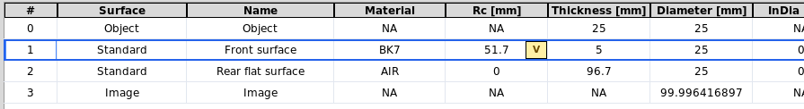

Editable Table Workflow
=======================

The editable table is the working prescription for sequential layouts and the
surface/object list for non-sequential scene workflows. A single row is a
KrakenOS surface. A component is one or more adjacent rows grouped as an
``Element`` so that the UI can move, flip, copy, paste, ungroup, and path-tag
the optical component as one unit.

Physical illumination sources are already first-class scene objects through the
Source panel and ``SETTINGS["scene_sources"]``. Use ``Actions -> Scene Source
Manager...`` or the Source-panel ``Scene Source Manager...`` button to add,
edit, delete, duplicate, or reorder explicit physical emitters. When the selected
source is a physical emitter, the table shows an ``Illumination Source`` scene row
beside ``Object`` and ``Image``. Double-click or right-click that source row to
open the manager. The row is not a KrakenOS surface: it has no table-row index,
no trace-surface index, and is skipped when the surface prescription is read back
for tracing. This preserves KrakenOS surface indices used by ray tracing, path
assignment, detectors, and analysis. The source-aware ``SceneRowMapping`` bridge
records this source-visible row order while the prescription rows remain ordinary
KrakenOS surfaces. Layouts may request ``scene_row_order="before_object"`` when
the source is the intuitive first entity in the workflow, for example a
right-angle beam-splitter illumination scene where Source 1 illuminates an object
through folded optics.

For a single source, the Source panel remains the quick fallback. For multiple
sources, the manager writes explicit ``scene_sources`` records. Inspect the exact
scene/table/trace mapping in ``Actions -> Non-Sequential Scene Graph``; the graph
shows the scene row number, current table row, trace surface, and source ID side
by side.

Use ``Direction preset`` in the Source panel or Scene Source Manager to orient
physical emitters without manually entering direction cosines. ``Horizontal +Z
(right)`` is the normal left-to-right source direction in the YZ layout; the
equivalent manual entry is ``Source L=0``, ``Source M=0``, ``Source N=1``.
In Scene Source Manager, ``Aim Direction At Row`` points the selected source
origin at the center of a chosen ``Object``, surface, ``Image``, or file-backed
CAD/STL row. It updates only the source direction cosines, so the source remains
a scene emitter and the optical prescription rows are not reordered or modified.

After tracing, use ``Actions -> Source Illumination Report`` to inspect how each
physical source illuminates the selected Object, aperture, detector, or Image
surface. The report uses traced 3D ray hits and does not add pseudo-surfaces to
the prescription.

The ``Illum`` analysis uses the same source-hit records. In ``Auto`` target
mode it prefers the final Detector/Image plane because that is the usual
relative-illumination use case for camera sensors. If you need pupil
illumination, set ``Analysis surface`` to the desired ``Aperture``/``Stop`` row
or choose that row in the Source Illumination Report ``Target`` dropdown before
refreshing.

Loading versus inserting
------------------------

Use ``Layouts`` or ``Examples`` when you want to load a complete preset system.
Those presets may intentionally apply object distance, source, field, pupil,
wavelength, analysis, and plot defaults.

Use ``Insert`` when you want to keep the current design and add an optic below
the selected row:

* ``Insert -> Common Component`` splices component-style common layouts such as
  lenses, mirrors, and F-theta components into the current table.
* ``Insert -> Stock Lens Catalog...`` imports Edmund/Thorlabs-style ``.ZMF``
  stock lenses and expands the selected catalog part into ordinary table rows.
* ``Insert -> Optical CAD/STL Solid...`` inserts a file-backed KrakenOS optical
  solid row. STEP/IGES vendor CAD is meshed to cached STL automatically.
* ``Insert -> Component to Current Path View...`` inserts a detector, aperture,
  thin lens, refractive surface, or mirror into the active beam-splitter path.

The insertion commands do not overwrite the current source, field, pupil,
wavelength, analysis, or display settings. They only add component rows.

   Use ``Insert`` for adding optics to the current design without replacing the
   active layout settings.

Insertion point
---------------

The table uses the current selection as the insertion anchor:

* If one or more rows are selected, inserted rows go below the last selected row.
* If the selected row belongs to a grouped element, selecting the ``#`` column
  selects the whole element block.
* If no row is selected, inserted rows go before the final ``Image`` row.
* ``Object`` and ``Image`` stay anchored and are not treated as component rows.

Surface and element clipboard
-----------------------------

The table supports component-aware clipboard operations:

* ``Ctrl-C`` copies selected surface rows.
* If any selected row is part of a grouped element, the complete contiguous
  element block is copied.
* ``Ctrl-V`` pastes copied rows below the current selection.
* ``Object`` and ``Image`` are skipped on copy/paste.
* Pasted grouped elements receive independent element labels, so later Move
  Up/Down, Flip, Ungroup, and path assignment act on the pasted component rather
  than merging it with the source component.

The same commands are also available from ``Edit`` and from the table
right-click menu.

Surface right-click menu
------------------------

Right-clicking the ``Surface`` cell no longer opens only the type chooser. The
same full menu is available from any table cell:

   The table right-click menu groups row conversion, component insertion,
   geometry, diagnostics, and optimization actions.

* ``Convert Type`` changes the row to Standard, Aperture, Mirror,
  Object Target, Diffuse Object, Beam Splitter, Thin Lens, Grating, Image, or
  converts the selected physical row to an Optical CAD/STL Solid.
* ``Insert Component Below`` splices singlets, doublets, flat mirrors,
  object-target proxy rows, diffuse-object rows, plate/window rows, wedge prism
  rows, a right-angle prism primitive, a cube beam-splitter primitive, stock
  lenses, CAD/STL solids, or path-local components.
* ``Shape / Aperture`` exposes Shape Builder plus circular, rectangular,
  polygon/UDA, annulus, spider, and rectangular clear-aperture presets.
* ``Material`` opens the glass catalog and applies common materials to selected
  rows.
* ``Coating / Polarization`` opens coating/material editing, applies coating
  presets, enables metal Fresnel mirror mode, and configures beam-splitter
  Fresnel P/S behavior.
* ``Geometry`` aligns the local row orientation, sets TiltX incidence, reverses
  elements, and assigns/places rows on the current Path view.
* ``Element`` contains grouping, copy/paste, move, path assignment, and path role
  commands.
* ``Diagnostics`` sets trace/analysis targets and opens ray/path/scene
  inspectors.
* ``Advanced`` opens native KrakenOS attributes, Error Map, Grating/Galvo
  settings, and STL diagnostics/placement.

Compact prescription columns
----------------------------

The visible table keeps the columns that are edited most often during lens and
layout work: surface type, material, radius, thickness, aperture, tilt,
decenter, and axis movement. KrakenOS fields that are real but uncommon are
kept in the row model and file export, but edited through ``Advanced...``.

``k`` is the conic constant of the base sag. ``k = 0`` is spherical,
``k = -1`` is parabolic, values below ``-1`` are hyperbolic, and positive
values are oblate ellipsoids. Use it for conic/aspheric surfaces; ordinary
spherical singlets and doublets usually leave it at zero.

``Axicon`` is a conical sag angle in degrees. It is useful for axicons and
Bessel-beam style layouts, but it is not a common day-to-day lens prescription
field.

Open ``Advanced... -> Shape Params`` to edit either value. ``k`` can also be
marked as an optimization variable from that pane; this writes KrakenOS-native
``Var``/``VarBounds`` metadata while keeping the main table compact.

Optimization cell marker
------------------------

Cells selected as optimization variables use a Zemax-style split-cell marker:
the main cell area keeps the numeric value, and a small right-side ``V`` badge
marks that value as variable. This replaces the older ``*`` suffix and avoids
coloring the whole row, so grouped element colors and row-selection borders
remain readable.

Right-click a supported numeric cell and use
``Optimization / Solves -> Select ... for optimization``. Supported visible
variables include radius, thickness, tilt, decenter, and grating pitch. Hidden
advanced variables such as conic ``k`` can still be enabled from their
specialized dialog, but they do not reappear as main table columns.

   The ``V`` marker appears inside the selected numeric cell without replacing
   the row or element color.

Prisms and cube beam splitters
------------------------------

Simple prisms can be built from table rows. A wedge prism is two tilted Standard
surfaces: the first enters glass, the second exits to AIR. The right-click
``Insert Component Below -> Wedge Prism`` command creates this starter block.

For arbitrary prism solids, use ``Convert Type -> Optical CAD/STL Solid`` or
``Insert Component Below -> Optical CAD/STL Solid``. A closed mesh is the
physically correct UI representation when rays may hit side faces, experience
total internal reflection, or leave through a non-sequential face.

After importing a file-backed solid, use ``Actions -> Assign CAD/STL Optical
Faces`` or the row context menu ``Advanced -> Assign CAD/STL Optical Faces`` to
record the optical intent of the mesh. The dialog clusters planar STL triangles
into candidate faces and lets you assign roles such as ``Input``, ``Output``,
``TIR``, ``Mirror``, ``Beam Splitter``, and ``Absorber/Mechanical``. These roles
are metadata used by the UI workflow and validators; KrakenOS still performs
the physical ray trace through the closed ``Solid_3d_stl`` geometry and row
material.

This is not yet the final prism authoring workflow. It is accurate as a
KrakenOS execution model, but too pose-math-heavy for practical optical design.
The future workflow should be a 3D scene-object placement tool: import the
solid, select or fit the intended optical faces/axes visually, snap the prism to
a traced ray or path frame, and then write the resulting pose back to the table
only as saved implementation data.

``Insert Component Below -> Cube Beam Splitter`` creates a practical starter:
entrance face, internal 45 degree Beam Splitter surface, and transmit exit face.
It is enough to start deterministic transmitted/reflected path design. For a
closed cube with every side face available to tracing, use an Optical CAD/STL
Solid for the external cube boundary and keep a Beam Splitter table surface for
the internal coating/path metadata. Vendor CAD generally does not encode the
split ratio, phase, or internal coating as ray-trace-ready physics.

Tilt and decenter tolerance overlays
------------------------------------

The pose columns ``TiltX``, ``TiltY``, ``TiltZ``, ``DespX``, ``DespY``, and
``DespZ`` accept comma-separated values or ``start:stop:step`` ranges. For
example, enter ``-0.1, 0, 0.1`` in ``TiltY`` or ``-0.05:0.05:0.05`` in
``DespX``.

The middle value becomes the nominal scalar KrakenOS row value. The full list is
stored as ``Advanced -> Display2D -> pose_tolerance_overlay`` and the 2-D plot
draws additional dashed ray traces plus dashed affected surface positions. If
several pose cells contain lists with the same length, the values are swept
together by index. If the list lengths differ, combinations are generated and
truncated to 25 variants.

For grouped elements, enter the pose list once on any row in the element. The
UI applies the same delta sweep to every row in the contiguous element block, so
a doublet behaves like one mechanically shifted component instead of three
independent tilted/decentered surfaces.

Mirror ``TiltX`` keeps the dedicated galvo/folded-scan interpretation because
its displayed value is mirror slant, not raw KrakenOS local tilt. It still uses
the same comma/range entry syntax.

Validation
----------

Run the workflow regression check with:

.. code-block:: bash

   python -m KrakenOS.UI.validate_table_component_workflow
   python -m KrakenOS.UI.validate_compact_shape_fields

The first check inserts a common component while preserving global source/field
settings, then copies and pastes grouped component rows while confirming that
``Object`` and ``Image`` are not duplicated. The compact-shape check confirms
that ``k`` and ``Axicon`` are hidden from the main table, still reach KrakenOS
surface construction, and remain optimizer-addressable where supported.
