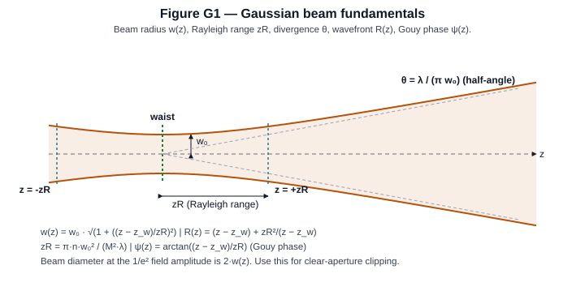
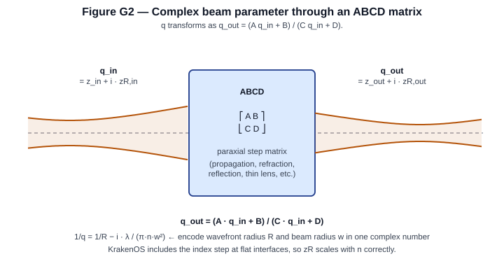
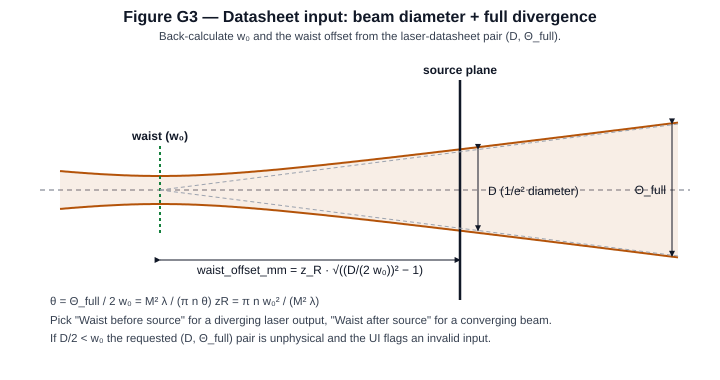
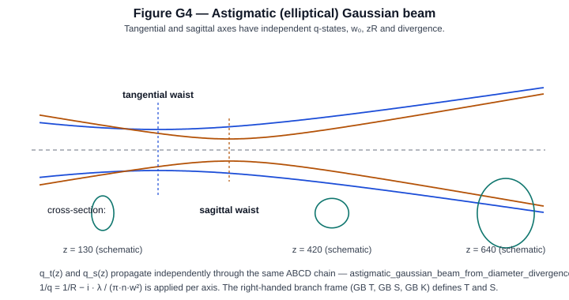

Gaussian Beam Propagation
=========================

KrakenOS now exposes a lightweight Gaussian beam propagation path on top of the
same paraxial matrices used by ``system.ParaxMatrices()`` and
``Actions -> Paraxial Matrix Report``. It is intended for first-order laser
layout work: waist size, beam radius, divergence, Rayleigh range, wavefront
radius, Gouy phase, and CSV export at every paraxial step.

Beam fundamentals
-----------------

A monochromatic Gaussian beam in homogeneous medium is fully specified by its
**beam radius** :math:`w(z)`, **wavefront radius of curvature** :math:`R(z)`,
and **Gouy phase** :math:`\psi(z)`, all measured from the waist position
:math:`z_{w}`:

.. math::

   w(z)   &= w_{0}\,\sqrt{1 + \!\left(\frac{z - z_{w}}{z_{R}}\right)^{2}}, \\[4pt]
   R(z)   &= (z - z_{w})\;\Bigl[\,1 + \!\bigl(z_{R}/(z - z_{w})\bigr)^{2}\,\Bigr], \\[4pt]
   \psi(z) &= \arctan\!\left(\frac{z - z_{w}}{z_{R}}\right),

with the **Rayleigh range** and far-field **half-divergence**:

.. math::

   z_{R} = \frac{\pi\,n\,w_{0}^{2}}{M^{2}\,\lambda},
   \qquad
   \theta = \frac{M^{2}\,\lambda}{\pi\,n\,w_{0}}.

Here

* :math:`w_{0}` is the waist radius (1/e² field amplitude),
* :math:`z_{w}` is the waist position along the optical axis,
* :math:`z_{R}` is the Rayleigh range — the distance from the waist at which
  the beam area doubles (:math:`w(z_{w} + z_{R}) = w_{0}\sqrt{2}`),
* :math:`R(z)` is the radius of curvature of the wavefront
  (:math:`R \to \infty` at the waist; :math:`R \to z - z_{w}` in the far
  field),
* :math:`\psi(z)` is the Gouy phase — an axial phase slip of
  :math:`\pi` rad between the two far fields,
* :math:`\lambda` is the vacuum wavelength,
* :math:`n` is the refractive index of the current medium,
* :math:`M^{2}` is the beam-quality factor (1 for an ideal TEM₀₀).

   The amber envelope is :math:`\pm w(z)`. The waist sits where the envelope
   pinches. :math:`z_R` is the distance to where the envelope has expanded
   by :math:`\sqrt{2}`; the dashed grey lines are the far-field asymptotes
   that open at the half-angle :math:`\theta`.

**Worked example.** Take :math:`\lambda = 0.6328` µm
(HeNe), :math:`n = 1`, :math:`M^{2} = 1`, :math:`w_{0} = 0.5` mm.

* :math:`z_{R} = \pi \cdot 1 \cdot (0.5)^{2} / 0.0006328
  \approx 1241` mm.
* :math:`\theta = 0.0006328 / (\pi \cdot 0.5) \approx 4.03 \cdot 10^{-4}` rad
  :math:`= 0.403` mrad
  (full divergence :math:`\Theta_{\mathrm{full}} = 0.806` mrad).
* At :math:`z - z_{w} = z_{R}`:
  :math:`w = w_{0}\sqrt{2} = 0.707` mm,
  :math:`R = z_{R}\,(1 + 1) = 2482` mm,
  :math:`\psi = \arctan(1) = \pi/4 \approx 0.785` rad.
* At :math:`z - z_{w} = 2\,z_{R}`:
  :math:`w = w_{0}\sqrt{5} = 1.118` mm,
  :math:`R = 2z_{R}(1 + 1/4) = 3103` mm.
* Far-field beam diameter at 10 m:
  :math:`2\,w(10\,\mathrm{m}) \approx 2\,w_{0}\,\sqrt{1 + (10000/1241)^{2}}
  \approx 8.06` mm — i.e. essentially the far-field cone
  :math:`2\theta \cdot z = 0.806\,\mathrm{mrad} \cdot 10\,\mathrm{m} = 8.06` mm.

**KrakenOS code:**

.. code-block:: python

   import numpy as np
   import KrakenOS as Kos

   lam_um = 0.6328
   w0_mm  = 0.5
   n      = 1.0
   M2     = 1.0

   lam_mm = lam_um * 1e-3
   zR     = np.pi * n * w0_mm**2 / (M2 * lam_mm)
   theta  = M2 * lam_mm / (np.pi * n * w0_mm)
   print(f"zR = {zR:.2f} mm   theta_half = {theta*1e3:.3f} mrad")

   # Trace q through a 100-mm propagation step using the q-transform:
   beam   = Kos.GaussianBeamInput(wavelength_um=lam_um,
                                  waist_radius_mm=w0_mm,
                                  waist_offset_mm=0.0,
                                  m2=M2)
   z       = 100.0                          # mm from waist
   q_in    = complex(0.0, zR)               # q at the waist
   A, B, C, D = 1.0, z, 0.0, 1.0            # free-space propagation matrix
   q_out   = (A*q_in + B) / (C*q_in + D)
   w_z     = np.sqrt(-lam_mm / (np.pi * (1/q_out).imag))
   R_z     = 1.0 / (1/q_out).real
   psi_z   = np.arctan2(q_out.real, q_out.imag)
   print(f"at z = {z:.0f} mm:  w = {w_z*1e3:.3f} um,  R = {R_z:.1f} mm,  "
         f"Gouy = {psi_z:.4f} rad")

Complex beam parameter and ABCD transformation
----------------------------------------------

The implementation uses the conventional complex beam parameter:

.. math::

   q_{out} = \frac{A q_{in} + B}{C q_{in} + D}

where ``A``, ``B``, ``C``, and ``D`` are the step matrix values in the
``(height, angle)`` convention. The single complex number encodes *both*
the beam radius and the wavefront curvature through

.. math::

   \frac{1}{q(z)} \;=\; \frac{1}{R(z)} \;-\; i\,\frac{\lambda}{\pi\,n\,w(z)^{2}}.

KrakenOS refraction matrices include refractive index transitions, so a
flat air-to-glass interface scales the Rayleigh range correctly.

   ``q`` is a single complex number that carries both
   :math:`R(z)` (its inverse real part) and :math:`w(z)` (via the imaginary
   part). It transforms by the same ABCD matrix that propagates paraxial
   rays.

**Worked example.** Pass the HeNe beam above (:math:`q_{0} = 0 + i\,z_{R}
= i\,1241` mm) through a 100-mm free-space step and then through a thin
lens of focal length :math:`f = 80` mm.

* Free-space propagation matrix:
  :math:`(A, B, C, D) = (1, 100, 0, 1)`. So
  :math:`q_{1} = q_{0} + 100 = 100 + i\,1241` mm.
  :math:`w(z = 100) = \sqrt{|q_{1}|^{2} \cdot \lambda / (\pi z_{R})}
  = 0.5\,\sqrt{1 + (100/1241)^{2}} \approx 0.502` mm.
* Thin-lens matrix:
  :math:`(A, B, C, D) = (1, 0,\, -1/f,\, 1) = (1, 0, -0.0125, 1)`. Then
  :math:`q_{2} = q_{1} / (1 - q_{1}/f)
  = (100 + 1241i) / (1 - (100 + 1241i)/80)
  = (100 + 1241i) / (-0.25 - 15.5125 i)`
  :math:`\approx -3.20 - 79.7\,i` mm.
* Read out: new waist offset = :math:`\mathrm{Re}(q_{2}) = -3.20` mm
  (waist is 3.2 mm *before* the lens plane, i.e. on the source side),
  new Rayleigh range = :math:`\mathrm{Im}(q_{2}) = 79.7` mm, so
  :math:`w_{0}' = \sqrt{\lambda\,z_{R}' / \pi}
  = \sqrt{0.0006328 \cdot 79.7 / \pi} \approx 0.127` mm — the lens has
  refocused the beam to a tight new waist.

**KrakenOS code:**

.. code-block:: python

   # Same setup as the previous block; demonstrate the ABCD chain.
   def step(q, A, B, C, D):
       return (A*q + B) / (C*q + D)

   q   = complex(0.0, zR)
   q1  = step(q,   1.0, 100.0, 0.0,         1.0)        # 100 mm air
   q2  = step(q1,  1.0,   0.0, -1.0/80.0,   1.0)        # thin lens f=80 mm

   def w_R(q, lam, n=1.0):
       w = np.sqrt(-lam / (np.pi * (1/q).imag * n))
       R = 1.0 / (1/q).real if (1/q).real != 0 else np.inf
       return w, R

   for label, qq in [("q_in", q), ("after 100 mm", q1), ("after lens", q2)]:
       w, R = w_R(qq, lam_mm)
       print(f"{label:<14}  q = {qq.real:+.3f} {qq.imag:+.3f}i mm   "
             f"w = {w*1e3:.2f} um   R = {R:+.1f} mm")

Input conventions
-----------------

All distances are in millimeters. Wavelength is in micrometers, matching the
rest of KrakenOS.

``Source X/Y/Z`` and ``Source L/M/N``
   The Gaussian source can be launched from a physical origin and chief-ray
   direction. ``Source L/M/N`` are normalized direction cosines. The traced
   representative rays follow that direction, so the source can be separated
   from the ``Object`` reference row for beam-splitter geometry. The amber
   q-envelope overlay is intentionally limited to centered ``+Z`` paraxial
   layouts; for tilted or folded Gaussian systems, use the traced rays and the
   Gaussian Beam Report until the future non-sequential astigmatic q model is
   implemented.

``GB input mode``
   ``Waist + offset`` is the direct q-parameter workflow. ``Diameter +
   divergence`` is the laser-datasheet workflow: enter the beam diameter at the
   source/reference plane and the full far-field divergence, then KrakenOS
   back-calculates the equivalent waist radius and waist location.

``Cone half-angle [deg]``
   This is not the Gaussian divergence field. It belongs to geometric random
   source models such as ``Random point cone`` and random area sources. Edit it
   in ``Scene Source Manager...``. It is a half-angle in degrees, so the full
   geometric cone angle is twice the entered value.

``waist_radius_mm``
   The 1/e^2 Gaussian field radius at the input waist.

``waist_offset_mm``
   The signed real part of the input ``q`` parameter. A value of ``0`` means
   the waist is located exactly at the first paraxial input plane. A positive
   value means the input plane is downstream of the waist. A negative value
   means the waist is downstream of the input plane.

``m2``
   Beam quality factor. ``m2=1`` is diffraction-limited. Larger values increase
   the effective wavelength used by the q-parameter report.

Datasheet diameter/divergence flow
----------------------------------

Laser manufacturers often specify a beam diameter at the laser output and a
full-angle divergence. Use this flow for beam expanders and collimators:

1. Choose ``Source model -> Gaussian beam``.
2. Set ``GB input mode -> Diameter + divergence``.
3. Enter ``GB diameter [mm]`` as the 1/e^2 beam diameter at the source plane.
4. Enter ``GB full div [mrad]`` as the full far-field divergence angle.
5. Choose ``GB waist side``. ``Waist before source`` is the normal diverging
   laser-output case. ``Waist after source`` represents a converging beam.
6. Set ``GB M2`` if the laser is not diffraction-limited.
7. Click ``Update``. The UI computes the equivalent ``w0`` and waist offset,
   traces representative rays, and draws the amber 1/e^2 q-envelope.

.. figure:: ../_static/manual/ui/gaussian_source_panel.png
   :alt: Source panel configured for Gaussian beam diameter and divergence input
   :width: 55%

   In ``Gaussian beam`` mode, the Source panel shows the laser-datasheet inputs
   and hides irrelevant pupil/field controls.

The calculation uses:

.. math::

   \theta = \frac{\Theta_{full}}{2}

.. math::

   w_0 = \frac{M^2 \lambda}{\pi n \theta}

.. math::

   z_R = \frac{\pi n w_0^2}{M^2 \lambda}

.. math::

   z = z_R \sqrt{\left(\frac{w}{w_0}\right)^2 - 1}

where

* :math:`\Theta_{\mathrm{full}}` is the full-angle far-field divergence
  (datasheet value, mrad → rad),
* :math:`\theta` is the corresponding half-divergence,
* :math:`w_{0}` is the back-calculated waist radius (mm),
* :math:`z_{R}` is the Rayleigh range implied by that :math:`w_{0}`,
* :math:`w` is half the specified beam diameter at the source plane
  (:math:`w = D/2`),
* :math:`z` is the **signed offset** from the source plane to the waist:
  positive when the waist sits *before* the source plane (``Waist
  before source``), negative when it sits *after* it.

If :math:`w < w_{0}` the requested (D, Θ_full) pair is unphysical and the
UI flags an invalid Gaussian source input.

   The source plane defines where you measure D; the waist sits an offset
   distance away — KrakenOS solves for that distance from the
   diameter/divergence pair.

**Worked example.** Datasheet entry for a small 650-nm visible diode:
:math:`D = 1.0` mm, :math:`\Theta_{\mathrm{full}} = 2.0` mrad,
:math:`M^{2} = 1`, :math:`n = 1`.

* :math:`\theta = 2.0/2 = 1.0` mrad :math:`= 10^{-3}` rad.
* :math:`w_{0} = M^{2}\,\lambda / (\pi\,n\,\theta)
  = 1 \cdot 0.00065 / (\pi \cdot 1 \cdot 10^{-3})
  \approx 0.2069` mm.
* :math:`z_{R} = \pi\,n\,w_{0}^{2}/(M^{2}\,\lambda)
  = \pi \cdot 1 \cdot 0.2069^{2}/0.00065
  \approx 206.9` mm.
* Source-plane radius :math:`w = D/2 = 0.5` mm.
* Waist offset:
  :math:`z = z_{R}\,\sqrt{(w/w_{0})^{2} - 1}
  = 206.9\,\sqrt{(0.5/0.2069)^{2} - 1}
  = 206.9\,\sqrt{4.836}
  \approx 455.1` mm.

So the laser-output plane is ~455 mm downstream of the implied waist.

**KrakenOS code:**

.. code-block:: python

   beam = Kos.gaussian_beam_from_diameter_divergence(
       wavelength_um=0.650,
       beam_diameter_mm=1.0,
       full_divergence_mrad=2.0,
       m2=1.0,
       waist_after_input=False,            # waist before source plane
   )
   print(f"w0          = {beam.waist_radius_mm*1e3:.2f} um")
   print(f"waist offset= {beam.waist_offset_mm:.2f} mm")

   # Compare against the analytic value:
   lam   = 0.650e-3
   theta = 1.0e-3
   w0    = 1.0 * lam / (np.pi * theta)
   zR    = np.pi * w0**2 / lam
   z     = zR * np.sqrt((0.5/w0)**2 - 1)
   print(f"analytic w0 = {w0*1e3:.2f} um   z = {z:.2f} mm")

Report columns
--------------

``Re(q)`` and ``Im(q)``
   Complex beam parameter after the paraxial step. ``Im(q)`` is the local
   Rayleigh range in the current medium.

``w`` and ``2w``
   Gaussian beam radius and diameter at the current step.

``Rwf``
   Wavefront radius. ``inf`` means a flat wavefront at the waist.

``w0``
   Waist radius implied by the current ``q`` state in the current medium.

``Waist offset``
   Distance from the current step plane to the waist. Positive values mean the
   waist is still downstream of the current step.

``Div``
   Far-field half-angle divergence in milliradians.

``Gouy``
   Gouy phase in radians for the current ``q`` state.

Astigmatic and elliptical beams
-------------------------------

KrakenOS also exposes a two-axis helper for laser sources whose tangential and
sagittal beam diameters, divergences, or ``M2`` values are different. This is
useful for diode lasers and beam-shaping lenses where the source is elliptical.

   Two independent q-states propagate along the same axis; the cross-section
   ellipse rotates and changes aspect ratio as each axis crosses its own
   waist.

**Worked example.** Diode laser: :math:`\lambda = 0.6328` µm, M² = 1.1
tangential and 1.3 sagittal, with datasheet
:math:`D_{t} = 1.2` mm, :math:`\Theta_{t} = 0.9` mrad,
:math:`D_{s} = 0.8` mm, :math:`\Theta_{s} = 1.4` mrad. Per-axis:

* tangential:
  :math:`\theta_{t} = 0.45` mrad,
  :math:`w_{0,t} = 1.1 \cdot 0.0006328 / (\pi \cdot 0.45 \cdot 10^{-3})
  \approx 0.4922` mm,
  :math:`z_{R,t} = \pi \cdot 0.4922^{2}/(1.1 \cdot 0.0006328) \approx 1094` mm.
* sagittal:
  :math:`\theta_{s} = 0.70` mrad,
  :math:`w_{0,s} = 1.3 \cdot 0.0006328 / (\pi \cdot 0.70 \cdot 10^{-3})
  \approx 0.3738` mm,
  :math:`z_{R,s} = \pi \cdot 0.3738^{2}/(1.3 \cdot 0.0006328) \approx 534` mm.
* At :math:`z = 200` mm downstream of each waist:
  :math:`w_{t}(200) = 0.4922\,\sqrt{1 + (200/1094)^{2}} \approx 0.501` mm,
  :math:`w_{s}(200) = 0.3738\,\sqrt{1 + (200/534)^{2}} \approx 0.400` mm — the
  beam is already noticeably elliptical (ratio 1.25).
* The **astigmatic separation** (different waist positions for the two axes)
  combined with different :math:`z_{R}` is why the cross-section ellipse
  rotates with z.

The current UI and ``ParaxMatrices()`` path use one centered ABCD sequence, so
the two axes differ because the input beam data differ. Branch-carried Gaussian
q propagation has a Phase 8B validation baseline for oblique mirrors and
first-order oblique refractive powers, but it is not yet a full thick tilted
plate or non-sequential wave-optics model. When future non-sequential or tilted
surface matrices expose separate tangential/sagittal ABCD chains, the same
per-axis propagation routine can consume them.

For splitter and folded-laser future work, see :doc:`beam_splitters`.
Deterministic beam-splitter ray branches now carry power and phase metadata.
Ray Inspector and Trace Path Inspector CSV exports now also carry branch-local
Gaussian frame columns at every traced hit:

``GB K``
   The local propagation axis for the outgoing branch after that hit.

``GB T``
   The local tangential axis. When a surface normal is available this is the
   projection of the normal into the plane perpendicular to ``GB K``.

``GB S``
   The local sagittal axis, perpendicular to the local plane of incidence.
   The frame is right-handed, so ``GB T x GB S = GB K``.

``Inc [deg]``
   The unsigned incidence angle between incoming ray direction and surface
   normal. It is blank when no reliable surface normal exists.

These columns are the first non-sequential Gaussian contract. KrakenOS also
provides ``KrakenOS.propagate_branch_gaussian_q(record, beam, surfaces=rows)``
for traced branch records. It propagates independent tangential/sagittal
``q`` states, branch distance, optical path, beam radii, wavefront radii, and
cumulative centered aperture/obscuration clipping.

The UI exposes the same contract through ``Actions -> Branch Gaussian Q
Report``. The report lists one row per branch hit with the q-update note,
tangential/sagittal surface powers, q states, beam radii, clipping, and
stability flags. Use its CSV export when auditing oblique powered refraction,
flat tilted-plate q-only diagnostics, or TIR-deferred cases.

.. code-block:: python

   astigmatic_beam = Kos.astigmatic_gaussian_beam_from_diameter_divergence(
       wavelength_um=0.6328,
       tangential_beam_diameter_mm=1.2,
       tangential_full_divergence_mrad=0.9,
       sagittal_beam_diameter_mm=0.8,
       sagittal_full_divergence_mrad=1.4,
       tangential_m2=1.1,
       sagittal_m2=1.3,
       waist_after_input=False,
   )
   astigmatic_trace = Kos.propagate_astigmatic_gaussian_beam(
       paraxial_trace,
       astigmatic_beam,
   )
   print(astigmatic_trace.final_tangential.beam_radius_mm)
   print(astigmatic_trace.final_sagittal.beam_radius_mm)

Validate the branch-frame contract with:

.. code-block:: bash

   python -m KrakenOS.UI.validate_gaussian_branch_frames

Validate branch-carried ``q`` and detector-side Gaussian recombination with:

.. code-block:: bash

   python -m KrakenOS.UI.validate_gaussian_branch_q
   python -m KrakenOS.UI.validate_gaussian_detector_recombination

For active Source-panel Gaussian interferometer layouts, the ``Interf`` analysis
uses the branch-carried q envelope and cumulative clipping when detector-bin
coherent promotion is reliable. The displayed annotation reads
``Gaussian-q detector-bin coherent sum``. This is a detector-bin geometric
field model.

Phase 8 branch-field propagation
--------------------------------

Phase 8 starts the higher-order field-propagation layer with a small reusable
contract in ``KrakenOS.BranchField``. The first helper is scalar and grid-based:
it is designed to sit between traced branch/detector data and future UI field
plots without adding more analysis logic directly to the editor.

``BranchFieldGrid``
   A complex scalar field sampled on monotonic ``x_edges_mm`` and
   ``y_edges_mm``. The first contract uses the same discrete power convention
   as ``CohDet`` and ``Diffr``: ``sum(abs(field)**2)``.

``BranchFieldGrid.centroid_mm()``
   Returns the intensity-weighted sampled field centroid. The UI uses this as
   the center for the first fitted TEM00 overlap estimate.

``make_gaussian_tem00_field(...)``
   Builds a normalized waist-plane TEM00 field on a rectangular grid.

``propagate_branch_field(grid, distance_mm)``
   Propagates the scalar field through homogeneous free space using a unitary
   paraxial/Fresnel transfer function. This conserves the discrete field power
   to numerical precision.

``gaussian_mode_overlap(grid, waist_radius_mm=...)``
   Computes normalized overlap efficiency against a waist-plane TEM00 reference
   sampled on the same grid.

``branch_field_from_detector_data(data, component=...)``
   Converts current coherent-detector data dictionaries into the Phase 8 field
   contract. This is the bridge from Phase 7 detector-bin fields to future
   branch-field plots.

**Worked example.** Place a TEM₀₀ field of :math:`w_{0} = 0.55` mm at
:math:`\lambda = 0.6328` µm on a 129×129 grid over ±4 mm. Propagate
:math:`L = 250` mm forward and check what should happen analytically.

* :math:`z_{R} = \pi \cdot 0.55^{2}/0.0006328 \approx 1501` mm.
* :math:`w(250) = 0.55\,\sqrt{1 + (250/1501)^{2}}
  \approx 0.55 \cdot 1.0138 \approx 0.558` mm — barely larger than at
  the waist (we are well inside the Rayleigh range,
  :math:`L/z_{R} \approx 0.166`).
* :math:`R(250) = 250\,(1 + (1501/250)^{2})
  \approx 250 \cdot 37.05 \approx 9{,}260` mm — long-radius curvature.
* Gouy phase: :math:`\psi(250) = \arctan(250/1501) \approx 0.165` rad
  :math:`\approx 9.5°`.
* **Self-overlap** of the propagated field with a *waist-plane* TEM₀₀
  template of the same :math:`w_{0}`: because the propagated field
  carries curvature :math:`1/R(250)` that the flat template lacks, the
  overlap drops slightly below 1. The closed-form for two co-axial
  Gaussians with matched :math:`w_{0}` but mismatched curvature
  :math:`(1/R_{1}, 1/R_{2}) = (0, 1/R(250))` gives
  :math:`\eta \approx 1/\!\left[1 + (\pi\,w_{0}^{2}/(\lambda\,R(250)))^{2}\right]
  \approx 0.9978` — slight curvature-mismatch loss.

**KrakenOS code:**

.. code-block:: python

   import numpy as np
   import KrakenOS as Kos

   x_edges = np.linspace(-4.0, 4.0, 129)
   y_edges = np.linspace(-4.0, 4.0, 129)
   field = Kos.make_gaussian_tem00_field(
       x_edges_mm=x_edges,
       y_edges_mm=y_edges,
       wavelength_um=0.6328,
       waist_radius_mm=0.55,
       power=1.0,
   )
   propagated = Kos.propagate_branch_field(field, 250.0)
   overlap    = Kos.gaussian_mode_overlap(propagated, waist_radius_mm=0.55)
   print(f"power conserved: {propagated.total_power:.6f}")
   print(f"TEM00 overlap  : {overlap.efficiency:.6f}")

   # Analytic comparison
   lam   = 0.6328e-3
   w0    = 0.55
   zR    = np.pi * w0**2 / lam
   L     = 250.0
   w     = w0 * np.sqrt(1 + (L/zR)**2)
   R     = L * (1 + (zR/L)**2)
   psi   = np.arctan(L/zR)
   eta_a = 1.0 / (1.0 + (np.pi*w0**2/(lam*R))**2)
   print(f"analytic w({L:.0f}) = {w*1e3:.2f} um   R = {R:.0f} mm   "
         f"Gouy = {psi:.3f} rad   eta = {eta_a:.6f}")

Run the example and validators with:

.. code-block:: bash

   python KrakenOS/Examples/Examp_Branch_Field_Propagation.py
   python -m KrakenOS.UI.validate_phase8_field_contract
   python -m KrakenOS.UI.validate_phase8_complete

The UI-facing entry point is the ``BField`` analysis button beside ``CohDet``
and ``Diffr``. It reuses the selected ``Analysis path`` and detector-bin count,
promotes the coherent detector samples into ``BranchFieldGrid``, then plots:

* normalized scalar field intensity,
* wrapped phase contours in radians where the field has enough power,
* the fitted intensity centroid,
* a TEM00 overlap estimate using the second-moment radius as the fitted waist.

The ``BField z [mm]`` field in the left analysis controls applies the first
Phase 8 paraxial propagation helper before plotting and measuring the field.
Use ``0`` for the detector plane. Positive and negative distances are accepted
for forward/backward propagation on the same sampled grid. ``Actions -> Export
Branch Field CSV...`` writes one row per field bin with complex field,
intensity, phase, propagation distance, centroid, fitted waist, and TEM00
overlap metadata.

Headless snapshot example:

.. code-block:: bash

   python -m KrakenOS.UI.render_layout_snapshot \
     --file KrakenOS/common_optical_layouts/michelson_interferometer_ray_only.py \
     --mode branch_field \
     --output testing/branch_field.png

This first slice is intentionally not a full tilted thick-plate field
propagator. Fully oblique astigmatic matrices and richer mode-overlap workflows
remain Phase 8 follow-up slices.

Phase 8B oblique astigmatic q baseline
--------------------------------------

Phase 8B validates the branch-carried Gaussian-q surface-power contract. The
current behavior is:

* flat mirrors/folds behave as pure branch-local free-space q propagation,
* flat oblique refractive plate faces are marked as q-only index steps, not
  full tilted-plate field propagation,
* oblique spherical reflection applies different tangential and sagittal
  curvature powers,
* near-normal spherical refraction applies symmetric first-order power,
* oblique spherical refraction applies first-order Coddington tangential and
  sagittal powers in the branch-local frame,
* above-critical synthetic transmit hits are marked as TIR-deferred q
  diagnostics instead of silently applying a spherical power.

The validator also loads the real ``Galvo F-Theta Laser Scanner`` common
layout, runs the same headless UI trace used by the ray inspector, and checks
that traced oblique refractive hits match the first-order tangential/sagittal
surface powers.

Run the diagnostic example and validator with:

.. code-block:: bash

   python KrakenOS/Examples/Examp_Oblique_Astigmatic_Q.py
   python -m KrakenOS.UI.validate_phase8b_complete
   python -m KrakenOS.UI.validate_branch_gaussian_q_report
   python -m KrakenOS.UI.validate_oblique_astigmatic_q
   python -m KrakenOS.UI.validate_phase8_complete

Phase 8B is closed at this Gaussian-q contract scope. This is still a
first-order q update at traced surface hits. Flat oblique refractive plates are
labeled as q-only index steps; they do not yet replace full wave propagation
through thick tilted splitter plates or arbitrary CAD prisms. That work belongs
in a later branch-field/physical-optics layer, not another silent q-only patch.

Cavity eigenmode flow
---------------------

The Gaussian Beam Report includes a ``Use Cavity Eigenmode`` button. It solves
the self-consistent mode:

.. math::

   q = \frac{Aq + B}{Cq + D}

for the current ABCD matrix, then fills the report input waist and waist offset
with that eigenmode. Use this only when the current ABCD matrix represents one
complete cavity round trip at the chosen reference plane. A normal single-pass
imaging lens is not a cavity round trip, so the button may correctly report an
unstable or invalid eigenmode.

The reported stability parameter is:

.. math::

   g = \frac{A + D}{2 \sqrt{AD - BC}}

where :math:`(A, B, C, D)` are the entries of the round-trip matrix, and
the mode is stable when :math:`|g| < 1` and the solved :math:`q` has a
positive imaginary part. For a two-mirror cavity of length :math:`L` and
radii :math:`R_{1}, R_{2}`, this is equivalent to the geometric

.. math::

   0 \le g_{1}\,g_{2} \le 1,
   \quad g_{1} = 1 - L/R_{1},
   \quad g_{2} = 1 - L/R_{2}.

For a **symmetric** cavity (:math:`R_{1} = R_{2} = R`) the waist sits at
the centre, and

.. math::

   z_{R} = \frac{L}{2}\,\sqrt{\frac{2R}{L} - 1},
   \qquad
   w_{0} = \sqrt{\frac{\lambda\,z_{R}}{\pi}}.

.. figure:: ../_static/manual/gaussian_beams/05_cavity_eigenmode.svg
   :alt: Two-mirror cavity with eigenmode envelope and round-trip ABCD
   :align: center
   :width: 100%

   The mode profile that survives one full round trip is the cavity
   eigenmode. For a symmetric cavity the waist sits at the geometric
   centre.

**Worked example.** Symmetric two-mirror cavity, :math:`L = 300` mm,
:math:`R_{1} = R_{2} = 1000` mm, :math:`\lambda = 0.6328` µm,
:math:`M^{2} = 1`.

* :math:`g_{1} = g_{2} = 1 - 300/1000 = 0.7`,
  :math:`g_{1}g_{2} = 0.49` → **stable**
  (well inside :math:`[0, 1]`).
* :math:`z_{R} = (L/2)\,\sqrt{2R/L - 1}
  = 150\,\sqrt{2000/300 - 1}
  = 150 \cdot \sqrt{5.667}
  \approx 357.1` mm.
* :math:`w_{0} = \sqrt{\lambda\,z_{R} / \pi}
  = \sqrt{0.0006328 \cdot 357.1 / \pi}
  \approx 0.268` mm.
* Beam radius at each mirror (:math:`z = L/2 = 150` mm from waist):
  :math:`w_{\mathrm{mirror}} = w_{0}\,\sqrt{1 + (150/357.1)^{2}}
  \approx 0.290` mm.

The same solve is available from Python:

.. code-block:: python

   import numpy as np
   import KrakenOS as Kos

   L = 300.0
   R = 1000.0
   propagation = np.array([[1.0, L], [0.0, 1.0]])
   mirror      = np.array([[1.0, 0.0], [-2.0/R, 1.0]])
   round_trip  = mirror @ propagation @ mirror @ propagation

   mode = Kos.solve_gaussian_cavity_eigenmode(
       round_trip,
       wavelength_um=0.6328,
       m2=1.0,
   )
   if mode.stable:
       beam = mode.beam
       print(f"w0           = {beam.waist_radius_mm*1e3:.2f} um")
       print(f"waist offset = {beam.waist_offset_mm:.2f} mm")

   # Analytic cross-check (symmetric cavity, waist at centre):
   zR_a = (L/2) * np.sqrt(2*R/L - 1)
   w0_a = np.sqrt(0.6328e-3 * zR_a / np.pi)
   g1   = 1.0 - L/R
   print(f"analytic w0  = {w0_a*1e3:.2f} um   zR = {zR_a:.1f} mm   g1*g2 = {g1*g1:.3f}")

UI workflow
-----------

1. Load ``Common Optical Layout -> Gaussian Beam ABCD Example``.
2. In the Source panel, choose ``Gaussian beam``.
3. Set ``GB waist [mm]``, ``GB waist offset [mm]``, and ``GB M2``.
4. Click ``Update`` to trace representative Gaussian source rays and draw the
   amber 1/e^2 q-envelope in the 2-D layout.
5. Open ``Actions -> Gaussian Beam Report`` for the per-surface q table.
6. For resonator layouts whose ABCD matrix is one complete round trip, click
   ``Use Cavity Eigenmode`` to seed the report from the stable cavity mode.
7. Use ``Export CSV`` when you want to compare the per-step q trace externally.

Low ray-count Gaussian previews use equal-spaced meridional samples inside the
current beam radius so the 2-D layout gaps are uniform. The outer preview rays
stay conservatively inside the source edge to avoid accidental clipping on
tilted finite plates. Increase ``Ray count`` above nine when you want the
representative rays to fill the 2-D source disk.

Folded laser scanner example
----------------------------

``Common Optical Layout -> Galvo F-Theta Laser Scanner`` demonstrates a typical
laser-scanner path:

1. a Gaussian 650 nm source using diameter/divergence input
   (1 mm beam diameter and 2 mrad full divergence in the preset);
2. a negative/positive two-lens beam expander tuned for about 2x expansion, so
   the beam at the galvo/entrance stop is compatible with the Figure 8
   2 mm EPD;
3. a 45 degree galvo mirror;
4. a 50 mm F-theta lens transcribed from ``attachment/F-theta.pdf`` Figure 8;
5. a flat scan/focus plane.

The preset uses ``Folded Preview`` plus explicit ``Folded reach = Display
compatibility`` so the 2-D layout reads like the physical bench: beam expander,
fold mirror, downward F-theta leg, and scan plane. That detector reach mode is
legacy display compatibility; exported ray records still mark the folded
terminal provenance. The case is also covered by the branch-frame and branch-q
validators, so it is useful for checking folded Gaussian q propagation
contracts. It is still not a higher-order diffraction or mode-overlap field
solver. The F-theta lens data is also available as ``Common Optical Layout ->
F-Theta Lens 50mm Figure 8``. Its original Zemax ``K9`` glass is mapped to
bundled CDGM ``H-K9L``.

The galvo mirror row also supports a 2-D scan overlay directly in the
prescription table. Edit the mirror ``TiltX`` cell and enter comma-separated
values, such as ``40,45,50``, or a range like ``40:50:5``. These values
use the same displayed mirror angle as the table cell; they are not the optical
F-theta field angle. Around the 45 degree fold, the optical scan angle is twice
the displayed mirror-slant change from the nominal ``45`` degree fold. Thus
``40,45,50`` is a conservative ``-10,0,+10`` degree optical scan. The
Figure 8 prescription is a 40 degree full-field lens, so its nominal full
optical scan is ``-20,0,+20`` degrees, entered as ``35,45,55``. The middle
value becomes the nominal pose stored on the row; the full list draws
additional mirror positions and representative focused bundles without
duplicating rows in the prescription table. The right-click
``Galvo scan overlay...`` dialog edits the same setting.

For a step-by-step UI walkthrough with reproducible snapshots, see
:doc:`../tutorials/galvo_f_theta_laser_scanner`.

Other pose cells use the same comma/range syntax for mechanical tolerance
overlays. For example, entering ``-0.05,0,0.05`` in a lens ``DespX`` cell keeps
``0`` as the nominal prescription value and overlays the decentered ray traces
in the 2-D plot without duplicating lens rows.

If the folded scanner spot is not exactly on the scan plane, first validate the
standalone ``F-Theta Lens 50mm Figure 8`` layout with object mode
``Infinity``. The integrated scanner also includes a finite Gaussian source and
beam expander; its exact plane focus depends on the expander collimating the
beam at the galvo/entrance stop.

Python example
--------------

The same feature is available directly from Python:

.. code-block:: python

   import KrakenOS as Kos

   setup = Kos.Setup()

   obj = Kos.surf()
   obj.Name = "Input plane"
   obj.Thickness = 80.0
   obj.Diameter = 20.0
   obj.Glass = "AIR"

   lens = Kos.surf()
   lens.Name = "Focusing lens f=100"
   lens.Thin_Lens = 100.0
   lens.Thickness = 130.0
   lens.Diameter = 30.0
   lens.Glass = "AIR"

   image = Kos.surf()
   image.Name = "Readout plane"
   image.Thickness = 0.0
   image.Diameter = 16.0
   image.Glass = "AIR"

   system = Kos.system([obj, lens, image], setup)
   paraxial_trace = system.ParaxMatrices(0.6328)

   beam = Kos.GaussianBeamInput(
       wavelength_um=0.6328,
       waist_radius_mm=0.5,
       waist_offset_mm=0.0,
       m2=1.0,
   )

   # Alternative manufacturer-style input:
   beam = Kos.gaussian_beam_from_diameter_divergence(
       wavelength_um=0.6328,
       beam_diameter_mm=1.0,
       full_divergence_mrad=1.0,
       m2=1.0,
       waist_after_input=False,
   )
   beam_trace = Kos.propagate_gaussian_beam(paraxial_trace, beam)

   for step in beam_trace.steps:
       print(
           step.step_index,
           step.label,
           f"w={step.beam_radius_mm:.6g} mm",
           f"R={step.wavefront_radius_mm:.6g} mm",
           f"waist_offset={step.waist_offset_mm:.6g} mm",
       )

A runnable version of this example is available at
``KrakenOS/Examples/Examp_Gaussian_Beam_Propagation.py``. A second runnable
example for astigmatic beams and cavity eigenmodes is available at
``KrakenOS/Examples/Examp_Gaussian_Laser_Modes.py``.

Scope and limitations
---------------------

This is a q-parameter and detector-bin Gaussian envelope tool, not a full
diffraction field propagator. Branch q traces include centered
aperture/obscuration clipping, and promoted Gaussian-source interferograms can
use detector-bin coherent recombination. Higher-order modes, FFT propagation
through arbitrary clipping, and true tilted thick-plate mode-overlap still
require future wave-optics work. Tangential/sagittal helpers model independent
two-axis source data on the current centered ABCD path; fully oblique
astigmatic optics still require future separate axis matrices.

The 2-D layout also traces an exact-count representative 2-D disk bundle so the
source appears in the normal ray display. The amber envelope is the physical
Gaussian beam size; the traced rays are still a visual/geometric guide rather
than a diffraction-field calculation.

Source-mode field relevance
---------------------------

When ``Gaussian beam`` or another physical source is selected, object/field and
pupil controls do not define the source. The UI therefore hides unused controls
such as ``Object mode``, ``Field type``, ``Pupil pattern``, and ``Pupil
factor``. The saved values are preserved internally and restored when returning
to ``Pupil / field``.

This distinction is intentional for future beam-splitter and illumination
workflows: an illumination source is a separate entity from the optical object.
For example, a source can illuminate an object through a 45 degree beam
splitter from a 90 degree direction. In that case source position, direction,
beam diameter, divergence, and power define the launched rays; object mode and
pupil-factor ray-height scaling are not the ray-generation controls.
